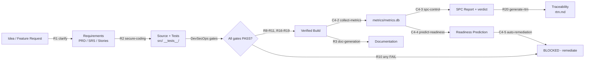
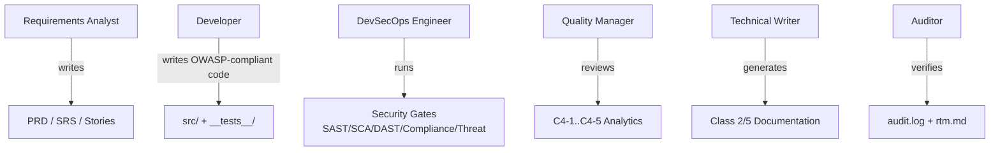

# Product Requirements Document (PRD)

**Product:** CMMI Level 4 OpenCode DevSecOps Pipeline (Linux Edition)
**Version:** 1.0.0
**Status:** Draft
**Owner:** Pipeline Engineering
**Skill:** requirement-gathering (R1) · **Classifier:** Class 1 (Business/Requirements)
**Traceability parent:** `specs/idea.md`

---

## 1. Product Vision

We build a quantitatively managed software development pipeline that uses
OpenCode as the single entry point (R5) and demonstrates **CMMI Level 4
(Quantitatively Managed)** process maturity. Requirements, code, security
verification, and documentation are produced in a **strict enforced order**
(W1: Requirements → Coding → DevSecOps → Documentation) with **mandatory
security gates** (R7–R11, R16–R19) and **statistical process control**
(C4-1–C4-5) over a local-first, free, open-source toolchain (R6).

The pipeline is the single source of truth for the team's software process:
every build is measured, every gate result is logged (R11), every artifact is
traceable to a requirement (R20), and readiness is predicted so the team can
act before quality degrades (C4-4, C4-5).

Figure 1 - Product vision: the pipeline converts raw ideas into verified,
measured, documented releases.

## 2. Problem Statement

Development teams struggle to demonstrate quantitative process maturity:

- Requirements, code, security checks, and docs are produced in ad-hoc order
  with no enforced workflow (violates W1).
- No mandatory security gates — defects leak into production (violates R8–R10).
- No measurement of process stability — the team cannot prove CMMI Level 4
  (violates C4-1–C4-3).
- No traceability — requirements cannot be linked to code, tests, and security
  evidence (violates R11, R20).
- Proprietary tooling is costly; teams want free, local-first alternatives
  (violates R6).

## 3. Goals and Non-Goals

### 3.1 Goals

| # | Goal | Requirement(s) |
| :--- | :--- | :--- |
| G1 | Single entry point for the entire workflow via `opencode run` | R5 |
| G2 | Strict workflow order enforced by the pipeline script | W1 |
| G3 | Mandatory DevSecOps gates: SAST, SCA, DAST, compliance, threat model | R8–R10, R16–R19 |
| G4 | Quantitative metrics collected into `metrics/metrics.db` | C4-2 |
| G5 | Statistical process control (3-sigma UCL/LCL) and readiness prediction | C4-3, C4-4 |
| G6 | Full traceability: audit log + requirements traceability matrix | R11, R20 |
| G7 | Free, local-first, open-source toolchain (Node.js LTS, Ollama, ESLint, Jest) | R6 |

### 3.2 Non-Goals

- Not a cloud-hosted CI/CD SaaS — runs on-premise / local-first only.
- No commercial security scanners required for the base pipeline (paid engines
  are optional recommendations only, R19).
- No GUI — all interaction is via CLI / OpenCode TUI.

## 4. Personas

| Persona | Description | Needs |
| :--- | :--- | :--- |
| **Requirements Analyst** | Writes PRD/SRS/user stories | Guided requirements process (R1), traceability |
| **Developer** | Writes `src/` and `__tests__/` under secure-coding rules | Fast feedback, lint/test gates (R2, R8) |
| **DevSecOps Engineer** | Runs and reads security gate reports | SAST/SCA/DAST/compliance/threat evidence (R8–R10, R16–R19) |
| **Quality Manager** | Reviews metrics, SPC, readiness | Quantitative reports, prediction, remediation (C4-1–C4-5) |
| **Technical Writer** | Generates docs | Doc-generation skill (R3) |
| **Auditor** | Verifies compliance and traceability | Audit log, RTM (R11, R20) |

Figure 2 - Persona-to-capability mapping.

## 5. Feature Requirements

### 5.1 Workflow Orchestration (W1, R5)

- FR-001 — Provide a single command `npm run pipeline` (or `/pipeline`) that
  enforces the order Requirements → Coding → DevSecOps → Documentation.
- FR-002 — Allow non-destructive overrides: `--no-gates`, `--no-docgen`, `--sops`.

### 5.2 Skills (R1–R4, R12, R13)

- FR-003 — Provide `requirement-gathering`, `secure-coding`, and `doc-generation`
  skills, each as an independent `SKILL.md` (separation of concerns, R4).
- FR-004 — Provide `cmmi-analytics` skill for the quantitative gates (C4-2–C4-5).

### 5.3 Security Gates (R7–R11, R16–R19)

- FR-005 — Runtime protection (R7): manual checks in pipeline.
- FR-006 — SAST via ESLint (R8) with security plugin.
- FR-007 — SCA via `npm audit` (R9).
- FR-008 — Fail-on-error blocking gate (R10) — any gate error blocks the build.
- FR-009 — Compliance evidence gates for GDPR / HIPAA / PCI DSS / SOX (R16).
- FR-010 — Threat modeling from npm audit + OSV.dev CVE/CVSS, OWASP mapping (R17).
- FR-011 — DAST via on-prem OWASP ZAP (running instance at `http://zap:8080`,
  else Docker/CLI; warn+block if no free engine) (R19).
- FR-012 — Notifications on gate results (Telegram env-only) (R18).

### 5.4 Quantitative Management (C4-1–C4-5)

- FR-013 — Collect build metrics into `metrics/metrics.db` (C4-2).
- FR-014 — Compute SPC UCL/LCL (3-sigma) and block merge when defect density
  exceeds UCL (C4-3).
- FR-015 — Predict readiness via linear regression (C4-4).
- FR-016 — Auto-generate remediation plans on degrading trends (C4-5).

### 5.5 Traceability (R11, R20)

- FR-017 — Write every gate result to `logs/audit.log` (R11).
- FR-018 — Generate `docs/00_Planning_Requirements/rtm.md` from SRS §6 traceability, cross-referencing
  user stories and on-disk artifacts; block on broken links (R20).

### 5.6 Operational Hard Rules (R14, R15)

- FR-019 — Mirror ALL resources to `~/.config/opencode/` via
  `scripts/deploy-global.sh`; refuse non-import-safe `tools/*.js` (R14, C4-6).
- FR-020 — Remind the user to commit to local git when work is complete (R15).

## 6. Success Metrics (C4-1)

| Metric | Target | Measurement Method |
| :--- | :--- | :--- |
| Defect Density (Critical+High/KLOC) | ≤ 0.5 | npm audit + ESLint + DAST findings / LOC |
| Build Stability (rolling 10 builds) | ≥ 98% | metrics.db |
| Cycle Time Stability (std dev) | < 2 minutes | metrics.db timestamps |
| Mandatory gates (R7–R11, R16–R19) | 100% enforced | audit.log + gate reports |

## 7. Release Criteria

1. All four Class 1/Class 2 artifacts exist and reference R-IDs.
2. `npm run lint` passes (R8).
3. `npm test` passes (Jest).
4. `npm run audit` has no high/critical vulnerabilities (R9).
5. `npm run rtm` reports no broken links (R20).
6. `bash scripts/deploy-global.sh` succeeds and is recorded in `logs/audit.log` (R14).
7. Metrics DB seeded and SPC/report scripts produce reports (C4-2–C4-5).

---

_Generated by the `requirement-gathering` skill. References: R1–R15, R16–R20, W1, C4-1–C4-5._