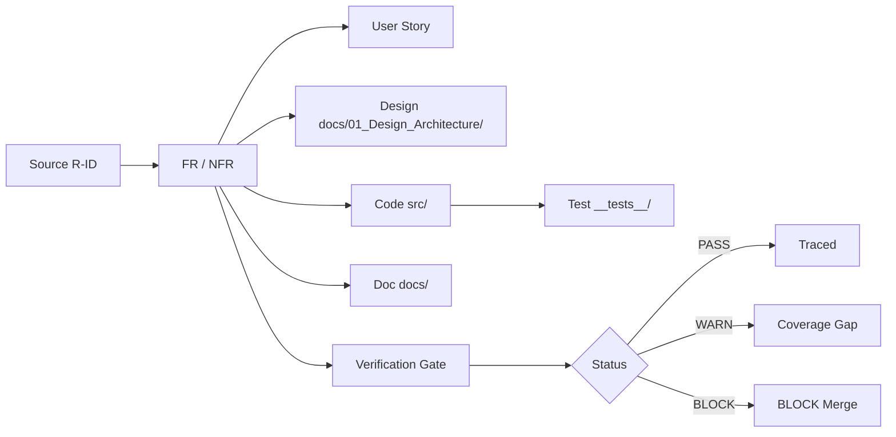

# Requirements Traceability Matrix - CMMI Level 4

## Meta

| Field | Value |
| :--- | :--- |
| Generated | 2026-08-14T08:24:57.399Z |
| SSOT Present | No (generic mode) |
| Requirements Traced | 28 |
| Coverage (PASS) | 4% |

## Traceability Flow

Figure 1 - Requirements traceability lifecycle (R20)

## Traceability Matrix

| Req ID | Source | Description | User Story | Artifact (verified) | Test | Doc | Verification | Status |
| :--- | :--- | :--- | :--- | :--- | :--- | :--- | :--- | :--- |
| FR-001 | W1, R5 | Provide single entry point `npm run pipeline` enforcing W1 o | Story 1 | scripts/opencode-pipeline.sh, AGENTS.md | — | docs/03_Development_Testing/pipeline-guide.md | No gate mapping | :warning: WARN |
| FR-002 | R10 | Support `--no-gates`, `--no-docgen`, `--sops` overrides | Story 1 | scripts/opencode-pipeline.sh | — | docs/03_Development_Testing/pipeline-guide.md | Pipeline: SUCCESS | :warning: WARN |
| FR-003 | R4, R13 | Provide independent skills with `SKILL.md` | Story 3 | .opencode/skills/*/SKILL.md, docs/01_Design_Architecture/tech-design.md | — | docs/03_Development_Testing/dev-guide.md | No gate mapping | :warning: WARN |
| FR-004 | C4-2 | Provide `cmmi-analytics` skill | Story 6 | .opencode/skills/cmmi-analytics/SKILL.md, scripts/collect-metrics.js | — | docs/03_Development_Testing/dev-guide.md | Phase 3 (Metrics): PASSED | :warning: WARN |
| FR-005 | R7 | Enforce runtime protection manual checks | — | scripts/opencode-pipeline.sh, AGENTS.md | — | docs/03_Development_Testing/dev-guide.md | Phase 3 (Runtime Protection): PASSED | :warning: WARN |
| FR-006 | R8 | Run ESLint SAST gate | Story 7 | .eslintrc.js, __tests__ | — | docs/06_User_Reference/user-guide.md | Phase 3 (SAST): PASSED | :warning: WARN |
| FR-007 | R9 | Run `npm audit` SCA gate | Story 8 | package.json, metrics/threat-model.md | — | docs/05_Security_Compliance/sec-hardening.md | Phase 3 (SCA): PASSED | :warning: WARN |
| FR-008 | R10 | Fail pipeline on any gate error | Story 9 | scripts/opencode-pipeline.sh, AGENTS.md | — | docs/05_Security_Compliance/sec-hardening.md | Pipeline: SUCCESS | :warning: WARN |
| FR-009 | R16 | Run compliance evidence gates (GDPR/HIPAA/PCI DSS/SOX) | Story 10 | scripts/compliance-check.js, metrics/compliance-report.md | — | docs/05_Security_Compliance/sec-hardening.md | Phase 3 (Compliance): PASSED | :warning: WARN |
| FR-010 | R17 | Run threat modeling (npm audit + OSV.dev CVSS, OWASP mapping | Story 11 | scripts/threat-model.js, metrics/threat-model.md | — | docs/03_Development_Testing/pipeline-guide.md | Phase 3 (Threat Model): PASSED | :warning: WARN |
| FR-011 | R19 | Run DAST via OWASP ZAP; warn+block if no free engine | Story 12 | scripts/dast-scan.js, metrics/dast-report.md, dast.config.json | — | docs/02_Setup_Configuration/admin-guide.md | Phase 3 (DAST): PASSED | :warning: WARN |
| FR-012 | R18 | Send gate-result notifications (Telegram env-only) | Story 13 | scripts/notify.js | __tests__/notify.spec.js | docs/03_Development_Testing/dev-guide.md | No gate mapping | :white_check_mark: PASS |
| FR-013 | C4-2 | Collect metrics into `metrics/metrics.db` | Story 14 | scripts/collect-metrics.js, metrics/metrics.db | — | docs/03_Development_Testing/dev-guide.md | Phase 3 (Metrics): PASSED | :warning: WARN |
| FR-014 | C4-3 | Compute 3-sigma UCL/LCL; block merge on UCL breach | Story 15 | scripts/spc-control.js, metrics/spc-report.md | — | docs/04_Operations_Maintenance/mon-alert-guide.md | Phase 3 (SPC): PASSED | :warning: WARN |
| FR-015 | C4-4 | Predict readiness via regression | Story 16 | scripts/predict-readiness.js, metrics/readiness-prediction.md | — | docs/04_Operations_Maintenance/mon-alert-guide.md | Phase 3 (Prediction): PASSED | :warning: WARN |
| FR-016 | C4-5 | Auto-generate remediation on degrading trends | Story 17 | scripts/predict-readiness.js, metrics/readiness-prediction.md | — | docs/04_Operations_Maintenance/mon-alert-guide.md | Phase 3 (Prediction): PASSED | :warning: WARN |
| FR-017 | R11 | Append every gate result to `logs/audit.log` | Story 18 | logs/audit.log, docs/00_Planning_Requirements/rtm.md | — | docs/04_Operations_Maintenance/mon-alert-guide.md | Pipeline: SUCCESS | :warning: WARN |
| FR-018 | R20 | Generate `docs/00_Planning_Requirements/rtm.md`; block on br | Story 19 | scripts/generate-rtm.js, docs/00_Planning_Requirements/rtm.md, docs/00_Planning_Requirements/srs.md | — | docs/05_Security_Compliance/sec-hardening.md | No gate mapping | :warning: WARN |
| FR-019 | R14, C4-6 | Deploy all resources to `~/.config/opencode/`; guard import- | Story 20 | scripts/deploy-global.sh, ~/.config/opencode/opencode.jsonc, tools/reqmind.js | — | — | No gate mapping | :warning: WARN |
| FR-020 | R15 | Remind user to commit to local git when done | Story 21 | .opencode/rules/operational-hard-rules.md, docs/00_Planning_Requirements/stories.md | — | — | No gate mapping | :warning: WARN |
| NFR-001 | C4-1 | Defect density (Critical+High/KLOC) | — | metrics/metrics.db, metrics/spc-report.md | — | — | Pipeline: SUCCESS | :warning: WARN |
| NFR-002 | C4-1 | Build stability (rolling 10 builds) | — | metrics/metrics.db, metrics/spc-report.md | — | — | Pipeline: SUCCESS | :warning: WARN |
| NFR-003 | C4-1 | Cycle time stability (std dev) | — | metrics/metrics.db, metrics/spc-report.md | — | — | Pipeline: SUCCESS | :warning: WARN |
| NFR-004 | R2 | Security: no hardcoded secrets, no `eval`, input validation | — | src, __tests__, .eslintrc.js | — | — | Phase 2 (Coding): PASSED | :warning: WARN |
| NFR-005 | R6 | Cost: free, local-first, open-source | — | package.json | — | — | Pipeline: SUCCESS | :warning: WARN |
| NFR-006 | R11 | Traceability: every build maps to audit.log | — | logs/audit.log, docs/00_Planning_Requirements/rtm.md | — | — | Pipeline: SUCCESS | :warning: WARN |
| NFR-007 | R14 | Portability: runs from any directory after global deploy | — | scripts/deploy-global.sh, ~/.config/opencode | — | — | No gate mapping | :warning: WARN |
| NFR-008 | C4-6 | Import-safety: every `tools/*.js` import-safe at startup | — | tools/reqmind.js, scripts/deploy-global.sh | — | — | No gate mapping | :warning: WARN |

## Coverage Summary

| Status | Count |
| :--- | :--- |
| :white_check_mark: PASS | 1 |
| :warning: WARN | 27 |
| :red_circle: BLOCK | 0 |
| **Total** | **28** |

## Gate Verdict

**:white_check_mark: RTM GATE PASSED - all declared artifacts verified, no broken traceability links**

## Coverage Warnings (non-blocking)

- FR-001: no matching test
- FR-002: no matching test
- FR-003: no matching test
- FR-004: no matching test
- FR-005: no user story, no matching test
- FR-006: no matching test
- FR-007: no matching test
- FR-008: no matching test
- FR-009: no matching test
- FR-010: no matching test
- FR-011: no matching test
- FR-013: no matching test
- FR-014: no matching test
- FR-015: no matching test
- FR-016: no matching test
- FR-017: no matching test
- FR-018: no matching test
- FR-019: no matching test
- FR-020: no matching test
- NFR-001: no user story, no matching test
- NFR-002: no user story, no matching test
- NFR-003: no user story, no matching test
- NFR-004: no user story, no matching test
- NFR-005: no user story, no matching test
- NFR-006: no user story, no matching test
- NFR-007: no user story, no matching test
- NFR-008: no user story, no matching test

---
Generated by scripts/generate-rtm.js (R20). Parses docs/00_Planning_Requirements/srs.md traceability tables,
cross-references docs/00_Planning_Requirements/stories.md, verifies src/ __tests__/ docs/ artifacts on disk,
and maps source R-IDs to logs/audit.log gate results.
