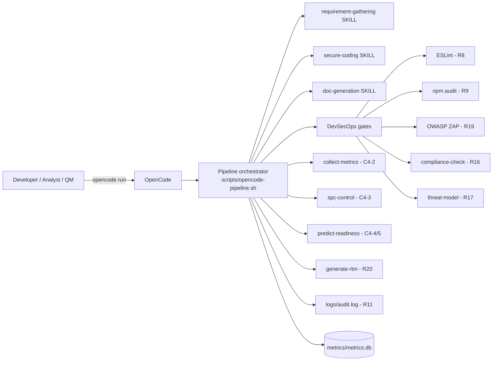
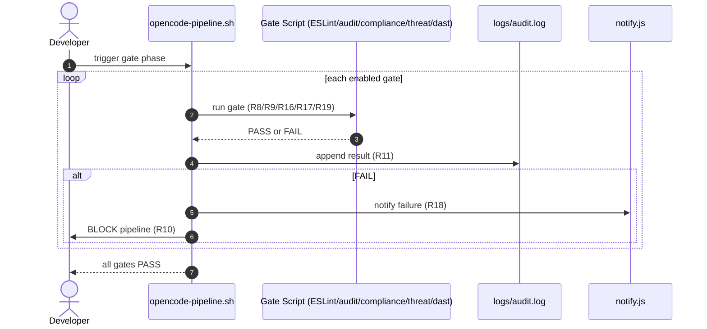

# Software Requirements Specification (SRS)

**Product:** CMMI Level 4 OpenCode DevSecOps Pipeline (Linux Edition)
**Version:** 1.0.0
**Status:** Draft
**Skill:** requirement-gathering (R1) · **Classifier:** Class 1 (Business/Requirements)
**Parent:** `docs/00_Planning_Requirements/prd.md`

---

## 1. Introduction

### 1.1 Purpose
This SRS specifies the functional and non-functional requirements of the CMMI
Level 4 pipeline. It is the authoritative input to `scripts/generate-rtm.js`
(R20), which parses §6 to build `docs/00_Planning_Requirements/rtm.md` and
verifies declared artifacts on disk.

### 1.2 Scope
The system is a Node.js (LTS) pipeline scripted around OpenCode, skills,
DevSecOps gates, and quantitative analytics. It is deployed globally to
`~/.config/opencode/` (R14) and runs from any directory.

### 1.3 Definitions

| Term | Definition |
| :--- | :--- |
| W1 | Strict workflow order: Requirements → Coding → DevSecOps → Documentation |
| R10 | Mandatory gate — fail on error |
| UCL/LCL | Upper / Lower Control Limit = Mean ± 3σ |
| SSOT | Single Source of Truth: `~/.config/opencode/` and `opencode.project.md` |
| SPC | Statistical Process Control |

## 2. Overall Description

### 2.1 System Context

Figure 1 - System context of the pipeline.

### 2.2 User Classes
Requirements Analyst, Developer, DevSecOps Engineer, Quality Manager,
Technical Writer, Auditor (see PRD §4).

### 2.3 Operating Environment
- Node.js LTS (≥ 18), Linux
- OpenCode CLI (`opencode run`)
- Free/local-first toolchain: ESLint, Jest, sqlite3, mathjs, regression, Ollama
- On-prem OWASP ZAP running instance at `http://zap:8080` (optional for R19)

## 3. Functional Requirements

| ID | Requirement | Source | Priority |
| :--- | :--- | :--- | :--- |
| FR-001 | Provide single entry point `npm run pipeline` enforcing W1 order | R5, W1 | High |
| FR-002 | Support `--no-gates`, `--no-docgen`, `--sops` overrides | R10 | Medium |
| FR-003 | Provide independent skills with `SKILL.md` | R4, R13 | High |
| FR-004 | Provide `cmmi-analytics` skill | C4-2–C4-5 | Medium |
| FR-005 | Enforce runtime protection manual checks | R7 | High |
| FR-006 | Run ESLint SAST gate | R8 | High |
| FR-007 | Run `npm audit` SCA gate | R9 | High |
| FR-008 | Fail pipeline on any gate error | R10 | High |
| FR-009 | Run compliance evidence gates (GDPR/HIPAA/PCI DSS/SOX) | R16 | High |
| FR-010 | Run threat modeling (npm audit + OSV.dev CVSS, OWASP mapping) | R17 | High |
| FR-011 | Run DAST via OWASP ZAP; warn+block if no free engine | R19 | High |
| FR-012 | Send gate-result notifications (Telegram env-only) | R18 | Medium |
| FR-013 | Collect metrics into `metrics/metrics.db` | C4-2 | High |
| FR-014 | Compute 3-sigma UCL/LCL; block merge on UCL breach | C4-3 | High |
| FR-015 | Predict readiness via regression | C4-4 | Medium |
| FR-016 | Auto-generate remediation on degrading trends | C4-5 | Medium |
| FR-017 | Append every gate result to `logs/audit.log` | R11 | High |
| FR-018 | Generate `docs/00_Planning_Requirements/rtm.md`; block on broken links | R20 | High |
| FR-019 | Deploy all resources to `~/.config/opencode/`; guard import-safe tools | R14, C4-6 | High |
| FR-020 | Remind user to commit to local git when done | R15 | Medium |

## 4. Non-Functional Requirements

| ID | Requirement | Source | Target |
| :--- | :--- | :--- | :--- |
| NFR-001 | Defect density (Critical+High/KLOC) | C4-1 | ≤ 0.5 |
| NFR-002 | Build stability (rolling 10 builds) | C4-1 | ≥ 98% |
| NFR-003 | Cycle time stability (std dev) | C4-1 | < 2 minutes |
| NFR-004 | Security: no hardcoded secrets, no `eval`, input validation | R2 | OWASP compliant |
| NFR-005 | Cost: free, local-first, open-source | R6 | No license fees |
| NFR-006 | Traceability: every build maps to audit.log | R11 | 100% |
| NFR-007 | Portability: runs from any directory after global deploy | R14 | 100% |
| NFR-008 | Import-safety: every `tools/*.js` import-safe at startup | C4-6 | No opencode crash |

## 5. Constraints and Assumptions

- **Constraints:** Node.js LTS only; W1 order is mandatory; all gates mandatory.
- **Assumptions:** OpenCode installed; internet available for npm/OSV lookups;
  OWASP ZAP optional but preferred for DAST.

## 6. Traceability Matrix

| Requirement ID | Source ID | Artifact | Status |
| :--- | :--- | :--- | :--- |
| FR-001 | W1, R5 | `scripts/opencode-pipeline.sh`, `AGENTS.md` | Proposed |
| FR-002 | R10 | `scripts/opencode-pipeline.sh` | Proposed |
| FR-003 | R4, R13 | `.opencode/skills/*/SKILL.md`, `docs/01_Design_Architecture/tech-design.md` | Proposed |
| FR-004 | C4-2 | `.opencode/skills/cmmi-analytics/SKILL.md`, `scripts/collect-metrics.js` | Proposed |
| FR-005 | R7 | `scripts/opencode-pipeline.sh`, `AGENTS.md` | Proposed |
| FR-006 | R8 | `.eslintrc.js`, `__tests__/` | Proposed |
| FR-007 | R9 | `package.json`, `metrics/threat-model.md` | Proposed |
| FR-008 | R10 | `scripts/opencode-pipeline.sh`, `AGENTS.md` | Proposed |
| FR-009 | R16 | `scripts/compliance-check.js`, `metrics/compliance-report.md` | Proposed |
| FR-010 | R17 | `scripts/threat-model.js`, `metrics/threat-model.md` | Proposed |
| FR-011 | R19 | `scripts/dast-scan.js`, `metrics/dast-report.md`, `dast.config.json` | Proposed |
| FR-012 | R18 | `scripts/notify.js` | Proposed |
| FR-013 | C4-2 | `scripts/collect-metrics.js`, `metrics/metrics.db` | Proposed |
| FR-014 | C4-3 | `scripts/spc-control.js`, `metrics/spc-report.md` | Proposed |
| FR-015 | C4-4 | `scripts/predict-readiness.js`, `metrics/readiness-prediction.md` | Proposed |
| FR-016 | C4-5 | `scripts/predict-readiness.js`, `metrics/readiness-prediction.md` | Proposed |
| FR-017 | R11 | `logs/audit.log`, `docs/00_Planning_Requirements/rtm.md` | Proposed |
| FR-018 | R20 | `scripts/generate-rtm.js`, `docs/00_Planning_Requirements/rtm.md`, `docs/00_Planning_Requirements/srs.md` | Proposed |
| FR-019 | R14, C4-6 | `scripts/deploy-global.sh`, `~/.config/opencode/opencode.jsonc`, `tools/reqmind.js` | Proposed |
| FR-020 | R15 | `.opencode/rules/operational-hard-rules.md`, `docs/00_Planning_Requirements/stories.md` | Proposed |
| NFR-001 | C4-1 | `metrics/metrics.db`, `metrics/spc-report.md` | Proposed |
| NFR-002 | C4-1 | `metrics/metrics.db`, `metrics/spc-report.md` | Proposed |
| NFR-003 | C4-1 | `metrics/metrics.db`, `metrics/spc-report.md` | Proposed |
| NFR-004 | R2 | `src/`, `__tests__/`, `.eslintrc.js` | Proposed |
| NFR-005 | R6 | `package.json` | Proposed |
| NFR-006 | R11 | `logs/audit.log`, `docs/00_Planning_Requirements/rtm.md` | Proposed |
| NFR-007 | R14 | `scripts/deploy-global.sh`, `~/.config/opencode/` | Proposed |
| NFR-008 | C4-6 | `tools/reqmind.js`, `scripts/deploy-global.sh` | Proposed |

## 7. Gate Lifecycle

Figure 2 - Sequence diagram of a DevSecOps gate run (R8–R11, R16–R19).

---

_Generated by the `requirement-gathering` skill. This §6 table is parsed by `scripts/generate-rtm.js` (R20)._