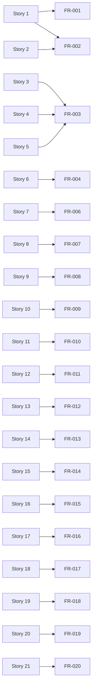
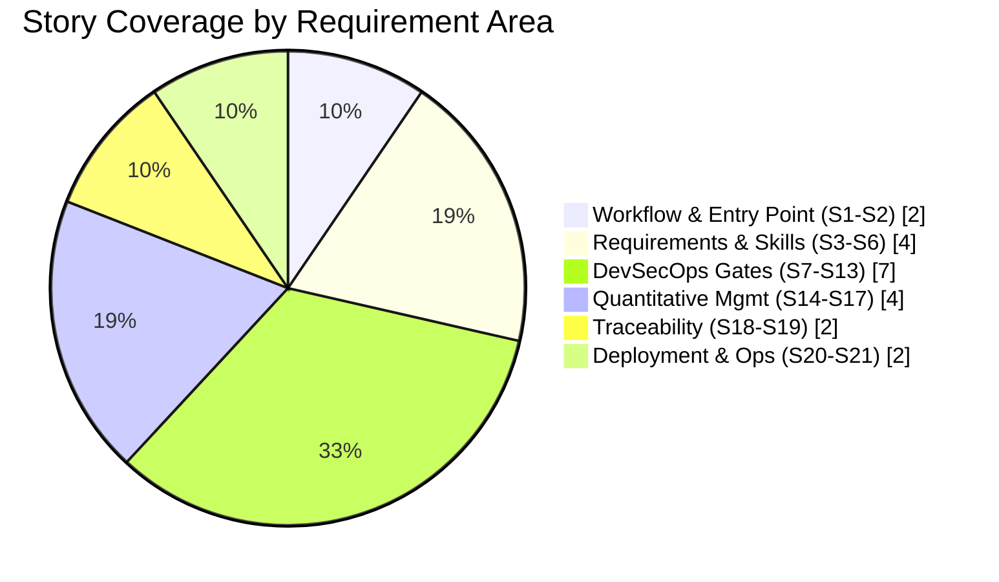

# User Stories

**Product:** CMMI Level 4 OpenCode DevSecOps Pipeline (Linux Edition)
**Version:** 1.0.0
**Status:** Draft
**Skill:** requirement-gathering (R1) · **Classifier:** Class 1 (Business/Requirements)
**Parent:** `docs/00_Planning_Requirements/srs.md` (traceability IDs FR-xxx, Rxx)

Story format: **As a** `<role>`, **I want** `<capability>`, **so that** `<value>`.
Each story maps to one or more functional requirements (FR-xxx). These maps are
cross-referenced by `scripts/generate-rtm.js` (R20).

---

## Story 1: One-command pipeline

**As a** Requirements Analyst, **I want** to run the whole pipeline with one
command, **so that** I never break the workflow order (W1).

**Maps to**: FR-001, FR-002

## Story 2: Local iteration overrides

**As a** Developer, **I want** optional overrides (`--no-gates`, `--no-docgen`,
`--sops`) for local iterations, **so that** I can develop quickly without
weakening final gates.

**Maps to**: FR-002

## Story 3: Guided requirements process

**As a** Requirements Analyst, **I want** a guided requirements process that
produces PRD, SRS, and stories, **so that** requirements are clarified (R1)
and reusable.

**Maps to**: FR-003

## Story 4: OWASP-aware coding guidance

**As a** Developer, **I want** OWASP-aware coding guidance from the
`secure-coding` skill, **so that** my code passes SAST and tests on the first try.

**Maps to**: FR-003

## Story 5: Automated documentation

**As a** Technical Writer, **I want** automated doc generation, **so that**
documentation stays consistent with code and gates.

**Maps to**: FR-003

## Story 6: Analytics skill drives quantitative gates

**As a** Quality Manager, **I want** the `cmmi-analytics` skill to drive the
quantitative gates, **so that** reports are produced consistently.

**Maps to**: FR-004

## Story 7: SAST on every build

**As a** DevSecOps Engineer, **I want** SAST (ESLint) run on every build,
**so that** static defects are caught early (R8).

**Maps to**: FR-006

## Story 8: SCA on every build

**As a** DevSecOps Engineer, **I want** SCA (`npm audit`) run on every build,
**so that** vulnerable dependencies are blocked (R9).

**Maps to**: FR-007

## Story 9: Fail on any gate error

**As a** DevSecOps Engineer, **I want** the pipeline to fail on any gate error,
**so that** defects never merge silently (R10).

**Maps to**: FR-008

## Story 10: Compliance evidence

**As a** Compliance Officer, **I want** GDPR/HIPAA/PCI DSS/SOX evidence gates,
**so that** we can demonstrate compliance (R16).

**Maps to**: FR-009

## Story 11: Quantified threat models

**As a** DevSecOps Engineer, **I want** threat models built from npm audit +
OSV.dev CVSS with OWASP mapping, **so that** risk is quantified (R17).

**Maps to**: FR-010

## Story 12: DAST through OWASP ZAP

**As a** DevSecOps Engineer, **I want** DAST through on-prem OWASP ZAP,
**so that** runtime weaknesses are found before release (R19).

**Maps to**: FR-011

## Story 13: Gate-result notifications

**As a** DevSecOps Engineer, **I want** gate-result notifications, **so that**
the team acts on failures promptly (R18).

**Maps to**: FR-012

## Story 14: Measured build data

**As a** Quality Manager, **I want** every build's metrics collected into
`metrics/metrics.db`, **so that** we have measured process data (C4-2).

**Maps to**: FR-013

## Story 15: 3-sigma SPC control limits

**As a** Quality Manager, **I want** 3-sigma SPC control limits and merge
blocking when defect density exceeds UCL, **so that** the process stays in
control (C4-3).

**Maps to**: FR-014

## Story 16: Readiness predictions

**As a** Quality Manager, **I want** readiness predictions via regression,
**so that** I can plan releases with evidence (C4-4).

**Maps to**: FR-015

## Story 17: Auto-generated remediation

**As a** Quality Manager, **I want** auto-generated remediation plans when two
builds trend upward, **so that** degradation is fixed proactively (C4-5).

**Maps to**: FR-016

## Story 18: Audit trail

**As an** Auditor, **I want** every gate result in `logs/audit.log`, **so
that** builds are auditable (R11).

**Maps to**: FR-017

## Story 19: Generated traceability matrix

**As a** Requirements Analyst, **I want** a generated `docs/00_Planning_Requirements/rtm.md` that blocks
on broken links, **so that** every requirement is verified end-to-end (R20).

**Maps to**: FR-018

## Story 20: Global deployment

**As a** DevOps Engineer, **I want** all resources deployed globally to
`~/.config/opencode/`, **so that** the pipeline runs from any directory (R14).

**Maps to**: FR-019

## Story 21: Git commit reminder

**As a** Developer, **I want** a git-commit reminder when work is complete,
**so that** changes are versioned (R15).

**Maps to**: FR-020

---

## Story-to-Feature Summary

Figure 1 - Story coverage of functional requirements.

Figure 2 - Story velocity / acceptance-state tracking of the backlog.

---

_Generated by the `requirement-gathering` skill. Cross-referenced by `scripts/generate-rtm.js` (R20)._