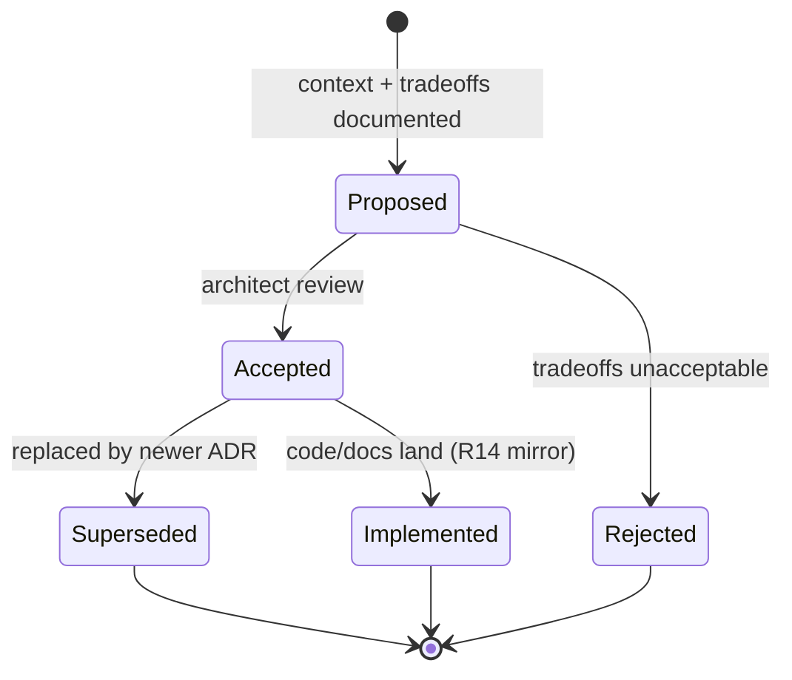

# Architecture Decision Record (ADR) Log

**Class**: 2 (Technical Design) | **Persona**: Architect

## Overview

This log records the significant architectural decisions for the CMMI Level 4
pipeline. Each entry captures the context, the decision, and the consequences so
that future architects can reconstruct *why* the system looks the way it does.
Superseded decisions are marked **Superseded** (with the replacement ADR
referenced) rather than deleted, preserving an auditable decision history (R11).

## Decision lifecycle

Figure 1 - ADR lifecycle

## ADR index

| ID | Title | Status | ADR |
| :--- | :--- | :--- | :--- |
| ADR-001 | bash orchestrator | Accepted | below |
| ADR-002 | OpenCode as single entry point (R5) | Accepted | below |
| ADR-003 | Three independent skills + AGENTS.md (R4) | Accepted | below |
| ADR-004 | SQLite metrics storage (C4-2) | Accepted | below |
| ADR-005 | 3-sigma UCL/LCL statistical process control (C4-3) | Accepted | below |
| ADR-006 | Fail-on-error blocking gates (R10) | Accepted | below |
| ADR-007 | Global deployment with generated config (R14) | Accepted | below |
| ADR-008 | Import-safe custom tools (C4-6) | Accepted | below |
| ADR-009 | Local-first, free/open-source tooling (R6) | Accepted | below |

## ADR-001 - bash orchestrator

**Status**: Accepted

**Context**: The pipeline must run on Linux (the target platform) without a
container dependency (R6). The workflow order (W1) must be strictly enforced
and every phase/gate must write to an audit log (R11).

**Decision**: Implement the orchestrator as `scripts/opencode-pipeline.sh`
using bash. It sequences the four phases, runs the mandatory gates, and
appends one audit line per phase/gate.

**Consequences**:
- Native Linux execution with no extra runtime.
- bash is the standard shell available on every Linux host.
- Logic is portable to any POSIX host without a rewrite.

## ADR-002 - OpenCode as single entry point (R5)

**Status**: Accepted

**Context**: Users invoke the pipeline in different ways and from different
directories. A single, uniform entry point reduces training and misconfiguration.

**Decision**: Route every pipeline activity through `opencode run` / the
`/pipeline` command. The pipeline script shells out to `opencode run` for the
AI-generation phases, and the `/pipeline` command is synced globally so it works
from any directory (R14).

**Consequences**:
- One mental model: "run the pipeline" always means the same command.
- The global `~/.config/opencode/commands/pipeline.md` must be kept in sync with
  the project command (R14).
- Requires a working `opencode` install before any pipeline run.

## ADR-003 - Three independent skills + AGENTS.md (R4)

**Status**: Accepted

**Context**: Requirements, coding, and documentation must stay decoupled so a
change in one concern does not ripple through the others.

**Decision**: Maintain three independent skills (`requirement-gathering`,
`secure-coding`, `doc-generation`) plus `AGENTS.md` as the shared process
charter. No skill loads or depends on another skill's artifacts.

**Consequences**:
- Separation of concerns (R4) is structurally enforced.
- Shared conventions must be duplicated in `AGENTS.md` (the single process
  authority), not in each skill.
- A new concern requires a new skill + R14 deploy mirror.

## ADR-004 - SQLite metrics storage (C4-2)

**Status**: Accepted

**Context**: CMMI Level 4 requires quantitative measurement over time. The
metrics store must be lightweight, local-first (R6), and queryable for SPC and
prediction.

**Decision**: Use SQLite (`metrics/metrics.db`, `builds` table) via the
`sqlite3` npm module. `scripts/collect-metrics.js` inserts one row per build.

**Consequences**:
- No external database server to operate.
- History is a plain file; it must be backed up on schedule
  (see [Monitoring-Alerting-Guide](Monitoring-Alerting-Guide.md)).
- Deleting the DB erases the SPC/prediction baseline — treated as organizational
  data (kept under `~/.config/opencode/metrics/` after R14 deploy).

## ADR-005 - 3-sigma UCL/LCL statistical process control (C4-3)

**Status**: Accepted

**Context**: The process must distinguish normal variation from out-of-control
behavior using an industry-standard rule.

**Decision**: Compute `UCL = mean + 3σ`, `LCL = max(0, mean - 3σ)` in
`src/spc.js` (`controlLimits`). A build is out of control when its defect
density exceeds the UCL (`isOutOfControl`).

**Consequences**:
- Standard, defensible control limits for the audit record.
- Requires ≥ 2 historical builds before limits are meaningful (the first SPC
  baseline is valid around build 5; see Monitoring-Alerting-Guide).
- A density excursion above UCL blocks the merge (ADR-006 / R10).

## ADR-006 - Fail-on-error blocking gates (R10)

**Status**: Accepted

**Context**: Optional security checks allow critical/high defects to ship. The
process needs a mandatory, non-bypassable gate.

**Decision**: Every gate (R7 runtime, R8 SAST, R9 SCA, tests, C4-3 SPC) exits
non-zero on failure; the pipeline propagates the failure and blocks the merge.
`npm run pipeline:skipsecurity` is offered only as an explicit opt-out.

**Consequences**:
- Defects cannot silently pass; a blocked run is visible in `logs/audit.log`.
- Teams must fix the gate violation before merging.
- Skips must be deliberate and named, never the default.

## ADR-007 - Global deployment with generated config (R14)

**Status**: Accepted

**Context**: The pipeline and skills must run from *any* directory, not just the
project checkout.

**Decision**: Sync every resource to `~/.config/opencode/` via
`scripts/deploy-global.sh` (`npm run deploy`). The global `opencode.jsonc` and
`package.json` are *generated* from project templates; nothing global is edited
by hand.

**Consequences**:
- One source of truth (the project directory); the global install is a mirror.
- A hand-edited global resource is a BLOCKING defect.
- Every new resource must be added to the deploy script in the same change, and
  opencode must be restarted after deploy to reload config.

## ADR-008 - Import-safe custom tools (C4-6)

**Status**: Accepted

**Context**: opencode auto-imports every `.js` under
`~/.config/opencode/tools/` as a custom tool module, in-process, at startup. A
plain CLI whose top-level code runs on import crashes opencode.

**Decision**: Every `.js` deployed to `tools/` must be import-safe: either the
CLI entry is guarded by `if (require.main === module) { ... }`, or the file
exports a `tool()` definition from `@opencode-ai/plugin`.
`scripts/deploy-global.sh` refuses to deploy an unsafe `tools/*.js`.

**Consequences**:
- `tools/reqmind.js` remains a functional CLI *and* safe to import.
- A missing guard is caught at deploy time, not as an opencode startup crash.
- Contributors must never copy a bare CLI into `tools/`.

## ADR-009 - Local-first, free/open-source tooling (R6)

**Status**: Accepted

**Context**: The pipeline must run with zero licensing or cloud cost.

**Decision**: Use only free, open-source, local-first tooling: Node.js LTS,
ESLint, Jest, npm, SQLite, and local models via Ollama.

**Consequences**:
- No vendor lock-in or recurring cost.
- Model quality depends on the local model chosen in `opencode.jsonc`.
- Cloud CI/CD integration is explicitly out of scope (PRD non-goal).

## Audit trail

Every ADR acceptance is recorded in `logs/audit.log` (R11). When this log is
updated, run `npm run deploy` so `docs/ADR.md` mirrors to
`~/.config/opencode/docs/ADR.md` (R14).
