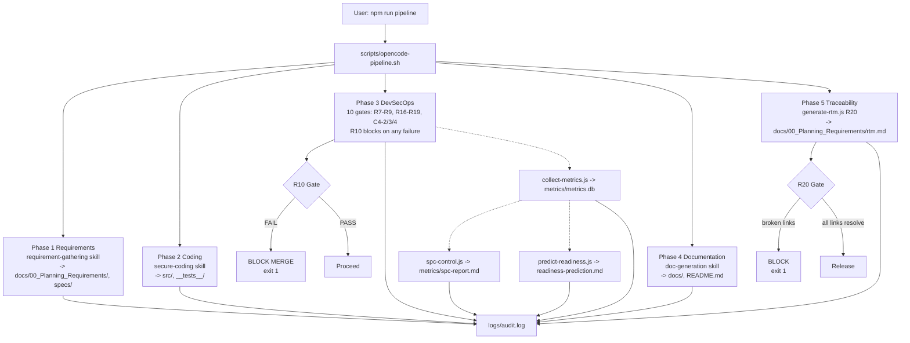
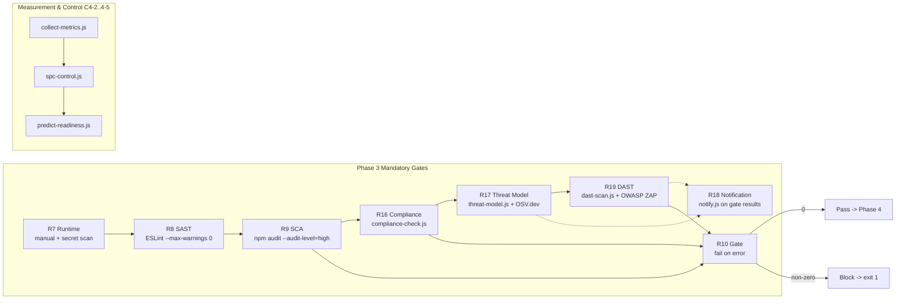
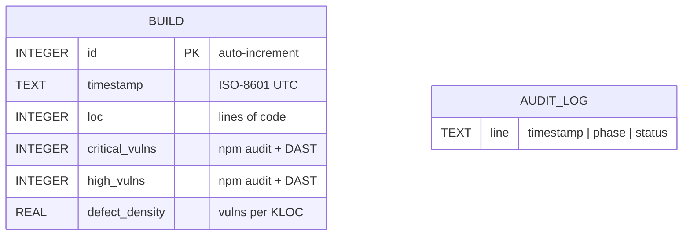
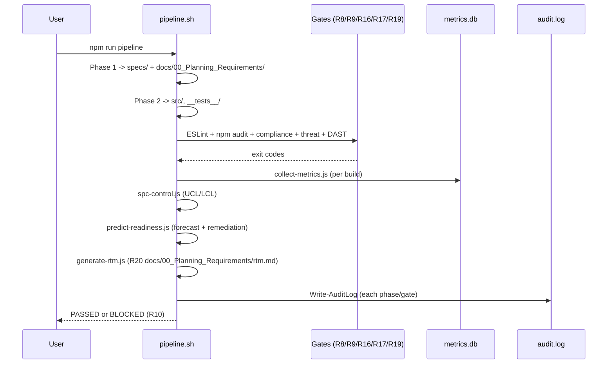
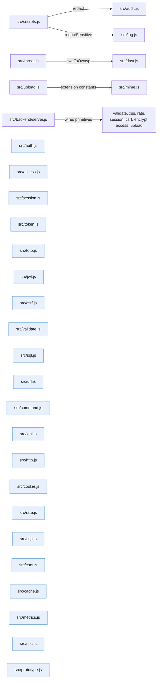

# Architecture

**Class**: 2 (Technical Design) | **Source**: `docs/00_Planning_Requirements/`, `src/`, `AGENTS.md`

## Overview

This project is a Linux-native, CMMI Level 4 (Quantitatively Managed) software
development pipeline. OpenCode is the single entry point (R5). A bash
orchestrator (`scripts/opencode-pipeline.sh`) enforces the strict workflow order
(W1) and runs mandatory security gates (R7–R11, R16–R19). Node.js scripts
implement statistical process control (C4-1..C4-5) and the DevSecOps report
gates (compliance, threat model, DAST, notification). A secure-coding layer in
`src/` provides reusable, OWASP-aligned primitives used across the toolchain.
Every phase and gate writes to an audit log (R11).

## High-level flow

Figure 1 — High-level pipeline flow (W1 order, R7–R11, R16–R19, C4-2..C4-5)

## Gate logic

Phase 3 runs the **ten mandatory DevSecOps gates**: the classic R7–R9 stack
(runtime protection, SAST, SCA), the R10 fail-on-error gate, the R16–R19
compliance/threat/DAST/notification gates, and the C4-2/C4-3/C4-4 measurement
and control gates. Any gate that exits non-zero blocks the build (R10).

Figure 2 — Phase 3 DevSecOps gate chain (R7–R11, R16–R19, C4-2..C4-5)

## Analytics data model

Figure 3 — Entity-relationship diagram for measurement data (C4-2)

Defect density = `(critical_vulns + high_vulns) / (loc / 1000)`. Target is
`<= 0.5` (C4-1), defined as `DENSITY_GOAL` in `src/metrics.js`.

SPC computes `UCL = mean + 3*stdev`, `LCL = max(0, mean - 3*stdev)`
(`src/spc.js` `controlLimits`). Density above UCL blocks the merge (C4-3/R10).

## Build sequence

Figure 4 — Sequence diagram of a build run

## Components

| Component | Location | Responsibility |
| :--- | :--- | :--- |
| Orchestrator | `scripts/opencode-pipeline.sh` | W1 order, 10 gates, audit (R11) |
| Metrics collector | `scripts/collect-metrics.js` | C4-2 measurement |
| SPC controller | `scripts/spc-control.js` | C4-3 control limits |
| Readiness predictor | `scripts/predict-readiness.js` | C4-4/5 forecast + remediation |
| Compliance checker | `scripts/compliance-check.js` + `src/compliance.js` | R16 GDPR/HIPAA/PCI DSS/SOX evidence |
| Threat modeler | `scripts/threat-model.js` + `src/threat.js` | R17 CVE/CVSS + OSV.dev, OWASP mapping |
| DAST scanner | `scripts/dast-scan.js` + `src/dast.js` | R19 OWASP ZAP scans |
| Notifier | `scripts/notify.js` + `src/notify.js` | R18 Telegram notification |
| RTM generator | `scripts/generate-rtm.js` + `src/rtm.js` | R20 docs/00_Planning_Requirements/rtm.md traceability |
| reqmind | `tools/reqmind.js` | R1 SRS generation (import-safe, C4-6) |
| Skills | `.opencode/skills/*` | R4 separation of concerns |
| Knowledge | `AGENTS.md` | R12 process rules |
| Secure primitives | `src/*.js` | OWASP-aligned helpers (R2/R8) |
| Application server | `src/backend/server.js` | Demo backend wired to `src/` primitives |

## `src/` secure-coding layer

The `src/` layer is the Class 3 source tree (R2). Every module is CommonJS,
side-effect-free, throws typed errors, and is covered by Jest tests in
`__tests__/`. Modules are grouped by concern:

Figure 5 — Component diagram of the `src/` layer grouped by concern

```mermaid
block
    columns 4
    block:AUTH["Authentication & Access"]:2
        a1["src/auth.js"]
        a2["src/access.js"]
        a3["src/session.js"]
        a4["src/token.js"]
        a5["src/totp.js"]
        a6["src/password.js"]
        a7["src/csrf.js"]
        a8["src/jwt.js"]
    end
    block:INPUT["Input & Injection Defense"]:2
        i1["src/validate.js"]
        i2["src/sql.js"]
        i3["src/url.js"]
        i4["src/command.js"]
        i5["src/xml.js"]
        i6["src/upload.js"]
        i7["src/mime.js"]
        i8["src/path.js"]
    end
    block:WEB["Web / HTTP Security"]:2
        w1["src/http.js"]
        w2["src/cookie.js"]
        w3["src/rate.js"]
        w4["src/host.js"]
        w5["src/redirect.js"]
        w6["src/xss.js"]
        w7["src/deflate.js"]
        w8["src/csp.js"]
        w9["src/cors.js"]
        w10["src/cache.js"]
    end
    block:OPS["Secrets, Audit & Analytics"]:2
        o1["src/secrets.js"]
        o2["src/audit.js"]
        o3["src/log.js"]
        o4["src/metrics.js"]
        o5["src/spc.js"]
        o6["src/encrypt.js"]
    end
    block:HARD["Prototype Hardening"]:1
        h1["src/prototype.js"]
    end
```

| Module | Purpose | Key exports |
| :--- | :--- | :--- |
| `src/auth.js` | PBKDF2 password hashing/verification | `hashPassword`, `verifyPassword`, `PBKDF2_ITERATIONS` |
| `src/access.js` | Role-based access control | `validateRoles`, `hasRole`, `assertRole`, `isOwner` |
| `src/session.js` | Opaque session tokens | `generateSessionToken`, `hashSessionToken`, `isValidSessionToken`, `isSessionExpired` |
| `src/token.js` | Cryptographically random tokens | `generateToken`, `isValidToken`, `safeEqual` |
| `src/totp.js` | RFC-6238 TOTP codes | `generateCode`, `verifyCode`, `generateSecret` |
| `src/password.js` | Password strength policy | `estimateEntropy`, `assessPassword`, `assertStrongPassword` |
| `src/csrf.js` | CSRF token generation/verification | `generateCsrfToken`, `verifyCsrfToken` |
| `src/jwt.js` | Signed JSON Web Tokens (HS256/384/512) | `createToken`, `verifyToken`, `hasExpired` |
| `src/validate.js` | Input sanitization, email, path validation | `sanitizeString`, `isValidEmail`, `isSafeRelativePath` |
| `src/sql.js` | SQL injection defense | `validateIdentifier`, `buildPlaceholders`, `validateParams`, `escapeLike` |
| `src/url.js` | SSRF defense, URL safety | `parseSafeUrl`, `isSafeUrl`, `assertSafeUrl` |
| `src/command.js` | Command injection defense | `assertSafeCommand`, `assertSafeArg`, `assertSafeShellArg`, `buildSpawnArgs` |
| `src/xml.js` | XXE / XML attack defense | `hasUnsafeXmlConstructs`, `assertSafeXml` |
| `src/upload.js` | File-upload whitelist | `sanitizeFilename`, `isAllowedExtension`, `assertAllowedUpload`, `validateFileBytes` |
| `src/mime.js` | Magic-byte content sniffing | `sniffFormat`, `detectMimeType`, `assertExtensionMatchesContent` |
| `src/path.js` | Path-traversal defense | `assertRelativeChild`, `isInside`, `resolveInside`, `sanitizeRelativePath` |
| `src/http.js` | Security headers and safe JSON parsing | `buildSecurityHeaders`, `safeJsonParse` |
| `src/cookie.js` | Safe `Set-Cookie` construction | `sanitizeCookieValue`, `buildSetCookie` |
| `src/rate.js` | Fixed-window rate limiting | `createRateLimiter` |
| `src/host.js` | Host-header validation | `isAllowedHost`, `assertHostHeader` |
| `src/redirect.js` | Open-redirect defense | `isSafeRedirectTarget`, `assertSafeRedirect`, `buildLocationHeader` |
| `src/xss.js` | XSS escaping | `escapeHtml`, `escapeAttribute`, `escapeJsString`, `containsHtmlMarkup` |
| `src/deflate.js` | ZIP-bomb-safe decompression | `safeInflate`, `decompressJson` |
| `src/csp.js` | Content-Security-Policy builder | `buildCsp`, `addNonce`, `isValidSource` |
| `src/cors.js` | CORS origin allow-listing | `normalizeOrigin`, `isAllowedOrigin`, `buildCorsHeaders` |
| `src/cache.js` | Cache-Control header policy | `buildCacheControl`, `sensitiveResponseHeader`, `validateCacheDirectiveList` |
| `src/secrets.js` | Secret scanning and redaction | `scanForSecrets`, `redact` |
| `src/audit.js` | Structured audit-log line formatting (R11) | `formatAuditLine` |
| `src/log.js` | Structured, redacted log lines | `sanitizeLogValue`, `redactSensitive`, `safeLogLine` |
| `src/metrics.js` | Defect-density computation (C4-1) | `defectDensity`, `meetsDefectDensityGoal` |
| `src/spc.js` | Mean / stdev / control limits (C4-3) | `mean`, `controlLimits`, `isOutOfControl` |
| `src/encrypt.js` | AES-GCM symmetric encryption | `encrypt`, `decrypt` |
| `src/prototype.js` | Prototype-pollution defense | `assertSafeKey`, `safeClone`, `deepMerge`, `freezeDeep` |
| `src/compliance.js` | R16 control evaluation | `evaluateAll`, `blockingGaps`, `buildComplianceReport` |
| `src/threat.js` | R17 CVE/CVSS, OWASP mapping | `severityFromCvss`, `cweToOwasp`, `isThreatBlocked`, `buildThreatReport` |
| `src/dast.js` | R19 ZAP results handling | `parseZapJson`, `isDastBlocked`, `buildDastReport` |
| `src/notify.js` | R18 notification formatting | `validateChannel`, `buildTelegramMessage`, `sendTelegram` |
| `src/rtm.js` | R20 traceability matrix | `parseSrsTables`, `buildMatrix`, `rtmGate`, `buildRtmReport` |

Figure 6 — DevSecOps reporting layer: script + library pairing (R16–R19, R20)

```mermaid
block
    columns 3
    block:SCR["Phase 3 / 5 Scripts"]:2
        s1["scripts/compliance-check.js"]
        s2["scripts/threat-model.js"]
        s3["scripts/dast-scan.js"]
        s4["scripts/notify.js"]
        s5["scripts/generate-rtm.js"]
    end
    block:LIB["src/ reporting libraries"]:2
        l1["src/compliance.js"]
        l2["src/threat.js"]
        l3["src/dast.js"]
        l4["src/notify.js"]
        l5["src/rtm.js"]
    end
    block:OUT["Outputs"]:2
        o1["metrics/compliance-report.md"]
        o2["metrics/threat-model.md"]
        o3["metrics/dast-report.md"]
        o4["logs/audit.log"]
        o5["docs/00_Planning_Requirements/rtm.md"]
    end
    s1 --> l1
    s2 --> l2
    s3 --> l3
    s4 --> l4
    s5 --> l5
    l1 --> o1
    l2 --> o2
    l3 --> o3
    l4 --> o4
    l5 --> o5
```

Figure 7 — Intra-`src/` dependency graph (small, so the primitives stay reusable)

## Design decisions

| Decision | Rationale |
| :--- | :--- |
| bash orchestrator | Native Linux, no WSL/cloud-core dependency (R6) |
| OpenCode as single entry point | R5: every phase runs through `opencode run` |
| Four independent skills + AGENTS.md | R4: separation of concerns, no cross-coupling |
| SQLite metrics storage | Lightweight, no external server, per-build history for SPC |
| 3-sigma UCL/LCL | C4-3: standard statistical process control |
| Fail-on-error gates | R10: any violation blocks the build and merge |
| Local-first, free tooling | R6: Ollama + open-source stack only |
| `src/` primitives throw typed errors | Predictable validation: `TypeError`/`RangeError`/`SyntaxError` |
| PBKDF2 210k iterations + constant-time verify | OWASP-aligned credential storage (`src/auth.js`) |
| JWT HS256 default, HMAC-constant-time verify | Stateless tokens without external signing infra (`src/jwt.js`) |
| Whitelist-based validators | Allow-list (regex, role sets, protocols, extensions) beats blacklists |
| CSP/CORS/Cache-Control builders | Browser security policy as code, validated per source (`src/csp.js`, `src/cors.js`, `src/cache.js`) |
| Reporting gates share `src/` libraries | Single implementation of severity/CVSS/threshold logic across scripts |
| RTM as Phase 5 gate | R20: docs/00_Planning_Requirements/rtm.md verifies artifacts on disk and maps R-IDs to audit.log |

## Constraints

- Workflow order W1 is non-negotiable (blocked otherwise).
- Gates R7–R11, R16–R19 are mandatory; failure blocks the build (R10).
- Local-first, free/open-source tooling only (R6).
- Secrets must never appear in logs; `src/secrets.js` redacts them (R7/R11).
- `.env` must be absent from the working tree; `.gitignore` must exclude it (R7).
- Every `.js` deployed to `tools/` must be import-safe (C4-6).
- Every Mermaid diagram must pass `scripts/validate-mermaid.js` (R10 gate).
