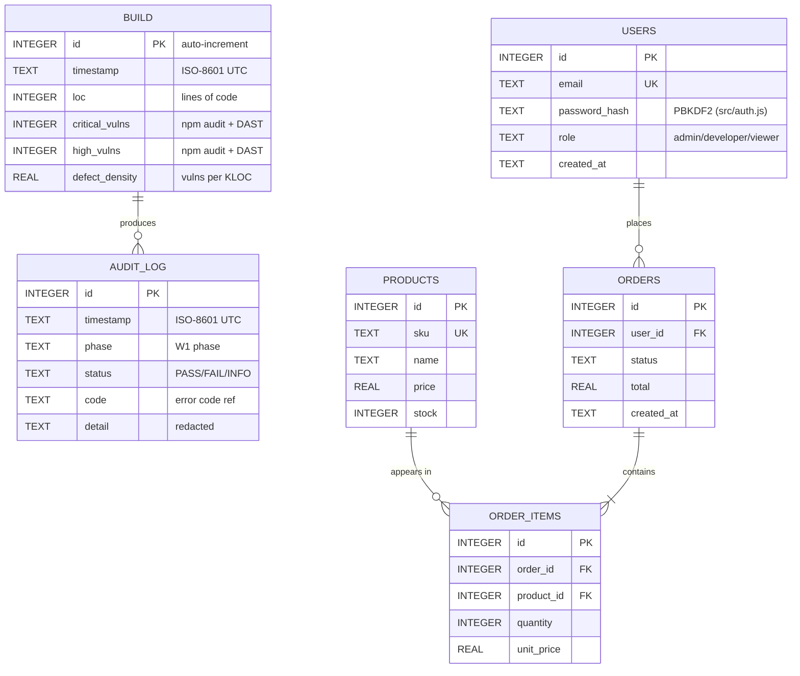

# Database Schema

**Class**: 2 (Technical Design) | **Persona**: Developer + Architect

This document defines the data model for the CMMI Level 4 pipeline. The
pipeline's own measurement store is SQLite (`metrics/metrics.db`, C4-2),
written by `scripts/collect-metrics.js`. The application database backing the
product itself — referred to below as **[Project Database]** — may be
PostgreSQL or MySQL depending on deployment; the tables illustrated there
(users, orders, products) are placeholders from the technical design. For the
surrounding component and data-flow context, see [Architecture](arch.md).

## Table of Contents

1. [Database Technology Overview](#1-database-technology-overview)
2. [Entity Relationship Diagram](#2-entity-relationship-diagram)
3. [Table Definitions](#3-table-definitions)
4. [Indexes](#4-indexes)
5. [Relationships](#5-relationships)
6. [Migration Strategy](#6-migration-strategy)
7. [Data Types Reference](#7-data-types-reference)
8. [Seeding Development Data](#8-seeding-development-data)
9. [Performance Considerations](#9-performance-considerations)
10. [Security & Audit Alignment](#10-security--audit-alignment)

---

## 1. Database Technology Overview

| Store | Engine | Purpose | Notes |
| :--- | :--- | :--- | :--- |
| `metrics/metrics.db` | SQLite (file-based) | C4-2 measurement data: builds, defect density, SPC history | No server; ships with the pipeline |
| `metrics/compliance.db` | SQLite (file-based) | R16/R17/R19 evidence history | Secondary store for gate outcomes |
| **[Project Database]** | PostgreSQL 15 *or* MySQL 8 | Application data: users, orders, products | Select per deployment; connection via `DATABASE_URL` |

### 1.1 Why SQLite for metrics

SQLite is chosen for `metrics.db` deliberately (see [Architecture](arch.md) §
Design decisions): it is lightweight, serverless, and local-first (R6). It
holds one row per pipeline build, which is exactly the granularity the SPC
controller (C4-3) and readiness predictor (C4-4) consume. It is **not** a
transactional store and is not shared across processes concurrently — only the
orchestrator writes, one build at a time.

### 1.2 Connection conventions

```bash
# metrics.db — always local, relative to the pipeline root
METRICS_DB=./metrics/metrics.db

# [Project Database] — production-grade, env-driven
DATABASE_URL=postgresql://[user]:[password]@[db-host]:5432/[db-name]
```

> Never commit real connection strings. They are injected at runtime and
> validated by `src/secrets.js` (R7). See the
> [Config Guide](../02_Setup_Configuration/config-guide.md).

---

## 2. Entity Relationship Diagram

Figure 1 — Entity-relationship diagram for `metrics.db` (builds) and the
`[Project Database]` application tables (users, orders, products).



---

## 3. Table Definitions

All SQL below is portable to SQLite for `metrics.db` and to PostgreSQL/MySQL
for `[Project Database]` unless noted. Identifiers are validated by
`src/sql.js#validateIdentifier` before any dynamic SQL is built.

### 3.1 `builds` (metrics.db)

The canonical C4-2 measurement table, created by
`scripts/collect-metrics.js`. One row per `npm run pipeline` execution.
Columns match the real scripted schema exactly.

| Column | Type | Constraints | Description |
| :--- | :--- | :--- | :--- |
| `id` | INTEGER | PK, AUTOINCREMENT | Surrogate key |
| `timestamp` | TEXT | NOT NULL | ISO-8601 UTC; drives cycle-time stability (C4-1) |
| `loc` | INTEGER | NOT NULL, CHECK ≥ 0 | Lines of code scanned (git diff; defaults to 100) |
| `critical_vulns` | INTEGER | NOT NULL, CHECK ≥ 0 | Critical vulns from `security-scan.json` + `dast-zap.json` |
| `high_vulns` | INTEGER | NOT NULL, CHECK ≥ 0 | High vulns from `security-scan.json` + `dast-zap.json` |
| `defect_density` | REAL | NOT NULL, CHECK ≥ 0 | `(critical_vulns + high_vulns) / (loc / 1000)`; target ≤ 0.5 (C4-1) |

```sql
CREATE TABLE IF NOT EXISTS builds (
    id              INTEGER PRIMARY KEY AUTOINCREMENT,
    timestamp       TEXT    NOT NULL,
    loc             INTEGER NOT NULL CHECK (loc >= 0),
    critical_vulns  INTEGER NOT NULL CHECK (critical_vulns >= 0),
    high_vulns      INTEGER NOT NULL CHECK (high_vulns >= 0),
    defect_density  REAL    NOT NULL CHECK (defect_density >= 0)
);
```

`defect_density` is derived, but stored redundantly so the SPC/predictor
queries need no join. The derivation lives in `src/metrics.js#defectDensity`.

### 3.2 `audit_log` (metrics.db)

Optional mirror of `logs/audit.log` (R11) for queryable traceability. The flat
file remains the source of truth; this table is a convenience projection.

```sql
CREATE TABLE IF NOT EXISTS audit_log (
    id          INTEGER PRIMARY KEY AUTOINCREMENT,
    timestamp   TEXT NOT NULL,
    phase       TEXT NOT NULL CHECK (phase IN
                    ('requirements','coding','devsecops','documentation','traceability')),
    status      TEXT NOT NULL CHECK (status IN ('PASS','FAIL','INFO')),
    code        TEXT,
    detail      TEXT
);
```

### 3.3 `users` ([Project Database])

Application user table. Passwords are hashed with PBKDF2 (210k iterations) via
`src/auth.js`; the raw password is never stored or logged (R7). Roles map to
`src/access.js#VALID_ROLES` (`admin`, `developer`, `viewer`).

| Column | Type | Constraints | Description |
| :--- | :--- | :--- | :--- |
| `id` | INTEGER/SERIAL | PK | Surrogate key |
| `email` | TEXT/VARCHAR(255) | NOT NULL, UNIQUE | Validated by `src/validate.js#isValidEmail` |
| `password_hash` | TEXT/VARCHAR(255) | NOT NULL | PBKDF2 digest |
| `role` | TEXT/VARCHAR(32) | NOT NULL, DEFAULT 'viewer' | RBAC role (`src/access.js`) |
| `created_at` | TIMESTAMP | NOT NULL, DEFAULT now | — |

```sql
CREATE TABLE users (
    id            SERIAL PRIMARY KEY,                 -- INTEGER PK on SQLite
    email         VARCHAR(255) NOT NULL UNIQUE,
    password_hash VARCHAR(255) NOT NULL,
    role          VARCHAR(32)  NOT NULL DEFAULT 'viewer',
    created_at    TIMESTAMP    NOT NULL DEFAULT CURRENT_TIMESTAMP
);
```

### 3.4 `orders` ([Project Database])

```sql
CREATE TABLE orders (
    id         SERIAL PRIMARY KEY,
    user_id    INTEGER NOT NULL REFERENCES users(id) ON DELETE CASCADE,
    status     VARCHAR(32) NOT NULL DEFAULT 'pending'
                 CHECK (status IN ('pending','paid','shipped','cancelled')),
    total      DECIMAL(10,2) NOT NULL CHECK (total >= 0),
    created_at TIMESTAMP NOT NULL DEFAULT CURRENT_TIMESTAMP
);
```

### 3.5 `products` ([Project Database])

```sql
CREATE TABLE products (
    id    SERIAL PRIMARY KEY,
    sku   VARCHAR(64) NOT NULL UNIQUE,
    name  VARCHAR(255) NOT NULL,
    price DECIMAL(10,2) NOT NULL CHECK (price >= 0),
    stock INTEGER NOT NULL DEFAULT 0 CHECK (stock >= 0)
);
```

### 3.6 `order_items` ([Project Database])

Join table resolving the many-to-many between `orders` and `products`.

```sql
CREATE TABLE order_items (
    id          SERIAL PRIMARY KEY,
    order_id    INTEGER NOT NULL REFERENCES orders(id) ON DELETE CASCADE,
    product_id  INTEGER NOT NULL REFERENCES products(id) ON DELETE RESTRICT,
    quantity    INTEGER NOT NULL CHECK (quantity > 0),
    unit_price  DECIMAL(10,2) NOT NULL CHECK (unit_price >= 0)
);
```

---

## 4. Indexes

Indexes target the access patterns the SPC/predictor scripts and the
application actually use. Every index has a stated purpose — an index without a
query is debt.

| Table | Index | Columns | Purpose |
| :--- | :--- | :--- | :--- |
| `builds` | `idx_builds_ts` | `timestamp` | SPC rolling-window lookups (last N builds) |
| `builds` | `idx_builds_density` | `defect_density` | Out-of-control scans (C4-3) |
| `audit_log` | `idx_audit_ts` | `timestamp` | Range scans for traceability reports |
| `audit_log` | `idx_audit_code` | `code` | Frequency analysis by error code |
| `users` | `idx_users_email` | `email` | Login lookup (unique, also enforces uniqueness) |
| `orders` | `idx_orders_user` | `user_id` | List a user's orders |
| `orders` | `idx_orders_status` | `status` | Operations dashboard filtering |
| `order_items` | `idx_items_order` | `order_id` | Fetch a cart's line items |
| `products` | `idx_products_sku` | `sku` | Catalog lookup (unique) |

```sql
CREATE INDEX IF NOT EXISTS idx_builds_ts       ON builds(timestamp);
CREATE INDEX IF NOT EXISTS idx_builds_density  ON builds(defect_density);
CREATE INDEX IF NOT EXISTS idx_audit_ts        ON audit_log(timestamp);
CREATE INDEX IF NOT EXISTS idx_audit_code      ON audit_log(code);
```

---

## 5. Relationships

| Parent | Child | Cardinality | On delete | Notes |
| :--- | :--- | :--- | :--- | :--- |
| `BUILD` | `AUDIT_LOG` | 1..N | — | A build emits one or more audit lines |
| `users` | `orders` | 1..N | CASCADE | A user owns their orders |
| `orders` | `order_items` | 1..N | CASCADE | An order contains its line items |
| `products` | `order_items` | 1..N | RESTRICT | A product cannot be deleted while referenced |

Foreign keys are **enforced**. On SQLite run `PRAGMA foreign_keys = ON;` per
connection (it is off by default). On PostgreSQL/MySQL it is on by default.

---

## 6. Migration Strategy

Migrations are **versioned, forward-only SQL scripts** under
`db/migrations/`, applied in order by a tiny runner. Each file is named
`NNNN_description.sql` and recorded in a `schema_migrations` table so it runs
exactly once.

```text
db/migrations/
  0001_init_builds.sql
  0002_add_cycle_time.sql
  0003_create_audit_log.sql
  0004_init_application.sql
```

### 6.1 The migrations bookkeeping table

```sql
CREATE TABLE IF NOT EXISTS schema_migrations (
    version    INTEGER PRIMARY KEY,
    applied_at TEXT NOT NULL DEFAULT (datetime('now'))
);
```

### 6.2 Example migration

```sql
-- 0002_add_cycle_time.sql
ALTER TABLE builds ADD COLUMN cycle_time INTEGER NOT NULL DEFAULT 0 CHECK (cycle_time >= 0);
CREATE INDEX IF NOT EXISTS idx_builds_ts ON builds(timestamp);
```

### 6.3 Running migrations

```bash
# metrics.db (SQLite) — loop runner over db/migrations/*.sql
node scripts/migrate.js --db ./metrics/metrics.db

# [Project Database]
node scripts/migrate.js --url "$DATABASE_URL"
```

> `scripts/migrate.js` is a helper; when it is absent from the tree the
> migrations are applied with the native client (`sqlite3` / `psql` / `mysql`).

Rules:
- Migrations are **immutable** once merged — fix forward with a new file.
- Every migration MUST be reversible in design (document the down path in a
  comment) even though only the up path is applied.
- A migration that touches `metrics.db` columns consumed by `src/spc.js` or
  `predict-readiness.js` MUST be paired with updated tests (R10).

---

## 7. Data Types Reference

| Concept | SQLite type | PostgreSQL type | MySQL type | Notes |
| :--- | :--- | :--- | :--- | :--- |
| Primary key | `INTEGER PRIMARY KEY AUTOINCREMENT` | `SERIAL` / `BIGSERIAL` | `INT AUTO_INCREMENT` | Use BIGINT if > 2³¹ rows expected |
| Short string | `TEXT` | `VARCHAR(n)` | `VARCHAR(n)` | Prefer bounded `VARCHAR` in [Project Database] |
| Long text | `TEXT` | `TEXT` | `TEXT` | No length check |
| Boolean | `INTEGER` (0/1) | `BOOLEAN` | `TINYINT(1)` | SQLite has no native bool |
| Timestamp | `TEXT` (ISO-8601) | `TIMESTAMP` / `TIMESTAMPTZ` | `DATETIME` | Store UTC always |
| Decimal money | `REAL` | `DECIMAL(p,s)` | `DECIMAL(p,s)` | Never use FLOAT for money |
| UUID | `TEXT` | `UUID` | `CHAR(36)` | Use `gen_random_uuid()` on PG |

---

## 8. Seeding Development Data

A seed script populates a minimal, deterministic dataset for local development
and integration tests. Seeds are **idempotent** and **never** run against
production.

```bash
node scripts/seed.js --db ./metrics/metrics.db        # metrics demo data
node scripts/seed.js --url "$DATABASE_URL" --app      # application demo data
```

`scripts/seed.js` (excerpt):

```javascript
// Insert 5 sample builds so spc-control.js can compute limits (needs >= 5)
const sampleBuilds = [
  { loc: 4200, critical_vulns: 0, high_vulns: 1, defect_density: 0.24 },
  { loc: 4250, critical_vulns: 0, high_vulns: 2, defect_density: 0.47 },
  { loc: 4300, critical_vulns: 1, high_vulns: 3, defect_density: 0.93 },
  { loc: 4350, critical_vulns: 0, high_vulns: 1, defect_density: 0.23 },
  { loc: 4400, critical_vulns: 0, high_vulns: 1, defect_density: 0.23 },
];
```

Application seed values:

```javascript
const { hashPassword } = require('./src/auth');
const users = [
  { email: 'admin@[example].com', role: 'admin', password_hash: hashPassword('change-me') },
  { email: 'dev@[example].com',   role: 'developer', password_hash: hashPassword('change-me') },
];
```

> The seed password `change-me` is for development only. Production accounts are
> provisioned out-of-band. Never commit real credentials (R7).

---

## 9. Performance Considerations

### 9.1 Indexing strategy

- Index the **access path**, not the column. The `(timestamp)` and
  `(defect_density)` indexes on `builds` serve the SPC and predictor queries
  in `scripts/spc-control.js` and `scripts/predict-readiness.js`.
- Avoid indexing low-cardinality columns alone (e.g. a bare `status` index is
  rarely selective).
- Run `EXPLAIN QUERY PLAN` (SQLite) / `EXPLAIN` (PG/MySQL) before merging a new
  query; attach the plan to the PR.

### 9.2 Partitioning (PostgreSQL [Project Database])

For high-volume tables like `audit_log` or `orders`, partition by range on
`timestamp` (monthly) once a table exceeds ~10M rows:

```sql
CREATE TABLE audit_log ( ... ) PARTITION BY RANGE (timestamp);
CREATE TABLE audit_log_2026_08 PARTITION OF audit_log
    FOR VALUES FROM ('2026-08-01') TO ('2026-09-01');
```

SQLite does not support partitioning; for `metrics.db` this is a non-issue
because the build count stays small (purge rows older than the rolling window).

### 9.3 Sharding

Sharding is **not** used for `metrics.db` (single-writer, low volume). For
`[Project Database]`, shard by `user_id` hash only if a single PG instance
cannot sustain the write throughput — and only after partitioning and read
replicas have been exhausted.

### 9.4 Maintenance routines

| Routine | Frequency | Command |
| :--- | :--- | :--- |
| SQLite `VACUUM` | Monthly | `sqlite3 metrics/metrics.db 'VACUUM;'` |
| SQLite `ANALYZE` | Weekly | `sqlite3 metrics/metrics.db 'ANALYZE;'` |
| PG/MySQL `ANALYZE` | Weekly | `psql "$DATABASE_URL" -c 'ANALYZE;'` / `mysql ... -e 'ANALYZE TABLE ...;'` |
| Purge old builds | Rolling 90 days | `DELETE FROM builds WHERE timestamp < datetime('now','-90 days');` |

---

## 10. Security & Audit Alignment

Every schema decision is checked against the security gates (R7–R11):

| Concern | Rule | Enforcement in schema |
| :--- | :--- | :--- |
| No plaintext secrets | R7 | Passwords stored as PBKDF2 hashes only; connection strings via env, never columns |
| SQL injection | R8 | Dynamic identifiers pass through `src/sql.js#validateIdentifier`; queries use parameterized placeholders |
| Traceability | R11 | `audit_log` mirrors `logs/audit.log`; `code` column links to [Error Codes](../03_Development_Testing/error-codes.md) |
| SPC blocking | C4-3/R10 | `builds.defect_density` above UCL blocks merge — computed in `src/spc.js` |
| Retention/privacy | R16 | PII columns (`users.email`) documented for compliance evidence (GDPR/HIPAA/PCI/SOX) |

For the compliance evidence gates themselves, see the
[Security Hardening Guide](../05_Security_Compliance/sec-hardening.md). For
term definitions (CMMI, SPC, RTM, etc.), see the
[Glossary](../06_User_Reference/glossary.md).
