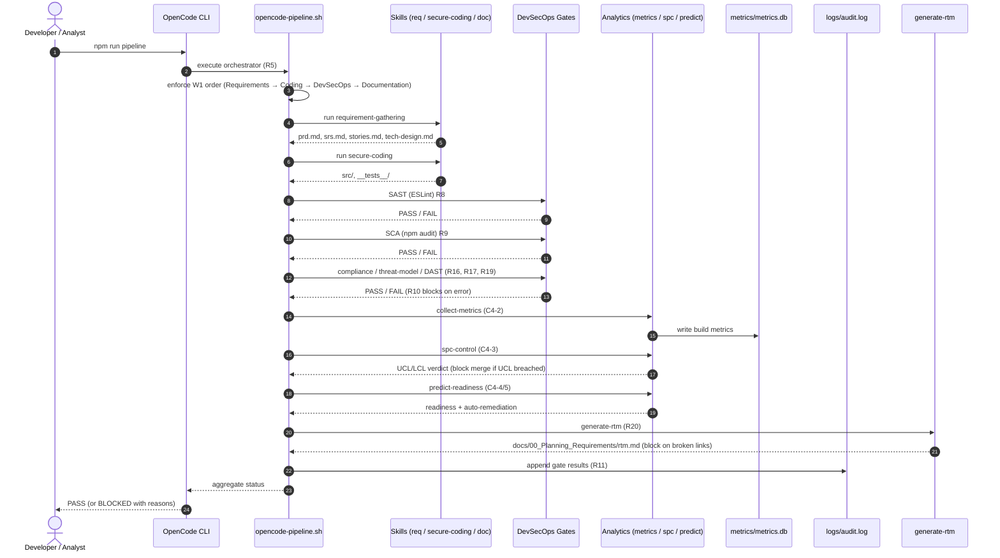
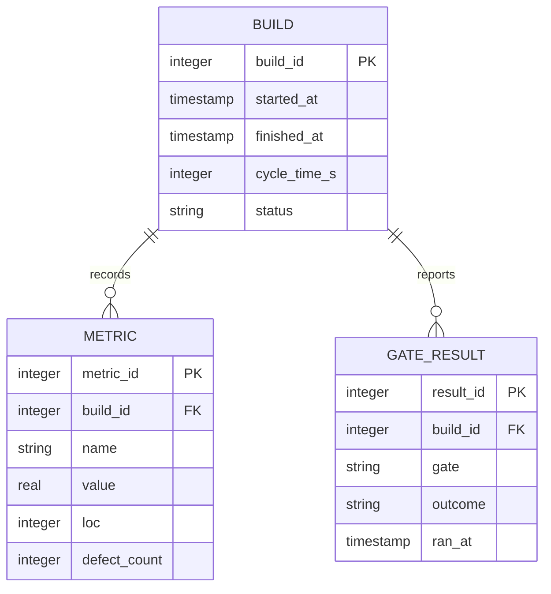
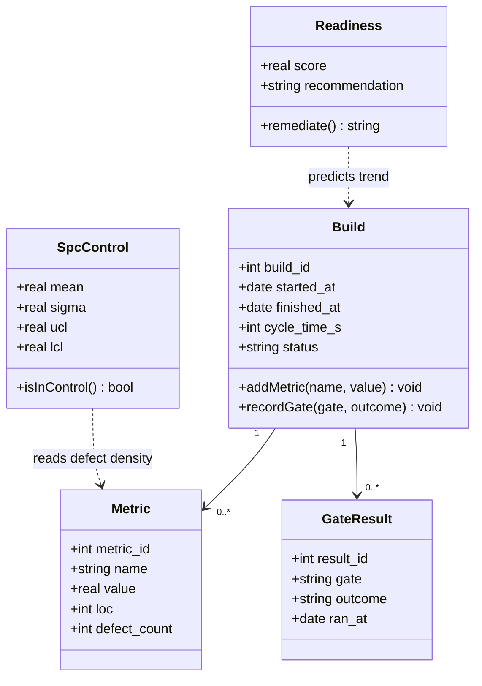
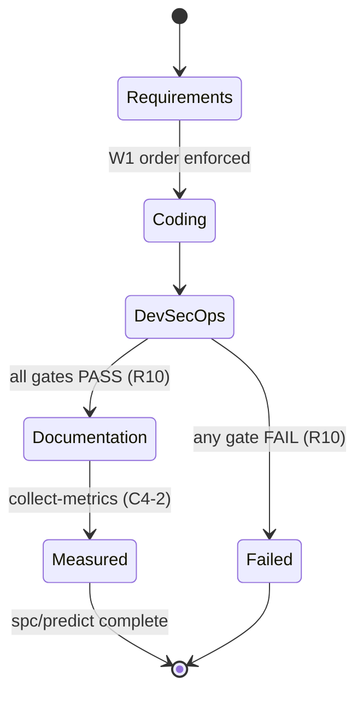
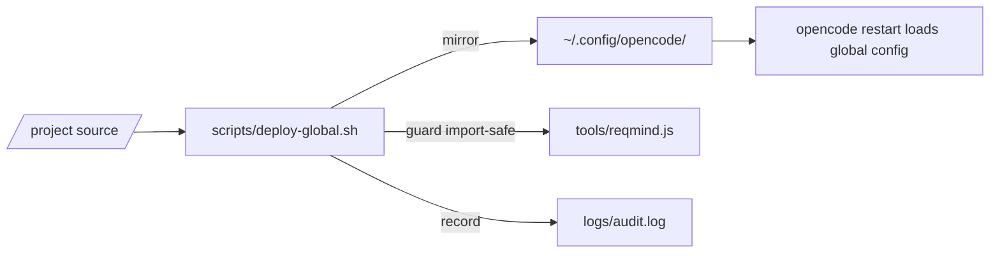
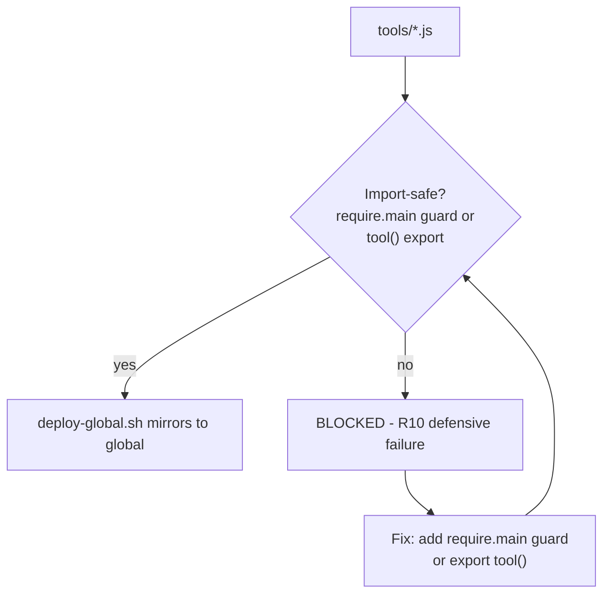

# Technical Design Document (tech-design.md)

**Product:** CMMI Level 4 OpenCode DevSecOps Pipeline (Linux Edition)
**Version:** 1.0.0
**Status:** Draft
**Skill:** requirement-gathering (R1) / speckit.plan · **Classifier:** Class 2 (Technical Design)
**Parent:** `docs/00_Planning_Requirements/srs.md`

> This document contains the mandatory **component diagram** and **sequence
> diagram of the primary flow** (skill Diagram Policy §5). All diagrams use
> Mermaid v11.16.x syntax (validated by `scripts/validate-mermaid.js`, R10).
> Mermaid is used by default; PlantUML / Graphviz are used only where a diagram
> type is not expressible in Mermaid.

---

## 1. Overview

The pipeline is a layered Node.js system orchestrated by OpenCode. A single
shell orchestrator enforces workflow order (W1), invokes skills for Class 1–5
artifact production, runs DevSecOps gates (R7–R11, R16–R19), and records
quantitative metrics (C4-2–C4-5). Everything is deployed globally to
`~/.config/opencode/` (R14).

## 2. Architecture Principles

1. **Single Entry Point (R5)** — all flows start at `npm run pipeline`.
2. **Strict Order (W1)** — Requirements → Coding → DevSecOps → Documentation.
3. **Mandatory Gates (R10)** — any gate error fails the build.
4. **Free/Local-First (R6)** — Node.js LTS, ESLint, Jest, sqlite3, mathjs,
   regression, Ollama, OWASP ZAP.
5. **Import-Safety (C4-6)** — every `tools/*.js` is side-effect-free on import.
6. **Single Source of Truth (R14)** — global `~/.config/opencode/` mirrors the
   project tree.

## 3. Repository Layout (mirrored globally)

| Path | Purpose |
| :--- | :--- |
| `AGENTS.md` | Project charter (R12) |
| `.opencode/skills/*/SKILL.md` | Skills (R13) |
| `.opencode/rules/operational-hard-rules.md` | R14/R15 hard rules |
| `.opencode/commands/pipeline.md` | `/pipeline` command |
| `scripts/` | Pipeline + DevSecOps + analytics scripts |
| `tools/reqmind.js` | Requirements-mind CLI (import-safe) |
| `src/`, `__tests__/` | Source and Jest tests (R2) |
| `docs/`, `specs/` | Class 1–5 documentation |
| `metrics/`, `logs/` | Metrics DB, audit log, gate reports |

## 4. Component Design

### 4.1 Component Diagram (mandatory)

Figure 1 - Component diagram of the pipeline.

### 4.2 Component Responsibilities

| Component | Responsibility | Requirement |
| :--- | :--- | :--- |
| `opencode-pipeline.sh` | Enforce W1 order, invoke skills/gates, fail on error | W1, R5, R10 |
| `requirement-gathering` | Produce PRD, SRS, stories | R1 |
| `secure-coding` | OWASP-compliant `src/` + tests | R2, R8 |
| `doc-generation` | Produce Class 2/5 docs | R3 |
| `cmmi-analytics` | Drive C4-2–C4-5 scripts | C4-2–C4-5 |
| ESLint gate | SAST | R8 |
| npm audit gate | SCA | R9 |
| compliance-check.js | GDPR/HIPAA/PCI DSS/SOX evidence | R16 |
| threat-model.js | npm audit + OSV.dev CVSS, OWASP | R17 |
| dast-scan.js | OWASP ZAP DAST; warn+block if none | R19 |
| notify.js | Telegram notifications (env-only) | R18 |
| collect-metrics.js | Seed `metrics/metrics.db` | C4-2 |
| spc-control.js | 3-sigma UCL/LCL; block on UCL breach | C4-3 |
| predict-readiness.js | Regression prediction + auto-remediation | C4-4, C4-5 |
| generate-rtm.js | `docs/00_Planning_Requirements/rtm.md`; block on broken links | R20 |
| deploy-global.sh | Mirror to `~/.config/opencode/`; guard import-safe tools | R14, C4-6 |

## 5. Sequence Diagram — Primary Flow (mandatory)

Figure 2 - Sequence diagram of the primary pipeline flow.

## 6. Data Model

### 6.1 Entity-Relationship Model

Figure 3 - Entity-relationship diagram of `metrics/metrics.db`.

### 6.2 Build Class Model

Figure 4 - Class diagram of the build/analytics domain.

## 7. State Machine — Pipeline Run

Figure 5 - State diagram of a pipeline run.

## 8. Deployment

Figure 6 - Deployment of resources to the global config (R14).

- Run `npm run deploy` after every resource change (R14).
- Never hand-edit global files (R14 enforcement #1).

## 9. Security & Import-Safety Considerations

- **C4-6:** every `.js` in `tools/` must be import-safe (guard CLI with
  `if (require.main === module)` or export `tool()` from `@opencode-ai/plugin`);
  `deploy-global.sh` refuses non-safe files (R10).
- **R2:** no hardcoded secrets, no `eval`, input validation in `src/`.
- **R18:** notifications read secrets from environment variables only.

Figure 7 - Import-safety decision flow for `tools/*.js` (C4-6).

## 10. Validation / Diagram Verification

All Mermaid diagrams in this document are validated by
`scripts/validate-mermaid.js` (R10 gate). The current release target is the
Mermaid version embedded in https://mermaid.live (v11.16.x); both canonical and
`-beta` keyword forms are accepted by the validator. Diagram types used here and
their status:

| Diagram | Type | Line | Validated |
| :--- | :--- | :--- | :--- |
| Figure 1 | `architecture-beta` | `tech-design.md:56` | ✓ |
| Figure 2 | `sequenceDiagram` | `tech-design.md:137` | ✓ |
| Figure 3 | `erDiagram` | `tech-design.md:182` | ✓ |
| Figure 4 | `classDiagram` | `tech-design.md:214` | ✓ |
| Figure 5 | `stateDiagram-v2` | `tech-design.md:260` | ✓ |
| Figure 6 | `flowchart` | `tech-design.md:276` | ✓ |
| Figure 7 | `flowchart` | `tech-design.md:298` | ✓ |

## 11. Acceptance Criteria

- [x] Component diagram present (Figure 1).
- [x] Sequence diagram of primary flow present (Figure 2).
- [x] All Mermaid diagrams validate under `scripts/validate-mermaid.js` (R10).
- [x] PlantUML / Graphviz used only where Mermaid cannot express the diagram.
- [x] Artifacts referenced in SRS §6 exist on disk (verified by `generate-rtm.js`, R20).

---

_Generated by the `requirement-gathering` skill. References: R1–R20, W1, C4-1–C4-6._