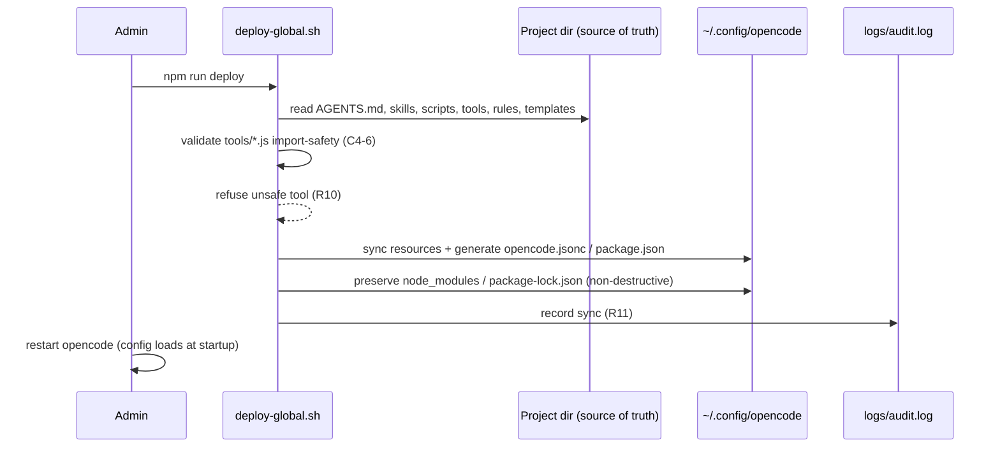
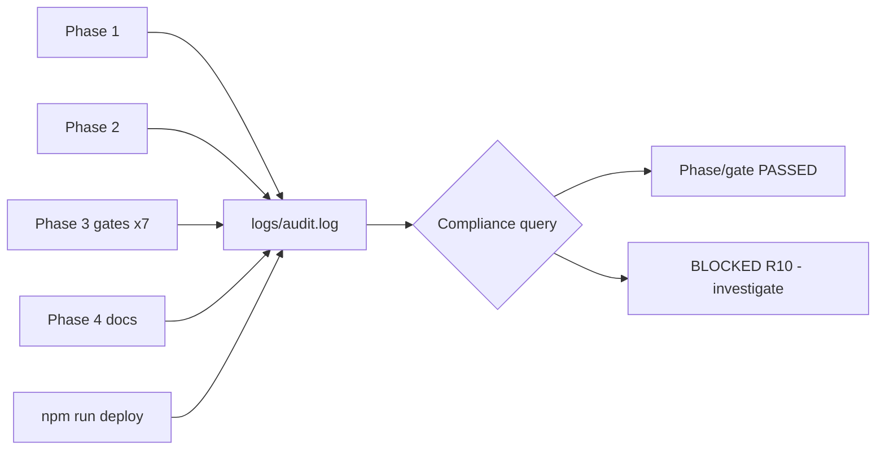

# Administration Guide

**Class**: 5 (Ops/User) | **Persona**: Administrator

## Overview

The administrator keeps the pipeline deployment healthy: syncing resources to
the global directory (R14), controlling who can act, reading the audit trail
(R11), and backing up the Class 4 artifacts. This guide covers day-to-day
administration; see [Configuration-Guide](Configuration-Guide.md) for
`opencode.jsonc` and model/provider settings.

## 1. Global deployment (R14 — HARD RULE)

The project directory is the single source of truth. Every resource the
pipeline needs at runtime is mirrored to `~/.config/opencode/` by the deploy
script — never by hand.

Figure 1 - Deploy sequence (R14)



### Rules the administrator must enforce

1. NEVER edit a global resource directly — edit the project source and re-run
   `npm run deploy`. A hand-edited global resource is a BLOCKING defect.
2. Deploy after EVERY change to any mirrored resource (skill, script, tool,
   rule, template, AGENTS.md, config).
3. Never run the pipeline against a stale global copy — deploy the latest
   scripts/skills/specs first.
4. `npm run pipeline` MUST work from `~/.config/opencode/` with zero dependency
   on the project directory.
5. Any new resource MUST be added to the deployment table AND the deploy script
   in the same change — a missing mirror is a BLOCKING defect.
6. The global `opencode.jsonc` and `package.json` are GENERATED; never hand-edit
   them.
7. Restart opencode after every deploy.

| Resource | Source | Global location |
| :--- | :--- | :--- |
| Global config (generated) | `opencode.global.jsonc` | `~/.config/opencode/opencode.jsonc` |
| package.json (generated) | `package.json` | `~/.config/opencode/package.json` |
| Charter + rules | `AGENTS.md`, `.opencode/rules/` | `~/.config/opencode/` |
| Skills | `.opencode/skills/*/SKILL.md` | `~/.config/opencode/skills/*/SKILL.md` |
| Command | `.opencode/commands/pipeline.md` | `~/.config/opencode/commands/pipeline.md` |
| SSOT format reference | `opencode.project.md` | `~/.config/opencode/opencode.project.md` |
| Scripts | `scripts/*` | `~/.config/opencode/scripts/*` |
| Doc templates | `scripts/templates/` | `~/.config/opencode/scripts/templates/` |
| Tools | `tools/*.js` | `~/.config/opencode/tools/*.js` |
| ESLint config, .gitignore | `.eslintrc.js`, `.gitignore` | `~/.config/opencode/` |
| Artifacts | `specs/`, `src/`, `__tests__/`, `docs/`, `metrics/` | `~/.config/opencode/` |
| Dependencies | package.json devDependencies | `~/.config/opencode/node_modules/` |

## 2. Tool import-safety (C4-6)

opencode auto-imports every `.js` under `~/.config/opencode/tools/` in-process
at startup. A plain CLI whose top-level code runs on import (prints usage,
calls `process.exit(1)`) will CRASH opencode.

| Module shape | Safe? |
| :--- | :--- |
| CLI entry guarded by `if (require.main === module) { ... }` | Yes |
| Exports a `tool()` definition from `@opencode-ai/plugin` | Yes |
| Top-level side effects (console/process.exit) | No — deploy refuses it (R10) |

## 3. Access control

Role-based access is enforced by the secure primitive `src/access.js`:

| Role | Scope |
| :--- | :--- |
| `admin` | All operations, including deploy and configuration changes |
| `developer` | Create code, specs, docs, run the pipeline |
| `viewer` | Read-only access to artifacts and reports |

Use `hasRole`, `assertRole`, and `isOwner` in application code; validate role
sets with `validateRoles` before trusting user input. Never grant `admin` to
untrusted identities, and never log raw credentials (see
[Security-Hardening-Guide](Security-Hardening-Guide.md)).

## 4. Reading the audit log (R11)

Every phase and gate writes a line to `logs/audit.log`:

```text
2026-08-09 10:00:01 | Phase 1 (Requirements) | PASSED
2026-08-09 10:00:41 | Phase 2 (Coding) | PASSED
2026-08-09 10:01:12 | Phase 3 (Runtime Protection) | PASSED
2026-08-09 10:01:15 | Phase 3 (SAST) | BLOCKED (R10)
2026-08-09 10:02:00 | Pipeline | SUCCESS
```

The pipeline also appends structured JSON lines via `src/audit.js`
(`formatAuditLine`), which redacts secrets before writing.

Figure 2 - Audit log lifecycle



Periodic checks: confirm every expected phase line has a matching `PASSED` (or a
documented `BLOCKED`), and that no line contains a secret.

## 5. Backups and restore

| Artifact | Back up | Restore |
| :--- | :--- | :--- |
| `metrics/metrics.db` | Copy to cold storage after each batch of builds | Copy back; SPC/prediction recompute automatically |
| `logs/audit.log` | Archive periodically (append-only) | Replace file; keep history for compliance |
| Global dir | Snapshot `~/.config/opencode/` (exclude `node_modules`) | Re-run `npm run deploy` from the project source of truth |
| `docs/`, `specs/`, `src/`, `__tests__/` | Version control (git) | `git checkout` / `git restore` |

Restore procedure for a broken global deployment:
1. Verify the project source of truth is intact.
2. Delete the corrupt global copy of a generated resource (or the whole
   `~/.config/opencode/`).
3. `npm install --prefix $HOME/.config/opencode`
4. `npm run deploy`
5. Restart opencode.

## 6. Daily admin checklist

- [ ] Run `npm run deploy` after any resource change; restart opencode.
- [ ] Confirm `logs/audit.log` shows `PIPELINE SUCCESS` for the latest build.
- [ ] Review `metrics/spc-report.md` for UCL excursions (see
  [Monitoring-Alerting-Guide](Monitoring-Alerting-Guide.md)).
- [ ] Ensure `.env` is absent and `.gitignore` excludes it (R7).
- [ ] Back up `metrics/metrics.db` and the audit log on a set cadence.
