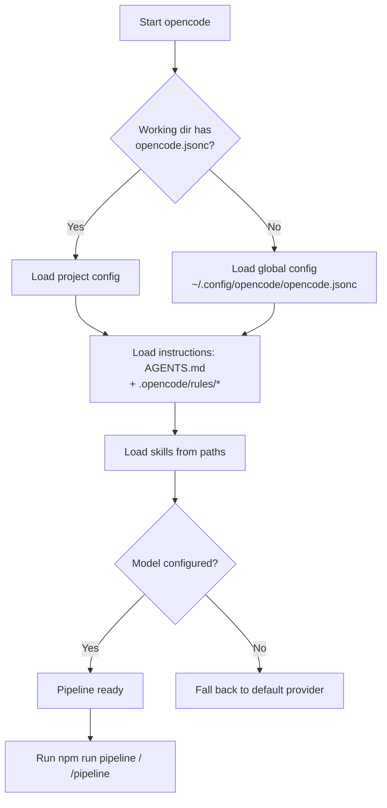
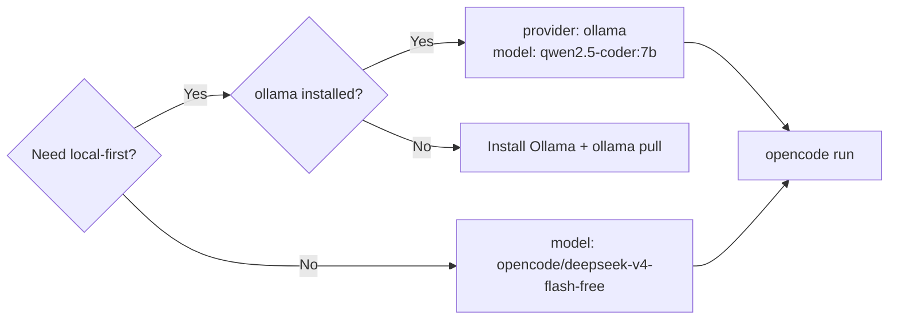

# Configuration Guide

**Class**: 5 (Ops/User) | **Persona**: Administrator

## Overview

This guide covers every configuration surface of the pipeline: `opencode.jsonc`
(model + provider), the global config template (`opencode.global.jsonc`), how
config loads, and how to point the pipeline at a different model or provider.
Security gate and tooling configuration live in the
[Security-Hardening-Guide](Security-Hardening-Guide.md); deployment mechanics
live in the [Administration-Guide](Administration-Guide.md).

## 1. Configuration surfaces

| Surface | File | Purpose |
| :--- | :--- | :--- |
| Project config | `opencode.jsonc` | Model, provider, skills path, instructions |
| Global config template | `opencode.global.jsonc` | Source for the GENERATED `~/.config/opencode/opencode.jsonc` |
| Global config (generated) | `~/.config/opencode/opencode.jsonc` | Loaded when running the pipeline from any directory (R14) |
| Rules | `.opencode/rules/operational-hard-rules.md` | R14/R15 HARD RULES, loaded via `instructions` |
| Charter | `AGENTS.md` | R12 process rules |
| ESLint | `.eslintrc.js` | R8 SAST configuration (global; project copies cannot shadow it) |
| Skills | `.opencode/skills/*/SKILL.md` | R13 workflow definitions |
| Package scripts | `package.json` | npm entry points (`pipeline`, `lint`, `test`, ...) |

## 2. How configuration loads

Figure 1 - Configuration load order



Key points:
- Config loads at startup — restart opencode after any change.
- The global config is GENERATED from `opencode.global.jsonc` by the deploy
  script and deliberately omits `skills.paths` (global skills auto-discover
  from `~/.config/opencode/skills/`) and uses global-relative `instructions`
  paths.
- Never hand-edit the generated global config (R14).

## 3. `opencode.jsonc` keys

| Key | Purpose | Example |
| :--- | :--- | :--- |
| `$schema` | Editor schema | `https://opencode.ai/config.json` |
| `model` | Default model id | `opencode/deepseek-v4-flash-free` |
| `provider` | Provider id | `ollama` (optional local-first) |
| `skills.paths` | Extra skill directories (project only) | `.opencode/skills` |
| `instructions` | Extra instruction files (charter, rules) | `AGENTS.md`, `.opencode/rules/operational-hard-rules.md` |
| `tools` | Enabled/disabled custom tools | `{ reqmind: true }` |

The default model `opencode/deepseek-v4-flash-free` requires no API key. The
Ollama provider is registered with `qwen2.5-coder:7b` and `qwen2.5-coder:14b`
for a free, local-first fallback (R6).

## 4. Models and providers

| Provider | Model | When to use |
| :--- | :--- | :--- |
| opencode default | `opencode/deepseek-v4-flash-free` | Default; no setup |
| Ollama (local) | `qwen2.5-coder:7b` | Offline / privacy-sensitive (R6) |
| Ollama (local) | `qwen2.5-coder:14b` | Higher quality, more RAM |

Figure 2 - Choose a provider



To switch provider: edit the `model` (and `provider` if needed) in
`opencode.jsonc`, update `opencode.global.jsonc` if you want it to persist
globally, then `npm run deploy` and restart opencode.

## 5. Global vs project configuration

The pipeline operates on a *project directory* but executes from the *global
toolchain*:

- The pipeline executable lives in `~/.config/opencode/scripts/` (inferred from
  the script's own location).
- The project it operates on defaults to the calling working directory; pass
  `-ProjectDir` to target another directory:
  ```bash
  bash scripts/opencode-pipeline.sh -ProjectDir /path/to/project
  ```
- ESLint always uses the GLOBAL `.eslintrc.js` (`--no-eslintrc --config`), so a
  project-level config can never shadow the enforced SAST settings (R8).
- `npm audit` and metrics run against the GLOBAL toolchain and the
  organizational `metrics/metrics.db` under `~/.config/opencode/metrics/`.

## 6. Project specification override

If `opencode.project.md` exists in the project root, the pipeline injects its
content into Phases 1, 2, and 4 so specs, code, and docs match the project's
domain. When absent, the pipeline runs generically. This is the recommended way
to tailor a deployment to a specific product without editing pipeline scripts.

Create or update it interactively with `/pipeline ssot` — it asks for the
project information ONE question at a time in the TUI and writes
`opencode.project.md` following the canonical SSOT format (identity, stack,
repository layout, configuration, architecture, schema, data sources, API,
workflow, deployment, security, troubleshooting, glossary). Existing sections
you do not re-answer are preserved on update.

When the SSOT is present, `src/` is the **ROOT DIRECTORY of the codebase**: the
coding phase follows the SSOT's Repository Layout exactly (e.g. `src/server.js`,
`src/database/`, `src/frontend/`). Generated markdown embeds Mermaid diagrams
that follow the CURRENT release used by https://mermaid.live (Mermaid v11.16.x)
using canonical keywords (`xychart`, `block`, `architecture-beta`, ...). Both
canonical and `-beta` keyword forms are accepted; all diagrams are validated
by `scripts/validate-mermaid.js` (R10 gate).

## 7. Change procedure

1. Edit the project source (`opencode.jsonc` / `opencode.global.jsonc`).
2. `npm run deploy` (R14) — records the sync in `logs/audit.log` (R11).
3. Restart opencode.
4. Verify: `npm run pipeline` from the project, and `/pipeline` from any
   directory.
