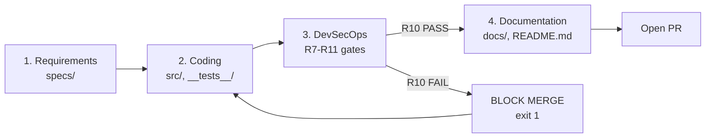
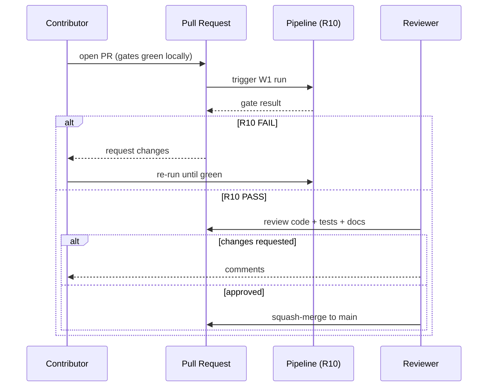

# Contributing Guide

**Class**: 5 (Ops/User) | **Persona**: Contributor

First off, thank you for taking the time to contribute. This project is a
Linux-native, CMMI Level 4 (Quantitatively Managed) DevSecOps pipeline built on
Node.js LTS and opencode. Every contribution — bug reports, features, docs, or
tests — helps improve the quantitative goals defined in `AGENTS.md`
(C4-1: defect density ≤ 0.5/KLOC, build stability ≥ 98%, cycle-time stability
< 2 min std dev).

## Table of Contents

1. [Code of Conduct](#1-code-of-conduct)
2. [Getting Started](#2-getting-started)
3. [How to Contribute](#3-how-to-contribute)
4. [Development Workflow (W1)](#4-development-workflow-w1)
5. [Coding Standards & Style](#5-coding-standards--style)
6. [Commit Message Guidelines](#6-commit-message-guidelines)
7. [Branch Naming Convention](#7-branch-naming-convention)
8. [Testing Requirements](#8-testing-requirements)
9. [Documentation Requirements](#9-documentation-requirements)
10. [Review Process](#10-review-process)
11. [Getting Help](#11-getting-help)

---

## 1. Code of Conduct

Participation in this project is governed by the
[Code of Conduct](../../CODE_OF_CONDUCT.md). By contributing, you agree to
uphold its standards. Please report unacceptable behavior to
`[security-contact@your-org]` rather than in public channels.

---

## 2. Getting Started

Welcome! Before you write any code, get a clean local environment running.

### 2.1 Prerequisites

| Requirement | Version | Notes |
| :--- | :--- | :--- |
| Node.js | LTS (≥ 18) | Install via nvm: `nvm install --lts` |
| npm | Bundled with Node.js | |
| bash | 4+ | Pipeline orchestrator is bash |
| opencode CLI | latest | `npm install -g opencode-ai` |
| Ollama (optional) | latest | Local-first LLM runtime (R6) |

### 2.2 First-time setup

Follow the [Setup Guide](setup-guide.md) end-to-end first, then read the
[Developer Guide](dev-guide.md) for the secure-coding conventions used across
`src/`. Confirm the toolchain is healthy:

```bash
git clone [repository-url] && cd software-development-pipeline/Linux
npm install
npm run lint          # ESLint SAST gate (R8) — must exit 0
npm run test          # Jest coverage suite
npm run audit         # SCA gate (R9) — expect 0 high/critical
npm run pipeline      # full W1 run; all gates enforced (R10)
```

> **Tip:** Every command above must exit `0` before a contribution is
> considered ready for review. A failing gate is a BLOCKING defect (R10).

---

## 3. How to Contribute

We welcome four kinds of contribution. Each has a preferred entry point.

### 3.1 Reporting bugs

1. Search existing issues to avoid duplicates.
2. Open a new issue using the **Bug Report** template.
3. Include: reproduction steps, expected vs. actual behavior, `node --version`,
   `npm --version`, the `[FAIL]` line from the console, and the relevant
   `logs/audit.log` excerpt (R11).
4. Redact any secrets — see [section 5](#5-coding-standards--style).

### 3.2 Suggesting features

1. Open an issue using the **Feature Request** template.
2. Tie the feature to a CMMI quantitative goal (C4-1) or a requirement ID
   (R1–R20) where possible.
3. Discuss scope with maintainers **before** writing code — the W1 workflow
   starts in Phase 1 (Requirements), not Phase 2 (Coding).

### 3.3 Improving documentation

Docs live in `docs/` (Class 5) and `specs/` (Class 1/2). See
[section 9](#9-documentation-requirements) and the
[Glossary](../06_User_Reference/glossary.md) for classification.

### 3.4 Submitting pull requests

1. Create a branch following [section 7](#7-branch-naming-convention).
2. Make small, single-concern commits.
3. Ensure all gates pass locally (`npm run pipeline`).
4. Open a PR against `main` and fill in the PR template.
5. Link the PR to its issue (`Closes #123`).

---

## 4. Development Workflow (W1)

The pipeline enforces a strict order (W1): **Requirements → Coding → DevSecOps
→ Documentation**. Violations block the build. Manual contributions follow the
same discipline.



| Phase | What you do | Output location |
| :--- | :--- | :--- |
| 1. Requirements | Clarify the need; update SRS/stories if scope changes | `specs/` |
| 2. Coding | Implement in `src/`; add matching `__tests__/*.spec.js` | `src/`, `__tests__/` |
| 3. DevSecOps | R7 runtime + R8 SAST + R9 SCA + Jest; R10 must pass | `metrics/`, `logs/audit.log` |
| 4. Documentation | Update docs to match the code change | `docs/` |

See the [Pipeline Guide](pipeline-guide.md) for the full phase reference and
the [Testing Guide](test-guide.md) for test conventions.

---

## 5. Coding Standards & Style

The `secure-coding` skill and the ESLint gate (R8) enforce OWASP-aligned
standards. The rules below are non-negotiable.

| Rule | Enforcement | Detail |
| :--- | :--- | :--- |
| No hardcoded secrets | R7 + ESLint + `src/secrets.js` | No `api_key`/`password`/`secret`/`token` literals |
| No `eval` / `new Function` | ESLint `no-eval`, security plugin | Static compile-time check |
| Input validation | R7 + `src/validate.js` | Validate at every trust boundary |
| No arbitrary command/URL | `src/command.js`, `src/url.js` | Allow-list beats block-list |
| Import-safe `tools/*.js` | C4-6 | Guard CLI entry with `require.main === module` |
| CommonJS modules | — | `require`/`module.exports`; throw typed errors |

### 5.1 Style summary

- 2-space indentation; no trailing whitespace; LF line endings.
- Single quotes for strings; semicolons required.
- Name exports explicitly; avoid `index.js` re-export barrels in `src/`.
- Functions stay small and pure; push side effects into explicit `init()` calls.

```bash
npm run lint          # auto-fixable: npx eslint . --ext .js --fix
```

> **Don't** bypass a gate with `npm run pipeline:skipsecurity` to ship a fix.
> A skipped gate is a BLOCKING defect (R10).

---

## 6. Commit Message Guidelines

We use [Conventional Commits](https://www.conventionalcommits.org/) so the
changelog and traceability (R11/R20) stay automatable.

```
<type>(<scope>): <subject>

<body>

<footer>
```

| Field | Allowed values |
| :--- | :--- |
| `type` | `feat`, `fix`, `docs`, `style`, `refactor`, `test`, `chore`, `perf`, `ci`, `build`, `security` |
| `scope` | module or area, e.g. `spc`, `auth`, `rtm`, `dast`, `docs` |
| `subject` | imperative, ≤ 72 chars, lowercase, no trailing period |

### 6.1 Examples

```text
feat(rtm): generate traceability matrix from SRS §6

Parses FR/NFR tables in specs/srs.md, cross-references User-Stories.md,
and verifies src/__tests__/docs artifacts on disk. R10 blocking on broken
links. Closes #42.
```

```text
fix(eslint): suppress false positive in src/command.js

The security plugin flagged an allow-listed binary. Added an inline
eslint-disable with justification. No behavior change.
```

```text
security(auth): raise PBKDF2 iterations to 210k (OWASP-aligned)
```

### 6.2 Footer keywords

- `Closes #123` / `Fixes #123` — link issue.
- `BREAKING CHANGE:` — describe migration in the body.
- `R-IDs: R8,R10` — map to requirement IDs for the RTM (R20).

---

## 7. Branch Naming Convention

Branches are named `<type>/<scope>-<short-desc>` and must map to an issue.

| Type | Example | When to use |
| :--- | :--- | :--- |
| `feature` | `feature/RTM-generator` | New capability |
| `fix` | `fix/eslint-warning` | Bug fix |
| `security` | `security/auth-iterations` | Security hardening |
| `docs` | `docs/database-schema` | Documentation only |
| `chore` | `chore/upgrade-node-lts` | Tooling/dependencies |
| `refactor` | `refactor/spc-control` | No behavior change |

```bash
git checkout -b feature/RTM-generator
# ...work...
git push -u origin feature/RTM-generator
```

---

## 8. Testing Requirements

Tests are mandatory. Code without a test is an R10 failure.

| Requirement | Threshold | Tool |
| :--- | :--- | :--- |
| Statement coverage | ≥ 90% | Jest + `--coverage` |
| Branch coverage | ≥ 85% | Jest |
| Critical-path coverage | 100% | `src/auth.js`, `src/secrets.js`, `src/sql.js` |
| Every new `src/*.js` | Matching `__tests__/*.spec.js` | — |

```bash
npm run test                          # full suite + coverage
npx jest __tests__/auth.spec.js       # single spec
npx jest --coverage --collectCoverageFrom='src/**/*.js'
```

Coverage is recorded into `metrics/metrics.db` per build (C4-2) and feeds the
SPC control report. See the [Testing Guide](test-guide.md) for fixture
patterns and the [Error Codes](error-codes.md) reference for the typed errors
your code should throw.

---

## 9. Documentation Requirements

If you change behavior, you change docs — in the **same PR**. Doc debt is a
blocking defect.

| Change type | Doc to update |
| :--- | :--- |
| New `src/` module | [API Reference](../01_Design_Architecture/api-ref.md) + this guide if conventions change |
| Schema change to `metrics.db` | [Database Schema](../01_Design_Architecture/database-schema.md) |
| New gate / pipeline phase | [Pipeline Guide](pipeline-guide.md) + [Architecture](../01_Design_Architecture/arch.md) |
| New error code | [Error Codes](error-codes.md) |
| Config surface change | [Config Guide](../02_Setup_Configuration/config-guide.md) |
| Deployment change | [Admin Guide](../02_Setup_Configuration/admin-guide.md) |

- Keep cross-references valid: same-folder links use `filename.md`; cross-folder
  links use `../NN_Folder/filename.md`; glossary is
  `../06_User_Reference/glossary.md`.
- Use `[placeholder]` for environment-specific values (hostnames, cloud
  providers, registry URLs).

---

## 10. Review Process

All changes are reviewed via pull request. The R10 gate is mandatory and runs
on every PR.



### 10.1 Reviewer checklist

- [ ] Gates R7–R11 pass (R10 is blocking).
- [ ] New code has matching tests; coverage thresholds met.
- [ ] No secrets, no `eval`, input validated at trust boundaries.
- [ ] Docs updated; cross-references valid.
- [ ] Commit messages follow Conventional Commits; branch name matches type.
- [ ] `tools/*.js` (if added) is import-safe (C4-6).
- [ ] RTM (R20) still resolves — no broken requirement links.

### 10.2 After merge

Per **R15 (HARD RULE)**, the contributor or maintainer should prompt for a local
git commit at natural milestones. After any deploy-relevant change, run
`npm run deploy` to sync global resources to `~/.config/opencode/` (R14), then
restart opencode.

---

## 11. Getting Help

| Need | Where |
| :--- | :--- |
| Setup trouble | [Setup Guide](setup-guide.md) → Troubleshooting table |
| Runtime failures / gate errors | [Troubleshooting Guide](../04_Operations_Maintenance/tshoot-guide.md) |
| Process / requirement questions | [Glossary](../06_User_Reference/glossary.md) and `AGENTS.md` (R12) |
| Architecture questions | [Architecture](../01_Design_Architecture/arch.md) |
| Security concerns | `[security-contact@your-org]` (do not open a public issue) |
| General discussion | `[discussion-channel-url]` |

Thanks again for contributing — and for keeping the gates green. Every
gate-clean PR keeps the SPC control limits (C4-3) honest and the defect-density
target (C4-1) within reach.
