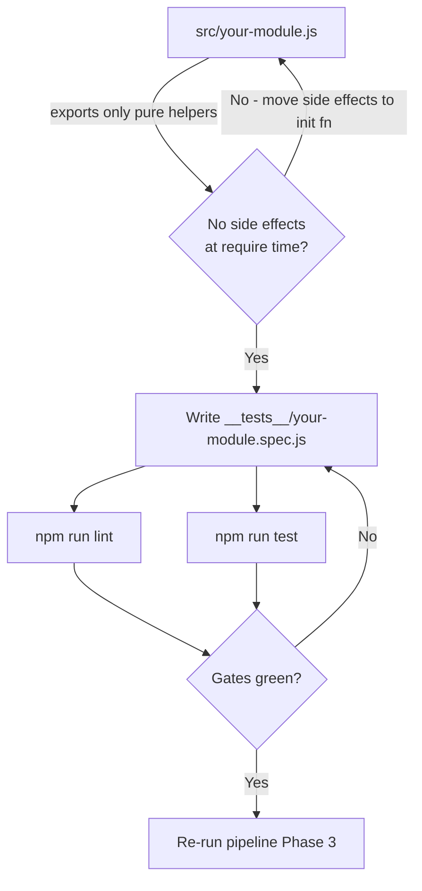
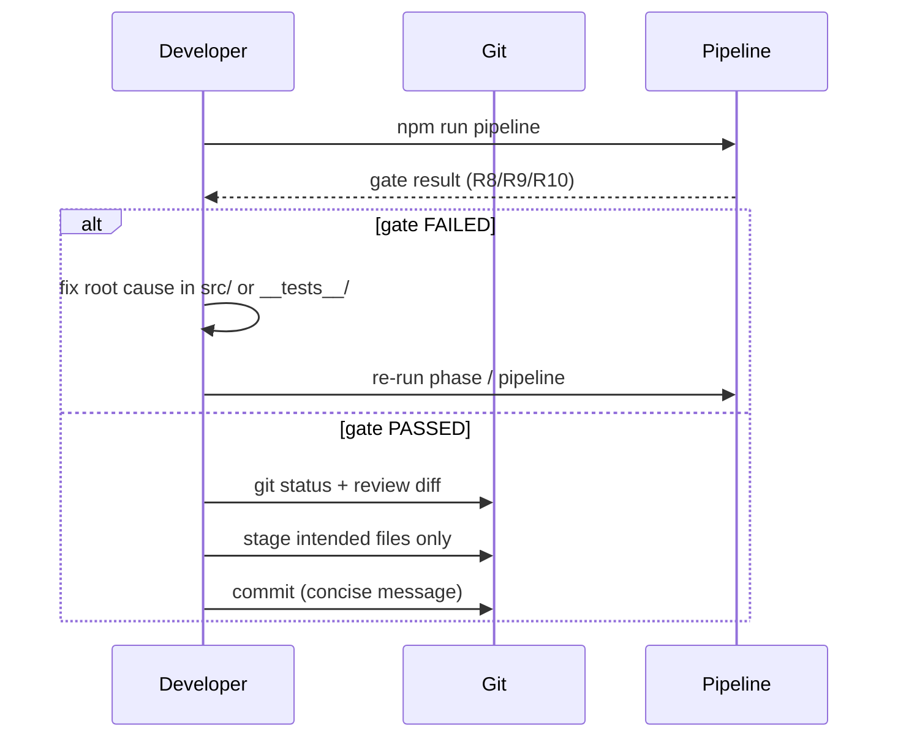

# Developer Guide

**Class**: 5 (Ops/User) | **Persona**: Developer

## Overview

This guide covers how to work on the codebase itself: the secure-coding
conventions for `src/`, the git workflow, local setup, and debugging. It is the
companion to the [Testing-Guide](Testing-Guide.md) (how to test) and the
[Pipeline-Guide](Pipeline-Guide.md) (how the phases drive the work).

## 1. Local setup

Follow the [Setup-Guide](Setup-Guide.md) first, then confirm the developer
toolchain:

```bash
node --version        # >= 18 LTS
npm run lint          # eslint . --ext .js (R8)
npm run test          # jest --coverage
npm run audit         # npm audit --audit-level=high (R9)
```

Every command must exit `0` before work is considered done (R10).

## 2. Coding standards

The pipeline enforces OWASP-aligned standards through the `secure-coding`
skill and the ESLint gate (R8). Rules in force:

| Rule | Enforcement | Detail |
| :--- | :--- | :--- |
| No hardcoded secrets | R7 + ESLint + `src/secrets.js` | No `api_key`/`password`/`secret`/`token` literals |
| No `eval` / `new Function` | ESLint (`no-eval`, security plugin) | Compile-time static check |
| Input validation | Manual (R7) + `src/validate.js` helpers | Validate at every trust boundary |
| No arbitrary command/URL construction | `src/command.js`, `src/url.js` | Allow-list beats block-list |
| No `require` of untrusted paths | ESLint security rules | Whitelist identifiers only |
| Import-safe tools | C4-6 (deploy script refuses unsafe `tools/*.js`) | Guard CLI entry with `require.main === module` |

Files live in `src/` (source) and `__tests__/` (matching `*.spec.js` tests).
Modules are CommonJS and throw typed errors (`TypeError`, `RangeError`,
`SyntaxError`) on invalid input.

## 3. Module layout and dependencies

Figure 1 - Adding or modifying a `src/` module



Dependency rule: keep `src/` modules independent. The only intra-`src/`
dependency today is `audit.js` -> `secrets.js` (redaction). Adding a new
dependency between modules must be justified in `docs/architecture.md`.

## 4. Git workflow

All work is produced by the pipeline phases, but manual fixes follow the same
discipline:

1. Run `npm run pipeline` to get a fresh build and gates.
2. On a gate failure (R10), fix the root cause in `src/` or `__tests__/`.
3. Re-run `npm run lint` and `npm run test` until both pass.
4. Never commit secrets; confirm `.gitignore` excludes `.env` (R7).
5. Commit in small, single-concern units (per R15, always ask first).

Figure 2 - Developer change loop



## 5. Debugging

| Symptom | Where to look |
| :--- | :--- |
| Gate failure | The `[FAIL]` line in the console names the gate; `logs/audit.log` records it (R11) |
| SAST warning | `npm run lint` output lists file:line |
| Test failure | `npm run test` shows the failing spec; coverage under `coverage/` |
| SCA finding | `metrics/security-scan.json` (npm audit JSON) |
| SPC block | `metrics/spc-report.md` (mean/UCL/LCL) |
| Startup crash | A `tools/*.js` is not import-safe (C4-6) — see Troubleshooting-Guide section 6 |

Quick reference commands:

```bash
npm run lint                     # SAST, exit 1 on any warning
npx jest __tests__/auth.spec.js  # run a single spec
npm run test                     # full suite + coverage
npm run spc                      # SPC control report
npm run predict                  # readiness forecast
```

## 6. Do / Don't

- **Do** reuse the `src/` primitives (`validate`, `sql`, `url`, `command`,
  `http`, `cookie`, `rate`, `secrets`, `audit`) instead of reinventing them.
- **Don't** bypass gates with `npm run pipeline:skipsecurity` to ship a fix;
  a skipped gate is a BLOCKING defect (R10).
- **Do** keep changes minimal and matched by a test.
- **Don't** edit global resources in `~/.config/opencode/` directly — edit the
  project source and run `npm run deploy` (R14).
