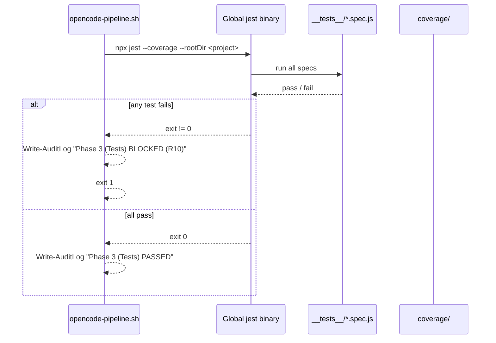
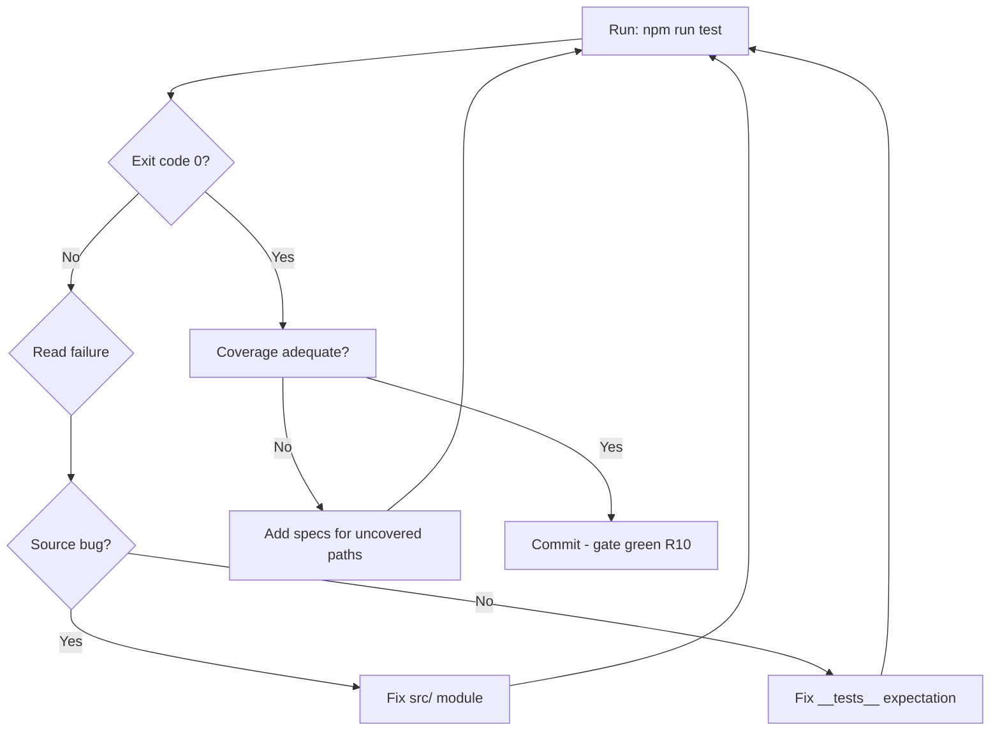

# Testing Guide

**Class**: 5 (Ops/User) | **Persona**: Developer

## Overview

Tests are a mandatory gate (Phase 3, step 4/7). Jest runs from the global
toolchain against the project, and any failing test or coverage miss blocks the
build with exit code 1 (R10). This guide explains the test layout, how coverage
is enforced, and exactly when tests block.

## 1. Test layout

Every `src/*.js` module has a matching `__tests__/*.spec.js`:

| Source | Spec |
| :--- | :--- |
| `src/auth.js` | `__tests__/auth.spec.js` |
| `src/access.js` | `__tests__/access.spec.js` |
| `src/validate.js` | `__tests__/validate.spec.js` |
| `src/sql.js` | `__tests__/sql.spec.js` |
| `src/url.js` | `__tests__/url.spec.js` |
| `src/command.js` | `__tests__/command.spec.js` |
| `src/http.js` | `__tests__/http.spec.js` |
| `src/cookie.js` | `__tests__/cookie.spec.js` |
| `src/rate.js` | `__tests__/rate.spec.js` |
| `src/secrets.js` | `__tests__/secrets.spec.js` |
| `src/audit.js` | `__tests__/audit.spec.js` |
| `src/metrics.js` | `__tests__/metrics.spec.js` |
| `src/spc.js` | `__tests__/spc.spec.js` |

Phase 2 (R2) produces these files; Phase 3 runs them. A Phase 2 run with no
`src/*.js` or no `__tests__/*.js` is BLOCKED (R10) before any test executes.

## 2. How the gate runs

Figure 1 - Test gate in the Phase 3 chain



The gate runs with `--rootDir` set to the project, so tests resolve project
`src/` modules while the jest binary and any devDependencies come from the
global toolchain.

## 3. Coverage

Coverage is collected on every run (`--coverage`) into `coverage/` (git-ignored).
The pipeline treats the Jest exit code as the gate; coverage output is a signal
for the developer:

```bash
npm run test
# =============================== Coverage summary ===============================
# Statements : xx% ( ... )
# Branches   : xx% ( ... )
# Functions  : xx% ( ... )
# Lines      : xx% ( ... )
```

Rules of thumb:

- Every public export in `src/` must be exercised (happy path + error path).
- Each module throws typed errors — test the thrown `TypeError`/`RangeError`/
  `SyntaxError` branches explicitly (e.g. empty arrays, non-finite values,
  disallowed identifiers).
- Constant-time paths (`auth.js`) and redaction (`secrets.js`) should be
  asserted on both sides (match and no-match).

## 4. When tests block (R10)

The test gate exits non-zero and blocks the build whenever:

| Condition | Result |
| :--- | :--- |
| Any `expect(...)` assertion fails | `BLOCKED (R10)` |
| A spec throws or times out | `BLOCKED (R10)` |
| `__tests__/` is missing after Phase 2 | `BLOCKED (R10)` at Phase 2 |
| `coverage/` cannot be written | `BLOCKED (R10)` |

A blocked gate is logged as `Phase 3 (Tests) | BLOCKED (R10)` in
`logs/audit.log`. Do not bypass with `pipeline:skipsecurity` — fix the failing
spec or the source it exercises.

## 5. Running tests locally

```bash
npm run test                      # full suite + coverage (matches the gate)
npx jest __tests__/auth.spec.js   # single spec, no coverage
npx jest -t "constant time"       # filter by test name
npx jest --watch                  # watch mode during development
```

Figure 2 - Test result decision flow



## 6. Relationship to other gates

Tests are the 4th of 7 Phase 3 steps, after R7 (runtime), R9 (SCA), and R8
(SAST). They run before metrics collection (C4-2), SPC (C4-3), and prediction
(C4-4). Fixing a test failure therefore also feeds a corrected measurement into
`metrics/metrics.db` on the next build.
