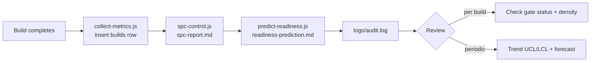
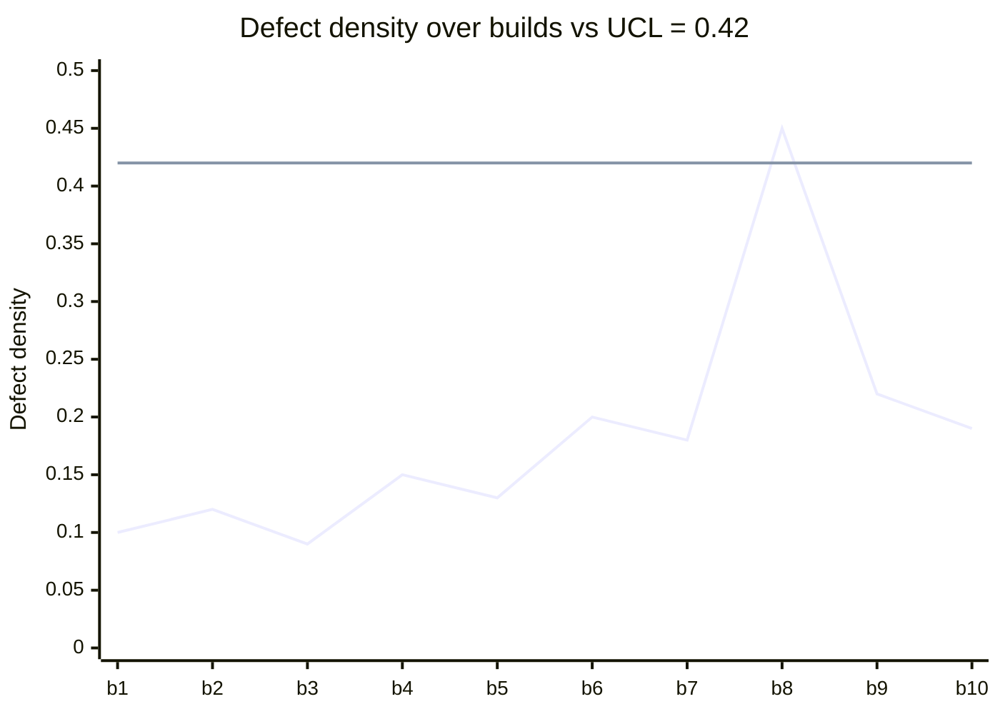
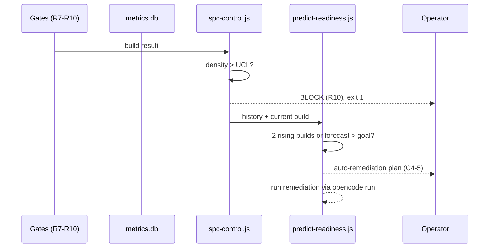

# Monitoring & Alerting Guide

**Class**: 5 (Ops/User) | **Persona**: Administrator / Operator

## Overview

The CMMI Level 4 pipeline is quantitatively managed: every build records a
measurement (C4-2), control limits are computed (C4-3), and readiness is
predicted (C4-4). This guide explains what to monitor, on what cadence, and how
alerting is triggered — by the SPC UCL rule (C4-3), the two-consecutive-build
trend rule (C4-5), and the fail-on-error gates (R10).

## 1. Monitoring cadence

Figure 1 - Monitoring loop per build and per period



| Cadence | What to review |
| :--- | :--- |
| Every build | Gate status in `logs/audit.log`, defect density vs UCL |
| Every 5 builds | First valid SPC baseline; start trusting `spc-report.md` |
| Every 10 builds | Readiness prediction meaningful; review forecast vs goal |
| Weekly | Backups of `metrics/metrics.db` and `logs/audit.log` |

## 2. Reading the SPC report

`metrics/spc-report.md` is generated by `spc-control.js`. It reports the
mean, standard deviation, UCL (`mean + 3σ`), LCL (`max(0, mean - 3σ)`), and
whether the current build is out of control.

Figure 2 - Control chart (illustrative build history)



Reading rules:
- **Action (C4-3)**: current density > UCL → BLOCK (R10). Investigate the
  cause before the next build.
- **Warning (C4-5)**: 2 consecutive builds trending upward → a remediation
  plan is auto-generated.
- **Goal (C4-1)**: density must stay ≤ 0.5 (Critical+High per KLOC).

## 3. Querying `metrics/metrics.db`

The `builds` table records one row per build (organizational DB under
`~/.config/opencode/metrics/metrics.db`).

| Column | Type | Meaning |
| :--- | :--- | :--- |
| `id` | INTEGER PK | Build id |
| `timestamp` | TEXT | ISO 8601 completion time |
| `loc` | INTEGER | Lines changed (git diff; defaults to 100) |
| `critical_vulns` | INTEGER | Critical vulnerabilities (npm audit) |
| `high_vulns` | INTEGER | High vulnerabilities (npm audit) |
| `defect_density` | REAL | `(critical + high) / (loc / 1000)` |

```bash
sqlite3 metrics/metrics.db "SELECT id, timestamp, loc, critical_vulns, high_vulns, defect_density FROM builds ORDER BY id DESC LIMIT 10;"
```

## 4. Audit log as a monitoring signal

`logs/audit.log` is append-only and records one line per phase/gate (R11).
Treat it as the operational health record:

```text
2026-08-09 10:01:15 | Phase 3 (SAST) | BLOCKED (R10)
```

Patterns to watch:
- Any `BLOCKED (R10)` — immediate investigation.
- Missing phase lines — a phase was skipped or the pipeline was interrupted.
- No `PIPELINE SUCCESS` line at the end — the run terminated early.

## 5. Alerting rules

Alerting is automatic and enforced by the pipeline scripts:

| Rule | Trigger | Action |
| :--- | :--- | :--- |
| UCL excursion (C4-3) | `defect_density > UCL` | `spc-control.js` exits 1 → pipeline BLOCKS (R10) |
| Upward trend (C4-5) | 2 consecutive builds trending upward | Auto-remediation generated by `predict-readiness.js` |
| Prediction over goal | Forecast density > DENSITY_GOAL (0.5) | Auto-remediation runs via `opencode run` |
| Gate failure | R7/R8/R9/test/metrics failure | Pipeline exits 1 → merge blocked |

Figure 3 - Alert escalation flow



## 6. Operator runbook summary

1. After each build: read the last lines of `logs/audit.log`; confirm
   `PIPELINE SUCCESS`.
2. After 5+ builds: open `metrics/spc-report.md`; note mean/UCL/LCL.
3. If `BLOCKED (R10)` appears: identify the gate, apply the fix from
   [Troubleshooting-Guide](Troubleshooting-Guide.md), re-run.
4. If prediction > goal: follow the generated remediation plan; re-run and
   confirm two consecutive improving builds.
5. Back up `metrics/metrics.db` and `logs/audit.log` on a fixed schedule.
