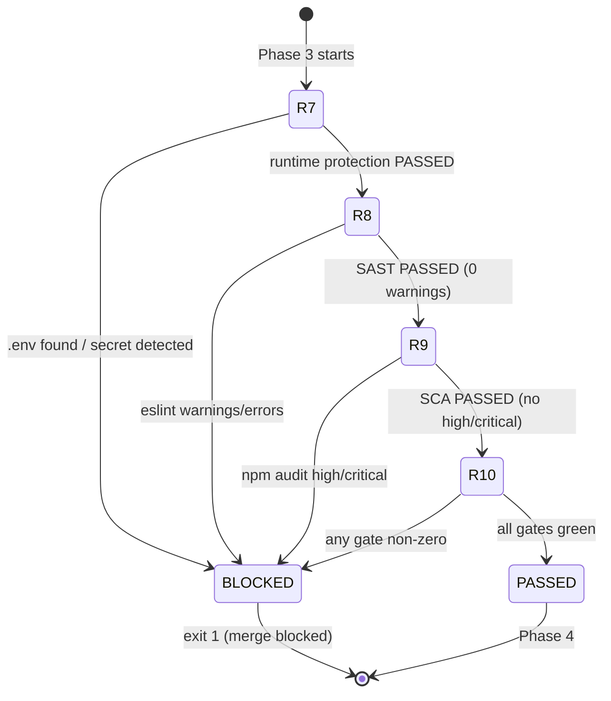
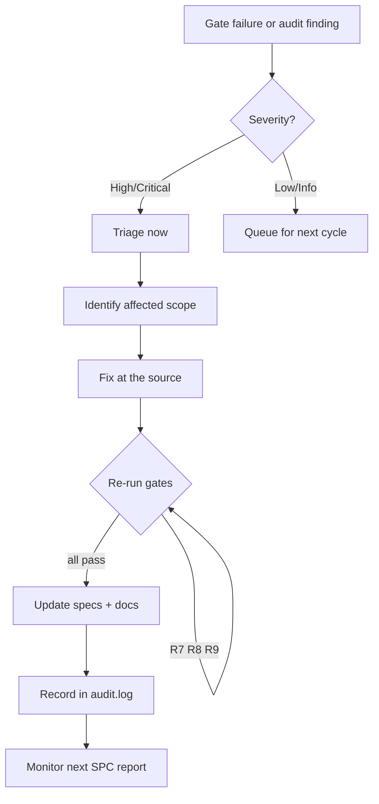

# Security Hardening Guide

**Class**: 5 (Ops/User) | **Persona**: Administrator / Security

## Overview

This guide explains how the mandatory security gates R7-R10 work, how the
secure `src/` primitives support them, and the concrete hardening steps an
administrator should apply. Reference for the process model is `AGENTS.md`;
tactical signatures are in [API-Reference](API-Reference.md).

## 1. The gate chain (R7-R10)

Figure 1 - State flow of the Phase 3 security gates

### R7 — Runtime protection
Automated checks against the project tree:
- `.env` must be absent (secrets at risk).
- `.gitignore` must exist and exclude `.env`.
- No hardcoded secrets in `src/`, `scripts/`, `tools/` (pattern:
  `(api[_-]?key|password|passwd|secret|token) = "..."`).

### R8 — SAST
`npx eslint --no-eslintrc --config .eslintrc.js <project> --ext .js --max-warnings 0`
runs against ALL project `.js` with the GLOBAL config. Any warning or error
blocks the build (R10).

### R9 — SCA
`npm audit --audit-level=high --json` runs against the GLOBAL toolchain. Output
is written to `metrics/security-scan.json` (UTF-8, no BOM) for C4-2. Any
high/critical advisory blocks the build.

### R10 — Mandatory gate
Every phase and gate enforces fail-on-error. A non-zero exit anywhere exits the
pipeline with code 1 and records a `BLOCKED (R10)` audit entry.

## 2. Secure primitives in `src/` (R2/R8)

The secure-coding layer implements OWASP-aligned defenses used across the
toolchain. Hardening relies on using these rather than re-inventing checks.

| Module | Defense | Hardening use |
| :--- | :--- | :--- |
| `src/auth.js` | PBKDF2 (210k iterations) + constant-time verify | Credential storage; never store plaintext |
| `src/secrets.js` | Secret scanning + redaction | Pre-write redaction for `logs/audit.log` (R11) |
| `src/validate.js` | Sanitization, email/path checks | Validate all external input |
| `src/sql.js` | Identifier whitelist + parameterized placeholders | SQL injection defense |
| `src/url.js` | Protocol allow-list, SSRF blocking (private/loopback) | Never fetch unfiltered URLs |
| `src/command.js` | Command/arg allow-lists, shell metachar rejection | Spawn only validated commands |
| `src/http.js` | Security headers, safe JSON parsing (no `__proto__`) | HTTP responses and untrusted payloads |
| `src/cookie.js` | RFC-6265 `Set-Cookie` with HttpOnly/Secure/SameSite | Session cookies |
| `src/rate.js` | Fixed-window rate limiting | Brute-force / DoS mitigation |
| `src/access.js` | Role validation, `hasRole`/`assertRole` | Access control enforcement |
| `src/audit.js` | Structured, secret-redacted audit lines | R11 traceability |

## 3. Hardening checklist

### Secrets management (R7)
- [ ] No `.env` in the working tree; `.gitignore` excludes `.env`, `.env.*`, `*.pem`, `*.key`.
- [ ] Secrets come from environment variables or a vault, never source code.
- [ ] `src/secrets.js` `redact()` applied to anything that may reach a log.
- [ ] `npm run deploy` refuses to ship a `tools/*.js` that is not import-safe (C4-6).

### Static analysis (R8)
- [ ] `npm run lint` passes with zero warnings before every merge.
- [ ] Keep the GLOBAL `.eslintrc.js` authoritative; never shadow it with a project config.

### Dependency hygiene (R9)
- [ ] `npm run audit` reports no high/critical advisories.
- [ ] Apply `npm audit fix` promptly; pin lockfiles (`package-lock.json`) in version control.

### Runtime and network (R7/R2)
- [ ] Validate all inputs with `src/validate.js`; reject anything outside allow-lists.
- [ ] Use `src/url.js` to block SSRF (private/loopback/IPv4-private hosts).
- [ ] Use `src/command.js` before any `child_process.spawn` call.
- [ ] Set security headers and Safe/SameSite/HttpOnly cookies via `src/http.js` and `src/cookie.js`.
- [ ] Protect auth endpoints with `src/rate.js`.

### Operational (R10/R11)
- [ ] All gates mandatory — never merge with `pipeline:skipsecurity`.
- [ ] `logs/audit.log` present and reviewed for anomalies.
- [ ] `metrics/spc-report.md` shows defect density ≤ 0.5 and within UCL (C4-1/C4-3).

## 4. Responding to a security finding

Figure 2 - Security incident response flow

Process:
1. Read the `BLOCKED (R10)` audit line — it names the exact gate.
2. For an R9 advisory: `npm audit fix` then re-run the pipeline.
3. For an R8 finding: fix the code, never silence the rule.
4. For an R7 secret leak: rotate the secret, purge history, add it to the deny
   pattern, and re-deploy (R14).
5. Confirm the SPC report stays within control limits for 2+ consecutive builds.
