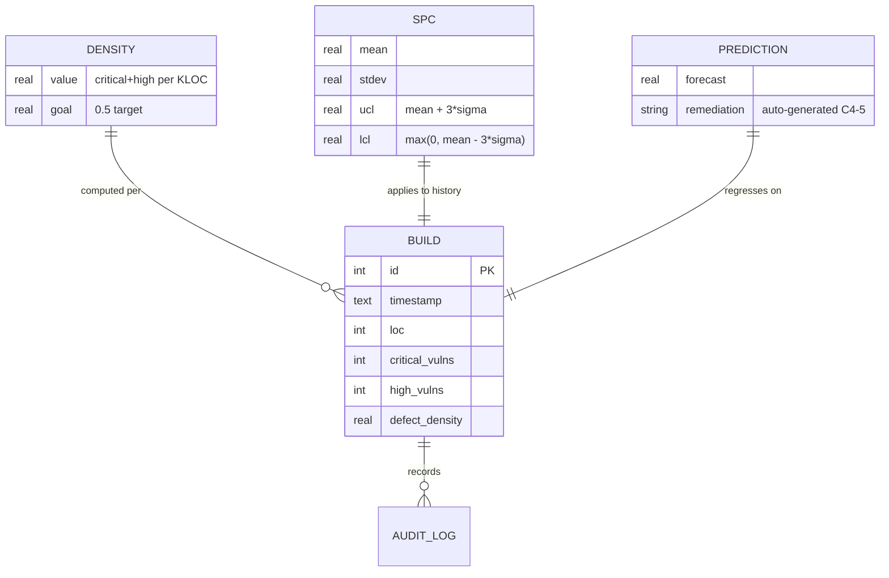

# Glossary

**Class**: 5 (Ops/User) | **Persona**: All

## Core process terms

| Term | Definition |
| :--- | :--- |
| **CMMI** | Capability Maturity Model Integration — a process-improvement model; Level 4 means the process is *quantitatively managed* (measured and controlled). |
| **R1..R14** | Requirement IDs from the project charter (`AGENTS.md`). R1-R6 cover workflow/tooling, R7-R11 cover security gates, R12-R14 cover knowledge and global deployment. |
| **W1** | The strict workflow order: Requirements → Coding → DevSecOps → Documentation. Violations block the build. |
| **DevSecOps** | Development + Security + Operations — security gates are embedded in the pipeline, not bolted on afterwards. |
| **Gate** | A mandatory verification step. Any gate failure BLOCKS the build (R10). |
| **Class 1-5** | Document classification: 1 Business/Requirements (`specs/`), 2 Technical Design (`specs/`, `docs/`), 3 Source/Test (`src/`, `__tests__/`), 4 Security/Compliance (`metrics/`, `logs/`), 5 Ops/User (`docs/`, root). |

## Security terms (R7-R11)

| Term | Definition |
| :--- | :--- |
| **SAST** | Static Application Security Testing — analyzing source code without running it (here: ESLint, R8). |
| **SCA** | Software Composition Analysis — scanning dependencies for known vulnerabilities (here: `npm audit`, R9). |
| **R7 Runtime protection** | Checks that secrets are never at runtime risk: no `.env` in the tree, `.gitignore` excludes `.env`, no hardcoded secrets in `src/`, `scripts/`, `tools/`. |
| **R11 Audit trail** | Every phase and gate appends a timestamped line to `logs/audit.log`, giving full traceability. |
| **OWASP** | Open Web Application Security Project — the security guidance the `src/` primitives implement. |
| **Import-safe** | A `tools/*.js` file that has no top-level side effects on import, so opencode's auto-import at startup cannot crash it (C4-6). |

## Statistical process control terms (C4-1..5)

Figure 1 - How the quantitative terms relate to the measurement model

| Term | Definition |
| :--- | :--- |
| **Defect density** | `(critical_vulns + high_vulns) / (loc / 1000)` — the C4-1 quality metric. |
| **DENSITY_GOAL** | The target of `0.5` (Critical+High per KLOC) defined in `src/metrics.js`. |
| **SPC** | Statistical Process Control — using control charts to keep a process in a state of statistical control. |
| **Mean (μ)** | Arithmetic average of the build-history defect densities. |
| **Standard deviation (σ)** | Sample standard deviation (n-1) of the history. |
| **UCL** | Upper Control Limit = `mean + 3σ`. Density above the UCL → BLOCK (C4-3/R10). |
| **LCL** | Lower Control Limit = `max(0, mean - 3σ)`. |
| **Out of control** | The latest value exceeds the UCL; the build is blocked until the cause is removed. |
| **Baseline** | The first builds (≥5 for SPC, ≥10 for prediction) used to compute initial limits/trend. |
| **Readiness prediction** | Regression forecast of future defect density (C4-4); when it exceeds the goal, a remediation plan is auto-generated (C4-5). |
| **LOC** | Lines of code changed, measured by `git diff --shortstat HEAD` (defaults to 100). |

## Toolchain and deployment terms

| Term | Definition |
| :--- | :--- |
| **OpenCode** | The CLI/agent runtime that is the single entry point for every phase (R5). |
| **Ollama** | Optional local LLM runtime used as a free, local-first provider (R6). |
| **reqmind** | Local requirements CLI (`tools/reqmind.js`) that generates an SRS skeleton from an idea document. |
| **/pipeline** | OpenCode command that runs the pipeline from any directory after global deployment. |
| **Global directory** | `~/.config/opencode/` — the single source of truth for scripts, skills, tools, and the organizational `metrics/metrics.db` (R14). |
| **Deploy** | `npm run deploy` — non-destructive sync of every project resource to the global directory, recorded in `logs/audit.log`. |
| **Single source of truth** | The project directory (`/workplace/mcp/software-development-pipeline/Linux`); global resources are generated copies, never hand-edited. |
| **metrics.db** | SQLite database holding one `builds` row per build for SPC and prediction. |
| **security-scan.json** | UTF-8 (no BOM) npm audit JSON written by the R9 gate and read by C4-2. |
| **spc-report.md** | The control-chart report generated by `spc-control.js` (C4-3). |
| **readiness-prediction.md** | The regression report generated by `predict-readiness.js` (C4-4). |
| **audit.log** | R11 traceability file: one `timestamp | phase | status` line per phase/gate. |
