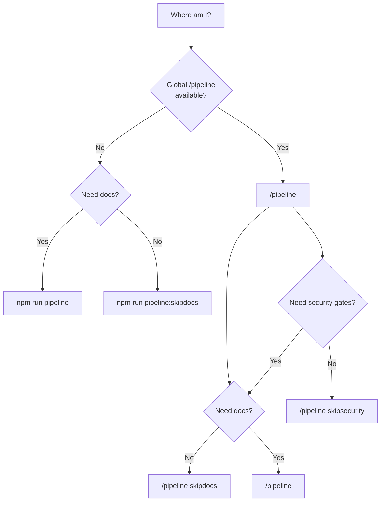
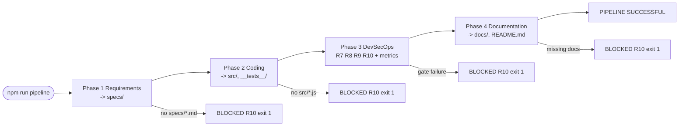

# User Guide

**Class**: 5 (Ops/User) | **Persona**: End user

## Overview

The CMMI Level 4 OpenCode DevSecOps Pipeline turns a working directory into a
fully managed software project. One command runs four phases in strict order
(W1) — Requirements, Coding, DevSecOps, Documentation — applies mandatory
security gates (R7-R11), and records quantitative metrics for statistical
process control (C4-1..5).

You do not need to know the internals. You run one command, watch the output,
and read the artifacts the pipeline produces.

## 1. Running the pipeline

OpenCode is the single entry point (R5). From the project directory:

```bash
npm run pipeline               # full 4-phase run, all gates
```

From ANY directory, after global deployment (R14):

```
/pipeline                 # equivalent to npm run pipeline
/pipeline ssot            # create/update opencode.project.md (SSOT) via TUI interview
/pipeline skipdocs        # skip Phase 4 (documentation)
/pipeline skipsecurity    # skip Phase 3 (security gates)
```

Figure 1 - Choose a run variant



| Variant | Phases | Gates |
| :--- | :--- | :--- |
| `pipeline` | 1-4 | R7-R11 (all) |
| `pipeline:skipdocs` | 1-3 | R7-R11 (all) |
| `pipeline:skipsecurity` | 1, 2, 4 | none |
| `pipeline ssot` (TUI) | SSOT only | none (writes `opencode.project.md`) |

`/pipeline ssot` asks you ONE question at a time about your project (name, stack,
architecture, repository layout, API, deployment, ...) and then creates or
updates `opencode.project.md` — the SINGLE SOURCE OF TRUTH that makes Phases
1/2/4 build specs, code and docs that match your product exactly. When it is
present, `src/` is treated as the ROOT DIRECTORY of your codebase per the
SSOT's Repository Layout.

## 2. What happens during a run

The pipeline prints a colored, phase-by-phase console log. Each phase and gate
appends an audit entry to `logs/audit.log` (R11).

Figure 2 - Interpreting a pipeline run



### Reading the output

| Console line | Meaning |
| :--- | :--- |
| `[PHASE n] <name>` | A phase started |
| `[n/7] <gate>...` | One of the seven Phase 3 verification steps |
| `[OK] Phase n completed (x files)` | Phase produced its deliverables |
| `[FAIL] ... BLOCKED (R10)` | A phase or gate failed; the run stopped with exit 1 |
| `[audit] 2026-08-09 ... | Phase | PASSED` | Live audit entry (same data as `logs/audit.log`) |
| `[OK] PIPELINE SUCCESSFUL` | All phases and gates passed; exit code 0 |

## 3. Artifacts you get

After a successful run:

| Artifact | Location | Contents |
| :--- | :--- | :--- |
| Requirements | `specs/` | PRD, SRS, User-Stories, Technical-Design |
| Source + tests | `src/`, `__tests__/` | OWASP-compliant code and Jest specs |
| Security scan | `metrics/security-scan.json` | npm audit JSON (R9) |
| Metrics history | `metrics/metrics.db` | One row per build (C4-2) |
| Control report | `metrics/spc-report.md` | 3-sigma control chart (C4-3) |
| Readiness forecast | `metrics/readiness-prediction.md` | Regression prediction (C4-4) |
| Documentation | `docs/`, `README.md` | Full document matrix |
| Audit trail | `logs/audit.log` | One line per phase/gate (R11) |

## 4. Quick reference

```bash
npm run pipeline               # full run
npm run pipeline:skipdocs      # no documentation phase
npm run pipeline:skipsecurity  # no security gates (testing only)
npm run collect-metrics        # record one build into metrics.db
npm run spc                    # regenerate the SPC control report
npm run predict                # regenerate the readiness forecast
npm run lint                   # run the SAST gate manually
npm run test                   # run Jest with coverage
npm run audit                  # run the SCA gate manually
```

Use `pipeline:skipsecurity` only for local experimentation — a merge must
always pass the full run (R10).

## 5. Where to go next

- See [Troubleshooting-Guide](Troubleshooting-Guide.md) when a run fails.
- See [FAQ](FAQ.md) for common questions.
- See [Monitoring-Alerting-Guide](Monitoring-Alerting-Guide.md) to understand
  the reports the pipeline produces.
