# Table of Contents — CMMI Level 4 Documentation Index

This file is the navigation hub for the entire documentation set. Every
markdown document in the project is listed here, organized by function
and ordered for sequential reading. The pipeline regenerates this file on
every doc-generating run (Phase 4) so it always reflects the current
document matrix.

### Document Hierarchy

The diagram below shows the parent-child relationship between every
documentation section and its documents. Each document node is clickable and
opens the corresponding file.

```mermaid
flowchart TD
    ROOT["CMMI Level 4 Pipeline"]

    ROOT --> PS["Policy &amp; Standards"]
    PS --> AGENTS["AGENTS.md"]
    PS --> OHR["operational-hard-rules.md"]
    PS --> RTM["specs/rtm.md"]
    PS --> IDEA["specs/idea.md"]
    PS --> CONTRIB["CONTRIBUTING.md"]
    PS --> COC["CODE_OF_CONDUCT.md"]
    PS --> SEC["SECURITY.md"]

    ROOT --> IG["Implementation Guides"]

    IG --> S00["00 — Planning &amp; Requirements"]
    S00 --> PRD["prd.md"]
    S00 --> SRS["srs.md"]
    S00 --> STORIES["stories.md"]
    S00 --> ROADMAP["roadmap.md"]
    S00 --> RTMDOC["rtm.md"]

    IG --> S01["01 — Design &amp; Architecture"]
    S01 --> TD["tech-design.md"]
    S01 --> ARCH["arch.md"]
    S01 --> API["api-ref.md"]
    S01 --> DB["database-schema.md"]
    S01 --> ADR["adr.md"]

    IG --> S02["02 — Setup &amp; Configuration"]
    S02 --> SETUP["setup-guide.md"]
    S02 --> DOCKER["docker-image-guide.md"]
    S02 --> ADMIN["admin-guide.md"]
    S02 --> CONFIG["config-guide.md"]

    IG --> S03["03 — Development &amp; Testing"]
    S03 --> DEV["dev-guide.md"]
    S03 --> TEST["test-guide.md"]
    S03 --> PIPE["pipeline-guide.md"]
    S03 --> CONTRIB03["contributing.md"]
    S03 --> ERR["error-codes.md"]

    IG --> S04["04 — Operations &amp; Maintenance"]
    S04 --> RUN["runbook.md"]
    S04 --> MAINT["maint-guide.md"]
    S04 --> MON["mon-alert-guide.md"]
    S04 --> TSHOOT["tshoot-guide.md"]
    S04 --> BACKUP["backup-recovery.md"]
    S04 --> DEPLOY["deployment-guide.md"]
    S04 --> POSTMORTEM["incident-postmortem-template.md"]
    S04 --> MIGR["migration-guide.md"]
    S04 --> SOPDIR["SOP/ (on-demand)"]

    IG --> S05["05 — Security &amp; Compliance"]
    S05 --> SECHARD["sec-hardening.md"]
    S05 --> COMPL["compliance.md"]

    IG --> S06["06 — User Reference"]
    S06 --> USER["user-guide.md"]
    S06 --> FAQ["faq.md"]
    S06 --> GLOSS["glossary.md"]
    S06 --> CHANGELOG["changelog.md"]
    S06 --> SLO["service-level-objectives.md"]
    S06 --> ONBOARD["onboarding-guide.md"]

    IG --> S07["07 — Additional Resources"]
    S07 --> L10N["localization-guide.md"]

    ROOT --> PM["Project Metadata"]
    PM --> README["README.md"]
    PM --> LICENSE["LICENSE"]
    PM --> ROOTCL["CHANGELOG.md"]

    %% Clickable hyperlinks — every document node opens its file.
    click AGENTS href "../AGENTS.md"
    click OHR href "../.opencode/rules/operational-hard-rules.md"
    click RTM href "../specs/rtm.md"
    click IDEA href "../specs/idea.md"
    click CONTRIB href "../CONTRIBUTING.md"
    click COC href "../CODE_OF_CONDUCT.md"
    click SEC href "../SECURITY.md"
    click PRD href "00_Planning_Requirements/prd.md"
    click SRS href "00_Planning_Requirements/srs.md"
    click STORIES href "00_Planning_Requirements/stories.md"
    click ROADMAP href "00_Planning_Requirements/roadmap.md"
    click RTMDOC href "00_Planning_Requirements/rtm.md"
    click TD href "01_Design_Architecture/tech-design.md"
    click ARCH href "01_Design_Architecture/arch.md"
    click API href "01_Design_Architecture/api-ref.md"
    click DB href "01_Design_Architecture/database-schema.md"
    click ADR href "01_Design_Architecture/adr.md"
    click SETUP href "02_Setup_Configuration/setup-guide.md"
    click DOCKER href "02_Setup_Configuration/docker-image-guide.md"
    click ADMIN href "02_Setup_Configuration/admin-guide.md"
    click CONFIG href "02_Setup_Configuration/config-guide.md"
    click DEV href "03_Development_Testing/dev-guide.md"
    click TEST href "03_Development_Testing/test-guide.md"
    click PIPE href "03_Development_Testing/pipeline-guide.md"
    click CONTRIB03 href "03_Development_Testing/contributing.md"
    click ERR href "03_Development_Testing/error-codes.md"
    click RUN href "04_Operations_Maintenance/runbook.md"
    click MAINT href "04_Operations_Maintenance/maint-guide.md"
    click MON href "04_Operations_Maintenance/mon-alert-guide.md"
    click TSHOOT href "04_Operations_Maintenance/tshoot-guide.md"
    click BACKUP href "04_Operations_Maintenance/backup-recovery.md"
    click DEPLOY href "04_Operations_Maintenance/deployment-guide.md"
    click POSTMORTEM href "04_Operations_Maintenance/incident-postmortem-template.md"
    click MIGR href "04_Operations_Maintenance/migration-guide.md"
    click SECHARD href "05_Security_Compliance/sec-hardening.md"
    click COMPL href "05_Security_Compliance/compliance.md"
    click USER href "06_User_Reference/user-guide.md"
    click FAQ href "06_User_Reference/faq.md"
    click GLOSS href "06_User_Reference/glossary.md"
    click CHANGELOG href "06_User_Reference/changelog.md"
    click SLO href "06_User_Reference/service-level-objectives.md"
    click ONBOARD href "06_User_Reference/onboarding-guide.md"
    click L10N href "07_Additional_Resources/localization-guide.md"
    click README href "../README.md"
    click LICENSE href "../LICENSE"
    click ROOTCL href "../CHANGELOG.md"
```

### Reading Sequence

The diagram below shows the recommended reading order. Follow the arrows
left-to-right, top-to-bottom. Each subgraph is a section; the last document
in one section flows into the first document of the next. Each document node
is clickable and opens the corresponding file.

```mermaid
flowchart LR
    subgraph PS["Policy &amp; Standards"]
        A1["AGENTS.md"] --> A2["operational-hard-rules.md"]
        A2 --> A3["specs/rtm.md"]
        A3 --> A4["specs/idea.md"]
        A4 --> A5["CONTRIBUTING.md"]
        A5 --> A6["CODE_OF_CONDUCT.md"]
        A6 --> A7["SECURITY.md"]
    end

    subgraph S00["00 — Planning &amp; Requirements"]
        B1["prd.md"] --> B2["srs.md"]
        B2 --> B3["stories.md"]
        B3 --> B4["roadmap.md"]
        B4 --> B5["rtm.md"]
    end

    A7 --> B1

    subgraph S01["01 — Design &amp; Architecture"]
        C1["tech-design.md"] --> C2["arch.md"]
        C2 --> C3["api-ref.md"]
        C3 --> C4["database-schema.md"]
        C4 --> C5["adr.md"]
    end

    B5 --> C1

    subgraph S02["02 — Setup &amp; Configuration"]
        D1["setup-guide.md"] --> D2["docker-image-guide.md"]
        D2 --> D3["admin-guide.md"]
        D3 --> D4["config-guide.md"]
    end

    C5 --> D1

    subgraph S03["03 — Development &amp; Testing"]
        E1["dev-guide.md"] --> E2["test-guide.md"]
        E2 --> E3["pipeline-guide.md"]
        E3 --> E4["contributing.md"]
        E4 --> E5["error-codes.md"]
    end

    D4 --> E1

    subgraph S04["04 — Operations &amp; Maintenance"]
        F1["runbook.md"] --> F2["maint-guide.md"]
        F2 --> F3["mon-alert-guide.md"]
        F3 --> F4["tshoot-guide.md"]
        F4 --> F5["backup-recovery.md"]
        F5 --> F6["deployment-guide.md"]
        F6 --> F7["incident-postmortem-template.md"]
        F7 --> F8["migration-guide.md"]
        F8 --> SOP["SOP/ (on-demand)"]
    end

    E5 --> F1

    subgraph S05["05 — Security &amp; Compliance"]
        G1["sec-hardening.md"] --> G2["compliance.md"]
    end

    SOP --> G1

    subgraph S06["06 — User Reference"]
        H1["user-guide.md"] --> H2["faq.md"]
        H2 --> H3["glossary.md"]
        H3 --> H4["changelog.md"]
        H4 --> H5["service-level-objectives.md"]
        H5 --> H6["onboarding-guide.md"]
    end

    G2 --> H1

    subgraph S07["07 — Additional Resources"]
        I1["localization-guide.md"]
    end

    H6 --> I1

    subgraph PM["Project Metadata"]
        J1["README.md"] --> J2["LICENSE"]
        J2 --> J3["CHANGELOG.md"]
    end

    I1 --> J1

    %% Clickable hyperlinks — every document node opens its file.
    click A1 href "../AGENTS.md"
    click A2 href "../.opencode/rules/operational-hard-rules.md"
    click A3 href "../specs/rtm.md"
    click A4 href "../specs/idea.md"
    click A5 href "../CONTRIBUTING.md"
    click A6 href "../CODE_OF_CONDUCT.md"
    click A7 href "../SECURITY.md"
    click B1 href "00_Planning_Requirements/prd.md"
    click B2 href "00_Planning_Requirements/srs.md"
    click B3 href "00_Planning_Requirements/stories.md"
    click B4 href "00_Planning_Requirements/roadmap.md"
    click C1 href "01_Design_Architecture/tech-design.md"
    click C2 href "01_Design_Architecture/arch.md"
    click C3 href "01_Design_Architecture/api-ref.md"
    click C4 href "01_Design_Architecture/database-schema.md"
    click C5 href "01_Design_Architecture/adr.md"
    click D1 href "02_Setup_Configuration/setup-guide.md"
    click D2 href "02_Setup_Configuration/docker-image-guide.md"
    click D3 href "02_Setup_Configuration/admin-guide.md"
    click D4 href "02_Setup_Configuration/config-guide.md"
    click E1 href "03_Development_Testing/dev-guide.md"
    click E2 href "03_Development_Testing/test-guide.md"
    click E3 href "03_Development_Testing/pipeline-guide.md"
    click E4 href "03_Development_Testing/contributing.md"
    click E5 href "03_Development_Testing/error-codes.md"
    click F1 href "04_Operations_Maintenance/runbook.md"
    click F2 href "04_Operations_Maintenance/maint-guide.md"
    click F3 href "04_Operations_Maintenance/mon-alert-guide.md"
    click F4 href "04_Operations_Maintenance/tshoot-guide.md"
    click F5 href "04_Operations_Maintenance/backup-recovery.md"
    click F6 href "04_Operations_Maintenance/deployment-guide.md"
    click F7 href "04_Operations_Maintenance/incident-postmortem-template.md"
    click F8 href "04_Operations_Maintenance/migration-guide.md"
    click G1 href "05_Security_Compliance/sec-hardening.md"
    click G2 href "05_Security_Compliance/compliance.md"
    click H1 href "06_User_Reference/user-guide.md"
    click H2 href "06_User_Reference/faq.md"
    click H3 href "06_User_Reference/glossary.md"
    click H4 href "06_User_Reference/changelog.md"
    click H5 href "06_User_Reference/service-level-objectives.md"
    click H6 href "06_User_Reference/onboarding-guide.md"
    click I1 href "07_Additional_Resources/localization-guide.md"
    click J1 href "../README.md"
    click J2 href "../LICENSE"
    click J3 href "../CHANGELOG.md"
```

---

## Policy & Standards

Governing documents that define the CMMI Level 4 charter, operational
rules, traceability, and project policies.

| Document | Description |
| :--- | :--- |
| [AGENTS.md](../AGENTS.md) | CMMI Level 4 Project Charter — requirements R1-R20, W1 order, C4-1 through C4-6 |
| [operational-hard-rules.md](../.opencode/rules/operational-hard-rules.md) | R14 Global Deployment + R15 Git Commit Reminder (HARD RULES) |
| [specs/rtm.md](../specs/rtm.md) | Requirements Traceability Matrix (R20) — mirror of the canonical `docs/00_Planning_Requirements/rtm.md`, generated by `generate-rtm.js` |
| [specs/idea.md](../specs/idea.md) | Seed idea — original project concept |
| [CONTRIBUTING.md](../CONTRIBUTING.md) | Contributing — getting started, before-you-submit checklist |
| [CODE_OF_CONDUCT.md](../CODE_OF_CONDUCT.md) | Code of Conduct |
| [SECURITY.md](../SECURITY.md) | Security Policy — supported versions, reporting, gate summary |

## Implementation Guides

The 36-document matrix across 7 numbered subfolders under `docs/`.

### 00 — Planning & Requirements

Business requirements, specifications, and planning artifacts produced by
the `requirement-gathering` skill (Phase 1, R1).

| Document | Description |
| :--- | :--- |
| [prd.md](00_Planning_Requirements/prd.md) | Product Requirements Document — vision, goals, feature scope |
| [srs.md](00_Planning_Requirements/srs.md) | Software Requirements Specification — FR/NFR tables with traceability IDs |
| [stories.md](00_Planning_Requirements/stories.md) | User Stories mapped to functional requirements |
| [roadmap.md](00_Planning_Requirements/roadmap.md) | Project Roadmap — milestones, backlog, C4-1 KPI targets |
| [rtm.md](00_Planning_Requirements/rtm.md) | Requirements Traceability Matrix (R20) — canonical artifact generated by `generate-rtm.js` (mirror: `specs/rtm.md`) |

### 01 — Design & Architecture

Technical design and architecture artifacts (Class 2).

| Document | Description |
| :--- | :--- |
| [tech-design.md](01_Design_Architecture/tech-design.md) | Technical Design — component and sequence diagrams of the primary flow |
| [arch.md](01_Design_Architecture/arch.md) | Architecture — high-level flow diagram and `src/` component diagram |
| [api-ref.md](01_Design_Architecture/api-ref.md) | API Reference — exported functions/classes with signatures and examples |
| [database-schema.md](01_Design_Architecture/database-schema.md) | Database Schema — ER diagrams, table/index definitions, migration strategy |
| [adr.md](01_Design_Architecture/adr.md) | Architectural Decision Records — R10, R14, C4-3 and other key decisions |

### 02 — Setup & Configuration

Installation, configuration, and administration guides.

| Document | Description |
| :--- | :--- |
| [setup-guide.md](02_Setup_Configuration/setup-guide.md) | Setup Guide — install and run instructions from scratch |
| [docker-image-guide.md](02_Setup_Configuration/docker-image-guide.md) | Docker Image Guide — build, tagging, registry, multi-stage, hardening |
| [admin-guide.md](02_Setup_Configuration/admin-guide.md) | Administration Guide — global deploy, opencode config, access control, audit |
| [config-guide.md](02_Setup_Configuration/config-guide.md) | Configuration Guide — `opencode.jsonc`, models, providers, profiles |

### 03 — Development & Testing

Developer workflow, testing, pipeline, and contribution guides.

| Document | Description |
| :--- | :--- |
| [dev-guide.md](03_Development_Testing/dev-guide.md) | Developer Guide — coding standards, git workflow, local setup, debugging |
| [test-guide.md](03_Development_Testing/test-guide.md) | Testing Guide — Jest structure, coverage, when tests block (R10) |
| [pipeline-guide.md](03_Development_Testing/pipeline-guide.md) | Pipeline Guide — phase I/O, gates, W1 order, skip variants |
| [contributing.md](03_Development_Testing/contributing.md) | Contributing Guide — PR process, code review, commit conventions |
| [error-codes.md](03_Development_Testing/error-codes.md) | Error Codes — catalog of codes, meanings, root causes, remediation |

### 04 — Operations & Maintenance

Day-2 operations, maintenance, monitoring, and incident response.

| Document | Description |
| :--- | :--- |
| [runbook.md](04_Operations_Maintenance/runbook.md) | Operations Runbook — day-2 ops, run variants, backup/restore, incident response |
| [maint-guide.md](04_Operations_Maintenance/maint-guide.md) | Maintenance Guide — upgrades, deprecation, patches, health checks |
| [mon-alert-guide.md](04_Operations_Maintenance/mon-alert-guide.md) | Monitoring & Alerting — read `metrics.db`, SPC reports, audit.log cadence |
| [tshoot-guide.md](04_Operations_Maintenance/tshoot-guide.md) | Troubleshooting Guide — common CLI/pipeline errors and their fixes |
| [backup-recovery.md](04_Operations_Maintenance/backup-recovery.md) | Backup & Recovery — procedures, RPO/RTO objectives, restore drills |
| [deployment-guide.md](04_Operations_Maintenance/deployment-guide.md) | Deployment Guide — strategies, blue-green, canary, rollback procedures |
| [incident-postmortem-template.md](04_Operations_Maintenance/incident-postmortem-template.md) | Incident Postmortem Template — root cause analysis, action items |
| [migration-guide.md](04_Operations_Maintenance/migration-guide.md) | Migration Guide — version-to-version steps, breaking changes, data migrations |

#### SOP (On-Demand)

Standard Operating Procedures generated by `/pipeline gen_sop`. Each file is
a focused, step-by-step procedural checklist for an on-call engineer.

> *No SOP files have been generated yet. Run `/pipeline gen_sop` to create
> them.*

### 05 — Security & Compliance

Security hardening and regulatory compliance documentation.

| Document | Description |
| :--- | :--- |
| [sec-hardening.md](05_Security_Compliance/sec-hardening.md) | Security Hardening — how R7-R11 gates work + hardening steps |
| [compliance.md](05_Security_Compliance/compliance.md) | Compliance Guide — GDPR/HIPAA/PCI DSS/SOX evidence gates, audit trail |

### 06 — User Reference

End-user documentation, reference material, and onboarding.

| Document | Description |
| :--- | :--- |
| [user-guide.md](06_User_Reference/user-guide.md) | User Guide — run `/pipeline`, interpret output, quick reference |
| [faq.md](06_User_Reference/faq.md) | FAQ — frequent questions and answers |
| [glossary.md](06_User_Reference/glossary.md) | Glossary — CMMI/SPC/UCL/LCL/DevSecOps terminology |
| [changelog.md](06_User_Reference/changelog.md) | Changelog — versioned features, fixes, breaking changes |
| [service-level-objectives.md](06_User_Reference/service-level-objectives.md) | Service Level Objectives — SLOs, SLIs, error budgets, C4-1 targets |
| [onboarding-guide.md](06_User_Reference/onboarding-guide.md) | Onboarding Guide — step-by-step for new developers, operators, admins |

### 07 — Additional Resources

Supplementary guides and specialized topics.

| Document | Description |
| :--- | :--- |
| [localization-guide.md](07_Additional_Resources/localization-guide.md) | Localization Guide — i18n/l10n strategy, locale management, translation workflow |

## Project Metadata

Scripted by the pipeline (create-if-missing from `scripts/templates/`).

| Document | Description |
| :--- | :--- |
| [README.md](../README.md) | Project README — quick start, structure, requirements table |
| [LICENSE](../LICENSE) | License (MIT) |
| [CHANGELOG.md](../CHANGELOG.md) | Changelog (root copy) |

---

*This file is regenerated by the pipeline on every Phase 4 (Documentation) run.
Do not edit manually — update the document matrix in `.opencode/skills/doc-generation/SKILL.md`
and re-run `/pipeline noskip`.*
