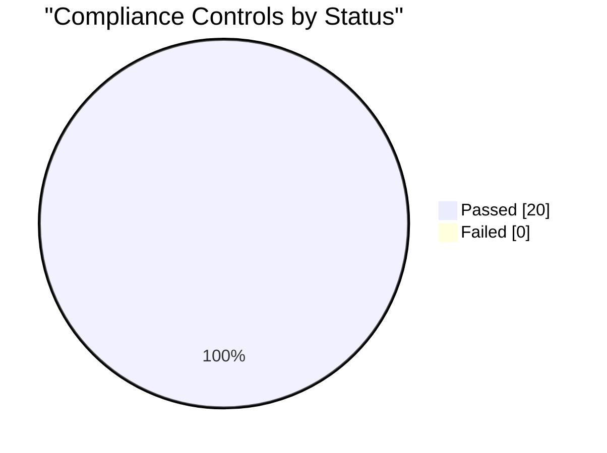

# Compliance Report - CMMI Level 4

## Framework Summary

| Framework | Passed | Total |
| :--- | :--- | :--- |
| GDPR | 5 | 5 |
| HIPAA | 5 | 5 |
| PCI DSS | 5 | 5 |
| SOX | 5 | 5 |

## Control Matrix

| ID | Control | Severity | Status | Evidence |
| :--- | :--- | :--- | :--- | :--- |
| GDPR-1 | Data-processing records / inventory (Art 30) | high | :white_check_mark: PASS | docs/05_Security_Compliance/compliance.md, metrics/compliance-evidence.md |
| GDPR-2 | Data subject rights: DSAR, erasure, portability (Art 15-22) | high | :white_check_mark: PASS | docs/05_Security_Compliance/compliance.md, metrics/compliance-evidence.md |
| GDPR-3 | Security of processing (Art 32) | critical | :white_check_mark: PASS | src/frontend/dist/index.html, src/frontend/index.html, src/frontend/package-lock.json ... |
| GDPR-4 | Data protection by design (Art 25) | medium | :white_check_mark: PASS | metrics/compliance-evidence.md |
| GDPR-5 | No production PII committed to source | high | :white_check_mark: PASS | No matching data committed |
| HIPAA-1 | Risk analysis / security management process (164.308(a)(1)) | high | :white_check_mark: PASS | metrics/compliance-evidence.md |
| HIPAA-2 | Information system activity review / audit logs (164.308(a)(1)(ii)(D)) | high | :white_check_mark: PASS | docs/00_Planning_Requirements/prd.md, docs/00_Planning_Requirements/srs.md, docs/02_Setup_Configuration/admin-guide.md ... |
| HIPAA-3 | e-PHI transmission security (164.312(e)) | critical | :white_check_mark: PASS | src/frontend/dist/index.html, src/frontend/index.html, src/frontend/package-lock.json ... |
| HIPAA-4 | Access control & data integrity (164.312) | high | :white_check_mark: PASS | docs/00_Planning_Requirements/srs.md, docs/02_Setup_Configuration/admin-guide.md, docs/04_Operations_Maintenance/backup-recovery.md ... |
| HIPAA-5 | Breach notification procedure (164.408) | medium | :white_check_mark: PASS | docs/00_Planning_Requirements/prd.md, docs/04_Operations_Maintenance/deployment-guide.md, docs/04_Operations_Maintenance/incident-postmortem-template.md ... |
| PCI-1 | No stored PAN / cardholder data (Req 3) | critical | :white_check_mark: PASS | No matching data committed |
| PCI-2 | Encrypted cardholder transmission (Req 4) | high | :white_check_mark: PASS | src/frontend/dist/index.html, src/frontend/index.html, src/frontend/package-lock.json ... |
| PCI-3 | Access control / MFA (Req 7-8) | high | :white_check_mark: PASS | docs/02_Setup_Configuration/admin-guide.md, metrics/compliance-evidence.md |
| PCI-4 | Logging and monitoring for cardholder data (Req 10) | high | :white_check_mark: PASS | specs/rtm.md, src/backend/antelopeService.js, src/backend/cities.js ... |
| PCI-5 | Data retention and disposal (Req 3.1) | medium | :white_check_mark: PASS | metrics/compliance-evidence.md |
| SOX-1 | Internal control documentation (302/404) | high | :white_check_mark: PASS | src/backend/server.js, src/frontend/package-lock.json, __tests__/server.spec.js ... |
| SOX-2 | Audit trail for financial/critical actions (404) | high | :white_check_mark: PASS | docs/00_Planning_Requirements/prd.md, docs/00_Planning_Requirements/srs.md, docs/02_Setup_Configuration/admin-guide.md ... |
| SOX-3 | Segregation of duties / role-based access (ITGC) | high | :white_check_mark: PASS | docs/02_Setup_Configuration/admin-guide.md, metrics/compliance-evidence.md |
| SOX-4 | Change management controls (ITGC) | medium | :white_check_mark: PASS | docs/03_Development_Testing/contributing.md, docs/04_Operations_Maintenance/incident-postmortem-template.md, docs/04_Operations_Maintenance/runbook.md ... |
| SOX-5 | Control environment: training / awareness | medium | :white_check_mark: PASS | docs/toctree.md, README.md, metrics/compliance-evidence.md |

## Status Chart

## Status

:white_check_mark: All high/critical controls satisfied.
**Scanned**: 105 project files across 4 frameworks. Generated by scripts/compliance-check.js (R16).
