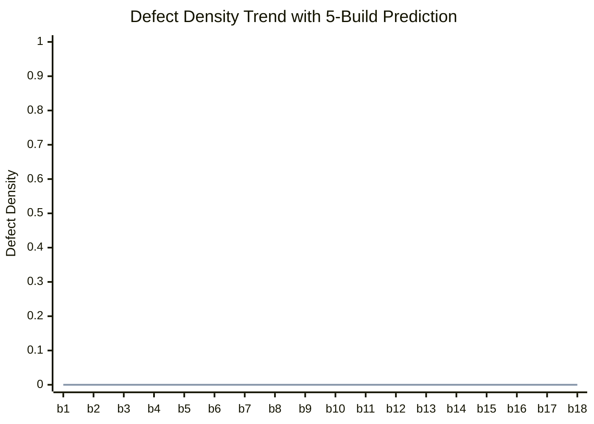

# Readiness Prediction Report - CMMI Level 4

## Regression Analysis
| Metric | Value |
| :--- | :--- |
| Data Points | 18 |
| Slope (trend) | 0.0000 |
| R² (confidence) | 0.8000 |

## Trend Chart

## Predictions
| Horizon | Predicted Defect Density | Meets Goal (≤0.5)? |
| :--- | :--- | :--- |
| **5 Builds Ahead** | **0.0000** | **:white_check_mark: YES** |

## Confidence Assessment
- **Confidence Level**: High
- **Trend**: :balance_scale: Stable

## Recommendation
:white_check_mark: On track to meet CMMI Level 4 quantitative goal.
