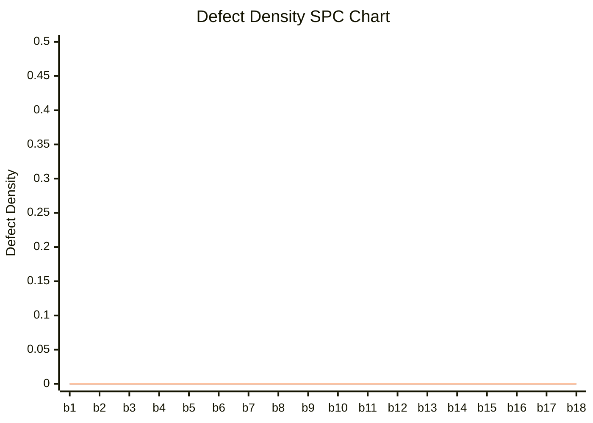

# SPC Report - CMMI Level 4

## Summary Statistics
| Metric | Value |
| :--- | :--- |
| Sample Size | 18 |
| Mean | 0.0000 |
| Standard Deviation | 0.0000 |
| UCL (Mean + 3σ) | 0.0000 |
| Current Defect Density | 0.0000 |

## Control Chart

## Status
**:white_check_mark: In Statistical Control**

No action required. Process is stable and predictable.
