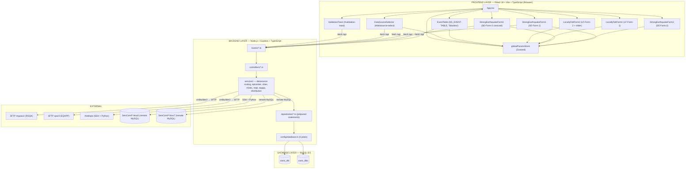

# CASIS (AI-Developed) — Single Source of Truth (SSOT) v2.0 — MERN & Layered Architecture

> **Authoritative development specification** for the Computer Aided Seismic Information System (AI-Developed). Where any other documents disagree, **this SSOT is canonical**.

---

## Table of Contents

1. [Project Identity](#1-project-identity)
2. [Prerequisites & Tech Stack](#2-prerequisites--tech-stack)
3. [Quick Start](#3-quick-start)
4. [Repository Layout](#4-repository-layout)
5. [Configuration](#5-configuration)
6. [Code Conventions & Hard Rules](#6-code-conventions--hard-rules)
7. [Architecture & Data Flow](#7-architecture--data-flow)
8. [Database Schema](#8-database-schema)
9. [Data Sources & Routing](#9-data-sources--routing)
10. [API Reference](#10-api-reference)
11. [The 3-Stage Workflow](#11-the-3-stage-workflow)
12. [Global JavaScript Parameters](#12-global-javascript-parameters)
13. [UI Components & Layout](#13-ui-components--layout)
14. [UI Component Status Matrix](#14-ui-component-status-matrix)
15. [Internal Calculations](#15-internal-calculations)
16. [Products & Formats](#16-products--formats)
17. [Deployment & Operations](#17-deployment--operations)
18. [Security Considerations](#18-security-considerations)
19. [Troubleshooting](#19-troubleshooting)
20. [Glossary](#20-glossary)

---

## 1. Project Identity

**CASIS (AI-Developed)** — *Computer Aided Seismic Information System* — is a Dockerized **MERN** (MySQL, Express, ReactJS, NodeJS) web application for earthquake information dissemination, organised as a **3-layer architecture**:

| Layer | Technology | Responsibility |
|-------|------------|----------------|
| **Database** | MySQL 8.0 | Persistence — source schema `casis_dbi`, application schema `casis_dbo` |
| **Backend** | Node.js LTS + Express + TypeScript | REST API, data-source routing, domain logic, XML product generation, SFTP distribution |
| **Frontend** | React 18 + Vite + TypeScript | Single-page UI, 3-stage workflow, client-side validation, state management |

It ingests seismic event data from multiple sources, processes them through a structured 3-stage workflow, generates bilingual (English / Traditional Chinese) REQK and EQAPP XML products, and distributes them via SFTP to remote servers (`regulus2` for REQK, `spar3` for EQAPP).

**Core Capabilities:**

- Multi-source data integration (BSCSTAC, Antelope, SeisComP, EQIM)
- 3-stage processing workflow (selection → processing → distribution)
- Full English / Traditional Chinese (繁體中文) bilingual support
- Automated REQK and EQAPP XML product generation
- SFTP distribution to `regulus2` and `spar3`
- Real-time event analysis
- Client-side input validation with toast notifications
- FE Region Scheme-based epicenter naming
- Nearest-location resolution (5 cities from reference file + Hong Kong)

**License:** MIT.

---

## 2. Prerequisites & Tech Stack

### 2.1 Prerequisites

| Requirement | Minimum Version |
|-------------|-----------------|
| Docker Engine | 20.10+ |
| Docker Compose | v2.0+ |
| Node.js (local dev, no Docker) | 20 LTS+ |
| npm | 10+ |
| MySQL | 8.0 (container image `mysql:8.0`) |
| Modern browser | Chrome / Firefox / Safari / Edge |
| Network access to SFTP servers | Production only |

### 2.2 Backend Stack

| Component | Technology |
|-----------|------------|
| OS | Linux |
| Runtime | Node.js 20 LTS+ |
| Web framework | Express 5 |
| Language | TypeScript 5 (strict mode) |
| DB access | `mysql2` connection pools with **prepared statements** (parameterised queries) |
| SSH (Antelope) | `ssh2` |
| SFTP (distribution) | `ssh2-sftp-client` |
| XML generation | `xmlbuilder2` |
| Validation | `express-validator` |
| Security middleware | `helmet`, `cors`, `express-rate-limit` |
| Tests | Vitest + Supertest |

### 2.3 Frontend Stack

| Library | Version | Purpose |
|---------|---------|---------|
| [React](https://react.dev/) | 18.3 | UI framework |
| [Vite](https://vite.dev/) | 5.x | Build tool + dev server with `/api` proxy |
| [TypeScript](https://www.typescriptlang.org/) | 5.x | Language (strict mode) |
| [Bootstrap](https://getbootstrap.com/) | 5.3.3 | UI framework, responsive layout, components (CSS + JS) |
| [react-bootstrap](https://react-bootstrap.github.io/) | 2.x | React bindings for Bootstrap components (Toast, Carousel, Form) |
| [Tabulator](https://tabulator.info/) | 6.2.1 | Interactive data table for `DS_EVENT-TABLE` (wrapped in React) |
| [Zustand](https://zustand.docs.pmnd.rs/) | 4.x | Global state store (holds Global JavaScript Parameters) |

**Intensity slider:** A dedicated React component (`IntensitySlider`) implements the documented slider behaviour — range 2–10, step 1, tick labels II–X, hidden tooltip, red handle, gradient track, 90% width centered, intensity label to the right. See [§13.3](#133-lf-form-behavior).

### 2.4 Style Guides

| Layer | Style Guide |
|-------|-------------|
| Bash | [Google Shell Style Guide](https://google.github.io/styleguide/shellguide.html) |
| SQL | [SQLFluff Style Guide](https://docs.sqlfluff.com/en/stable/style_guide.html) |
| TypeScript / JavaScript | Airbnb TypeScript (ESLint + Prettier), strict mode |
| HTML / CSS | [Google HTML/CSS Style Guide](https://google.github.io/styleguide/htmlcssguide.html) |
| React | ESLint `react-hooks` + `react` (recommended), function components + hooks only |

---

## 3. Quick Start

### 3.1 First-Time Setup

```bash
git clone <repository-url>
cd casis-mern

cp .env.example .env
npm install               # installs backend + frontend workspaces
docker-compose up -d

docker-compose ps
curl http://localhost:54880/api/health
```

### 3.2 Everyday Commands

```bash
npm run dev:backend        # Start Express (tsx watch) on BACKEND_PORT
npm run dev:frontend       # Start Vite dev server on FRONTEND_PORT
docker-compose build       # Build backend + frontend containers
docker-compose up -d       # Start all services
docker-compose down        # Stop all services
docker-compose logs -f     # View logs
docker-compose exec backend bash        # Shell into backend container
docker-compose exec db mysql -u root -p # MySQL shell
```

### 3.3 Access Points

| Service | URL | Description |
|---------|-----|-------------|
| CASIS Web App | http://localhost:54882 | Main application interface (Vite dev / Nginx prod) |
| Backend API | http://localhost:54880/api | Express REST API |
| phpMyAdmin | http://localhost:54881 | Database administration (dev only) |
| Health Check | http://localhost:54880/api/health | API health status |

> In local dev, the Vite dev server proxies `/api` to the backend, so the app is fully usable at the frontend URL alone.

### 3.4 Smoke Tests

```bash
curl http://localhost:54880/api/health                          # Health check
curl http://localhost:54880/api/events?dataSource=BSYSTEM-1     # Events API
curl "http://localhost:54880/api/cities?lat=22.5&lon=114.2"     # Cities API
curl "http://localhost:54880/api/epicenter?lat=22.5&lon=114.2"  # Epicenter API
```

---

## 4. Repository Layout

Three layers under `src/` (≡ `casis-mern/` in the conceptual model): **database** (`src/database/`), **backend** (`src/` `.js` files — the `backend/src/` layer is flattened to `src/`), and **frontend** (`src/frontend/`).

```
earthquake-casis/                    # project root
├── AGENTS.md                        # AI agent instructions (project charter)
├── opencode.project.md              # This SSOT
├── package.json                     # Backend package.json (Express, Helmet, Jest)
├── .eslintrc.json                   # ESLint config (eslint:recommended + security)
├── .gitignore
├── specs/                           # Class 1 docs (PRD, SRS, User-Stories, Technical-Design)
├── docs/                            # Class 5 docs (generated by pipeline Phase 4)
├── __tests__/                       # Jest unit tests (backend)
├── metrics/                         # Class 4 metrics (pipeline)
├── logs/                            # Class 4 logs (pipeline, gitignored)
├── src/                             # ═══ casis-mern/ (≡ backend/src/ + database/ + frontend/) ═══
│   ├── database/                    # ── DATABASE LAYER ──
│   │   ├── init/                    # MySQL init scripts (mounted into /docker-entrypoint-initdb.d)
│   │   │   ├── 01-schema.sql        # Table definitions (casis_dbi, casis_dbo)
│   │   │   └── 02-seed-data.sql     # Seed data (76 events + origins)
│   │   └── scripts/                 # Backup / restore helpers
│   │       ├── backup.sh
│   │       └── restore.sh
│   ├── frontend/                    # ── FRONTEND LAYER (React + Vite + TypeScript) ──
│   │   ├── package.json             # Frontend deps (react, react-bootstrap, zustand, tabulator)
│   │   ├── tsconfig.json
│   │   ├── vite.config.ts           # dev server (port 54882) + /api proxy to backend
│   │   ├── index.html
│   │   ├── .env.example
│   │   └── src/
│   │       ├── main.tsx             # React entry point
│   │       ├── App.tsx              # Main application layout (single-screen SPA)
│   │       ├── api/                 # API client layer (fetch wrapper)
│   │       │   ├── client.ts        # base fetch + JSON + error handling
│   │       │   ├── eventsApi.ts
│   │       │   ├── citiesApi.ts
│   │       │   ├── epicenterApi.ts
│   │       │   ├── mindsApi.ts
│   │       │   └── productsApi.ts
│   │       ├── store/               # Zustand stores
│   │       │   ├── globalParamsStore.ts   # Global JavaScript Parameters (§12)
│   │       │   ├── stageStore.ts          # Stage 1 / 2 / 3 + loading flags
│   │       │   └── uiStore.ts             # toast, invalid-field labels, datasource
│   │       ├── components/
│   │       │   ├── DataSourceSelector.tsx # #datasource-select
│   │       │   ├── EventTable.tsx         # DS_EVENT-TABLE
│   │       │   ├── GenerateButton.tsx     # #generate-btn
│   │       │   ├── SendToMindsButton.tsx  # #send-minds-btn
│   │       │   ├── ValidationToast.tsx    # #validation-toast
│   │       │   ├── se/
│   │       │   │   ├── StrongEarthquakeForm1.tsx   # SE-Form-1
│   │       │   │   ├── StrongEarthquakeForm2.tsx   # SE-Form-2
│   │       │   │   └── StrongEarthquakeForm3.tsx   # SE-Form-3 (carousel)
│   │       │   └── lf/
│   │       │       ├── LocallyFeltForm1.tsx        # LF-Form-1 (step checkboxes)
│   │       │       └── LocallyFeltForm2.tsx        # LF-Form-2 (dropdowns + slider)
│   │       ├── hooks/
│   │       │   ├── useEvents.ts       # loadDatasources + loadEvents chain
│   │       │   ├── useCities.ts       # resolveNearestCities fetch
│   │       │   └── useStage.ts        # stage transitions + styled console.log
│   │       ├── utils/
│   │       │   ├── formatters.ts      # yyyyMMdd, hhmmss, magnitude/depth/lat/lon formatting
│   │       │   └── validation.ts      # HR-1 / HR-2 validation rules
│   │       ├── types/                 # Shared TypeScript interfaces
│   │       │   ├── event.ts
│   │       │   ├── city.ts
│   │       │   ├── globalParams.ts
│   │       │   └── dataSource.ts
│   │       └── styles/
│   │           └── app.css            # Application styles (§11.7)
│   ├── data/feregion/               # FE Region data files (§9.7)
│   │   ├── earthquake_city3.txt     # Reference cities (CSV, 432 cities)
│   │   ├── names.asc                # FE Region names (757 regions, bilingual)
│   │   ├── {ne,nw,se,sw}sect.asc    # FE Region quadrant sector boundaries
│   │   └── quadsidx.asc             # FE Region legacy coarse index (unused)
│   ├── server.js                    # Express server (createApp() factory + endpoints)
│   ├── index.js                     # Backend entry point
│   ├── epicenter.js                 # resolveEpicenter() — FROZEN (HR-4)
│   ├── cities.js                    # resolveNearestCities() — FROZEN (HR-4)
│   ├── directions.js                # 16-direction maps (full EN + ZH + abbr)
│   ├── geodesy.js                   # Bearing, distance (haversine)
│   ├── health.js                    # /api/health handler
│   ├── datasources.js               # /api/datasources handler
│   ├── events.js                    # /api/events handler
│   ├── reqk.js                      # REQK XML generation
│   ├── eqapp.js                     # EQAPP XML generation
│   ├── sftp.js                      # SFTP distribution stubs
│   ├── validation.js                # Input validation helpers
│   ├── formatters.js                # XML/JSON formatting helpers
│   └── globalParams.js              # GlobalParams shape validation
```

### 4.1 Key Files

| File | Purpose |
|------|---------|
| `src/server.js` | Express server (createApp() factory, all API endpoints) |
| `src/index.js` | Backend entry point |
| `src/epicenter.js` | FE Region epicenter resolution — FROZEN (HR-4) |
| `src/cities.js` | Nearest cities resolution — FROZEN (HR-4) |
| `src/directions.js` | 16-direction maps (full EN + ZH + abbr) |
| `src/geodesy.js` | Bearing, haversine distance |
| `src/reqk.js` | REQK XML generation |
| `src/eqapp.js` | EQAPP XML generation |
| `src/data/feregion/earthquake_city3.txt` | Reference cities database (CSV, 432 cities) |
| `src/data/feregion/names.asc` | FE Region names table (757 regions, bilingual) |
| `src/data/feregion/{ne,nw,se,sw}sect.asc` | FE Region quadrant sector boundaries (4 files) |
| `src/data/feregion/quadsidx.asc` | FE Region legacy coarse index (unused by `resolveEpicenter`) |
| `src/src/database/init/01-schema.sql` | Schema for `casis_dbi` and `casis_dbo` |
| `src/src/database/init/02-seed-data.sql` | Seed data for `casis_dbi` (76 events + origins) |
| `src/database/scripts/backup.sh` | Database backup script |
| `src/database/scripts/restore.sh` | Database restore script |
| `src/src/frontend/src/store/globalParamsStore.ts` | Global JavaScript Parameters (Zustand) |
| `src/src/frontend/src/components/EventTable.tsx` | DS_EVENT-TABLE |
| `src/src/frontend/src/components/ValidationToast.tsx` | Validation toast |
| `src/src/frontend/src/hooks/useStage.ts` | Stage transitions + styled console.log |
| `src/src/frontend/src/utils/validation.ts` | HR-1 / HR-2 validation rules |
| `src/src/frontend/src/styles/app.css` | Application styles (§11.7) |
| `docker-compose.yml` | Service orchestration (backend, frontend, db, pma) |

---

## 5. Configuration

### 5.1 Environment Variables

Create `.env` from `.env.example`. Defaults are for local development — **change all credentials in production**.

| Variable | Default | Description |
|----------|---------|-------------|
| `MYSQL_ROOT_PASSWORD` | `rootsecret` | MySQL root password |
| `MYSQL_DATABASE` | `casis_dbo` | Application database name |
| `MYSQL_USER` | `casis_user` | Database user |
| `MYSQL_PASSWORD` | `casis_secret` | Database password |
| `MYSQL_PORT` | `3306` | MySQL port |
| `BACKEND_PORT` | `54880` | Express backend port |
| `FRONTEND_PORT` | `54882` | Frontend port (Vite dev / Nginx prod) |
| `PHPMYADMIN_PORT` | `54881` | phpMyAdmin port (dev only) |
| `DB_HOST` | `db` (Docker) / `localhost` | MySQL host for backend connections |
| `DB_PORT` | `3306` | MySQL port for backend connections |
| `DB_USER` | `casis_user` | Backend MySQL user |
| `DB_PASS` | `casis_secret` | Backend MySQL password |
| `SEISCOMP_HKSS5_HOST` | `hkss5` | SeisComP (hkss5) host |
| `SEISCOMP_HKSS5_USER` | `sysop` | SeisComP (hkss5) user |
| `SEISCOMP_HKSS5_PASS` | `sysop` | SeisComP (hkss5) password |
| `SEISCOMP_HKSS7_HOST` | `hkss7` | SeisComP (hkss7) host |
| `SEISCOMP_HKSS7_USER` | `sysop` | SeisComP (hkss7) user |
| `SEISCOMP_HKSS7_PASS` | `sysop` | SeisComP (hkss7) password |
| `ANTELOPE_SSH_HOST` | `hkss1` | SSH host for Antelope |
| `ANTELOPE_SSH_USER` | `snd2` | SSH user for Antelope |
| `ANTELOPE_SSH_KEY` | `/home/casis/.ssh/id_rsa_hkss1` | SSH private key path |
| `ANTELOPE_PYTHON` | `/home/rt/miniconda3/bin/python3` | Python interpreter on remote |
| `ANTELOPE_SCRIPT` | `/home/rt/GetAnteRecord/GetAnteRecord.py` | Python script path on remote |
| `SFTP_REGULUS2_HOST` | `regulus2.example.com` | REQK product SFTP host |
| `SFTP_REGULUS2_USER` | `casis` | REQK product SFTP user |
| `SFTP_REGULUS2_KEY` | `~/.ssh/casis_regulus2` | REQK product SFTP private key |
| `SFTP_SPAR3_HOST` | `spar3.example.com` | EQAPP product SFTP host |
| `SFTP_SPAR3_USER` | `casis` | EQAPP product SFTP user |
| `SFTP_SPAR3_KEY` | `~/.ssh/casis_spar3` | EQAPP product SFTP private key |
| `SFTP_DISTRIBUTE_ENABLED` | `false` (dev) / `true` (prod) | Whether generation endpoints also SFTP products |

### 5.2 Database Configuration (`src/server.js` — DB pools TBD)

The backend establishes **up to 4 MySQL connection pools** at startup (`mysql2` pool). Each pool is created lazily; on unreachable host the pool is set to `null` and the error is logged, not thrown. Downstream code MUST check the pool for `null` before querying.

| Variable | Database | Host | Auth | Usage |
|----------|----------|------|------|-------|
| `poolDbo` | `casis_dbo` | env `DB_HOST` / `DB_PORT` | env `DB_USER` / `DB_PASS` | MINDS writes, EQAPP reads |
| `poolDbi` | `casis_dbi` | env `DB_HOST` / `DB_PORT` | env `DB_USER` / `DB_PASS` | BSCSTAC event queries |
| `poolHkss5` | `seiscomp` | `SEISCOMP_HKSS5_HOST` | `SEISCOMP_HKSS5_USER` / `_PASS` | SeisComP (hkss5) queries |
| `poolHkss7` | `seiscomp` | `SEISCOMP_HKSS7_HOST` | `SEISCOMP_HKSS7_USER` / `_PASS` | SeisComP (hkss7) queries |

All queries MUST use **parameterised/prepared statements** (no string-concatenated SQL). A 30-second connection timeout applies; unreachable hosts degrade to `null` and optional sources fail gracefully with `503`.

### 5.3 Antelope SSH Configuration

Antelope data sources fetch via SSH + Python rather than direct DB connection (planned: `src/sftp.js` using `ssh2`).

| Variable | Default | Description |
|----------|---------|-------------|
| `ANTELOPE_SSH_HOST` | `hkss1` | SSH host for Antelope |
| `ANTELOPE_SSH_USER` | `snd2` | SSH user |
| `ANTELOPE_SSH_KEY` | `/home/casis/.ssh/id_rsa_hkss1` | SSH private key path |
| `ANTELOPE_PYTHON` | `/home/rt/miniconda3/bin/python3` | Python interpreter on remote |
| `ANTELOPE_SCRIPT` | `/home/rt/GetAnteRecord/GetAnteRecord.py` | Python script path on remote (local variant: `GetAnteRecord_Local.py`) |

### 5.4 phpMyAdmin (Dev Only)

- **Image**: `phpmyadmin:5.2.3`
- **Port**: `PHPMYADMIN_PORT` (default `54881`) → container port `80`
- **Environment**: `PMA_ROOT_PASSWORD` set to `MYSQL_ROOT_PASSWORD`
- **Network**: Same Docker network as `backend`, `frontend`, and `db`
- **`config.inc.php`**: `auth_type = 'cookie'` (login form on each visit, no hardcoded credentials), `AllowNoPassword = false` (passwordless logins blocked)

#### Login Credentials

| User | Password | Access |
|------|----------|--------|
| `root` | `rootsecret` (from `MYSQL_ROOT_PASSWORD`) | All databases |
| `casis_user` | `casis_secret` (from `MYSQL_PASSWORD`) | `casis_dbo` and `casis_dbi` |

---

## 6. Code Conventions & Hard Rules

### 6.1 General Conventions

- **TypeScript 5 (strict)** for backend and frontend.
- **`mysql2` pools with parameterised/prepared statements** for all database access.
- Environment variables are read from `.env` via `src/server.js` (never hardcode secrets in code).
- **No secrets in code.**
- All Chinese text uses **Traditional Chinese (繁體中文)**.
- Handle errors gracefully with appropriate HTTP status codes; the error handler returns `{ error: { code, message } }`.
- Write descriptive commit messages.
- Test all changes before committing (Vitest for backend unit/integration, component tests for frontend).
- Update documentation for new features.
- Function components + hooks only; no class components.
- Controlled inputs everywhere; state lives in Zustand stores (§12).

### 6.2 Hard Rules (Mandatory)

#### HR-1: Generate Button Validation (Stage 1 → Stage 2)

When the `Generate` button is clicked in Stage 1, validate all inputs before proceeding to Stage 2. Show a toast notification with a summary of errors if validation fails. Mark invalid field labels with `.text-bg-warning`. **Do NOT proceed if any field is invalid.**

- **SE-FORM-1** (all required):
  - Origin Date — `yyyyMMdd`, validated via `new Date()` constructor
  - Origin Time — `hhmmss`, valid time
  - Magnitude — `0.0–10.0`
  - Depth — `≥ 0`
  - Latitude — `-90` to `+90`
  - Longitude — `-180` to `+180`
- **LF-FORM-2** (only if `LF-FORM-1` Step 3 checkbox is checked):
  - Reports, Shaking, Duration must have a non-default selection
  - Intensity slider always has a default value (no validation needed)
- **Epicenter (English) / Epicenter (Chinese)** labels are marked invalid if either Latitude or Longitude is invalid (both depend on valid coordinates).

#### HR-2: Send to MINDS Button Validation (Stage 2 → Stage 3)

When the `Send to MINDS` button is clicked in Stage 2, validate epicenter fields before proceeding to Stage 3. Show a toast notification with a summary of errors if validation fails. Mark invalid field labels with `.text-bg-warning`.

- **Epicenter (English)** cannot be empty.
- **Epicenter (Chinese)** cannot be empty.

#### HR-3: No Proactive Changes

Do NOT make changes to any scenario unless explicitly instructed by the user. Ask for clarification and consent before modifying code.

#### HR-4: Frozen Source Files (Pipeline Guard)

The following source files contain **verified algorithms** that were validated against real Flinn-Engdahl `.asc` data files and the bilingual `earthquake_city3.txt` catalog. They **MUST NOT be overwritten, regenerated, or replaced** by the secure-coding skill (Phase 2 / `/pipeline`) or any other automated code-generation step:

| File | Verified Algorithm | Reason for Freeze |
|------|---------------------|--------------------|
| `src/epicenter.js` | `resolveEpicenter()` — FE Region quadrant→segment→breakpoint lookup against `names.asc` + `{ne,nw,se,sw}sect.asc` | Algorithm verified against 5 geographic fixtures (HK, Tokyo, SF, Sydney, Madrid); cannot be reconstructed from this spec alone — the `.asc` sector-file parsing (segment delimiter = longitude reset) is intricate and undocumented in code form. |
| `src/cities.js` | `resolveNearestCities()` — bilingual 7-field CSV catalog, HK exclusion, 16-direction full/Chinese maps, `generateCityString` / `generateHkString` (Variant D format) | Logic verified against real catalog (432 cities); field-name decisions (`english`/`chinese`, `nameEn`/`nameZh`), HK filter regex, and string-format variant are conversation-scoped decisions not derivable from the spec. |

The following rules apply **only** to the two files listed above. All other `src/` files remain freely creatable, editable, and overwritable by the skill/agent as normal.

1. **Never overwrite or regenerate** — if `src/epicenter.js` or `src/cities.js` already exists, leave it intact. Do not regenerate either file from the SSOT.
2. **Do not fold logic into them** — new functionality goes in new files under `src/`, not appended into the frozen files.
3. **Surgical edits only** — if a user explicitly requests a change to one of these two files, edit it surgically (preserve the algorithm structure); never replace the file wholesale.

### 6.3 Validation Behavior Details

- Validation errors display in a `text-bg-warning` toast notification (**non-auto-dismiss**).
- Toast is dismissed when user clicks close, when validation passes, or when the datasource changes.
- Invalid field labels receive `.text-bg-warning` class on failure. Labels are cleared individually when each field passes validation.
- `clearAllInvalid()` is scoped to `label[for]` elements only — it never removes the toast's `text-bg-warning` class (implemented in `uiStore.clearAllInvalid()`, which queries `document.querySelectorAll('label[for]')`).

---

## 7. Architecture & Data Flow

### 7.1 Layered Architecture Diagram



### 7.2 Data Flow (End-to-End)

1. **Data Routing** — `GET /api/events?dataSource=...` routes by `dataSource` to the appropriate service (local MySQL, remote MySQL, or SSH + Python) and normalizes the response.
2. **Event Selection** — User selects event from `DS_EVENT-TABLE`.
3. **Epicenter Resolution** — `resolveEpicenter()` (backend `epicenterService.ts`, exposed via `GET /api/epicenter`) determines the FE Region name from epicenter coordinates. **Runtime-resolved**, not stored in source data.
4. **Nearest Cities** — `resolveNearestCities()` finds 5 closest cities + HK (`GET /api/cities`). API returns `{ cities: [...5], hk: {...} }` — `cities` excludes HK; `hk` contains HK separately.
5. **MINDS Insert** — `POST /api/minds` writes Global JavaScript Parameters to `casis_dbo` (`strong_earthquake_parameter` + `locally_felt_parameter`).
6. **REQK Generation** — `POST /api/reqk` generates REQK XML from Global JavaScript Parameters (`globalParamsStore`).
7. **EQAPP Generation** — `GET /api/eqapp` reads from `casis_dbo.recent_earthquake_events` and generates EQAPP XML.
8. **Distribution** — Products SFTP'd to remote servers (`regulus2`, `spar3`) by `distributionService.ts` when `SFTP_DISTRIBUTE_ENABLED=true`.

---

## 8. Database Schema

Two databases back CASIS: `casis_dbi` (BSCSTAC source schema) and `casis_dbo` (application schema). The schema is defined in `src/database/init/01-schema.sql`; seed data in `02-seed-data.sql` (76 events + origins for `casis_dbi`). MySQL 8.0. The column names, types, and defaults below are authoritative and must not be altered without a schema-change review.

### 8.1 Source Schema: BSCSTAC (`casis_dbi`)

Primary data source (`BSYSTEM-1`) queries `casis_dbi`. The `origin.source` column uses 5 sub-source values: `CWA`, `USGS`, `SeisComP`, `Antelope`, `JMA`.

#### `event`

| Column | Type | Notes |
|--------|------|-------|
| `num` | `int NOT NULL` | Primary key (AUTO_INCREMENT via ALTER TABLE) |
| `id` | `varchar(255)` | Event ID |
| `description` | `varchar(255)` | Event description |
| `origntime` | `varchar(255)` | Origin time (UTC) |
| `timestamps` | `double` | Unix epoch timestamp |
| `magtype` | `varchar(50)` | Magnitude type |
| `magnitude` | `double` | Magnitude |
| `latitude` | `double` | Latitude |
| `longitude` | `double` | Longitude |
| `depths` | `double` | Depth |
| `prefer` | `varchar(255)` | Preferred flag |
| `EQ` | `int DEFAULT 0` | Earthquake flag |
| `TSUNAMI` | `int DEFAULT 0` | Tsunami flag |

#### `origin`

| Column | Type | Notes |
|--------|------|-------|
| `num` | `int NOT NULL` | Primary key (AUTO_INCREMENT via ALTER TABLE) |
| `id` | `varchar(255)` | Event ID |
| `pid` | `varchar(255)` | Preferred origin ID |
| `description` | `varchar(255)` | Event description |
| `origntime` | `varchar(255)` | Origin time (UTC) |
| `magnitude` | `double` | Magnitude |
| `magtype` | `varchar(50)` | Magnitude type |
| `latitude` | `double` | Latitude |
| `longitude` | `double` | Longitude |
| `depths` | `double` | Depth |
| `source` | `varchar(50)` | Sub-source (CWA, USGS, SeisComP, Antelope, JMA) |
| `timestamp` | `double DEFAULT 0` | Unix epoch timestamp |
| `update_time` | `varchar(255)` | Last update time |
| `update_timestamp` | `double DEFAULT 0` | Last update Unix timestamp |
| `EQ` | `int DEFAULT 0` | Earthquake flag |
| `TSUNAMI` | `int DEFAULT 0` | Tsunami flag |
| `nsta` | `int NOT NULL DEFAULT 0` | Number of stations |

#### `magnitude`

| Column | Type | Notes |
|--------|------|-------|
| `id` | `int NOT NULL` | Primary key (AUTO_INCREMENT via ALTER TABLE) |
| `pid` | `varchar(255)` | Parent event ID |
| `mb` | `double` | Body-wave magnitude |
| `ms` | `double` | Surface-wave magnitude |
| `mw` | `double` | Moment magnitude |
| `mwp` | `double` | Preferred moment magnitude |
| `mj` | `double` | Japan magnitude |
| `M` | `double` | Generic magnitude |

#### `sending`

| Column | Type | Notes |
|--------|------|-------|
| `id` | `varchar(255)` | Primary key — event ID |
| `method` | `varchar(255)` | Send method |
| `hk_num` | `int DEFAULT 1` | HK attempt count |
| `hk_send` | `int DEFAULT 0` | HK sent flag |
| `scs_num` | `int DEFAULT 1` | SCS attempt count |
| `scs_send` | `int DEFAULT 0` | SCS sent flag |

> `eventNormalizer.ts` normalizes this to the correlated-event format. Other data sources are fetched via different mechanisms (e.g., SSH + Python for Antelope) and normalized to the same shape.

### 8.2 Application Schema: `casis_dbo`

Stores processed earthquake parameters, felt reports, and product output.

#### `strong_earthquake_parameter`

Merged from legacy param + location tables.

| Column | Type | Notes |
|--------|------|-------|
| `id` | `int NOT NULL` | Primary key (AUTO_INCREMENT) |
| `event_id` | `varchar(255)` | Event ID |
| `event_version` | `int` | Incremented per event (composite unique key with `event_id`) |
| `origin_datetime_utc` | `datetime` | Origin datetime in UTC |
| `magnitude` | `float` | Magnitude |
| `latitude` / `longitude` | `float` | Epicenter coordinates |
| `depth` | `float` | Depth (km) |
| `is_locally_felt` | `tinyint(1)` | `1` if locally felt, `0` otherwise |
| `epicentre_chi` / `epicentre_eng` | `varchar(255)` | Epicenter name (Chinese/English) |
| `ref_city_name_chi` / `ref_city_name_eng` | `varchar(255)` | Reference city name |
| `ref_city_distance` | `float` | Distance to reference city (km) |
| `ref_city_direction_chi` / `ref_city_direction_eng` | `varchar(255)` | Direction to reference city |
| `ref_city_bearing` | `varchar(255)` | Bearing to reference city |
| `ref_city_country_chi` / `ref_city_country_eng` | `varchar(255)` | Country of reference city |
| `hk_distance` | `float` | Distance to Hong Kong (km) |
| `hk_direction_chi` / `hk_direction_eng` | `varchar(255)` | Direction to Hong Kong |
| `hk_bearing` | `varchar(255)` | Bearing to Hong Kong |
| `data_source` | `varchar(50)` | Data source identifier |
| `created_datetime` | `datetime` | Record creation time (DEFAULT CURRENT_TIMESTAMP) |

#### `locally_felt_parameter`

| Column | Type | Notes |
|--------|------|-------|
| `id` | `int NOT NULL` | Primary key (AUTO_INCREMENT) |
| `event_id` | `varchar(255)` | Event ID (composite unique key with `event_version`) |
| `event_version` | `int` | Event version |
| `report` | `int` | Report count category (1-indexed) |
| `shaking` | `int` | Shaking level (1-indexed) |
| `duration` | `int` | Duration category (1-indexed) |
| `intensity` | `varchar(255)` | Intensity (Roman numeral) |
| `stage` | `int` | LF stage value (`2` or `3`); defaults to `1` if NULL |
| `created_datetime` | `datetime` | Record creation time (DEFAULT CURRENT_TIMESTAMP) |

#### View: `recent_earthquake_events`

Joins `strong_earthquake_parameter` (latest version per event within 30 days) with `locally_felt_parameter` (LEFT JOIN). Used by `eqappService.ts` to generate EQAPP XML products.

- **Filter**: `created_datetime >= DATE_SUB(NOW(), INTERVAL 30 DAY)`
- **Sort**: `origin_datetime_utc DESC`
- **Latest version**: Subquery selects `MAX(event_version)` per `event_id`

---

## 9. Data Sources & Routing

### 9.1 Available Data Sources

**Primary:**

- `BSYSTEM-1` (BSCSTAC 1 (Primary)) — all events in `casis_dbi`; `origin.source` sub-sources: `CWA`, `USGS`, `SeisComP`, `Antelope`, `JMA`

**Other:**

- BSCSTAC: `BSYSTEM-2` (BSCSTAC 2 (Other)), `BSYSTEM-3` (BSCSTAC 3 (Other))
- Antelope: `Antelope (global)`, `Antelope (local)`
- SeisComP: `SeisComP (hkss5)`, `SeisComP (hkss7)`
- EQIM: `EQIM-2`

### 9.2 `eventsService` Routing

`GET /api/events?dataSource=<id>` routes to the appropriate backend service:

| Data Source | Mechanism | Service / Query Target | Key Details |
|-------------|-----------|------------------------|-------------|
| `BSYSTEM-1` | Local MySQL | `bscstacService.ts` → `casis_dbi.event` JOIN `casis_dbi.origin` | Last 6 days, lat 18–26 / lon 110–119 OR mag ≥ 5; returns `o.source`; `LIMIT 20` |
| `BSYSTEM-2`, `BSYSTEM-3` | TODO | `bscstacService.ts` | Returns empty array |
| `Antelope (global)` | SSH + Python | `antelopeService.ts` → remote `GetAnteRecord.py` | JSON decoded, nested `data` field |
| `Antelope (local)` | SSH + Python | `antelopeService.ts` → remote `GetAnteRecord_Local.py` | Same as global but `_Local.py` suffix |
| `SeisComP (hkss5)` | Remote MySQL | `seiscompService.ts` → `hkss5.seiscomp` (Magnitude, Origin, Event, etc.) | Last 144 hours, mag ≥ 5 OR (lat 18–26, lon 110–119, mag ≥ 1), `LIMIT 20` |
| `SeisComP (hkss7)` | Remote MySQL | `seiscompService.ts` → `hkss7.seiscomp` (same schema) | Same filter as hkss5, but simpler query (no MomentTensor join); adds `mag.type = 'M'` |
| `EQIM-2` | TODO | `eqimService.ts` | Returns empty array |

### 9.3 BSCSTAC Query Detail (`BSYSTEM-1`)

`casisDbiRepository.ts` selects from `event` JOIN `origin` on `e.prefer = o.id`:

- `e.timestamps >= UNIX_TIMESTAMP(NOW() - INTERVAL 6 DAY)`
- Geographic filter: `(latitude BETWEEN 18 AND 26 AND longitude BETWEEN 110 AND 119)` OR `magnitude >= 5`
- Returns `o.source` (sub-source: CWA, USGS, SeisComP, Antelope, JMA)
- **No filter on `o.source`** — returns all events regardless of sub-source
- Ordered by `e.origntime DESC`, `LIMIT 20`

### 9.4 SeisComP Query Detail (hkss5 / hkss7)

`seiscompRepository.ts` runs complex joins across `Magnitude`, `Origin`, `Event`, `OriginReference`, `FocalMechanism`, `MomentTensor` (hkss5 only), and `PublicObject` tables. Filters:

- `orig.time_value > NOW() - INTERVAL 144 HOUR`
- `mag.magnitude_value >= 5` OR `(lat 18–26, lon 110–119, mag >= 1)`
- hkss7 adds `mag.type = 'M'` filter

### 9.5 Normalization

After routing, `eventNormalizer.ts` normalizes all responses to a common shape (`CorrelatedEvent`):

- Adds `eventId`, `originDatetimeUtc`, `depth`, `nsta` fields if missing (from SeisComP/Antelope)
- Adds `source` for BSYSTEM-1 queries (sub-source: CWA, USGS, SeisComP, Antelope, JMA)
- Resolves epicenter names via `resolveEpicenter()`
- Resolves nearest cities via `resolveNearestCities()`

### 9.6 Cities Data File

`src/data/feregion/earthquake_city3.txt` — CSV format: `name_en,country_en,name_zh,country_zh,latitude,longitude,region`

Contains approximately 430 reference cities worldwide. `resolveNearestCities()` reads this file and returns the 5 nearest cities to the epicenter, with Hong Kong always appended as the 6th entry. The API response is `{ cities: [...5 cities], hk: {...HK object} }` — `cities` excludes HK; `hk` contains HK separately.

### 9.7 Epicenter FE Region Data Files

`resolveEpicenter()` resolves a `(lat, lon)` point to a Flinn-Engdahl (FE) region name using six fixed data files in `src/data/feregion/`. These files are **versioned reference data** — if lost they cannot be regenerated from code; they must be restored from version control or an upstream FE distribution. Their formats are documented below for verification and reconstruction only.

#### `names.asc` — region names table

- **Encoding**: UTF-8 text, one region per line.
- **Lines**: 757 (region numbers are 1-based; line *N* = region *N*).
- **Line format**: `<english>;<chinese>` (semicolon-separated; every line contains exactly one `;`).
- **Example**: `near coast of Southeastern China;中國東南部近岸` (line 242).
- Region `0` is never referenced by the sector files; it is a sentinel for "no region" used in `earthquake_city3.txt`.

#### `{ne,nw,se,sw}sect.asc` — quadrant sector boundaries (4 files)

One file per quadrant, selected by the signs of `lat` and `lon`:

| File | Quadrant | Condition |
|------|----------|-----------|
| `nesect.asc` | NE | `lat >= 0` and `lon >= 0` |
| `nwsect.asc` | NW | `lat >= 0` and `lon < 0` |
| `sesect.asc` | SE | `lat < 0` and `lon >= 0` |
| `swsect.asc` | SW | `lat < 0` and `lon < 0` |

- **Encoding**: ASCII text; whitespace-separated tokens (spaces and newlines are equivalent).
- **Token stream**: a flat sequence of `lonBreakpoint regionNumber` pairs, both non-negative integers.
- **Structure**: each file contains exactly **91 segments** — one per integer degree of `|lat|` from 0 to 90. Segment *K* (0-based) covers `floor(|lat|) == K`.
- **Segment delimiter**: a segment ends when the next pair's `lonBreakpoint` does **not** strictly exceed the previous pair's `lonBreakpoint` (i.e. longitude resets/decreases). Within a segment, `lonBreakpoint` values are strictly ascending.
- **Pair semantics**: `lonBreakpoint` is a degree of `|lon|` (0–180); `regionNumber` is a 1-based index into `names.asc`. A point's region is the `regionNumber` of the **last** pair in the segment whose `lonBreakpoint <= |lon|`.
- **Sizes** (for integrity checks): `nesect.asc` 1914 pairs / 15543 bytes; `nwsect.asc` 1579 pairs / 12836 bytes; `sesect.asc` 1304 pairs / 10607 bytes; `swsect.asc` 1161 pairs / 9451 bytes.

#### `quadsidx.asc` — legacy coarse index (unused)

- **Encoding**: ASCII text; 52 lines × 7 whitespace-separated integers per line (364 values total, 2964 bytes).
- **Status**: **not read** by `resolveEpicenter()`. Retained for provenance only; do not depend on its contents. If lost, restore from version control verbatim — no code path requires it.

#### Resolution algorithm (summary)

1. Select the quadrant file from the signs of `lat`/`lon`.
2. Index segment `K = floor(|lat|)` (clamp to the last segment if `K > 90`).
3. Scan the segment's pairs in ascending `lonBreakpoint` order; keep the `regionNumber` of the last pair with `lonBreakpoint <= |lon|`.
4. Return `names.asc` line `regionNumber` as `{ english, chinese }`. Out-of-range `regionNumber` falls back to `DEFAULT_REGION = { english: "Unknown Region", chinese: "未知地區" }`.

> **Provenance note**: the FE Region Scheme is a standard seismological regionalization. These specific files (bilingual `names.asc` with Traditional Chinese) are project-specific; the canonical English-only FE region table is published by the USGS/ISC. The Chinese translations were added for this project.

---

## 10. API Reference

Base URL: `http://<host>:<BACKEND_PORT>/api`. Express JSON API. Query/body parameters are validated with `express-validator`; invalid requests return `400` with `{ "error": { "code", "message" } }`.

### 10.1 Health Check

```http
GET /api/health
```

```json
{ "status": "ok", "timestamp": 1674123456 }
```

### 10.2 Datasources

```http
GET /api/datasources
```

```json
[
  { "id": "BSYSTEM-1", "name": "BSCSTAC 1 (Primary)", "type": "primary", "group": "BSCSTAC" },
  { "id": "BSYSTEM-2", "name": "BSCSTAC 2 (Other)",   "type": "other",   "group": "BSCSTAC" },
  { "id": "Antelope (global)", "name": "Antelope (global)", "type": "other", "group": "Antelope" }
]
```

### 10.3 Events

```http
GET /api/events?dataSource=BSYSTEM-1
```

- `dataSource` (required) — Data source ID. Routes to the appropriate backend service (see [§9](#9-data-sources--routing)).

Normalized response (all sources) — **camelCase keys** (mapped from the DB's snake_case columns):

```json
[
  {
    "eventId": "EQ20260721001",
    "originDatetimeUtc": "2026-07-21 05:30:00",
    "originDatetimeHkt": "2026-07-21 13:30:00",
    "magnitude": 5.2,
    "depth": 30.0,
    "latitude": 22.5000,
    "longitude": 114.2000,
    "source": "CWA",
    "epicenterEnglish": "Hong Kong",
    "epicenterChinese": "香港"
  }
]
```

Notes:
- `source` is the `origin.source` sub-source — **only returned for BSYSTEM-1 queries**.
- `epicenterEnglish` / `epicenterChinese` are **runtime-resolved** via `resolveEpicenter()` — not stored in source data.
- HKT is calculated as UTC+8.

**Field mapping (DB → JSON):** `event_id → eventId`, `origin_datetime_utc → originDatetimeUtc`, `origin_datetime_hkt → originDatetimeHkt`, `epicenter_english → epicenterEnglish`, `epicenter_chinese → epicenterChinese`.

### 10.4 Nearest Cities

```http
GET /api/cities?lat=22.5&lon=114.2
```

- `lat` (required, `-90`..`90`) — Latitude.
- `lon` (required, `-180`..`180`) — Longitude.

```json
{
  "cities": [
    {
      "nameEn": "Guangzhou",
      "nameZh": "廣州",
      "countryEn": "",
      "countryZh": "",
      "latitude": 23.11,
      "longitude": 113.26,
      "distanceKm": 20,
      "bearing": 73,
      "directionEnglish": "east-northeast",
      "directionChinese": "東北偏東",
      "directionAbbr": "ENE",
      "cityString": "20 km east-northeast of Guangzhou"
    }
  ],
  "hk": {
    "nameEn": "Hong Kong",
    "nameZh": "香港",
    "countryEn": "China",
    "countryZh": "中國",
    "latitude": 22.30194,
    "longitude": 114.1742,
    "distanceKm": 120,
    "bearing": 322,
    "directionEnglish": "northwest",
    "directionChinese": "西北",
    "directionAbbr": "NW",
    "cityString": "120 km northwest of Hong Kong, China",
    "hkString": "120 km northwest of Hong Kong"
  }
}
```

### 10.5 Epicenter Resolution

```http
GET /api/epicenter?lat=22.5&lon=114.2
```

- `lat` (required) — Latitude.
- `lon` (required) — Longitude.

Returns the FE Region Scheme name (runtime-resolved, **not stored**):

```json
{ "english": "near coast of Southeastern China", "chinese": "中國東南部近岸" }
```

> Used by the frontend `updateEpicenterFromCoords()` (SE-Form-1 Lat/Lon change) and by `eventNormalizer.ts`.

### 10.6 MINDS Insert

```http
POST /api/minds
```

Body: the Global JavaScript Parameters object (§12.2). Writes to `casis_dbo` (`strong_earthquake_parameter` + `locally_felt_parameter`), incrementing `event_version` per `event_id`.

```json
{ "status": "ok", "eventId": "EQ20260721001", "eventVersion": 1 }
```

### 10.7 REQK Generation

```http
POST /api/reqk
```

Body: the Global JavaScript Parameters object (§12.2). Generates REQK XML files (`REQK_E_*.xml`, `REQK_C_*.xml`) into `src/data/reqk/` and, when `SFTP_DISTRIBUTE_ENABLED=true`, distributes to `regulus2`.

```json
{ "status": "ok", "files": ["REQK_E_20260721053000.xml", "REQK_C_20260721053000.xml"] }
```

### 10.8 EQAPP Generation

```http
GET /api/eqapp
```

Reads from `casis_dbo.recent_earthquake_events`, generates `eq_app-30d_e.xml` / `eq_app-30d_uc.xml` into `src/data/eqapp/` and, when `SFTP_DISTRIBUTE_ENABLED=true`, distributes to `spar3`.

```json
{ "status": "ok", "files": ["eq_app-30d_e.xml", "eq_app-30d_uc.xml"] }
```

---

## 11. The 3-Stage Workflow

CASIS processes earthquake events through a structured 3-stage workflow. Stage transitions are driven by two buttons (`Generate` → Stage 2, `Send to MINDS` → Stage 3), each guarded by validation (see [§6.2](#62-hard-rules-mandatory)). The current stage is held in `stageStore`; all behavioural notes below are authoritative.

### 11.1 Initial Stage (`onLoad`)

1. Reset `LF-Form-1` (show all checkboxes, uncheck all) and `LF-Form-2` (hide).
2. Load events from `BSYSTEM-1` (default datasource) and auto-select the first correlated event (`useEvents.ts` chains `loadDatasources` → `loadEvents` → auto-select first row).
3. `DOMContentLoaded` handler logs a styled `console.log` message: `Initializing %cStage 1%c...` with HKT timestamp.

### 11.2 Stage 1: Data Selection

1. Select a correlated event from `DS_EVENT-TABLE`.
2. Update `SE-Form-1` fields.
3. Press `Generate` to proceed to Stage 2 (after validation passes — HR-1).

### 11.3 Stage 2: Event Processing

1. Replace `DS_EVENT-TABLE`, `SE-Form-1`, `LF-Form-1`, and `LF-Form-2` with their processed values.
2. Resolve the 6 nearest locations via `resolveNearestCities` and display them in `SE-Form-3` as Bootstrap Carousel slides.
3. Show `SE-Form-3` and make `SE-Form-2` editable.
4. Navigate the carousel to select a reference city; sliding updates `SE.ReferenceCity.*` and `SE.HK.*` parameters automatically.
5. Press `Send to MINDS` to proceed to Stage 3 (after validation passes — HR-2).

### 11.4 Stage 3: Product Generation & Distribution

1. Lock all forms and hide carousel controls.
2. Export `REQK Products` from Global JavaScript Parameters (`POST /api/reqk`).
3. SFTP `REQK Products` to `regulus2`.
4. Export `EQAPP Products` from `casis_dbo.recent_earthquake_events` (`GET /api/eqapp`).
5. SFTP `EQAPP Products` to `spar3`.

### 11.5 General Workflow Notes

- Datasource defaults to `BSYSTEM-1` on page load. `loadDatasources` chains `loadEvents` to ensure data is loaded first.
- Datasource is selected via `#datasource-select` displayed inline with the `Current Data Source` label.
- Refresh `DS_EVENT-TABLE` whenever `#datasource-select` changes. Passes `?dataSource=...` to `GET /api/events`.
- When `DS_EVENT-TABLE` returns no rows (e.g., empty datasource), all forms are reset to defaults via `resetAllForms()`.
- `DS_EVENT-TABLE` row selection: `deselectRow()` then `row.select()` to enforce single selection without toggling.
- Keep `DS_EVENT-TABLE` sorted by `Origin Datetime (UTC)` in descending order.
- On event selection, populate `SE-Form-1` (formatted per input rules) and `SE-Form-2` (auto-calculated via `resolveEpicenter`).
- On event selection, reset all `LF-Form-1` checkboxes and hide `LF-Form-2`.
- Update Global JavaScript Parameters (`globalParamsStore`) whenever any form field changes in `SE-Form-1`, `SE-Form-2`, `SE-Form-3`, `LF-Form-1`, or `LF-Form-2`.
- Lock `SE-Form-2` and `SE-Form-3` during Stage 1.
- `#send-minds-btn` is hidden in Stage 3.
- `#event-table` is disabled in Stage 2 (pointer events blocked, opacity reduced).
- Carousel prev/next controls are hidden (`display: none`) in Stage 3.
- `.city-card-header` elements are hidden via `visibility: collapse` in Stage 3 (number and distance labels are collapsed while the card body remains visible).
- All SE-Form-1, LF-Form-1, and LF-Form-2 inputs (including Intensity slider) are disabled during datasource change, row click, and when "No events found" is shown. They are re-enabled after `dataLoaded`/`onEventSelected` (via `setStage(1)`) or on fetch error, unless no events are found (forms stay disabled).
- Form defaults must match the values in Global JavaScript Parameters.
- `console.log('Global params:', globalParams)` is called before XML export in Stage 3 (logs `globalParamsStore.getState()`).
- Styled `console.log` is called on each stage transition: page load (Stage 1), Generate click (Stage 1→2), Send to MINDS click (Stage 2→3). Timestamps are HKT (UTC+8). Button names are styled like their actual Bootstrap components (`btn-primary` for Generate, `btn-success` for Send to MINDS). Stage labels use `alert-warning` style.
- The `Current Data Source` label has `height: 32px; line-height: 32px`.
- Browser tab icon (favicon) is set via `<link rel="icon" type="image/png">` pointing to `https://cdn-icons-png.flaticon.com/512/1998/1998614.png`.

### 11.6 Header Emoji Conventions

- Emojis are placed at the **end** of header text (not the start) to prevent label width shifting on stage transitions.
- SE-Form-1 and SE-Form-2 individual input labels do NOT have emojis. Emojis are consolidated to the section headers (1 emoji per section).

| Header | onLoad | Stage 1 | Stage 2 | Stage 3 |
|--------|--------|---------|---------|---------|
| `Current Data Source` label | text only | text only | text only | text only |
| `#correlated-event-header` | text only | text + ✏️ (via `#ds-emoji`) | text + 🔒 (via `#ds-emoji`) | text + 🔒 (via `#ds-emoji`) |
| `#se-form-1-header` | text only | text + ✏️ | text + 🔒 | text + 🔒 |
| `#se-form-2-header` | text only | text + 🔒 | text + ✏️ | text + 🔒 |
| `#se-form-3-header` | text only | text + ✏️ | text + ✏️ | text + 🔒 |
| `#lf-form-header` | text only | text + ✏️ | text + 🔒 | text + 🔒 |
| LF-Form-1 checkbox labels | — | ✏️ | 🔒 | no emoji |

### 11.7 CSS Layout Notes

The application stylesheet is `src/frontend/src/styles/app.css`. It is loaded after the Bootstrap CSS bundle and is the sole source of layout styling. The following is the normative content of `app.css` (deviations require a styling review):

```css
html {
  overflow-y: scroll;
}

.card-body.collapsed {
  display: none;
}

.tabulator-placeholder-contents {
  width: 25% !important;
}

.tabulator-placeholder-contents.alert-info {
  width: 50% !important;
}

.tabulator .tabulator-tableholder .tabulator-placeholder .tabulator-placeholder-contents.alert-danger,
.tabulator .tabulator-tableholder .tabulator-placeholder .tabulator-placeholder-contents.alert-info {
  color: var(--bs-alert-color) !important;
}

/* SE-Form-1 emoji right-align */
label.input-group-text.justify-content-between {
  justify-content: space-between !important;
}

#event-table .tabulator-header {
  background-color: #343a40;
}

#event-table .tabulator-tableholder {
  user-select: none;
}

#event-table .tabulator-row {
  background-color: #fff;
}

#event-table .tabulator-row:hover {
  background-color: #e9ecef;
}

#event-table .tabulator-row.tabulator-selected {
  background-color: #007bff;
  color: #fff;
}

/* City cards */
#city-carousel .carousel-inner {
  padding: 10px 50px;
}

#city-carousel .carousel-control-prev,
#city-carousel .carousel-control-next {
  width: 32px;
  height: 32px;
  top: 50%;
  bottom: auto;
  transform: translateY(-50%);
  opacity: 0.9;
  background: rgba(0, 0, 0, 0.5);
  border-radius: 50%;
}

#city-carousel .carousel-control-prev {
  left: -8px;
}

#city-carousel .carousel-control-next {
  right: -8px;
}

#city-carousel .carousel-control-prev-icon,
#city-carousel .carousel-control-next-icon {
  width: 16px;
  height: 16px;
  background-size: 100%;
}

#city-carousel .carousel-indicators {
  bottom: -5px;
}

#city-carousel .carousel-indicators button {
  width: 8px;
  height: 8px;
  border-radius: 50%;
  margin: 0 3px;
}

.city-card {
  border: 1px solid #dee2e6;
  padding: 15px;
  border-radius: 0.375rem;
  background: #fff;
  max-width: 400px;
  text-align: center;
}

.city-card-header {
  display: flex;
  justify-content: space-between;
  align-items: center;
  margin-bottom: 8px;
}

.city-card-number {
  font-size: 0.75em;
  color: #6c757d;
}

.city-card-distance {
  font-size: 0.75em;
  font-weight: bold;
  color: #0d6efd;
  background: #e7f1ff;
  padding: 2px 8px;
  border-radius: 0.25rem;
}

.city-card-name-zh {
  margin-bottom: 2px;
}

.city-card-name-en {
  font-size: 0.9em;
  color: #6c757d;
  margin-bottom: 0;
}

.city-card-details {
  font-size: 0.95em;
  text-align: center;
  line-height: 1.6;
}

/* Fixed label width for input groups */
#se1-form .input-group-text,
#lf2-form .input-group-text,
#lf-form-1 .form-check-label {
  font-weight: bold;
}

#se1-form .input-group-text {
  width: 160px;
  flex-shrink: 0;
  text-align: center;
  justify-content: start;
}

#lf2-form .input-group-text {
  width: 80px;
  flex-shrink: 0;
  text-align: center;
  justify-content: center;
}

/* Intensity slider */
.lf2-intensity-wrap {
  flex: 1;
  min-width: 0;
  display: flex;
  align-items: center;
  justify-content: center;
  margin-top: 10px;
}

.lf2-intensity-wrap .slider.slider-horizontal {
  width: 90% !important;
  margin: 0;
  padding: 0;
}

.lf2-intensity-wrap .slider-track {
  background: #6c757d;
}

.lf2-intensity-wrap .slider-handle {
  background: red;
  border: 2px solid #0d6efd;
}

.lf2-intensity-wrap .slider-ticks-labels {
  font-size: 0.8em;
  color: #6c757d;
  font-weight: bold;
}

.lf2-intensity-wrap .slider-tick.round {
  border: groove;
}

.lf2-intensity-label {
  font-weight: bold;
  text-align: center;
  padding: 0 10px;
  min-width: 80px;
}

.lf2-intensity-label span {
  display: block;
  text-align: center;
}
```

Behavioural notes:

- `overflow-y: scroll` on `html` forces a permanent scrollbar to prevent layout shift on stage transitions.
- `#event-table .tabulator-row.tabulator-selected` uses `#007bff` (not the Bootstrap `--bs-primary`); selection colour is intentionally distinct from the header background (`#343a40`).
- `.city-card-distance` renders the HK distance/direction (e.g. `3390 km SSW`) from the `hk` API response as a blue badge in each carousel card header.
- The intensity slider track is `#6c757d` with a red handle bordered `#0d6efd`; the slider occupies 90% width centered within `.lf2-intensity-wrap`, and `.lf2-intensity-label` sits to its right (see §13.3).

### 11.8 Datasource Change Behavior

When `#datasource-select` changes, the datasource handler executes the following in order:

1. **Close all toast notifications** — Iterates `.toast.show` elements, disposes each Bootstrap Toast instance (`uiStore.dismissAllToasts()`).
2. **Restore all invalid input status** — Calls `clearAllInvalid()` to remove `.text-bg-warning` from all `label[for]` elements.
3. **Reset forms** — If no datasource selected, calls `resetAllForms()`.
4. **Freeze table** — Deselects row, clears data, disables pointer events, reduces opacity to `0.6`, adds `alert-info` class to placeholder.
5. **Disable datasource dropdown and forms** — Sets `#datasource-select` `disabled = true`, sets `#ds-emoji` to 🔒, disables `#generate-btn`. Disables all inputs in SE-Form-1, LF-Form-1, and LF-Form-2 (including Intensity slider) via the shared `disabled` state in `uiStore`/`stageStore`.
6. **Clear form fields** — Resets all SE-Form-1, SE-Form-2, and LF-Form fields to empty defaults.
7. **Reset LF state** — Resets `lfFieldSet` flags, re-applies label warnings via `initLabelWarnings()`.
8. **Load new events** — Calls `loadEvents()` with the new datasource.
9. **Re-enable forms after dataLoaded** — When `setData()` completes (or `tableBuilt` on first load), `onEventSelected()` or `resetAllForms()` calls `setStage(1)`, which re-enables all forms and the Intensity slider. If no events are found (`rows.length === 0`), forms remain disabled after `resetAllForms()`. On fetch error, forms are re-enabled in the error handler.

### 11.9 Screen Flow — MERN Implementation Plan

**Canonical model:** the complete CASIS screen flow is defined entirely by this SSOT. It consists of **one screen** rendered in **three sequential stages** (State 1 → State 2 → State 3). Each stage is a distinct combination of control visibility and editability as specified in §14.1 (the normative control-state matrix). The stage-to-layer responsibilities below are the authoritative spec; the legacy static-HTML rendering method is irrelevant to the MERN implementation.

**Architecture decision — single-screen SPA, no per-stage routes.** The whole screen flow is implemented as **one React page** (`App.tsx`). All three stages share the same component tree; the current stage is a value in `stageStore` (`1 | 2 | 3`). Stage transitions toggle control visibility / editability (see §14.1); they do **not** navigate routes, remount components, or lose in-memory state. This preserves layout stability (§11.7) and keeps the Global JavaScript Parameters (§12) resident across stages. Each React component keeps its DOM ID 1:1 with the component mapping in §13.1.

#### Stage → transition mapping

| Stage | State | Trigger | Guard |
|-------|-------|---------|-------|
| Stage 1 — Data Selection | Event table + SE-Form-1 + LF-Form-1 editable; SE-Form-2/-3 locked (§14.1) | `onLoad` / event row select / datasource change | — |
| Stage 2 — Event Processing | Table + SE-Form-1 + LF forms frozen; SE-Form-2 editable; SE-Form-3 visible | `#generate-btn` click | HR-1 (§6.2) |
| Stage 3 — Product Generation & Distribution | All forms locked; carousel controls hidden; `.city-card-header` collapsed | `#send-minds-btn` click | HR-2 (§6.2) |

#### Control-state matrix

| Control | Stage 1 | Stage 2 | Stage 3 |
|----------|---------|---------|---------|
| `#correlated-event-header` emoji (`#ds-emoji`) | ✏️ | 🔒 | 🔒 |
| `#datasource-select` | enabled | disabled | disabled |
| `#generate-btn` | visible | hidden | hidden |
| `#send-minds-btn` | hidden | visible | hidden |
| `#event-table` | enabled | disabled (`pointer-events: none`, `opacity: 0.6`) | disabled |
| `#se-form-1-header` | ✏️ | 🔒 | 🔒 |
| SE-Form-1 inputs (`#origin-date`, `#origin-time`, `#magnitude`, `#depth`, `#latitude`, `#longitude`) | enabled | disabled | disabled |
| `#se-form-2-header` | 🔒 | ✏️ | 🔒 |
| `#epicenter-en`, `#epicenter-zh` | `readonly` + `disabled` | enabled | `readonly` + `disabled` |
| `#se-form-3` (carousel card) | hidden (`display: none`) | visible | visible |
| `#se-form-3-header` | ✏️ | ✏️ | 🔒 |
| `#lf-form-header` | ✏️ | 🔒 | 🔒 |
| LF-Form-1 checkboxes (`#lf-step-2`, `#lf-step-3`) | enabled | disabled | disabled |
| LF-Form-2 (`#lf-report`, `#lf-shaking`, `#lf-duration`, `#lf-intensity`) | hidden | hidden unless Step 3 checked, then disabled | hidden unless Step 3 checked, then disabled |
| Carousel prev/next controls | — | visible | hidden (`display: none`) |
| `.city-card-header` (number + HK distance labels) | — | visible | collapsed (`visibility: collapse`) |

> Implemented in React by deriving each control's `disabled`/`hidden`/emoji prop from `stageStore.stage` + LF `Step` state; the emoji `✏️`/`🔒` is rendered inside each card header per §11.6.

#### Stage-to-layer responsibilities

| Stage | Frontend | Backend API |
|-------|----------|-------------|
| **1** | Render `DataSourceSelector`, load + auto-select first row in `EventTable`, populate `StrongEarthquakeForm1`, resolve epicenter names into `StrongEarthquakeForm2` (read-only), reset LF forms | `GET /api/datasources`, `GET /api/events?dataSource=`, `GET /api/epicenter?lat&lon` |
| **2** | Freeze table + SE-Form-1 + LF forms, enable SE-Form-2, fetch + render 6-city carousel in `StrongEarthquakeForm3`, sync `SE.ReferenceCity.*` / `SE.HK.*` on slide | `GET /api/cities?lat&lon` |
| **3** | Lock all forms, hide carousel controls, collapse `.city-card-header`, trigger products | `POST /api/reqk` (from `globalParamsStore`), `GET /api/eqapp` (from `casis_dbo.recent_earthquake_events`), SFTP distribution |

---

## 12. Global JavaScript Parameters

Global JavaScript Parameters (`globalParams`) are the in-memory state object updated whenever any form field changes. They drive REQK XML generation in Stage 3 and are written to `casis_dbo` via MINDS.

**Implementation:** the object lives in the Zustand store `src/frontend/src/store/globalParamsStore.ts`. The JSON shape is authoritative (§12.2). React controlled inputs call store setters (e.g. `setField`, `setLfReport`) on change. The store serialises to the exact JSON structure for `POST /api/minds` and `POST /api/reqk`.

### 12.1 Parameter Reference

| Parameter | Default | Notes |
|-----------|---------|-------|
| `Datasource` | | |
| `Event ID` | | |
| `Origin Datetime (UTC)` | | |
| `Origin Datetime (HKT)` | | |
| `Magnitude` | | |
| `Depth` | | |
| `Latitude` | | |
| `Longitude` | | |
| `LF.Step` | `1` | `1`: none checked, `3`: checked. Resets all LF fields on change. |
| `LF.Report` | `{ Name: null, Value: null }` | `{ Name: string, Value: string }` — 1-indexed option number. Updated only after slider initialized. |
| `LF.Shaking` | `{ Name: null, Value: null }` | `{ Name: string, Value: string }` — 1-indexed option number. Updated only after slider initialized. |
| `LF.Duration` | `{ Name: null, Value: null }` | `{ Name: string, Value: string }` — 1-indexed option number. Updated only after slider initialized. |
| `LF.Intensity` | `{ Name: null, Value: null }` | `{ Name: string, Value: string }` — Roman numeral name, numeric value. Updated only after slider initialized. |
| `SE.Epicenter.English` | | |
| `SE.Epicenter.Chinese` | | |
| `SE.ReferenceCity.Name.English` | | |
| `SE.ReferenceCity.Name.Chinese` | | |
| `SE.ReferenceCity.Country.English` | | |
| `SE.ReferenceCity.Country.Chinese` | | |
| `SE.ReferenceCity.Direction.English` | | |
| `SE.ReferenceCity.Direction.Chinese` | | |
| `SE.ReferenceCity.Distance` | | |
| `SE.ReferenceCity.Bearing` | | |
| `SE.ReferenceCity.Citystring` | | `{Distance} km {full direction} of {Name}, {Country}` |
| `SE.HK.Direction.English` | | |
| `SE.HK.Direction.Chinese` | | |
| `SE.HK.Distance` | | |
| `SE.HK.Bearing` | | |
| `SE.HK.Hkstring` | | `{Distance} km {full direction} of Hong Kong` |

### 12.2 JSON Structure

```json
{
  "Datasource": null,
  "Event ID": null,
  "Origin Datetime (UTC)": null,
  "Origin Datetime (HKT)": null,
  "Magnitude": null,
  "Depth": null,
  "Latitude": null,
  "Longitude": null,
  "LF": {
    "Step": 1,
    "Report": { "Name": null, "Value": null },
    "Shaking": { "Name": null, "Value": null },
    "Duration": { "Name": null, "Value": null },
    "Intensity": { "Name": null, "Value": null }
  },
  "SE": {
    "Epicenter": {
      "English": null,
      "Chinese": null
    },
    "Reference City": {
      "Name": {
        "English": null,
        "Chinese": null
      },
      "Country": {
        "English": null,
        "Chinese": null
      },
      "Direction": {
        "English": null,
        "Chinese": null
      },
      "Distance": null,
      "Bearing": null,
      "Citystring": null
    },
    "HK": {
      "Direction": {
        "English": null,
        "Chinese": null
      },
      "Distance": null,
      "Bearing": null,
      "Hkstring": null
    }
  }
}
```

---

## 13. UI Components & Layout

### 13.1 Component Tree

```
middle-top
  └── Correlated Event (header + #ds-emoji span) + Current Data Source (label + #datasource-select inline) + Buttons (Generate / Send to MINDS, aligned right)
  └── DS_EVENT-TABLE (Tabulator table, selectable)

middle-bottom
  ├── left
  │     ├── SE-Form-1 (editable)
  │     │     ├── Origin Date (UTC) — text (yyyyMMdd)
  │     │     ├── Origin Time (UTC) — text (hhmmss)
  │     │     ├── Magnitude — number (1 d.p., step 0.1)
  │     │     ├── Depth (km) — number (step 1, nearest int <100, nearest 10 ≥100)
  │     │     ├── Latitude — number (-90 to +90, step 0.01, 2 d.p.)
  │     │     └── Longitude — number (-180 to +180, step 0.01, 2 d.p.)
  │     └── bottom
  │           ├── LF-Form-1 (checkboxes)
  │           │     ├── Step 2 — "Locally-felt (step 2, no felt-details)"
  │           │     └── Step 3 — "Locally-felt (step 3, with felt-details)"
  │           └── LF-Form-2 (hidden by default)
  │                 ├── Reports — select dropdown
  │                 ├── Shaking — select dropdown
  │                 ├── Duration — select dropdown
  │                 └── Intensity — IntensitySlider (2–10, labels II–X)
  │                       └── Intensity Label — "Intensity:<br/><span>{Roman numeral}</span>"
  └── right
        ├── SE-Form-2 (read-only)
        │     ├── Epicenter (English)
        │     └── Epicenter (Chinese)
        └── SE-Form-3 (Bootstrap Carousel, hidden)
              └── Nearest Location slide (6 locations: 5 nearest from `data/feregion/earthquake_city3.txt` + HK, with prev/next controls. Card header shows HK distance/direction from `hk` API response.)
```

**React component mapping (DOM IDs preserved 1:1):**

| Legacy ID | React Component |
|-----------|-----------------|
| `#datasource-select` | `DataSourceSelector.tsx` |
| `#event-table` | `EventTable.tsx` |
| `#origin-date`, `#origin-time`, `#magnitude`, `#depth`, `#latitude`, `#longitude` | `StrongEarthquakeForm1.tsx` |
| `#epicenter-en`, `#epicenter-zh` | `StrongEarthquakeForm2.tsx` |
| `#city-carousel` | `StrongEarthquakeForm3.tsx` |
| `#lf-step-2`, `#lf-step-3` | `LocallyFeltForm1.tsx` |
| `#lf-report`, `#lf-shaking`, `#lf-duration`, `#lf-intensity` | `LocallyFeltForm2.tsx` |
| `#generate-btn`, `#send-minds-btn` | `GenerateButton.tsx`, `SendToMindsButton.tsx` |
| `#validation-toast` | `ValidationToast.tsx` |

### 13.2 SE-Form-1 Input Rules

| Field | Type | Constraint | Rounding |
|-------|------|------------|----------|
| Origin Date (UTC) | text | `yyyyMMdd` | — |
| Origin Time (UTC) | text | `hhmmss` | — |
| Magnitude | number | min 0, step 0.1 | 1 d.p. |
| Depth (km) | number | min 0, step 1 | Nearest integer (<100), nearest ten (≥100) |
| Latitude | number | -90 to +90, step 0.01 | 2 d.p. (round, not trim) |
| Longitude | number | -180 to +180, step 0.01 | 2 d.p. (round, not trim) |

Formatting is applied on `change` (`src/frontend/src/utils/formatters.ts`). Values from `DS_EVENT-TABLE` are formatted to match these rules when populating the form.

### 13.3 LF-Form Behavior

- **Step 2 checked**: Hide Step 3 checkbox. Hide `LF-Form-2`. Disable inputs.
- **Step 3 checked**: Hide Step 2 checkbox. Show `LF-Form-2`. Enable inputs. Initialize the IntensitySlider on first show.
- **Both unchecked**: Show all checkboxes. Hide `LF-Form-2`. Default `Step` to `1`.
- **Intensity**: `IntensitySlider` (React). Range 2–10, step 1, tick labels II–X. Tooltip hidden. Handle colored red. Track gradient: primary (#0d6efd) left, secondary (#6c757d) right. Slider occupies 90% width, centered horizontally. Intensity label displayed to the right of slider.

### 13.4 LF-Form-2 Dropdown Options

| Field | Options (1-indexed) |
|-------|---------------------|
| Reports | 1: `two`, 2: `several`, 3: `over ten`, 4: `over a hundred`, 5: `over a thousand` |
| Shaking | 1: `this earth tremor`, 2: `minor shaking` |
| Duration | 1: `a few`, 2: `over ten` |

All dropdowns show `--- Select ---` as the default unselected state (value: `""`, `hidden selected`). Label shows warning color (`text-bg-warning`) until a value is selected for the first time.

LF dropdowns (Reports, Shaking, Duration) store `{ Name, Value }` where Value is the 1-indexed option number. Intensity slider stores `{ Name: Roman numeral, Value: numeric string }`.

IntensitySlider is initialized lazily on first Step 3 check, not on page load. LF parameter updates (Report, Shaking, Duration, Intensity) are deferred until slider is initialized. Dropdown labels show warning color (`text-bg-warning`) until a value is selected for the first time.

### 13.5 SE-Form-3 (Nearest Location Carousel)

- Uses a Bootstrap Carousel (v5.3 via react-bootstrap) to display nearest cities one at a time.
- No auto-advance (`interval: false`), supports wrap-around.
- Includes dot indicators and prev/next controls.
- Displays 6 locations total: 5 nearest cities from `data/feregion/earthquake_city3.txt` plus Hong Kong as the 6th item.
- The card header displays HK distance/direction (from the `hk` API response).
- City names (`fw-bold`) display in both Chinese and English, omitting country if empty.
- Sliding to a new city auto-updates the `SE.ReferenceCity.*` and `SE.HK.*` global parameters (react-bootstrap `onSlid`).

### 13.6 Buttons

`Generate` and `Send to MINDS` buttons are placed inline with the `Current Data Source` label, aligned to the right end of the row.

### 13.7 Screen Layout — Sample HTML

The following is the **canonical screen skeleton** rendered by React (one page, three stages). It shows the complete DOM structure with the 1:1 IDs from §13.1. Stage-dependent attributes (`disabled`, `readonly`, `display`, emoji, carousel control visibility) are shown in their Stage 2 state; see §14.1 for the per-stage matrix. This sample is normative for structure only — React renders it, it is not authored as static HTML.

```html
<body>
  <div class="container pt-4">
    <!-- middle-top -->
    <div class="card mb-4">
      <div class="card-header">
        <h5 class="mb-0" id="correlated-event-header">Correlated Event <span id="ds-emoji">🔒</span></h5>
      </div>
      <div class="card-body">
        <div class="d-flex align-items-center justify-content-between mb-2">
          <div class="d-flex align-items-center gap-2">
            <label class="form-label mb-0 fw-bold" style="height: 32px; line-height: 32px;">Current Data Source</label>
            <select id="datasource-select" class="form-select form-select-sm w-auto" disabled="">
              <optgroup label="BSCSTAC" class="text-success">
                <option value="BSYSTEM-1" selected="">BSCSTAC 1 (Primary)</option>
              </optgroup>
              <optgroup label="BSCSTAC" class="text-info">
                <option value="BSYSTEM-2">BSCSTAC 2 (Other)</option>
                <option value="BSYSTEM-3">BSCSTAC 3 (Other)</option>
              </optgroup>
              <optgroup label="Antelope" class="text-info">
                <option value="Antelope (global)">Antelope (global)</option>
                <option value="Antelope (local)">Antelope (local)</option>
              </optgroup>
              <optgroup label="SeisComP" class="text-info">
                <option value="SeisComP (hkss5)">SeisComP (hkss5)</option>
                <option value="SeisComP (hkss7)">SeisComP (hkss7)</option>
              </optgroup>
              <optgroup label="EQIM" class="text-info">
                <option value="EQIM-2">EQIM-2</option>
              </optgroup>
            </select>
          </div>
          <div class="d-flex gap-2">
            <button type="button" id="generate-btn" class="btn btn-primary btn-sm" style="display: none;">Generate</button>
            <button type="button" id="send-minds-btn" class="btn btn-success btn-sm">Send to MINDS</button>
          </div>
        </div>
        <!-- DS_EVENT-TABLE -->
        <div id="event-table" class="tabulator" role="grid" tabulator-layout="fitColumns"
          style="height: 200px; pointer-events: none; opacity: 0.6;"></div>
      </div>
    </div>

    <!-- middle-bottom -->
    <div class="row g-4">
      <!-- left -->
      <div class="col-md-6">
        <!-- SE-Form-1 -->
        <div class="card mb-3">
          <div class="card-header"><h5 class="mb-0" id="se-form-1-header">SE-Form-1 🔒</h5></div>
          <div class="card-body">
            <form id="se1-form">
              <div class="row mb-2">
                <div class="col">
                  <div class="input-group input-group-sm">
                    <label for="origin-date" class="input-group-text">Origin Date (UTC)</label>
                    <input type="text" id="origin-date" class="form-control" placeholder="yyyyMMdd" data-label="Origin Date (UTC)" disabled="">
                  </div>
                </div>
                <div class="col">
                  <div class="input-group input-group-sm">
                    <label for="origin-time" class="input-group-text">Origin Time (UTC)</label>
                    <input type="text" id="origin-time" class="form-control" placeholder="hhmmss" data-label="Origin Time (UTC)" disabled="">
                  </div>
                </div>
              </div>
              <div class="row mb-2">
                <div class="col">
                  <div class="input-group input-group-sm">
                    <label for="magnitude" class="input-group-text">Magnitude</label>
                    <input type="number" id="magnitude" class="form-control" step="0.1" min="0" data-label="Magnitude" disabled="">
                  </div>
                </div>
                <div class="col">
                  <div class="input-group input-group-sm">
                    <label for="depth" class="input-group-text">Depth (km)</label>
                    <input type="number" id="depth" class="form-control" step="1" min="0" data-label="Depth (km)" disabled="">
                  </div>
                </div>
              </div>
              <div class="row mb-2">
                <div class="col">
                  <div class="input-group input-group-sm">
                    <label for="latitude" class="input-group-text">Latitude</label>
                    <input type="number" id="latitude" class="form-control" step="0.01" min="-90" max="90" data-label="Latitude" disabled="">
                  </div>
                </div>
                <div class="col">
                  <div class="input-group input-group-sm">
                    <label for="longitude" class="input-group-text">Longitude</label>
                    <input type="number" id="longitude" class="form-control" step="0.01" min="-180" max="180" data-label="Longitude" disabled="">
                  </div>
                </div>
              </div>
            </form>
          </div>
        </div>

        <!-- LF-Form-1 & LF-Form-2 -->
        <div class="card">
          <div class="card-header"><h5 class="mb-0" id="lf-form-header">LF-Form 🔒</h5></div>
          <div class="card-body">
            <div id="lf-form-1">
              <form id="lf1-form">
                <div class="form-check">
                  <input class="form-check-input" type="checkbox" name="lf-step" id="lf-step-2" value="2" disabled="">
                  <label class="form-check-label" for="lf-step-2">Locally-felt (step 2, no felt-details)</label>
                </div>
                <div class="form-check">
                  <input class="form-check-input" type="checkbox" name="lf-step" id="lf-step-3" value="3" disabled="">
                  <label class="form-check-label" for="lf-step-3">Locally-felt (step 3, with felt-details)</label>
                </div>
              </form>
            </div>
            <div id="lf-form-2" class="mt-3" style="display: none;">
              <form id="lf2-form">
                <div class="mb-2">
                  <div class="input-group input-group-sm">
                    <label for="lf-report" class="input-group-text text-bg-warning">Reports</label>
                    <select id="lf-report" class="form-select" disabled="">
                      <option value="" hidden="" selected="">--- Select ---</option>
                      <option value="two">two</option>
                      <option value="several">several</option>
                      <option value="over ten">over ten</option>
                      <option value="over a hundred">over a hundred</option>
                      <option value="over a thousand">over a thousand</option>
                    </select>
                  </div>
                </div>
                <div class="mb-2">
                  <div class="input-group input-group-sm">
                    <label for="lf-shaking" class="input-group-text text-bg-warning">Shaking</label>
                    <select id="lf-shaking" class="form-select" disabled="">
                      <option value="" hidden="" selected="">--- Select ---</option>
                      <option value="this earth tremor">this earth tremor</option>
                      <option value="minor shaking">minor shaking</option>
                    </select>
                  </div>
                </div>
                <div class="mb-2">
                  <div class="input-group input-group-sm">
                    <label for="lf-duration" class="input-group-text text-bg-warning">Duration</label>
                    <select id="lf-duration" class="form-select" disabled="">
                      <option value="" hidden="" selected="">--- Select ---</option>
                      <option value="a few">a few</option>
                      <option value="over ten">over ten</option>
                    </select>
                  </div>
                </div>
                <div class="mb-2">
                  <div class="input-group input-group-sm">
                    <label for="lf-intensity" class="input-group-text">Intensity</label>
                    <div class="lf2-intensity-wrap">
                      <input id="lf-intensity" type="text" data-slider-min="2" data-slider-max="10" data-slider-step="1"
                        data-slider-value="2" data-slider-ticks="[2,3,4,5,6,7,8,9,10]"
                        data-slider-ticks-labels="[&quot;II&quot;,&quot;III&quot;,&quot;IV&quot;,&quot;V&quot;,&quot;VI&quot;,&quot;VII&quot;,&quot;VIII&quot;,&quot;IX&quot;,&quot;X&quot;]"
                        disabled="">
                    </div>
                    <div id="lf-intensity-label" class="lf2-intensity-label"></div>
                  </div>
                </div>
              </form>
            </div>
          </div>
        </div>
      </div>

      <!-- right -->
      <div class="col-md-6">
        <!-- SE-Form-2 -->
        <div class="card mb-3">
          <div class="card-header"><h5 class="mb-0" id="se-form-2-header">SE-Form-2 ✏️</h5></div>
          <div class="card-body">
            <form id="se2-form">
              <div class="mb-2">
                <label for="epicenter-en" class="form-label fw-bold">Epicenter (English)</label>
                <input type="text" id="epicenter-en" class="form-control form-control-sm" data-label="Epicenter (English)">
              </div>
              <div class="mb-2">
                <label for="epicenter-zh" class="form-label fw-bold">Epicenter (Chinese)</label>
                <input type="text" id="epicenter-zh" class="form-control form-control-sm" data-label="Epicenter (Chinese)">
              </div>
            </form>
          </div>
        </div>

        <!-- SE-Form-3 -->
        <div class="card mb-3" id="se-form-3">
          <div class="card-header"><h5 class="mb-0" id="se-form-3-header">Nearest Location ✏️</h5></div>
          <div class="card-body">
            <div id="city-carousel" class="carousel slide" data-bs-interval="false">
              <div class="carousel-indicators" id="carousel-indicators"></div>
              <div class="carousel-inner" id="carousel-inner"></div>
              <button class="carousel-control-prev" type="button" data-bs-target="#city-carousel" data-bs-slide="prev">
                <span class="carousel-control-prev-icon" aria-hidden="true"></span>
                <span class="visually-hidden">Previous</span>
              </button>
              <button class="carousel-control-next" type="button" data-bs-target="#city-carousel" data-bs-slide="next">
                <span class="carousel-control-next-icon" aria-hidden="true"></span>
                <span class="visually-hidden">Next</span>
              </button>
            </div>
          </div>
        </div>
      </div>
    </div>
  </div>

  <!-- validation toast -->
  <div class="toast-container position-fixed bottom-0 end-0 p-3">
    <div id="validation-toast" class="toast align-items-center text-bg-warning border-0" role="alert"
      aria-live="assertive" aria-atomic="true">
      <div class="d-flex">
        <div class="toast-body" id="validation-toast-body"></div>
        <button type="button" class="btn-close btn-close-dark me-2 m-auto" data-bs-dismiss="toast" aria-label="Close"></button>
      </div>
    </div>
  </div>
</body>
```

> **Carousel slides.** `#carousel-inner` is populated with 6 `.carousel-item` slides (5 nearest cities + HK) by `StrongEarthquakeForm3.tsx`; each slide holds a `.city-card` whose `.city-card-header` shows the item number and the HK distance/direction badge (see §13.5 and `app.css`). Sample slide markup (Stages 2/3):

```html
<div class="carousel-item active"
  data-city="{&quot;name_en&quot;:&quot;Jakarta&quot;,&quot;country_en&quot;:&quot;Indonesia&quot;,&quot;name_zh&quot;:&quot;雅加達&quot;,&quot;country_zh&quot;:&quot;印尼&quot;,&quot;latitude&quot;:-6.2,&quot;longitude&quot;:106.8,&quot;distance_km&quot;:490,&quot;bearing&quot;:273,&quot;direction_english&quot;:&quot;west&quot;,&quot;direction_chinese&quot;:&quot;西&quot;,&quot;direction_abbr&quot;:&quot;W&quot;,&quot;citystring&quot;:&quot;490 km W of Jakarta, Indonesia&quot;}">
  <div class="city-card mx-auto">
    <div class="city-card-header">
      <span class="city-card-number">1 / 6</span>
      <span class="city-card-distance">3390 km SSW</span>
    </div>
    <h5 class="city-card-name-zh fw-bold">雅加達, 印尼</h5>
    <p class="city-card-name-en fw-bold">Jakarta, Indonesia</p>
    <hr class="my-2">
    <div class="city-card-details">
      about 490 km<br>
      west (273 deg)<br>
      of Jakarta, Indonesia (雅加達, 印尼)
    </div>
  </div>
</div>
```

> The `data-city` JSON matches the `NearestCity` DTO shape from `GET /api/cities` (§10.4); `distance_km`/`bearing` are the source values and `citystring`/`hkstring` are formatted variants. In Stage 3 the `.city-card-header` is collapsed (`visibility: collapse`) and the prev/next controls are hidden (`display: none`).

---

## 14. UI Component Status Matrix

### 14.1 Component Visibility, Editability, and Handlers

| Component | Type | onLoad | Stage 1 | Stage 2 | Stage 3 |
|-----------|------|--------|---------|---------|---------|
| **SE-Form-1** ||||||
| `#origin-date` | input | visible, disabled | visible, enabled | visible, disabled | visible, disabled |
| `#origin-time` | input | visible, disabled | visible, enabled | visible, disabled | visible, disabled |
| `#magnitude` | input | visible, disabled | visible, enabled | visible, disabled | visible, disabled |
| `#depth` | input | visible, disabled | visible, enabled | visible, disabled | visible, disabled |
| `#latitude` | input | visible, disabled | visible, enabled | visible, disabled | visible, disabled |
| `#longitude` | input | visible, disabled | visible, enabled | visible, disabled | visible, disabled |
| **SE-Form-2** ||||||
| `#epicenter-en` | input | visible, readonly+disabled | visible, readonly+disabled | visible, enabled | visible, readonly+disabled |
| `#epicenter-zh` | input | visible, readonly+disabled | visible, readonly+disabled | visible, enabled | visible, readonly+disabled |
| **LF-Form-1** ||||||
| `#lf-step-2` | checkbox | visible, enabled | visible ✏️, enabled | visible 🔒, disabled | visible 🔒, disabled |
| `#lf-step-3` | checkbox | visible, enabled | visible ✏️, enabled | visible 🔒, disabled | visible 🔒, disabled |
| **LF-Form-2** (only if Step 3 checked) ||||||
| `#lf-report` | select | hidden, disabled | visible ✏️, enabled | visible 🔒, disabled | visible 🔒, disabled |
| `#lf-shaking` | select | hidden, disabled | visible ✏️, enabled | visible 🔒, disabled | visible 🔒, disabled |
| `#lf-duration` | select | hidden, disabled | visible ✏️, enabled | visible 🔒, disabled | visible 🔒, disabled |
| `#lf-intensity` | slider | hidden | visible ✏️, enabled | visible 🔒, disabled | visible 🔒, disabled |
| **SE-Form-3** ||||||
| `#city-carousel` | carousel | hidden | hidden | visible, enabled, controls shown | visible, controls hidden, `.city-card-header` collapsed |
| `#se-form-3` div | container | hidden | hidden | visible | visible |
| **Tables** ||||||
| `#datasource-select` | select | visible, disabled | visible, enabled | visible, disabled | visible, disabled |
| `#event-table` | tabulator | visible, enabled | visible, enabled | visible, disabled (opacity 0.6) | visible, disabled |
| **Buttons** ||||||
| `#generate-btn` | button | hidden | visible, clickable | hidden | hidden |
| `#send-minds-btn` | button | hidden | hidden | visible, clickable | hidden |
| **Toast** ||||||
| `#validation-toast` | toast | hidden | hidden | visible (on validation fail), closed on datasource change | visible (on validation fail), closed on datasource change |

### 14.2 Event Handlers

| Component | React Handler | globalParams |
|-----------|---------------|--------------|
| `#datasource-select` | `onChange` → datasource change flow (§11.8) | `Datasource` |
| `#event-table` | Tabulator `rowClick` → disable forms, then `onEventSelected()` (re-enables via `setStage(1)`) | `Datasource`, `Event ID`, SE-Form-1 fields |
| `#origin-date` | `onChange` → `updateGlobalParams()` | `Origin Datetime (UTC)`, `Origin Datetime (HKT)` |
| `#origin-time` | `onChange` → `updateGlobalParams()` | `Origin Datetime (UTC)`, `Origin Datetime (HKT)` |
| `#magnitude` | `onChange` → `formatMagnitude()` | `Magnitude` |
| `#depth` | `onChange` → `formatDepth()` | `Depth` |
| `#latitude` | `onChange` → `formatLatitude()`, `updateEpicenterFromCoords()` | `Latitude`, `SE.Epicenter` |
| `#longitude` | `onChange` → `formatLongitude()`, `updateEpicenterFromCoords()` | `Longitude`, `SE.Epicenter` |
| `#epicenter-en` | `onChange` → `updateGlobalParams()` | `SE.Epicenter.English` |
| `#epicenter-zh` | `onChange` → `updateGlobalParams()` | `SE.Epicenter.Chinese` |
| `#lf-step-2` | `onChange` → `handleLfStepChange()` | `LF.Step` |
| `#lf-step-3` | `onChange` → `handleLfStepChange()`, `toggleLfForm2()` | `LF.Step` |
| `#lf-report` | `onChange` → `updateLabelWarning()`, `updateGlobalParams()` | `LF.Report` |
| `#lf-shaking` | `onChange` → `updateLabelWarning()`, `updateGlobalParams()` | `LF.Shaking` |
| `#lf-duration` | `onChange` → `updateLabelWarning()`, `updateGlobalParams()` | `LF.Duration` |
| `#lf-intensity` | slider `slide`/`change` → `updateIntensitySlider()`, `updateIntensityLabel()`, `updateGlobalParams()` | `LF.Intensity` |
| `#city-carousel` | react-bootstrap `onSlid` → `onSlideChanged()` | `SE.ReferenceCity`, `SE.HK` |
| `#generate-btn` | `onClick` → `validateGenerateInputs()`, `onGenerate()` | — |
| `#send-minds-btn` | `onClick` → `validateSendMinds()`, `onSendMinds()` | — |

### 14.3 DS_EVENT-TABLE (Tabulator)

Tabulator v6.2.1 table for selecting correlated events, wrapped in React (`EventTable.tsx`).

#### Columns

| Group | Title | Field | minWidth | Alignment |
|-------|-------|-------|----------|-----------|
| Origin Time | Origin Time (UTC) | `origin_datetime_utc` | 170 | center |
| Origin Time | Origin Time (HKT) | `origin_datetime_hkt` | 170 | center |
| — | Mag. | `magnitude` | 60 | center |
| Location | Lat. | `latitude` | 80 | center |
| Location | Long. | `longitude` | 80 | center |
| — | Depth | `depth` | 60 | center |
| — | Event ID | `event_id` | 150 | center |

> Column fields keep the API's camelCase keys (`originDatetimeUtc`, `originDatetimeHkt`, `eventId`, etc.) mapped to these titles.

#### Configuration

```typescript
{
  layout: 'fitColumns',
  selectable: 1,
  height: 200,
  pagination: true,
  paginationSize: 10,
  paginationCounter: 'rows',
}
```

#### Events

| Event | Handler | Description |
|-------|---------|-------------|
| `rowClick` | Disable forms, then `onEventSelected(row.getData())` | Selects row, disables forms during transition, re-enables via `setStage(1)` |
| `tableBuilt` | Selects first row or disables forms | Auto-selects first row on load; if no rows, disables SE-Form-1/LF-Form-1/LF-Form-2 |

#### Row Click Logic

When a row is clicked:

1. **Disable forms** — SE-Form-1, LF-Form-1, LF-Form-2 (including Intensity slider) are disabled before processing.
2. **SE-Form-1**: Populate `origin_date`, `origin_time`, `magnitude`, `depth`, `latitude`, `longitude` — formatted per input rules.
3. **SE-Form-2**: Populate `epicenter_en`, `epicenter_zh` (read-only).
4. **LF-Form-1**: Uncheck all checkboxes, show all checkboxes.
5. **LF-Form-2**: Clear all fields, hide.
6. **Global Parameters**: Update via `updateGlobalParams()`.
7. **Stage**: Reset to Stage 1 (re-enables all forms).

#### No Events Found

When `loadEvents()` returns an empty array (or `tableBuilt` finds no rows), `resetAllForms()` is called followed by disabling SE-Form-1, LF-Form-1, and LF-Form-2 (including Intensity slider). Forms remain disabled until a datasource with events is selected or a row is clicked.

---

## 15. Internal Calculations

| Name (Human) | Name (Machine) | Characteristics | Input | Output | Location |
|--------------|----------------|-----------------|-------|--------|----------|
| Epicenter Resolution | `resolveEpicenter` | `FE Region Scheme` (data files) | `Latitude`, `Longitude` | `Epicenter (English)` and `Epicenter (Chinese)` | `src/epicenter.js` (exposed via `GET /api/epicenter`) |
| Nearest Cities Resolution | `resolveNearestCities` | `5 Reference Cities` from `data/feregion/earthquake_city3.txt` | `Latitude` and `Longitude` | `{ cities: [...5], hk: {...} }` — 5 nearest from file + HK in separate `hk` key. Distance rounding: >100km → nearest 10, ≤100km → nearest integer. | `src/cities.js` (exposed via `GET /api/cities`) |
| Direction Abbreviation | `bearingToDirectionAbbr` | 16 directions (22.5° sectors) | `Bearing` (degrees) | Direction abbreviation (e.g., `N`, `NNE`, `NE`, `ENE`, `E`, `ESE`, `SE`, `SSE`, `S`, `SSW`, `SW`, `WSW`, `W`, `WNW`, `NW`, `NNW`) | `src/geodesy.js` |
| Citystring Generation | `generateCityString` | EQAPP product format | `Distance`, `Bearing`, `CityName`, `CityCountry` | Citystring (e.g., `40 km southwest of Shenzhen, China`) | `src/cities.js` |
| Hkstring Generation | `generateHkString` | EQAPP product format | `Distance`, `Bearing` | Hkstring (e.g., `100 km southeast of Hong Kong`) | `src/cities.js` |

### 15.1 Correlated Event Definition

Each correlated event (displayed in `DS_EVENT-TABLE`) is composed of:

- Assigned event id
- Origin datetime (UTC)
- Origin datetime (HKT)
- Magnitude
- Depth
- Latitude
- Longitude
- Epicenter (English) — runtime-resolved via `resolveEpicenter()`
- Epicenter (Chinese) — runtime-resolved via `resolveEpicenter()`

HKT is calculated as UTC+8 (`src/formatters.js`). Epicenter names are **not stored** in the source data; they are resolved at runtime from latitude/longitude via the FE Region Scheme.

---

## 16. Products & Formats

### 16.1 Product Summary

| Product | Files | Source | SFTP Target |
|---------|-------|--------|-------------|
| REQK | `REQK_E_{yyyyMMddhhmmss}.xml` (English), `REQK_C_{yyyyMMddhhmmss}.xml` (Chinese) | Global JavaScript Parameters (`POST /api/reqk`) | `regulus2` |
| EQAPP | `eq_app-30d_e.xml` (English), `eq_app-30d_uc.xml` (Chinese) | `casis_dbo.recent_earthquake_events` (`GET /api/eqapp`) | `spar3` |

### 16.2 REQK Product Format

Generated by `reqkService.ts` (xmlbuilder2) from the Global JavaScript Parameters payload:

```xml
<?xml version="1.0" encoding="UTF-8"?>
<REQK_E>
    <REQK_Evid>EQ20260721001_20260721053000123</REQK_Evid>
    <REQK_Version>1</REQK_Version>
    <REQK_OriDate>20260721</REQK_OriDate>
    <REQK_OriTime>0530</REQK_OriTime>
    <REQK_Location>Hong Kong</REQK_Location>
    <REQK_Lat>22.50 N</REQK_Lat>
    <REQK_Long>114.20 E</REQK_Long>
    <REQK_Depth>30.0</REQK_Depth>
    <REQK_RefLocation>Shenzhen</REQK_RefLocation>
    <REQK_Distance>31</REQK_Distance>
    <REQK_Bearing>45</REQK_Bearing>
    <REQK_Magnitude>5.2</REQK_Magnitude>
    <REQK_HKDistance>22</REQK_HKDistance>
    <REQK_HKBearing>180</REQK_HKBearing>
    <REQK_REPORT></REQK_REPORT>
    <REQK_SHAKING></REQK_SHAKING>
    <REQK_DURATION></REQK_DURATION>
    <REQK_INTENSITY></REQK_INTENSITY>
    <REQK_UPDATE>True</REQK_UPDATE>
</REQK_E>
```

### 16.3 EQAPP Product Format

EQAPP products are generated by `eqappService.ts` from `casis_dbo.recent_earthquake_events` (a view joining `strong_earthquake_parameter` and `locally_felt_parameter`). The view returns all events within the last 30 days, sorted by `origin_datetime_utc DESC`. The `<EventGroup>` contains one `<Event>` per row.

```xml
<?xml version="1.0" encoding="UTF-8"?>
<Earthquake>
    <TimeStamp>20260721053000</TimeStamp>
    <EventGroup>
        <Event EventId="EQ20260721001" EventVer="1">
            <EventId>EQ20260721001</EventId>
            <EventVer>1</EventVer>
            <HKTDate>20260721</HKTDate>
            <HKTTime>133000</HKTTime>
            <Lat>22.5000</Lat>
            <Lon>114.2000</Lon>
            <Mag>5.2</Mag>
            <Depth>30.0</Depth>
            <Dist>31</Dist>
            <Dir>NE</Dir>
            <City>Shenzhen</City>
            <citystring>31 km northeast of Shenzhen, China</citystring>
            <Region>near coast of Southeastern China</Region>
            <HKDist>22</HKDist>
            <HKDir>S</HKDir>
            <hkstring>22 km south of Hong Kong</hkstring>
            <Stage>1</Stage>
            <Intensity></Intensity>
            <Verify>N</Verify>
        </Event>
    </EventGroup>
</Earthquake>
```

### 16.4 EQAPP Field Mapping (DB → XML)

| XML Tag | DB Column | Notes |
|---------|-----------|-------|
| `EventId` / `EventVer` (attribute) | `event_id` / `event_version` | |
| `EventId` / `EventVer` (element) | `event_id` / `event_version` | |
| `HKTDate` | `origin_datetime_utc` | Converted to HKT (UTC+8), format `Ymd` |
| `HKTTime` | `origin_datetime_utc` | Converted to HKT (UTC+8), format `His` (hhmmss) |
| `Lat` / `Lon` | `latitude` / `longitude` | |
| `Mag` / `Depth` | `magnitude` / `depth` | |
| `Dist` | `ref_city_distance` | |
| `Dir` | `ref_city_direction_eng` / `_chi` | Language-dependent |
| `City` | `ref_city_name_eng` / `_chi` | Language-dependent |
| `citystring` | Generated | `generateCityString(distance, bearing, name, country)` |
| `Region` | `epicentre_eng` / `_chi` | Language-dependent |
| `HKDist` | `hk_distance` | |
| `HKDir` | `hk_direction_eng` / `_chi` | Language-dependent |
| `hkstring` | Generated | `generateHkString(distance, bearing)` |
| `Stage` | `l.stage` | From `locally_felt_parameter`; defaults to `1` if NULL (no felt report) |
| `Intensity` | `l.intensity` | From `locally_felt_parameter`; empty if NULL |
| `Verify` | Static | `N` |

---

## 17. Deployment & Operations

### 17.1 Production Deployment

```bash
git clone <repository-url>
cd casis-mern

cp .env.example .env
nano .env  # Update passwords, SFTP hosts, ports

docker-compose up -d

docker-compose ps
curl http://localhost:54880/api/health
```

### 17.2 SFTP Configuration

#### REQK Products (regulus2)

Update `.env`:
```
SFTP_REGULUS2_HOST=regulus2.yourdomain.com
SFTP_REGULUS2_USER=casis
SFTP_REGULUS2_KEY=~/.ssh/casis_regulus2
SFTP_DISTRIBUTE_ENABLED=true
```

Configure SSH keys:
```bash
ssh-keygen -t ed25519 -f ~/.ssh/casis_regulus2
ssh-copy-id -i ~/.ssh/casis_regulus2.pub casis@regulus2.yourdomain.com
chmod 600 ~/.ssh/casis_regulus2
```

#### EQAPP Products (spar3)

Update `.env`:
```
SFTP_SPAR3_HOST=spar3.yourdomain.com
SFTP_SPAR3_USER=casis
SFTP_SPAR3_KEY=~/.ssh/casis_spar3
```

### 17.3 Local Development

```bash
docker-compose up -d            # db + backend + frontend + pma
docker-compose logs -f backend
docker-compose exec backend sh
docker-compose exec db mysql -u root -p
docker-compose exec -T db mysql -u root -p casis_dbo < src/database/init/01-schema.sql
```

Or run without Docker:

```bash
npm install
npm run dev:backend   # Express on :54880
npm run dev:frontend  # Vite on :54882 (proxies /api to :54880)
```

### 17.4 Backup and Recovery

```bash
# Backup database
docker-compose exec db mysqldump -u root -p casis_dbo > backup_$(date +%Y%m%d).sql

# Restore database
docker-compose exec -T db mysql -u root -p casis_dbo < backup_20260721.sql

# Backup generated product data
tar -czf data_backup_$(date +%Y%m%d).tar.gz src/data/

# Restore data
tar -xzf data_backup_20260721.tar.gz
```

### 17.5 Monitoring

```bash
docker-compose ps
docker-compose logs -f
docker-compose exec db mysqladmin -u root -p status
docker stats
```

### 17.6 Contributing Guidelines

1. Follow the applicable [style guides](#24-style-guides) for each layer.
2. Write descriptive commit messages.
3. Test all changes before committing (Vitest backend unit/integration; React component tests).
4. Update documentation for new features.
5. Use parameterised/prepared statements for all database queries.
6. Handle errors gracefully with appropriate HTTP status codes.
7. Run `npm run lint` and `npm run typecheck` in both workspaces before committing.

---

## 18. Security Considerations

1. **Change Default Passwords** — Update all MySQL passwords in production.
2. **HTTPS** — Configure SSL/TLS for web traffic (terminate at the frontend reverse proxy).
3. **Firewall** — Restrict access to necessary ports only (`BACKEND_PORT`, `FRONTEND_PORT`).
4. **SSH Keys** — Use key-based authentication for SFTP and Antelope; `chmod 600` keys.
5. **Regular Updates** — Keep Docker images and npm dependencies updated (`npm audit` in CI).
6. **Backups** — Implement regular database backups.
7. **Logging** — Monitor application logs for suspicious activity.
8. **No Secrets in Code** — All secrets via environment variables / `.env`; `src/server.js` validates required vars and fails fast if missing.
9. **Input Validation** — `express-validator` on every route; `helmet` + `cors` (restricted origin) + `express-rate-limit` middleware.
10. **SQL Injection** — Parameterised/prepared statements exclusively; no string-built SQL.
11. **phpMyAdmin** — `AllowNoPassword = false`; cookie-based auth only; dev-only service.

---

## 19. Troubleshooting

### 19.1 Common Issues

**Layout shift on stage transition:**
The page uses `overflow-y: scroll` on `html` to force a permanent scrollbar, preventing content width changes on stage transitions.

**Application not accessible:**
```bash
docker-compose ps
docker-compose logs backend frontend
docker-compose restart
```

**Backend not starting / missing env:**
```bash
docker-compose logs backend
# config/env.ts fails fast on missing required variables — check .env
```

**Database connection failed:**
```bash
docker-compose logs db backend
docker-compose exec db mysql -u root -p
docker-compose exec backend node -e "const {poolDbo}=require('./dist/config/database.js'); poolDbo.query('SELECT 1').then(()=>console.log('ok')).catch(console.error)"
```

**SFTP connection issues:**
```bash
sftp -i ~/.ssh/casis_regulus2 casis@regulus2.yourdomain.com
chmod 600 ~/.ssh/casis_regulus2
chmod 644 ~/.ssh/casis_regulus2.pub
```

**Port conflicts:**
```bash
netstat -tulpn | grep -E '54880|54881|54882|3306'
# Update ports in .env file
```

**Network not found:**
```bash
docker network ls | grep casis
docker-compose down && docker-compose up -d
```

### 19.2 Log Locations

| Source | Location |
|--------|----------|
| Backend | `docker-compose logs backend` |
| Frontend | `docker-compose logs frontend` |
| Database | `docker-compose logs db` |
| phpMyAdmin | `docker-compose logs pma` |
| Express access/errors | `backend` container stdout (`console.log` / error handler) |
| MySQL | `/var/log/mysql/error.log` |

---

## 20. Glossary

| Term | Definition |
|------|------------|
| **BSCSTAC** | Bsystem Cstation — the primary data source group for CASIS (`BSYSTEM-1` is primary) |
| **CASIS** | Computer Aided Seismic Information System |
| **Correlated Event** | A normalized event record displayed in `DS_EVENT-TABLE`, composed of event ID, origin datetime (UTC/HKT), magnitude, depth, lat/lon, and runtime-resolved epicenter names |
| **casis_dbi** | Source database — stores raw BSCSTAC event/origin data |
| **casis_dbo** | Application database — stores processed parameters, felt reports, and drives product generation |
| **Data Source Routing** | The backend service layer selecting the correct data-source mechanism (local MySQL / remote MySQL / SSH + Python) based on `dataSource` |
| **EQAPP** | Earthquake Application product — XML product generated from `casis_dbo.recent_earthquake_events`, SFTP'd to `spar3` |
| **FE Region Scheme** | Flinn-Engdahl Region Scheme — used by `resolveEpicenter()` to name epicenters from coordinates |
| **HKT** | Hong Kong Time (UTC+8) |
| **LF** | Locally Felt — form group for felt-report data (Reports, Shaking, Duration, Intensity) |
| **Layered Architecture** | The 3-layer decomposition of CASIS: Database (MySQL), Backend (Express + TypeScript), Frontend (React + Vite + TypeScript) |
| **MERN** | MySQL, Express, ReactJS, NodeJS — the CASIS framework |
| **MINDS** | The insert operation writing Global JavaScript Parameters to `casis_dbo` |
| **REQK** | Request Earthquake Knowledge product — XML product generated from Global JavaScript Parameters, SFTP'd to `regulus2` |
| **SE** | Strong Earthquake — form group for earthquake parameters (epicenter, reference city, HK data) |
| **Sub-source** | `origin.source` value within BSYSTEM-1: `CWA`, `USGS`, `SeisComP`, `Antelope`, `JMA` |

---

> **End of SSOT v2.0.** This document is the single source of truth for CASIS (AI-Developed) MERN development.
