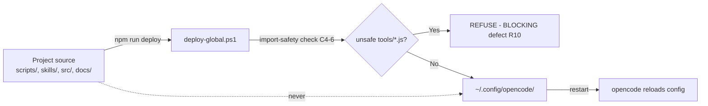
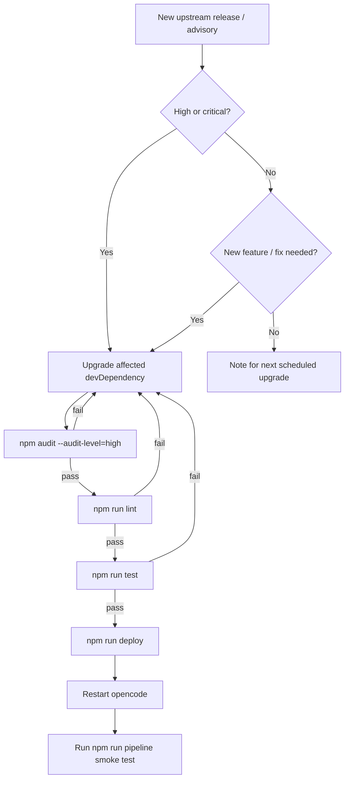
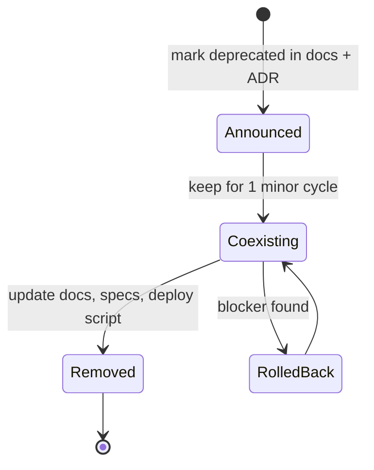
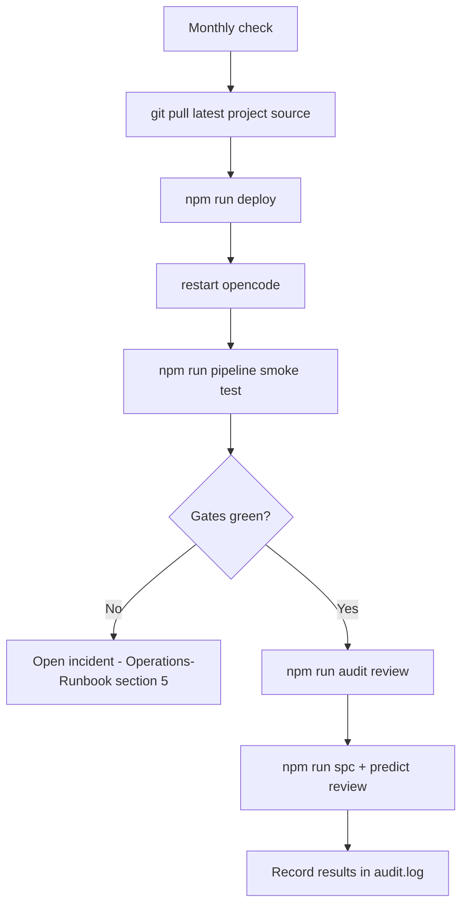

# Maintenance Guide

**Class**: 5 (Ops/User) | **Persona**: Maintainer

## Overview

This guide covers the maintenance lifecycle of the CMMI Level 4 pipeline:
dependency upgrades, the global deployment model (R14), deprecation policy,
patch handling, and scheduled health checks. It is the maintainer companion to
the [Operations-Runbook](Operations-Runbook.md) (day-2 operator tasks).

## 1. Global deployment model (R14)

The pipeline is deployed to `~/.config/opencode/` from the single source of
truth `C:\OpenCode\software-development-pipeline\Windows\`. The deploy script
(`scripts/deploy-global.ps1`, via `npm run deploy`) is non-destructive and
refuses unsafe `tools/*.js` (C4-6).

Figure 1 - Edit project source, then re-deploy (never edit globals directly)



Hard rules for maintainers:

1. Never modify a global resource directly — a hand-edited global is a
   BLOCKING defect. Edit the project source and re-run `npm run deploy`.
2. Record every deploy in `logs/audit.log` (R11).
3. After any deploy, restart opencode so the new config/skills/commands load.
4. Any new resource (skill, script, tool, doc, artifact, config key) must be
   added to the R14 resource table AND the deploy script in the same change.
5. The global `opencode.jsonc` and `package.json` are generated — do not edit
   by hand.

## 2. Upgrade process

### 2.1 Dependency upgrades

The toolchain lives in the global `package.json` devDependencies
(`eslint`, `jest`, `sqlite3`, `mathjs`, `regression`, `@babel/*`,
`eslint-plugin-security`, `eslint-plugin-react`).

| Gate | Purpose | Tool |
| :--- | :--- | :--- |
| R9 SCA | dependency safety | `npm audit --audit-level=high` |
| R8 SAST | code quality | `npx eslint --no-eslintrc --config .eslintrc.js . --ext .js --max-warnings 0` |
| Tests | behavior | `npx jest --coverage` |

Figure 2 - Upgrade decision flow



### 2.2 Upgrade checklist

```powershell
# In the project directory (source of truth)
npm install -D eslint@<new> jest@<new> ...   # bump devDependencies
npm run audit          # R9 gate green
npm run lint           # R8 gate green
npm run test           # tests green
npm run deploy         # sync to ~/.config/opencode/ (R14)
# restart opencode, then:
npm run pipeline       # full smoke test
```

Rollback: revert the `package.json` devDependency bump, re-run the four
commands above, and re-deploy. The git history on the project source is the
rollback mechanism (commit before upgrading).

## 3. Patch handling

Patches follow the same lifecycle as the code they touch:

| Patch type | Procedure |
| :--- | :--- |
| `src/` fix | Fix module + matching `__tests__/*.spec.js`; pass lint + test; commit |
| `scripts/*.ps1` / `*.js` fix | Edit project source; run `npm run deploy`; smoke test |
| Skill change (`.opencode/skills/*/SKILL.md`) | Edit project; `npm run deploy`; restart opencode |
| Tool change (`tools/reqmind.js`) | Keep `require.main === module` guard (C4-6); `npm run deploy` |
| Doc fix (`docs/*`) | Re-run Phase 4 docs pass or edit + deploy |

Security-sensitive patches (secret handling, auth, audit, SPC) additionally
require a passing `npm run audit` and full `npm run test` before deploy.

## 4. Deprecation policy

Any deprecated resource must be removed in a controlled order so no gate or
doc breaks:

Figure 3 - Safe deprecation sequence



1. Announce in `docs/ADR.md` and `docs/Project-Roadmap.md`.
2. Keep the resource during one coexistence cycle; update callers.
3. Remove it, then update every artifact that referenced it (docs, specs,
   deploy script, R14 resource table) in the same change — a missing mirror is
   a BLOCKING defect.
4. Re-deploy and restart opencode.

## 5. Health checks

Maintainers run deeper checks than operators on a scheduled cadence:

| Cadence | Check |
| :--- | :--- |
| Monthly | `npm run deploy` idempotence + `npm run pipeline` smoke test from a clean checkout |
| Monthly | `npm run audit` for new advisories; review `metrics/security-scan.json` |
| Quarterly | Review `metrics/metrics.db` build history against C4-1 targets |
| Quarterly | Review `docs/ADR.md` log for stale decisions |
| On release | Full documentation pass (Phase 4) and SPC/prediction review |

Figure 4 - Monthly maintenance health check



## 6. Handoff notes

- The single source of truth is the project directory; the global install is a
  generated mirror (R14).
- Metrics history is organizational (`~/.config/opencode/metrics/metrics.db`) —
  deleting it erases SPC/prediction baselines.
- A healthy system shows a flat or improving defect-density trend below UCL,
  `PIPELINE SUCCESS` on every run, and zero hand-edited global files.
