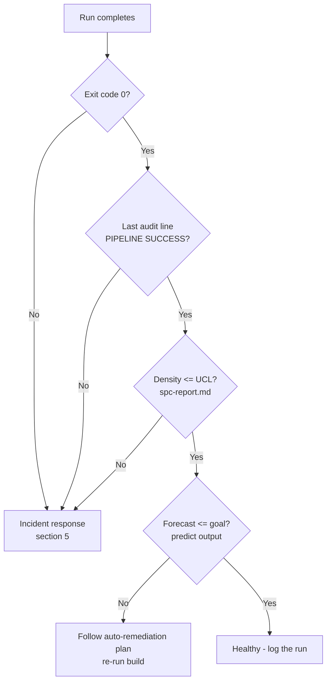
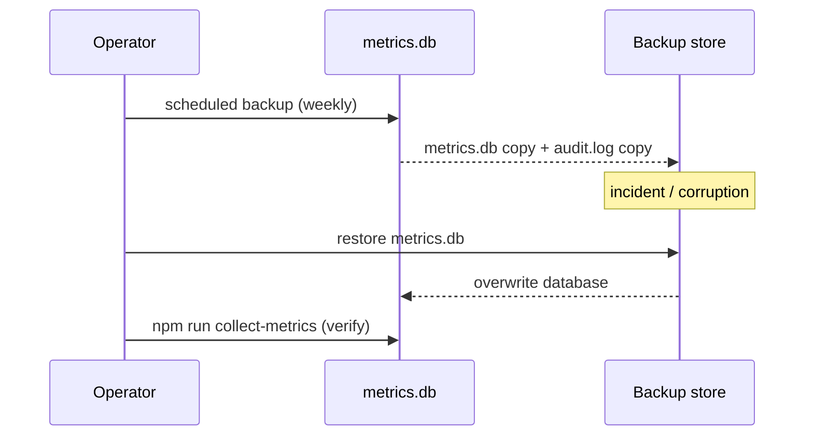

# Operations Runbook

**Class**: 5 (Ops/User) | **Persona**: Operator

## Overview

This runbook covers day-2 operations: running the pipeline variants, verifying
health, backup and restore of the measurement database, and incident response
for blocked builds. It assumes the pipeline is deployed globally per
[Administration-Guide](Administration-Guide.md) and can run from any directory.

## 1. Run variants

| Task | Command |
| :--- | :--- |
| Full build with all gates | `npm run pipeline` |
| Regenerate documentation only | `npm run pipeline:skipdocs` (inverse — skip docs) |
| Rebuild code without security gates | `npm run pipeline:skipsecurity` |
| Record a manual build measurement | `npm run collect-metrics` |
| Generate the SPC control report | `npm run spc` |
| Generate the readiness forecast | `npm run predict` |
| Re-sync global deployment | `npm run deploy` |

All analytics commands (`collect-metrics`, `spc`, `predict`) read/write the
organizational database under `~/.config/opencode/metrics/`.

## 2. Health check

Figure 1 - Post-build health checklist



1. Confirm `logs/audit.log` ends with `Pipeline | SUCCESS`.
2. Confirm no `BLOCKED (R10)` entries in the run.
3. Compare current defect density to the UCL in `metrics/spc-report.md`.
4. If a readiness prediction exists, confirm the forecast is at or below the
   `DENSITY_GOAL` (0.5); otherwise apply the auto-generated remediation plan.

## 3. Backup and restore

### 3.1 What to back up

| Path | Why |
| :--- | :--- |
| `~/.config/opencode/metrics/metrics.db` | Build history — the SPC/prediction input |
| `~/.config/opencode/logs/audit.log` | R11 compliance trail |
| `~/.config/opencode/opencode.jsonc` | Generated global config |
| Project `specs/`, `src/`, `__tests__/`, `docs/` | Canonical artifacts (Class 1/3/5) |

### 3.2 Backup

```powershell
# Copy the organizational DB + audit trail (repeat on a fixed cadence)
Copy-Item "$env:USERPROFILE\.config\opencode\metrics\metrics.db" "C:\backups\metrics.db.$(Get-Date -Format yyyyMMdd)"
Copy-Item "$env:USERPROFILE\.config\opencode\logs\audit.log" "C:\backups\audit.log.$(Get-Date -Format yyyyMMdd)"
```

Figure 2 - Backup and restore cycle



### 3.3 Restore

```powershell
# Stop any running pipeline first
Copy-Item "C:\backups\metrics.db.<date>" "$env:USERPROFILE\.config\opencode\metrics\metrics.db" -Force
npm run spc    # verify SPC reads the restored history
npm run predict
```

> The DB is a single-file SQLite database. Copy it while no build is writing;
> SQLite is crash-safe, but a hot copy may be mid-transaction.

## 4. Routine operator schedule

| Cadence | Action |
| :--- | :--- |
| Every build | Read the last lines of `logs/audit.log`; confirm `PIPELINE SUCCESS` |
| Every 5 builds | Review `metrics/spc-report.md` (first valid SPC baseline) |
| Every 10 builds | Review the readiness prediction; act on C4-5 warnings |
| Weekly | Back up `metrics/metrics.db` and `logs/audit.log` |
| Monthly | `npm run deploy` to re-sync globals; run a full `npm run pipeline` smoke test |
| On upstream release | Re-deploy after global dependency updates (see Maintenance-Guide) |

## 5. Incident response

Figure 3 - Incident triage flow

```mermaid
flowchart TD
    S[Build blocked / error] --> A{Open the matching step in Troubleshooting-Guide}
    A --> B{Gate failure?}
    B -->|Yes| C[Identify gate from [FAIL] line + audit.log]
    C --> D{Secret/env issue?}
    D -->|Yes| E[Remove .env / add .gitignore rule / clear hardcoded secrets]
    D -->|No| F{Lint or test?}
    F -->|Yes| G[Fix src/ or __tests__/; re-run lint + test]
    F -->|No| H{SCA?}
    H -->|Yes| I[npm audit fix / upgrade dependency]
    B -->|No| J{Startup crash?}
    J -->|Yes| K[Check tools/*.js import-safety (C4-6); npm run deploy]
    B -->|No| L{Missing output?}
    L -->|Yes| M[Re-run the phase; verify skill present]
```

| Incident | Symptoms | Immediate actions | Escalation |
| :--- | :--- | :--- | :--- |
| Gate blocked (R10) | `BLOCKED (R10)` in audit.log, exit 1 | Read the failing gate; apply Troubleshooting-Guide fix | Maintainer for root-cause fix |
| SPC excursion | `density > UCL` | Investigate cause before next build; reduce critical/high vulns | Maintainer review |
| Prediction over goal | forecast > 0.5, C4-5 warning | Apply auto-generated remediation plan; confirm two improving builds | Maintainer review |
| Startup crash | opencode exits 1 / `Failed to fetch` | Check `tools/*.js` import-safety; `npm run deploy`; restart | Administrator |
| DB corruption | SQL errors on metrics | Restore from backup (section 3.3) | Administrator |
| Env compromise | `.env` present / secrets in tree | Delete secrets; rotate credentials; re-run R7 | Security lead |

## 6. Post-incident

1. Record the incident and fix in `logs/audit.log` context / commit message.
2. Re-run `npm run pipeline` to confirm a clean `PIPELINE SUCCESS`.
3. After 2 consecutive improving builds, close the C4-5 warning.
4. If the incident changed global config or scripts, run `npm run deploy` and
   restart opencode (R14).
