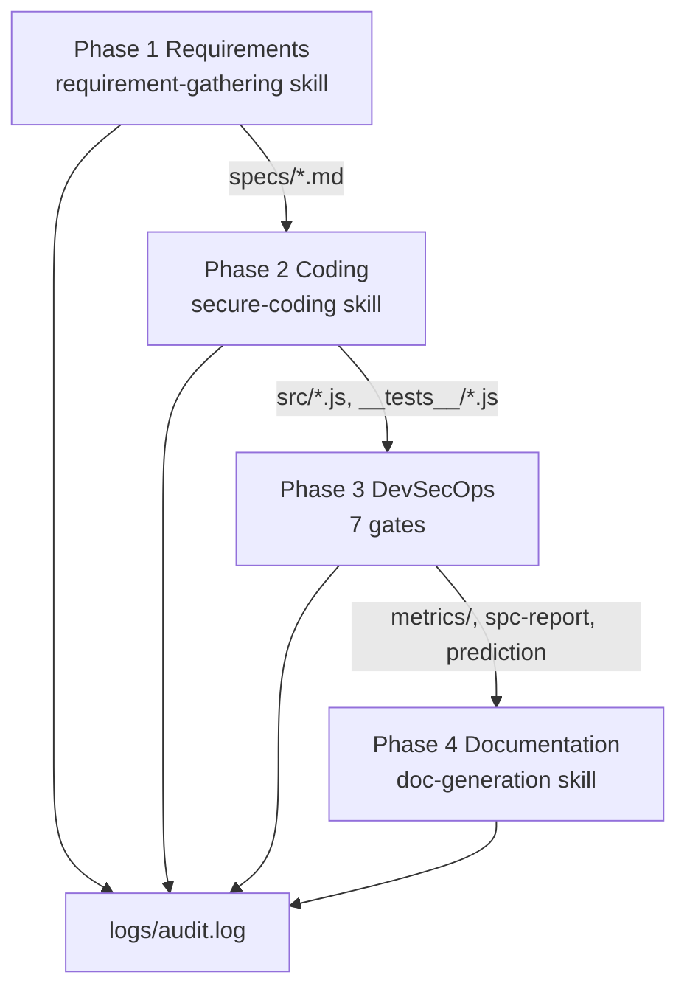
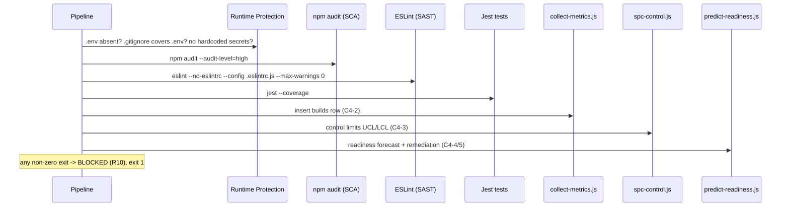
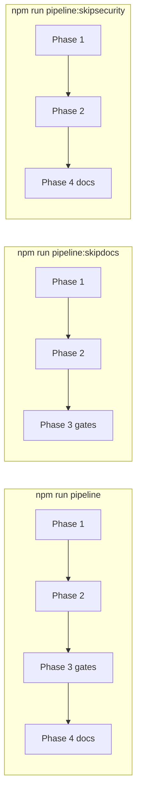

# Pipeline Guide

**Class**: 5 (Ops/User) | **Persona**: Developer / Operator

## Overview

This guide documents the four-phase pipeline, its inputs and outputs per phase,
the mandatory gates, the strict workflow order (W1), and the skip variants. It
is the operational companion to the [Developer-Guide](Developer-Guide.md) and
the [Testing-Guide](Testing-Guide.md).

## 1. Entry points

| Command | Behavior |
| :--- | :--- |
| `npm run pipeline` | Full 4-phase run, all gates |
| `npm run pipeline:skipdocs` | Phases 1-3 (skip Phase 4 documentation) |
| `npm run pipeline:skipsecurity` | Phases 1, 2, 4 (skip Phase 3 gates) |

All entry points run `scripts/opencode-pipeline.ps1` via
`powershell -ExecutionPolicy Bypass`. The script infers the global toolchain
from its own location and operates on the project directory (default: the
calling working directory, or `-ProjectDir`).

## 2. Phase I/O matrix (W1)

Figure 1 - Four phases, strict order, each audited (W1/R11)

| Phase | Skill / Tool | Input | Output | Blocked when (R10) |
| :--- | :--- | :--- | :--- | :--- |
| 1 - Requirements | `requirement-gathering` | `opencode.project.md` (optional) | `specs/PRD.md`, `specs/SRS.md`, `specs/User-Stories.md`, `specs/Technical-Design.md` | no `specs/*.md` produced |
| 2 - Coding | `secure-coding` | `specs/`, `opencode.project.md` (optional) | `src/*.js`, `__tests__/*.js` | no `src/*.js` or no `__tests__/*.js` |
| 3 - DevSecOps | R7-R10 + analytics scripts | project tree, global toolchain | `metrics/metrics.db`, `metrics/spc-report.md`, readiness prediction, `logs/audit.log` | any of the 7 gates fails |
| 4 - Documentation | `doc-generation` | `specs/`, `src/`, `docs/` | `docs/*`, `docs/wiki/*`, `README.md`, root templates | any required doc file missing |

## 3. Phase 3 gate chain (7 steps)

Figure 2 - The seven mandatory gates in execution order

| Step | Gate | Command (inside script) | Failure |
| :--- | :--- | :--- | :--- |
| 1/7 | R7 runtime | manual checks on project tree | `.env` present, `.gitignore` missing/not excluding `.env`, hardcoded secrets |
| 2/7 | R9 SCA | `npm audit --audit-level=high --json` | high/critical vulnerability |
| 3/7 | R8 SAST | `npx eslint --no-eslintrc --config .eslintrc.js <project> --ext .js --max-warnings 0` | any lint warning or error |
| 4/7 | Tests | `npx jest --coverage --rootDir <project>` | any failing spec |
| 5/7 | C4-2 metrics | `node collect-metrics.js` | unreadable `security-scan.json` |
| 6/7 | C4-3 SPC | `node spc-control.js` | density > UCL, or DB error |
| 7/7 | C4-4/5 predict | `node predict-readiness.js` | forecast over goal, or < 10 builds |

R8 runs with `--no-eslintrc` so the global `.eslintrc.js` cannot be shadowed by
a project-level config. R9/R8/Jest resolve binaries and config from the global
toolchain while operating on project files.

## 4. Gate outcomes and exit codes

| Outcome | Exit code | Audit log entry | Effect |
| :--- | :--- | :--- | :--- |
| All phases pass | `0` | `Pipeline \| SUCCESS` | Build complete |
| Any gate fails | `1` | `<Phase> \| BLOCKED (R10)` | Merge blocked |
| Phase 1/2/4 produced nothing | `1` | `<Phase> \| BLOCKED (R10)` | Merge blocked |
| opencode subprocess failed | child code | `<Phase> \| FAILED` | Build stops |

## 5. Skip variants

Figure 3 - What each skip variant runs

| Variant | Phase 1 | Phase 2 | Phase 3 | Phase 4 |
| :--- | :---: | :---: | :---: | :---: |
| `pipeline` | yes | yes | yes | yes |
| `pipeline:skipdocs` | yes | yes | yes | no |
| `pipeline:skipsecurity` | yes | yes | no | yes |

Skip variants exist for focused iteration. They are NOT a way to bypass a
failing gate on a deliverable — use them to save time while only re-running the
phase you changed (R10 still applies to the phases you run).

## 6. Project specification injection

If `opencode.project.md` exists in the project directory, its content is
injected into the Phase 1, Phase 2, and Phase 4 prompts so every artifact
matches the project's domain (stack, data sources, UI layout, forms). Without
it, the pipeline runs generically. This is the project-level customization hook.

## 7. R10 deliverable verification

After each phase, the script verifies artifacts exist:

- Phase 1: at least one `specs/*.md`.
- Phase 2: at least one `src/*.js` AND at least one `__tests__/*.js`.
- Phase 4: all 20 docs plus `README.md`, `LICENSE`, `CONTRIBUTING.md`,
  `CODE_OF_CONDUCT.md`, `SECURITY.md`, and `CHANGELOG.md`.

A missing artifact is a BLOCKING defect and the pipeline exits 1 listing the
missing files. See [Troubleshooting-Guide](Troubleshooting-Guide.md) section 4
for fixes.
