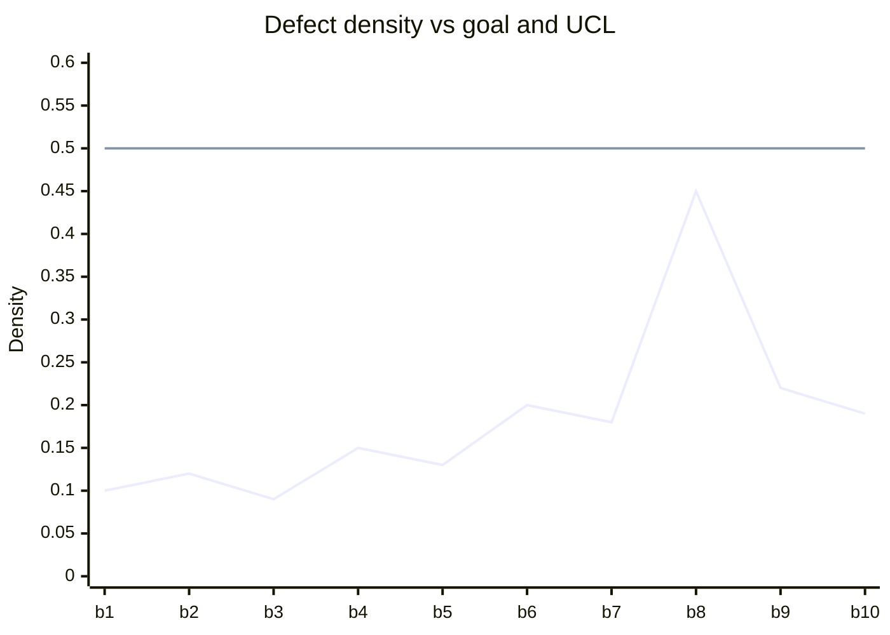
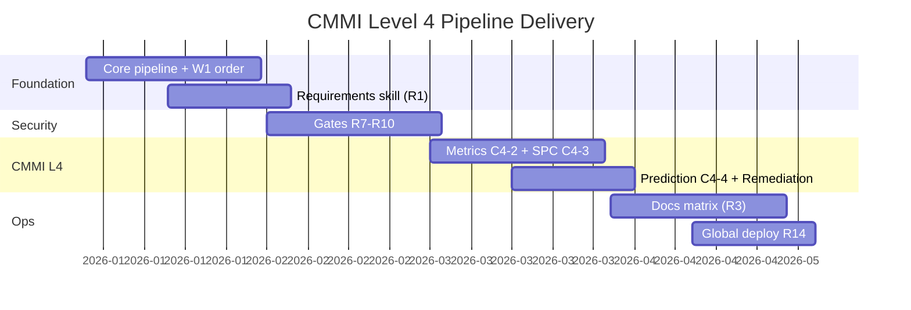

# Project Roadmap

**Class**: 5 (Ops/User) | **Persona**: Project Owner / Architect

## Overview

This roadmap defines the milestones, delivery phases, backlog, and the CMMI
Level 4 quantitative targets (C4-1) the pipeline must hold. It is the
owner/architect planning companion to [ADR.md](ADR.md) (decision history) and
[Monitoring-Alerting-Guide.md](Monitoring-Alerting-Guide.md) (how the targets are
measured).

## C4-1 Quantitative goals

| Metric | Target | How measured |
| :--- | :--- | :--- |
| Defect Density (Critical+High/KLOC) | ≤ 0.5 | `npm audit` + ESLint findings / LOC (`src/metrics.js` `DENSITY_GOAL`) |
| Build Stability (rolling 10 builds) | ≥ 98% | `metrics/metrics.db` build history |
| Cycle Time Stability (std dev) | < 2 minutes | `metrics/metrics.db` timestamps |
| Mandatory gates enforced (R7-R11) | 100% | `logs/audit.log` phase/gate lines |

Figure 1 - KPI target dashboard (illustrative)



## Milestones

Figure 2 - Delivery timeline (Mermaid gantt)



## Delivery phases

| Phase | Scope | Exit criteria | Status |
| :--- | :--- | :--- | :--- |
| M1 Foundation | Pipeline skeleton, W1 order, `opencode run` entry | Pipeline runs all 4 phases in order | Done |
| M2 Security | R7-R10 gates, audit log R11 | Any gate violation blocks (R10) | Done |
| M3 CMMI L4 | C4-2 metrics, C4-3 SPC, C4-4/5 prediction | Density > UCL blocks; trends alert | In progress |
| M4 Ops | Docs matrix, global deploy R14 | `/pipeline` works from any directory | In progress |

## Backlog

| ID | Item | Priority | Type |
| :--- | :--- | :--- | :--- |
| BL-01 | Rolling-window prediction beyond defect density (PRD open question) | High | Enhancement |
| BL-02 | Decide blocking policy for low/informational audit severities | Medium | Policy |
| BL-03 | Evaluate alternative local models (`qwen2.5-coder:7b` candidates) | Medium | Experiment |
| BL-04 | Non-Windows (Linux) orchestrator port | Low | Enhancement |
| BL-05 | SPC report HTML/GUI dashboard | Low | Enhancement |
| BL-06 | Automated weekly backup job for `metrics.db` + `audit.log` | Medium | Ops |

## Definition of Done (per milestone)

Figure 3 - Milestone acceptance flow

```mermaid
flowchart TD
    A[Implement scope items] --> B[npm run lint]
    B --> C[npm run test]
    C --> D[npm run audit]
    D --> E[npm run pipeline full run]
    E --> F{Gates green + PIPELINE SUCCESS?}
    F -->|No| A
    F -->|Yes| G[Update ADR.md + this roadmap]
    G --> H[npm run deploy (R14)]
    H --> I[Record in logs/audit.log]
```

## KPI review cadence

| Cadence | Owner | Review |
| :--- | :--- | :--- |
| Every build | Pipeline | Gate status + density vs UCL (C4-3) |
| Every 5 builds | Operator | First valid SPC baseline |
| Every 10 builds | Operator/Architect | Prediction vs goal (C4-4) |
| Quarterly | Owner | C4-1 targets vs `metrics.db` trend; backlog re-prioritization |
| On release | Owner/Architect | Full docs pass + SPC/prediction review |

## Risks and mitigation

| Risk | Impact | Mitigation |
| :--- | :--- | :--- |
| Metrics baseline too small for SPC | Spurious UCL/LCL | Baseline valid at ~5 builds; review cadence above |
| Local model quality | Higher defect density | Model eval backlog (BL-03); `npm audit` catches critical/high |
| Hand-edited global files | Drift from source of truth | R14 hard rule: deploy-only, blocking defect |
| Loss of `metrics.db` | Lost SPC baseline | Scheduled backups (BL-06) |
