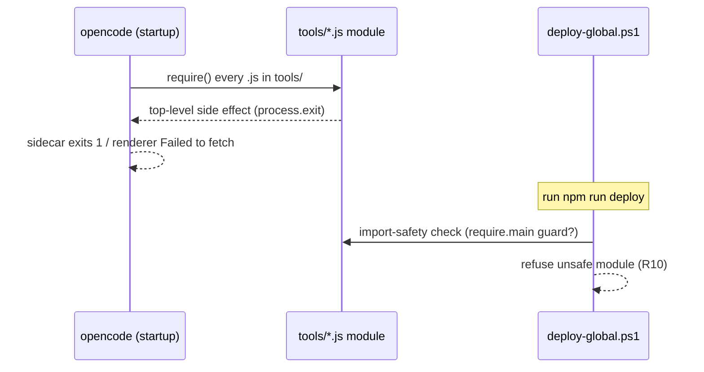

# Troubleshooting Guide

**Class**: 5 (Ops/User) | **Persona**: User + Administrator

## Overview

This guide covers the most common failures when running the CMMI Level 4
pipeline: environment issues, gate failures, and the specific opencode startup
crash caused by an unsafe custom tool (C4-6).

## 1. Decision flowchart

Figure 1 - Troubleshoot a failed run

```mermaid
flowchart TD
    A([Run failed / unexpected behavior]) --> B{Does opencode start?}
    B -->|No - crashes at startup| C[Check tools/*.js import-safety<br/>see section 6]
    B -->|Yes| D{Was it a gate failure?}
    D -->|Yes| E[Read the [FAIL] line<br/>identify the gate]
    D -->|No| F{Command not found?}
    F -->|Yes| G[Environment/PATH issue<br/>see section 2]
    F -->|No| H{Phase produced nothing?}
    H -->|Yes| I[Phase output missing<br/>see section 5]
    H -->|No| J[Check logs/audit.log<br/>see section 7]
    E --> K[Apply the matching fix table entry]
```

## 2. Environment and setup issues

| Symptom | Cause | Fix |
| :--- | :--- | :--- |
| `opencode: command not found` | Global CLI not installed or `%APPDATA%\npm` not on PATH | `npm install -g opencode-ai`; add `%APPDATA%\npm` to PATH |
| Scripts blocked by execution policy | PowerShell policy too restrictive | `Set-ExecutionPolicy RemoteSigned -Scope CurrentUser -Force` |
| `reqmind: command not found` | Local package not linked | `npm link` in the project directory |
| Ollama model missing | Provider model not pulled (local-first mode, R6) | `ollama pull qwen2.5-coder:7b` (only if using the Ollama provider) |
| `npm install` reports vulnerabilities | Outdated dependencies | Re-run `npm install` and let the R9 gate re-scan |

## 3. Gate failures (Phase 3)

| Symptom | Cause | Fix |
| :--- | :--- | :--- |
| `[FAIL] .env found in working tree` (R7) | A `.env` file exists | Delete it; never commit secrets |
| `[FAIL] .gitignore does not exclude .env` (R7) | `.gitignore` missing or not covering `.env` | Add `.env`, `.env.*`, `*.pem`, `*.key` |
| `[FAIL] Potential hardcoded secrets` (R7) | `api_key`/`password`/`token` assignments in `src/`, `scripts/`, `tools/` | Move values to environment variables; remove literals |
| `[FAIL] npm audit found vulnerabilities` (R9) | Dependency with high/critical advisory | `npm audit fix` or upgrade the affected package |
| `[FAIL] ESLint FAILED` (R8) | Warnings or errors (`--max-warnings 0`) | Run `npm run lint` and fix every finding |
| `[FAIL] Tests FAILED` | Jest assertion/coverage failures | Run `npm run test` and fix the failing specs |
| `[FAIL] Metrics collection FAILED` | `metrics/security-scan.json` unreadable or invalid JSON | Re-run `npm audit --json`; confirm UTF-8 without BOM |
| `[FAIL] SPC FAILED` | Defect density above UCL (C4-3) or fewer than 5 builds | Reduce critical/high vulns; collect more builds |
| `[FAIL] Prediction FAILED` | Regression forecast exceeds the goal (C4-4/5) or fewer than 10 builds | Apply the auto-generated remediation plan |

Any gate failure exits with code 1 and BLOCKS the merge (R10). Fix the root
cause, not the symptom — do not use `pipeline:skipsecurity` to bypass.

## 4. Phase output missing

| Symptom | Cause | Fix |
| :--- | :--- | :--- |
| `[FAIL] PHASE 1: no specs\*.md produced` | Requirements phase wrote nothing | Re-run Phase 1; verify the `requirement-gathering` skill is present in `.opencode/skills/` |
| `[FAIL] PHASE 2: no src\*.js ... produced` | Coding phase wrote nothing | Re-run Phase 2; verify the `secure-coding` skill is present |
| `[FAIL] PHASE 4: missing required docs` | A required doc file is absent after docs passes | Re-run Phase 4 (R10 gate lists the missing files) |

## 5. Metrics database issues

| Symptom | Cause | Fix |
| :--- | :--- | :--- |
| `Database error` or SQL errors | Corrupt `metrics/metrics.db` | Delete `metrics/metrics.db` and re-run `npm run collect-metrics` |
| `spc-control.js` prints a baseline notice | Fewer than 5 builds recorded | Let more builds accumulate before trusting the report |
| `predict-readiness.js` needs more data | Fewer than 10 builds recorded | Continue running the pipeline; prediction improves with history |

## 6. opencode crashes at startup (C4-6)

**Symptom**: the desktop sidecar exits with code 1, headless `opencode run`
exits 1 printing a CLI usage string on stderr, or the renderer reports
`TypeError: Failed to fetch`.

**Cause**: a `.js` file in `~/.config/opencode/tools/` is NOT import-safe.
opencode auto-imports every `.js` there in-process at startup; a plain CLI
whose top-level code runs on import (prints usage, calls `process.exit`) crashes
opencode.

**Fix**:
1. Every CLI in `tools/` must guard its entry:
   ```js
   if (require.main === module) { /* CLI entry */ }
   ```
   or export a `tool()` definition from `@opencode-ai/plugin`.
2. Re-deploy: `npm run deploy` (the deploy script refuses unsafe `tools/*.js`).
3. Restart opencode.

Figure 2 - Diagnose the opencode startup crash



## 7. Reading the audit trail

Every phase and gate is recorded in `logs/audit.log` (R11):

```text
2026-08-09 10:00:01 | Phase 1 (Requirements) | PASSED
2026-08-09 10:00:41 | Phase 2 (Coding) | PASSED
2026-08-09 10:01:12 | Phase 3 (Runtime Protection) | PASSED
2026-08-09 10:01:15 | Phase 3 (SAST) | BLOCKED (R10)
```

A `BLOCKED (R10)` entry names the exact gate that stopped the build — start the
diagnosis there. See [Administration-Guide](Administration-Guide.md) for how to
read and retain these logs.
