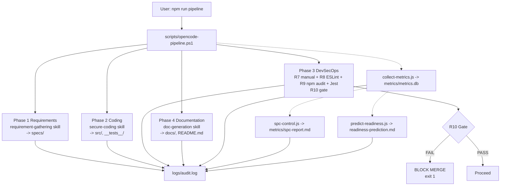
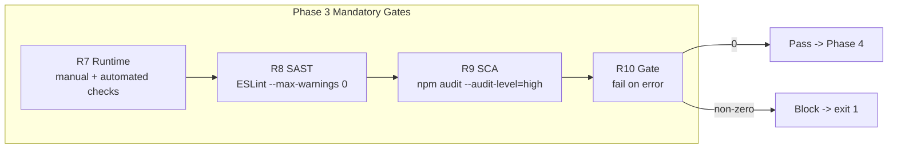
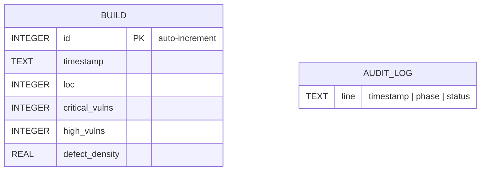
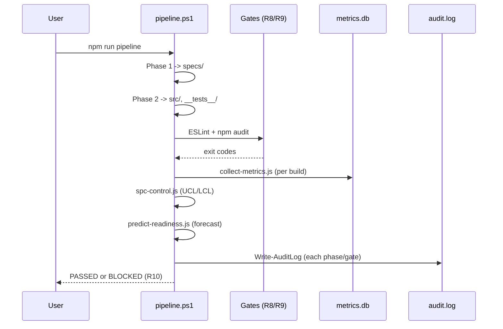
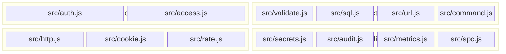
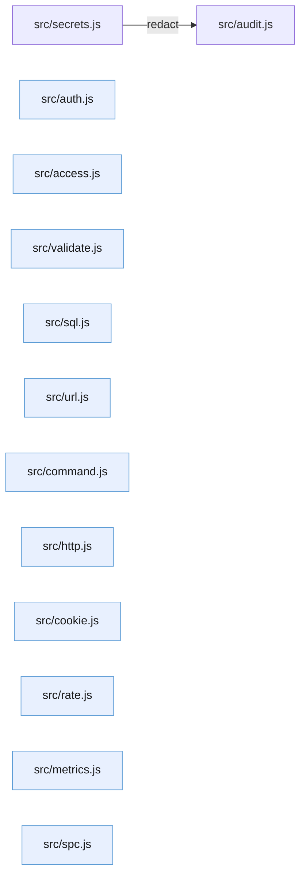

# Architecture

**Class**: 2 (Technical Design) | **Source**: `specs/Technical-Design.md`, `src/`, `AGENTS.md`

## Overview

This project is a Windows-native, CMMI Level 4 (Quantitatively Managed) software
development pipeline. OpenCode is the single entry point (R5). A PowerShell
orchestrator (`scripts/opencode-pipeline.ps1`) enforces the strict workflow order
(W1) and runs mandatory security gates (R7-R10). Node.js scripts implement
statistical process control (C4-1..5). Every phase and gate writes to an audit
log (R11). A secure-coding layer in `src/` provides reusable, OWASP-aligned
primitives used across the toolchain.

## High-level flow

Figure 1 - High-level pipeline flow (W1 order, R7-R11, C4-2..4-5)

## Gate logic

Figure 2 - Phase 3 DevSecOps gate chain (R7-R10)

## Analytics data model

Figure 3 - Entity-relationship diagram for measurement data (C4-2)

Defect density = `(critical_vulns + high_vulns) / (loc / 1000)`. Target is
`<= 0.5` (C4-1), defined as `DENSITY_GOAL` in `src/metrics.js`.

SPC computes `UCL = mean + 3*stdev`, `LCL = max(0, mean - 3*stdev)`
(`src/spc.js` `controlLimits`). Density above UCL blocks the merge (C4-3/R10).

## Build sequence

Figure 4 - Sequence diagram of a build run

## Components

| Component | Location | Responsibility |
| :--- | :--- | :--- |
| Orchestrator | `scripts/opencode-pipeline.ps1` | W1 order, gates, audit (R11) |
| Metrics collector | `scripts/collect-metrics.js` | C4-2 measurement |
| SPC controller | `scripts/spc-control.js` | C4-3 control limits |
| Readiness predictor | `scripts/predict-readiness.js` | C4-4/5 forecast + remediation |
| reqmind | `tools/reqmind.js` | R1 SRS generation (import-safe, C4-6) |
| Skills | `.opencode/skills/*` | R4 separation of concerns |
| Knowledge | `AGENTS.md` | R12 process rules |
| Secure primitives | `src/*.js` | OWASP-aligned helpers (R2/R8) |

## `src/` secure-coding layer

Figure 5 - Component diagram of the `src/` layer grouped by concern

| Module | Purpose | Key exports |
| :--- | :--- | :--- |
| `src/auth.js` | PBKDF2 password hashing/verification | `hashPassword`, `verifyPassword` |
| `src/access.js` | Role-based access control | `validateRoles`, `hasRole`, `assertRole`, `isOwner` |
| `src/validate.js` | Input sanitization, email, path validation | `sanitizeString`, `isValidEmail`, `isSafeRelativePath` |
| `src/sql.js` | SQL injection defense | `validateIdentifier`, `buildPlaceholders`, `validateParams`, `escapeLike` |
| `src/url.js` | SSRF defense, URL safety | `parseSafeUrl`, `isSafeUrl`, `assertSafeUrl` |
| `src/command.js` | Command injection defense | `assertSafeCommand`, `assertSafeArg`, `assertSafeShellArg`, `buildSpawnArgs` |
| `src/http.js` | Security headers and safe JSON parsing | `buildSecurityHeaders`, `safeJsonParse` |
| `src/cookie.js` | Safe `Set-Cookie` construction | `sanitizeCookieValue`, `buildSetCookie` |
| `src/rate.js` | Fixed-window rate limiting | `createRateLimiter` |
| `src/secrets.js` | Secret scanning and redaction | `scanForSecrets`, `redact` |
| `src/audit.js` | Structured audit-log line formatting (R11) | `formatAuditLine` |
| `src/metrics.js` | Defect-density computation (C4-1) | `defectDensity`, `meetsDefectDensityGoal` |
| `src/spc.js` | Mean / stdev / control limits (C4-3) | `mean`, `controlLimits`, `isOutOfControl` |

Figure 6 - Intra-`src/` dependency graph (only `audit.js` depends on another module)

## Design decisions

| Decision | Rationale |
| :--- | :--- |
| PowerShell orchestrator | Native Windows, no WSL/cloud dependency (R6) |
| OpenCode as single entry point | R5: every phase runs through `opencode run` |
| Three independent skills + AGENTS.md | R4: separation of concerns, no cross-coupling |
| SQLite metrics storage | Lightweight, no external server, per-build history for SPC |
| 3-sigma UCL/LCL | C4-3: standard statistical process control |
| Fail-on-error gates | R10: any violation blocks the build and merge |
| Local-first, free tooling | R6: Ollama + open-source stack only |
| `src/` primitives throw typed errors | Predictable validation: `TypeError`/`RangeError`/`SyntaxError` |
| PBKDF2 210k iterations + constant-time verify | OWASP-aligned credential storage (`src/auth.js`) |
| Whitelist-based validators | Allow-list (regex, role sets, protocols) beats blacklists |

## Constraints

- Workflow order W1 is non-negotiable (blocked otherwise).
- Gates R7-R11 are mandatory; failure blocks the build (R10).
- Local-first, free/open-source tooling only (R6).
- Secrets must never appear in logs; `src/secrets.js` redacts them (R7/R11).
- `.env` must be absent from the working tree; `.gitignore` must exclude it (R7).
- Every `.js` deployed to `tools/` must be import-safe (C4-6).
