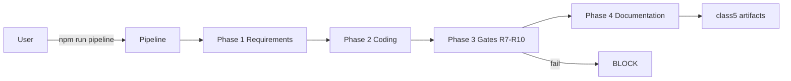
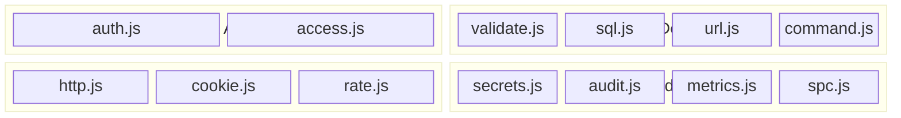

# Architecture

Full architecture with Mermaid diagrams: [`../architecture.md`](../architecture)

## Summary

A PowerShell orchestrator (`scripts/opencode-pipeline.ps1`) runs the four phases
in strict order (W1): Requirements (R1), Coding (R2), DevSecOps (R7-R10), and
Documentation (R3). Node.js analytics scripts measure (C4-2), control (C4-3),
and predict (C4-4/5) the process. Every phase and gate writes to
`logs/audit.log` (R11). A secure-coding layer in `src/` provides 13 OWASP-aligned
primitives grouped by concern (auth/access, input defense, web security,
secrets/audit/analytics).

## Flow

Figure 1 - Wiki flow diagram

## Components

| Component | Path | Role |
| :--- | :--- | :--- |
| Orchestrator | `scripts/opencode-pipeline.ps1` | W1 + gates + audit |
| Metrics | `scripts/collect-metrics.js` | C4-2 |
| SPC | `scripts/spc-control.js` | C4-3 (3-sigma UCL/LCL) |
| Prediction | `scripts/predict-readiness.js` | C4-4/5 |
| reqmind | `tools/reqmind.js` | R1 SRS |
| Skills | `.opencode/skills/*` | R4 |
| Plugins | `.opencode/plugins/*` | productteam, speckit |
| Secure primitives | `src/*.js` | R2/R8 OWASP helpers |

## `src/` layer

Figure 2 - Secure primitives grouped by concern

The only intra-layer dependency is `audit.js -> secrets.js` (redaction).
See the [API Reference](../API-Reference) for all 13 modules.

## Data

- `metrics/metrics.db` — `builds` table: id, timestamp, loc, critical_vulns,
  high_vulns, defect_density.
- Defect density = `(critical + high) / (loc / 1000)`.
- SPC: `UCL = mean + 3*stdev`; density above UCL blocks the merge.

See also: [Home](Home), [Setup Guide](../Setup-Guide), [API Reference](../API-Reference).
