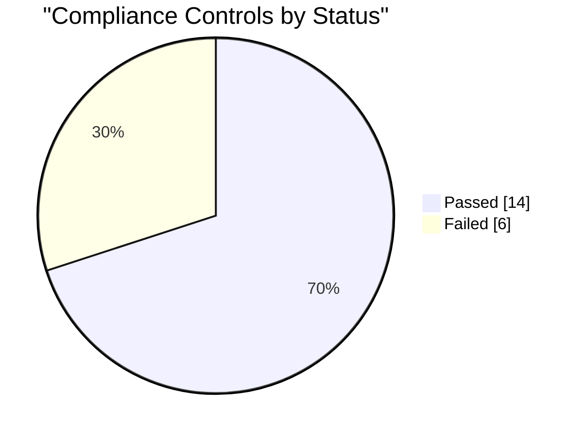

# Compliance Report - CMMI Level 4

## Framework Summary

| Framework | Passed | Total |
| :--- | :--- | :--- |
| GDPR | 2 | 5 |
| HIPAA | 4 | 5 |
| PCI DSS | 5 | 5 |
| SOX | 3 | 5 |

## Control Matrix

| ID | Control | Severity | Status | Evidence |
| :--- | :--- | :--- | :--- | :--- |
| GDPR-1 | Data-processing records / inventory (Art 30) | high | :red_circle: FAIL | No evidence found |
| GDPR-2 | Data subject rights: DSAR, erasure, portability (Art 15-22) | high | :red_circle: FAIL | No evidence found |
| GDPR-3 | Security of processing (Art 32) | critical | :white_check_mark: PASS | src/notify.js, src/threat.js, src/url.js ... |
| GDPR-4 | Data protection by design (Art 25) | medium | :warning: WARN | No evidence found |
| GDPR-5 | No production PII committed to source | high | :white_check_mark: PASS | No matching data committed |
| HIPAA-1 | Risk analysis / security management process (164.308(a)(1)) | high | :red_circle: FAIL | No evidence found |
| HIPAA-2 | Information system activity review / audit logs (164.308(a)(1)(ii)(D)) | high | :white_check_mark: PASS | specs/PRD.md, specs/SRS.md, specs/Technical-Design.md ... |
| HIPAA-3 | e-PHI transmission security (164.312(e)) | critical | :white_check_mark: PASS | src/notify.js, src/url.js, __tests__/threat.spec.js ... |
| HIPAA-4 | Access control & data integrity (164.312) | high | :white_check_mark: PASS | src/threat.js, __tests__/access.spec.js, __tests__/compliance.spec.js ... |
| HIPAA-5 | Breach notification procedure (164.408) | medium | :white_check_mark: PASS | specs/User-Stories.md, docs/Operations-Runbook.md, docs/Security-Hardening-Guide.md |
| PCI-1 | No stored PAN / cardholder data (Req 3) | critical | :white_check_mark: PASS | No matching data committed |
| PCI-2 | Encrypted cardholder transmission (Req 4) | high | :white_check_mark: PASS | src/notify.js, src/url.js, __tests__/threat.spec.js ... |
| PCI-3 | Access control / MFA (Req 7-8) | high | :white_check_mark: PASS | src/threat.js, __tests__/access.spec.js, __tests__/compliance.spec.js ... |
| PCI-4 | Logging and monitoring for cardholder data (Req 10) | high | :white_check_mark: PASS | specs/PRD.md, specs/SRS.md, specs/Technical-Design.md ... |
| PCI-5 | Data retention and disposal (Req 3.1) | medium | :white_check_mark: PASS | docs/ADR.md, docs/Maintenance-Guide.md, docs/Security-Hardening-Guide.md |
| SOX-1 | Internal control documentation (302/404) | high | :red_circle: FAIL | No evidence found |
| SOX-2 | Audit trail for financial/critical actions (404) | high | :white_check_mark: PASS | specs/PRD.md, specs/SRS.md, specs/Technical-Design.md ... |
| SOX-3 | Segregation of duties / role-based access (ITGC) | high | :white_check_mark: PASS | src/threat.js, __tests__/access.spec.js, __tests__/compliance.spec.js ... |
| SOX-4 | Change management controls (ITGC) | medium | :warning: WARN | No evidence found |
| SOX-5 | Control environment: training / awareness | medium | :white_check_mark: PASS | specs/User-Stories.md, docs/ADR.md |

## Status Chart

## Status

**:red_circle: OUT OF COMPLIANCE - Merge BLOCKED (R10)**

- GDPR-1 (GDPR, high): Data-processing records / inventory (Art 30)
- GDPR-2 (GDPR, high): Data subject rights: DSAR, erasure, portability (Art 15-22)
- HIPAA-1 (HIPAA, high): Risk analysis / security management process (164.308(a)(1))
- SOX-1 (SOX, high): Internal control documentation (302/404)
**Scanned**: 57 project files across 4 frameworks. Generated by scripts/compliance-check.js (R16).
