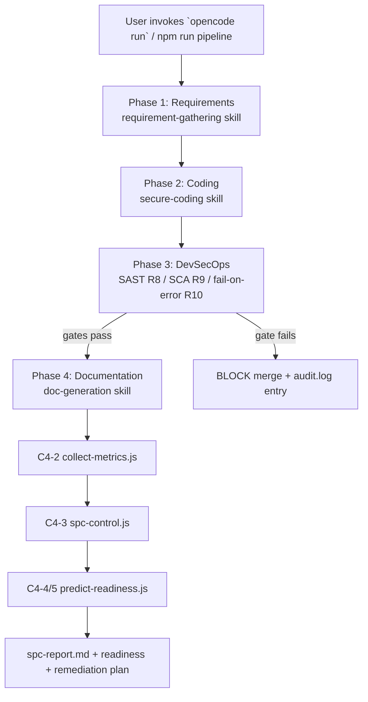
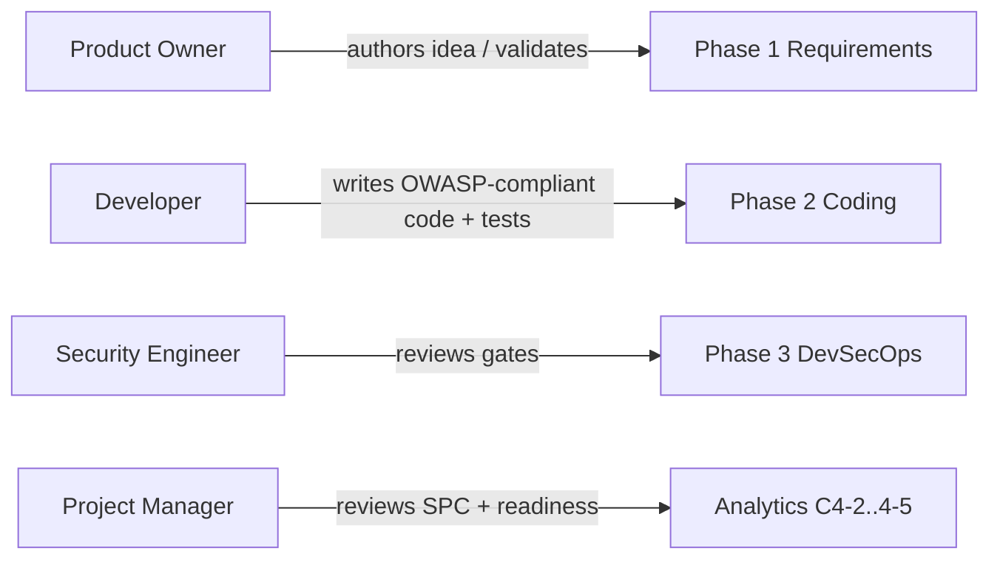
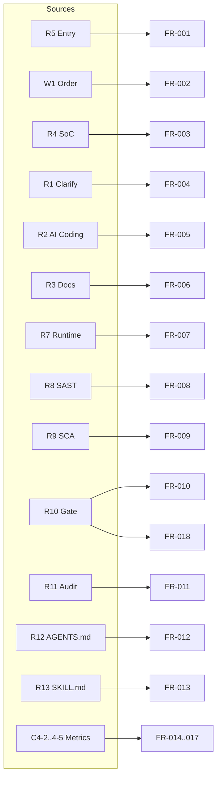
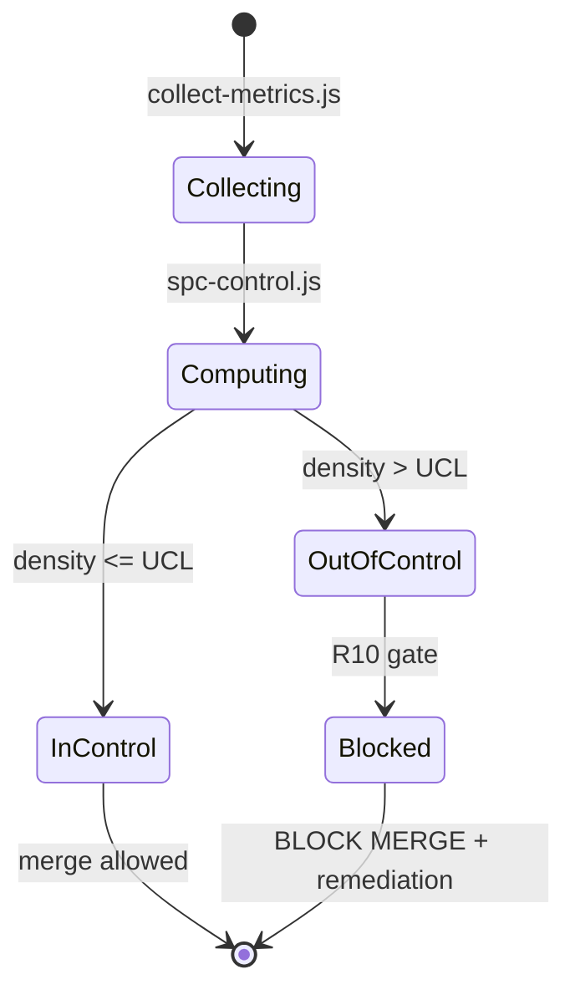

# Product Requirements Document - CMMI Level 4 OpenCode DevSecOps Pipeline

**Status**: Approved
**Date**: 2026-08-09
**Author**: ProductTeam Plugin + Requirement Clarification (R1)

## 1. Executive Summary

A quantitatively managed software development pipeline using OpenCode as the
single entry point (R5). It enforces the strict workflow order (W1):
Requirements -> Coding -> DevSecOps -> Documentation, with mandatory SAST/SCA
security gates (R8, R9), fail-on-error blocking (R10), statistical process
control with 3-sigma UCL/LCL (C4-3), readiness prediction with
auto-remediation (C4-4, C4-5), and full timestamped audit traceability (R11).

Figure 1 - Pipeline workflow overview (W1)

## 2. Problem Statement

- Teams produce requirements, code, security verification, and documentation in
  ad-hoc order with no enforced workflow (W1 violation).
- Security checks are optional, so critical and high-severity defects ship
  without a blocking gate (R7-R10 not enforced).
- No quantitative measurement of process stability means teams cannot demonstrate
  CMMI Level 4 (Quantitatively Managed) maturity (C4-1 not measurable).
- Process trends degrade silently; there is no early-warning or proactive
  remediation mechanism (C4-5 missing).

## 3. Goals & Non-Goals

### Goals

- G1: Provide a single entry point (`opencode run`) for all pipeline activity (R5).
- G2: Enforce the four-phase workflow order and block out-of-order execution (W1).
- G3: Make security gates R7-R10 mandatory and fail the build on any violation.
- G4: Collect per-build metrics and apply 3-sigma statistical process control (C4-1..3).
- G5: Predict release readiness and auto-generate remediation plans (C4-4, C4-5).
- G6: Keep full, timestamped audit traceability (R11).
- G7: Use only free, local-first, open-source tooling (R6).
- G8: Maintain separation of concerns across three independent skills plus `AGENTS.md` (R4).
- G9: Keep requirements, design, source, and documentation artifacts in their
  own classes with documented tool-to-path-to-file mappings (R4/R12/R13).

### Non-Goals

- No cloud-hosted CI/CD integration or remote model APIs.
- No GUI dashboard (SPC reports are Markdown/text artifacts).
- No deployment to production environments; pipeline targets local builds.
- No support for non-Windows hosts in this release.

## 4. User Stories

See `specs/User-Stories.md` for the full story set mapped to functional
requirements.

Figure 2 - Persona-to-phase ownership

## 5. Functional Requirements

| ID | Requirement | Source |
| :--- | :--- | :--- |
| FR-001 | Single entry point via `opencode run` | R5 |
| FR-002 | Strict workflow order enforcement | W1 |
| FR-003 | Separation of concerns: three skills + AGENTS.md | R4 |
| FR-004 | Requirement clarification producing four Class 1 documents | R1 |
| FR-005 | AI coding with OWASP-compliant output and tests | R2 |
| FR-006 | Documentation generation after security gates pass | R3 |
| FR-007 | Runtime protection checks in the pipeline | R7 |
| FR-008 | ESLint SAST gate | R8 |
| FR-009 | `npm audit` SCA gate | R9 |
| FR-010 | Mandatory fail-on-error gate | R10 |
| FR-011 | Audit log traceability | R11 |
| FR-012 | `AGENTS.md` process control rules artifact | R12 |
| FR-013 | `SKILL.md` per skill artifact | R13 |
| FR-014..017 | Metrics collection, SPC, prediction, auto-remediation | C4-2..C4-5 |
| FR-018 | Pipeline blocks merge when defect density exceeds the UCL | C4-3/R10 |

Full detail and traceability: `specs/SRS.md`.

Figure 3 - FR-to-source traceability

## 6. Success Metrics

| Metric | Target | Source |
| :--- | :--- | :--- |
| Defect Density (Critical+High/KLOC) | <= 0.5 | C4-1 |
| Build Stability (rolling 10 builds) | >= 98% | C4-1 |
| Cycle Time Stability (std dev) | < 2 minutes | C4-1 |
| Mandatory gates enforced (R7-R11) | 100% | R7-R11 |

Figure 4 - Statistical process control decision (C4-3/R10)

## 7. Open Questions

- Which severity levels (low/informational) should be non-blocking in audit?
- Should metrics use a rolling window for prediction beyond defect density?
- Model selection: `qwen2.5-coder:7b` confirmed; alternative local models to test?
