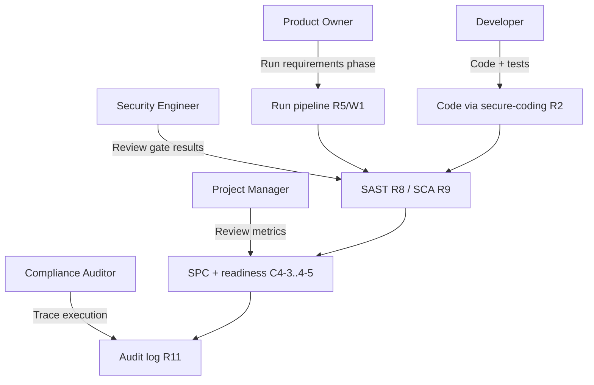
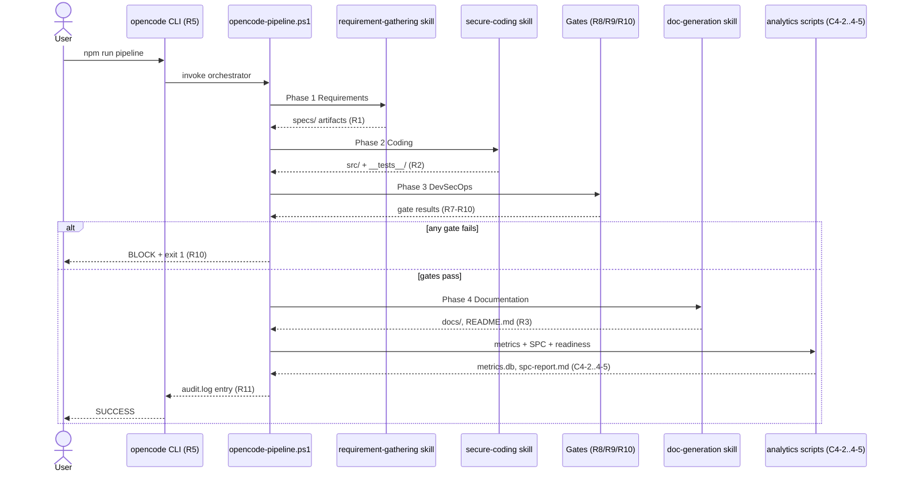
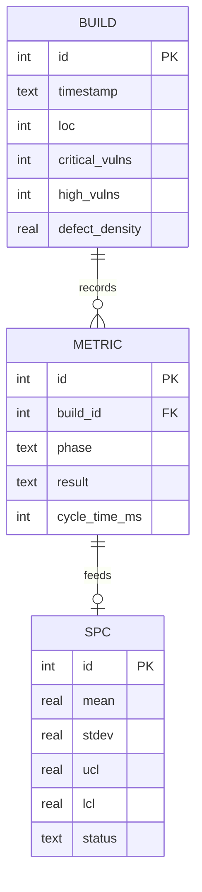

# Software Requirements Specification - CMMI Level 4 OpenCode DevSecOps Pipeline

**Status**: Approved
**Date**: 2026-08-09
**Tool**: reqmind (Requirements Mind CLI, R1)

## 1. Introduction

### 1.1 Purpose

This document defines the software requirements for a quantitatively managed
software development pipeline that uses OpenCode as the single entry point (R5),
enforces a strict workflow order (W1) with mandatory DevSecOps security gates
(R7-R10), and applies statistical process control (C4-3) to demonstrate CMMI
Level 4 maturity.

### 1.2 Scope

- Produces and maintains Class 1 requirement artifacts (`specs/PRD.md`,
  `specs/SRS.md`, `specs/User-Stories.md`, `specs/Technical-Design.md`).
- Orchestrates the workflow order Requirements -> Coding -> DevSecOps ->
  Documentation (W1).
- Enforces mandatory security gates R7-R10 and records audit traceability (R11).
- Collects, controls, and predicts process metrics (C4-2 through C4-5).

### 1.3 Source Idea

Derived from: `specs/idea.md` (CMMI Level 4 OpenCode DevSecOps Pipeline).

## 2. Overall Description

### 2.1 Users

- **Product Owner / Analyst**: authors the idea, validates PRD and user stories.
- **Developer**: writes code and tests via the secure-coding skill (R2).
- **Security Engineer**: reviews SAST/SCA gate output and vulnerability reports.
- **Project Manager**: reviews SPC reports, defect-density trends, and readiness
  predictions.

Figure 1 - System use-case diagram

### 2.2 Environment

- Windows 10/11 (PowerShell 5.1+), Node.js LTS, npm, Ollama with a local model
  (e.g., `qwen2.5-coder:7b`), and the `opencode` CLI.
- All tooling is free and local-first (R6); no cloud services are required.

### 2.3 Operating Modes

1. **Full pipeline**: `npm run pipeline` (all four phases + gates).
2. **Phased**: run individual phases or scripts for requirements, coding,
   metrics, SPC, or prediction.
3. **Skills**: manual use of the three independent skills plus `AGENTS.md` (R4).

Figure 2 - Pipeline phase sequence (W1)

## 3. Functional Requirements

| ID | Requirement | Source |
| :--- | :--- | :--- |
| FR-001 | Single entry point: all pipeline activity is invoked through `opencode run` | R5 |
| FR-002 | Strict workflow order enforced: Requirements -> Coding -> DevSecOps -> Documentation | W1 |
| FR-003 | Separation of concerns: three independent skills + AGENTS.md, no cross-coupling | R4 |
| FR-004 | Requirement clarification produces PRD, SRS, User-Stories, and Technical-Design in `specs/` | R1 |
| FR-005 | AI coding generates OWASP-compliant source and tests in `src/` and `__tests__/` | R2 |
| FR-006 | Documentation generation produces README.md, API reference, and wiki content | R3 |
| FR-007 | Runtime protection: manual security checks run in the pipeline | R7 |
| FR-008 | SAST gate: ESLint runs in the pipeline | R8 |
| FR-009 | SCA gate: `npm audit` runs in the pipeline | R9 |
| FR-010 | Mandatory gate: pipeline fails on any gate error | R10 |
| FR-011 | Auditable traceability: every phase/gate result is appended to `logs/audit.log` | R11 |
| FR-012 | Process control rules document maintained as `AGENTS.md` | R12 |
| FR-013 | Each skill ships a SKILL.md describing its workflow | R13 |
| FR-014 | Metrics collected into `metrics/metrics.db` (defect density, build stability, cycle time) | C4-2 |
| FR-015 | SPC computes 3-sigma UCL/LCL and flags out-of-control points | C4-3 |
| FR-016 | Readiness predicted via linear regression on defect density | C4-4 |
| FR-017 | Proactive remediation plan auto-generated when 2 consecutive builds trend upward | C4-5 |
| FR-018 | Pipeline blocks merge when current defect density exceeds the UCL | C4-3/R10 |

## 4. Non-Functional Requirements

| ID | Category | Requirement | Source |
| :--- | :--- | :--- | :--- |
| NFR-001 | Security | OWASP-compliant coding standards; secrets never logged or committed | R2/R8/R9 |
| NFR-002 | Performance | Cycle time stability: standard deviation < 2 minutes | C4-1 |
| NFR-003 | Reliability | Build stability >= 98% over rolling 10 builds | C4-1 |
| NFR-004 | Quality | Defect density (Critical+High/KLOC) <= 0.5 | C4-1 |
| NFR-005 | Portability | Runs on Windows without WSL or cloud dependencies | R6 |
| NFR-006 | Cost | Free/open-source only: Node.js, Ollama, ESLint, Jest, sqlite3, mathjs, regression | R6 |
| NFR-007 | Auditability | Every pipeline action has a timestamped, immutable audit record | R11 |
| NFR-008 | Usability | Human-readable SPC reports and remediation guidance | C4-3/C4-5 |

## 5. Constraints

- Workflow order W1 is non-negotiable and enforced by the pipeline script.
- All security gates (R7-R11) are mandatory; a failing gate blocks the pipeline.
- Measurement data must be collected in every build (C4-2) to keep SPC valid.
- AI tooling must be local-first via Ollama; no commercial LLM API required.
- Technical design must be completed before coding (Technical-Design.md gate).

## 6. Traceability

| Requirement ID | Source ID | Artifact | Status |
| :--- | :--- | :--- | :--- |
| FR-001 | R5 | scripts/opencode-pipeline.ps1 | Specified |
| FR-002 | W1 | scripts/opencode-pipeline.ps1 | Specified |
| FR-003 | R4 | .opencode/skills/* | Specified |
| FR-004 | R1 | specs/*.md | Specified |
| FR-005 | R2 | src/, __tests__/ | Specified |
| FR-006 | R3 | docs/, README.md | Specified |
| FR-007 | R7 | pipeline phase 3 | Specified |
| FR-008 | R8 | .eslintrc.js + pipeline | Specified |
| FR-009 | R9 | npm audit in pipeline | Specified |
| FR-010 | R10 | pipeline gate logic | Specified |
| FR-011 | R11 | logs/audit.log | Specified |
| FR-012 | R12 | AGENTS.md | Specified |
| FR-013 | R13 | .opencode/skills/*/SKILL.md | Specified |
| FR-014 | C4-2 | scripts/collect-metrics.js | Specified |
| FR-015 | C4-3 | scripts/spc-control.js | Specified |
| FR-016 | C4-4 | scripts/predict-readiness.js | Specified |
| FR-017 | C4-5 | scripts/predict-readiness.js | Specified |
| FR-018 | C4-3/R10 | spc-control.js + pipeline | Specified |
| NFR-001 | R2/R8/R9 | security gates | Specified |
| NFR-002 | C4-1 | metrics.db timestamps | Specified |
| NFR-003 | C4-1 | metrics.db builds | Specified |
| NFR-004 | C4-1 | npm audit + ESLint / LOC | Specified |
| NFR-005 | R6 | toolchain config | Specified |
| NFR-006 | R6 | package.json | Specified |
| NFR-007 | R11 | logs/audit.log | Specified |
| NFR-008 | C4-3/C4-5 | metrics/spc-report.md | Specified |

Figure 3 - Metrics data model (C4-2)

