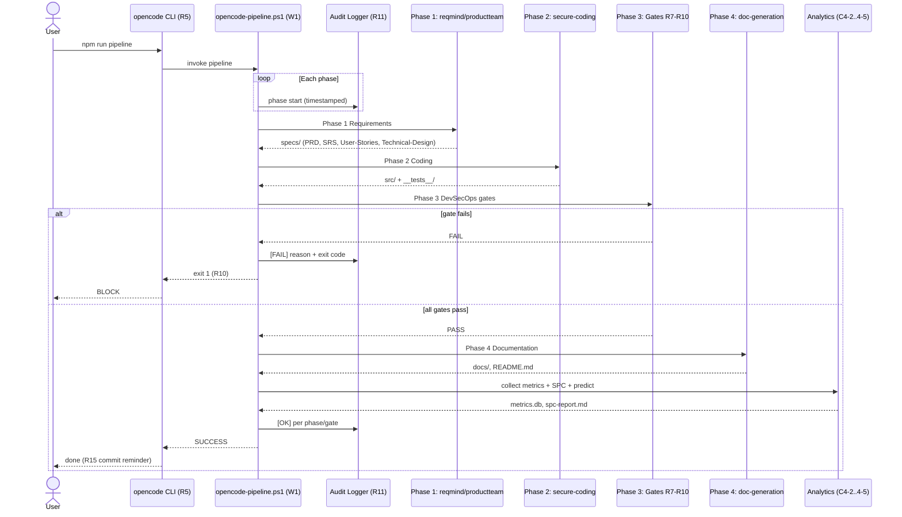
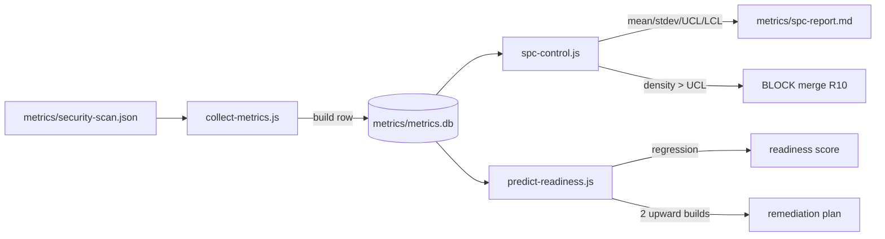
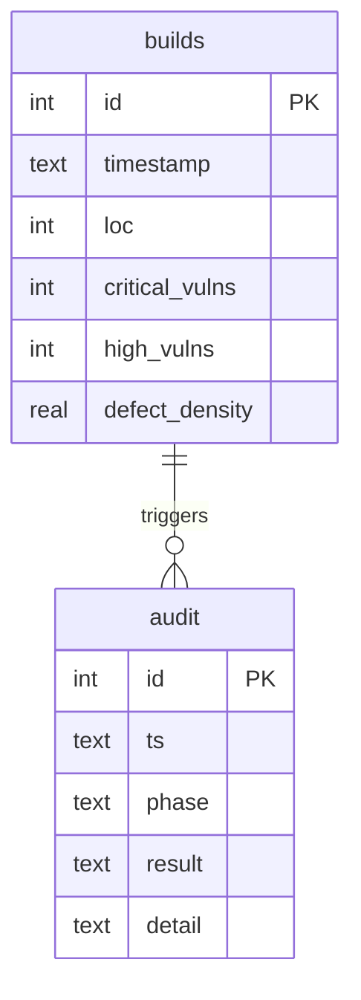

# Implementation Plan & Technical Design: CMMI Level 4 OpenCode DevSecOps Pipeline

**Status**: Approved | **Date**: 2026-08-09 | **Spec**: `specs/SRS.md`

**Input**: `specs/SRS.md` (FR-001..018, NFR-001..008), `specs/PRD.md`, `specs/User-Stories.md`
**Workflow**: Requirement clarification (R1) -> this design document (Class 2)

## Summary

A Windows-native, quantitatively managed software pipeline. OpenCode is the
single entry point (R5). A PowerShell orchestrator enforces the strict order
Requirements -> Coding -> DevSecOps -> Documentation (W1). Three independent
skills (requirement-gathering, secure-coding, doc-generation) plus `AGENTS.md`
implement separation of concerns (R4). Mandatory gates SAST (ESLint, R8), SCA
(`npm audit`, R9), and fail-on-error (R10) protect the delivery. Metrics are
collected per build into SQLite (C4-2) and controlled with 3-sigma SPC (C4-3);
readiness is predicted by linear regression with auto-remediation (C4-4, C4-5).
All actions are audited to `logs/audit.log` (R11).

## Technical Context

- **Language/Version**: Node.js LTS, npm, PowerShell 5.1
- **Primary Dependencies**:
  - Runtime: `sqlite3` (metrics storage), `mathjs` (statistics), `regression`
    (linear prediction)
  - Dev: `eslint`, `eslint-plugin-security`, `@eslint/js`, `jest`
  - External: `opencode` CLI, Ollama + local coder model (e.g., `qwen2.5-coder`),
    local plugins (product-team, speckit)
- **Storage**: SQLite (`metrics/metrics.db`); logs (`logs/audit.log`)
- **Testing**: Jest (`npx jest --coverage`)
- **Target Platform**: Windows 10/11 (PowerShell 5.1+); no WSL/cloud dependency
- **Project Type**: CLI pipeline (npm scripts + PowerShell orchestrator) with
  OpenCode plugins, skills, and analytics scripts
- **Performance Goals**: Cycle time std dev < 2 min; pipeline gate latency minimal
- **Constraints**:
  - Workflow order W1 is non-negotiable; gates R7-R11 are mandatory and block
  - Local-first, free/open-source only (R6)
  - Defect density (Crit+High/KLOC) <= 0.5; build stability >= 98% (rolling 10)
- **Scale/Scope**: Single-project repo; ~1 build/minute cadence; 4 phases per run

## Constitution Check

*GATE: Must pass before Phase 0 research. Re-checked after Phase 1 design.*

Governing document: `AGENTS.md` (project charter). Compliance matrix:

| Charter Clause | Design Status | Verdict |
| :--- | :--- | :--- |
| W1 strict order | Orchestrator enforces phase sequence | PASS |
| C4-1 quantitative goals | Metrics targets defined and measured | PASS |
| C4-2 measurement | `collect-metrics.js` -> metrics.db | PASS |
| C4-3 SPC (3-sigma UCL/LCL) | `spc-control.js` | PASS |
| C4-4 prediction | `predict-readiness.js` regression | PASS |
| C4-5 proactive action | Auto-remediation in `predict-readiness.js` | PASS |
| R4 separation of concerns | 3 skills + AGENTS.md | PASS |
| R7-R11 security gates | Pipeline gates mandatory | PASS |
| R12/R13 artifacts | AGENTS.md + SKILL.md files present | PASS |
| C4-6 import safety | `tools/*.js` import-safe guard (require.main) | PASS |

No violations; no complexity justification required.

## Architecture

### Component Diagram

Figure 1 - Component diagram of the pipeline (FR-001, FR-002, FR-003)


### Pipeline Phase Gate Logic

Figure 2 - Phase 3 DevSecOps gate flow (R7-R10)

```mermaid
flowchart TD
    A[Phase 2 Coding complete] --> B{R7 Runtime<br/>manual checks}
    B -->|not verified| FAIL[FAIL exit 1]
    B -->|verified| C{R8 SAST<br/>npx eslint . --max-warnings 0}
    C -->|errors| FAIL
    C -->|clean| D{R9 SCA<br/>npm audit --audit-level=high}
    D -->|vulns| FAIL
    D -->|clean| E{R10 Gate decision}
    E -->|any gate failed| FAIL
    E -->|all green| OK[Proceed Phase 4]
    FAIL --> AUD1[audit.log [FAIL] timestamped]
    OK --> AUD2[audit.log [OK] timestamped]
```

### Sequence Diagram (Primary Flow)

Figure 3 - Sequence diagram of the primary flow (FR-001, FR-002, FR-011)



### Analytics Subsystem

- **C4-2 `collect-metrics.js`**: reads `metrics/security-scan.json`, computes
  `defect_density = (critical + high) / (loc / 1000)`, inserts a build row.
- **C4-3 `spc-control.js`**: reads build history, computes mean/stdev, sets
  `UCL = mean + 3*stdev`, `LCL = max(0, mean - 3*stdev)`; flags density > UCL
  as BLOCK (R10) and emits `metrics/spc-report.md`.
- **C4-4/5 `predict-readiness.js`**: least-squares regression on defect density;
  if 2 consecutive builds trend upward, auto-generates a remediation plan.

Figure 4 - Analytics data flow (C4-2..C4-5)



## Data Model (`metrics/metrics.db`)

Figure 5 - Entity-relationship diagram for metrics storage (C4-2)



Derived SPC quantities (computed, not stored): mean, stdev, UCL, LCL.
No PII, secrets, or credentials are ever stored.

## Contracts

### 1. Pipeline CLI (npm scripts)

| Script | Behavior |
| :--- | :--- |
| `npm run pipeline` | Phases 1-4 with all gates |
| `npm run pipeline:skipdocs` | Phases 1-3 (skip documentation) |
| `npm run pipeline:skipsecurity` | Phases 1-2, 4 (skip security gates) |
| `npm run spc` / `npm run predict` | Standalone SPC / prediction |

### 2. reqmind CLI (tools/reqmind.js)

```text
reqmind generate -i <input.md> -o <output.md>
```

Import-safe: CLI entry guarded by `if (require.main === module)` (C4-6).

### 3. ProductTeam plugin (productteam tool)

```text
args: { feature: string, context?: string }
-> writes specs/PRD.md, specs/User-Stories.md
```

### 4. speckit plugin (tool)

```text
actions: init | check | phase | version
phase reads workflow registry under .specify/workflows/
```

### 5. Skills (R4/R13)

Four independent SKILL.md workflows under `.opencode/skills/`; each produces
only its own class of artifacts.

## Phase 0: Research (resolved unknowns)

| Unknown | Decision | Rationale | Alternatives considered |
| :--- | :--- | :--- | :--- |
| npm plugin packages | Local plugins in `.opencode/plugins/` | published spec-kit packages unavailable | none |
| reqmind | Local CLI (`tools/reqmind.js`, linked `bin`) | No real package exists | none |
| Model | Ollama local coder model | Free, local-first (R6) | CodeLlama, DeepSeek-coder |

## Phase 1: Design (this document)

- **Project Structure**: documented above; existing scaffold conforms.
- **Interfaces/Contracts**: CLI + plugin + skills contracts documented above
  (project is primarily internal CLI).
- **Quickstart validation**: see `## Quickstart Validation Guide`.

## Risks & Mitigations

| Risk | Likelihood | Impact | Mitigation |
| :--- | :--- | :--- | :--- |
| npm audit vulnerabilities present | High | Security gate fails | Pin/adjust devDeps; documented in security-scan; tracked in metrics |
| Ollama/opencode CLI absent | Medium | Pipeline cannot start | Phase 1 error + audit entry; prerequisites documented |
| Metrics too sparse for SPC | Medium | SPC baseline weak | Baseline mode until min sample; warnings not hard blocks |
| No git installed | Medium | LOC + branch detection degrade | Defaults (LOC=100) documented |
| Non-import-safe tool in tools/ | Low | opencode crash at startup (C4-6) | deploy-global.ps1 refuses deployment; require.main guard |

## Quickstart Validation Guide

Prerequisites: Node.js LTS, npm deps installed, `opencode` CLI, Ollama running
with a local coder model, execution policy `RemoteSigned`.

```text
npm run lint            # expected: exit 0 (SAST gate green)
npm run audit           # expected: JSON report; gate fails while vulns remain
npm run spc             # expected: spc-report.md generated with UCL/LCL
npm run predict         # expected: readiness score + (optional) remediation
npm run pipeline        # expected: 4 phases in order; audit.log appended per phase
```

Success criteria: all four Class 1 artifacts exist (`specs/PRD.md`,
`specs/SRS.md`, `specs/User-Stories.md`, `specs/Technical-Design.md`), metrics
row inserted per build, SPC report generated, audit log non-empty.

## Done When

- [x] R1 requirement clarification executed with the real toolchain
- [x] `specs/idea.md`, `PRD.md`, `SRS.md`, `User-Stories.md` produced
- [x] `specs/Technical-Design.md` produced (this document)
- [ ] Phase 2 coding generates `src/` and `__tests__/`
- [ ] Phase 3 security gates fully green (vulnerabilities remediated)
- [ ] Phase 4 documentation generated
