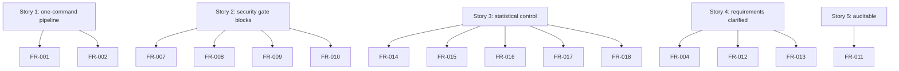
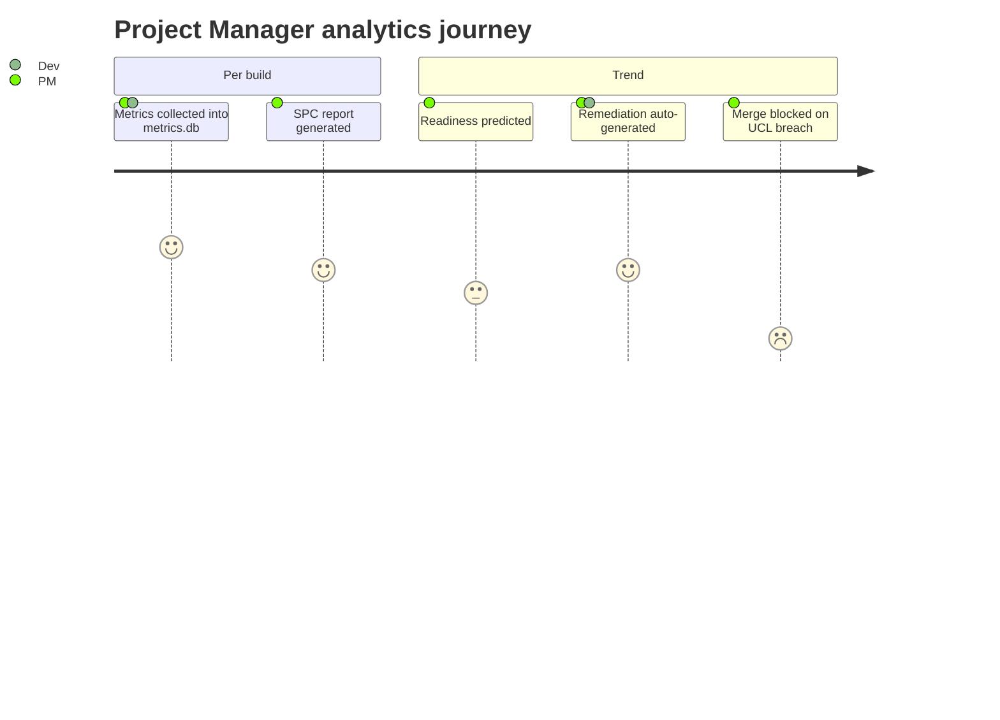

# User Stories - CMMI Level 4 OpenCode DevSecOps Pipeline

Each story maps to one or more functional requirements in `specs/SRS.md`.

Figure 1 - Story-to-FR mapping

## Story 1: Run the full pipeline with one command

**As a** developer,
**I want** to run `npm run pipeline` through OpenCode as the single entry point (R5),
**so that** requirements, coding, security checks, and documentation run in the
correct order automatically (W1).

**Maps to**: FR-001, FR-002

### Acceptance Criteria

- Given a ready project, When I invoke the pipeline, Then Phase 1 (Requirements)
  runs before Phase 2 (Coding), before Phase 3 (DevSecOps), before Phase 4
  (Documentation).
- Given an out-of-order invocation, When I attempt a later phase first, Then the
  pipeline blocks it with an error in `logs/audit.log` (R11).
- Given any phase failure, When a gate fails, Then the pipeline exits non-zero
  (R10) and the failure is recorded with a timestamp.

## Story 2: Security gate blocks vulnerable code

**As a** security engineer,
**I want** ESLint (SAST, R8) and `npm audit` (SCA, R9) to run as mandatory gates,
**so that** critical/high defects and known vulnerabilities never pass (R10).

**Maps to**: FR-007, FR-008, FR-009, FR-010

### Acceptance Criteria

- Given code with an ESLint error, When the SAST gate runs, Then the build fails.
- Given a dependency with a high/critical advisory, When the SCA gate runs, Then
  the build fails.
- Given a clean tree, When both gates run, Then the build proceeds and the results
  are written to `logs/audit.log` (R11).

## Story 3: See the process is statistically controlled

**As a** project manager,
**I want** defect density, build stability, and cycle time measured per build and
controlled with 3-sigma UCL/LCL (C4-2, C4-3),
**so that** I can prove CMMI Level 4 quantitatively-managed maturity (C4-1).

**Maps to**: FR-014, FR-015, FR-016, FR-017, FR-018

### Acceptance Criteria

- Given each completed build, When metrics are collected, Then a row is inserted
  into `metrics/metrics.db` (C4-2).
- Given a defect density above the UCL, When SPC runs, Then the pipeline blocks
  the merge (C4-3/R10) and writes a warning to `metrics/spc-report.md`.
- Given 2 consecutive builds trending upward, When prediction runs, Then a
  remediation plan is auto-generated (C4-5).

Figure 2 - User journey through the analytics loop (C4-2..C4-5)

## Story 4: Requirements are clarified before coding

**As a** product owner,
**I want** PRD, SRS, User-Stories, and Technical-Design generated in `specs/` (R1),
**so that** the team builds against agreed requirements and the design is
traceable (R11).

**Maps to**: FR-004, FR-012, FR-013

### Acceptance Criteria

- Given a feature idea in `specs/idea.md`, When the requirement workflow runs,
  Then `specs/PRD.md`, `specs/SRS.md`, `specs/User-Stories.md`, and
  `specs/Technical-Design.md` exist.
- Given an SRS requirement, When the design is reviewed, Then each FR/NFR is
  traceable to a source ID (R1/R11).

## Story 5: Every action is auditable

**As a** compliance auditor,
**I want** every pipeline phase and gate result appended to `logs/audit.log` (R11),
**so that** process execution is fully traceable.

**Maps to**: FR-011

### Acceptance Criteria

- Given any pipeline run, When phases and gates complete, Then timestamped audit
  lines exist for each one.
- Given a failing gate, When I inspect the log, Then the failure reason and exit
  code are present.

## Edge Cases

- Ollama is not running: pipeline reports a clear Phase 1/2 error and records it,
  without partial artifacts.
- Metrics DB locked/corrupt: collector recovers or fails gracefully with an
  audit entry (no silent data loss).
- Empty test suite: jest exits with "no tests found" but the gate treats it as
  a documented, non-silent state.
- First build (no history): SPC computes baseline mean but skips out-of-control
  judgment until a minimum sample exists.
