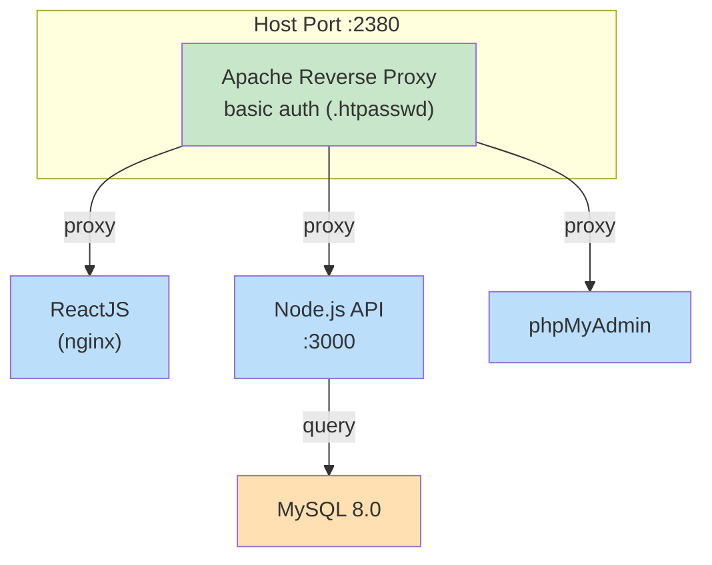

# Application Proxy Server

A Dockerized multi-tier application stack with an Apache reverse proxy front end,
ReactJS static frontend, Node.js API backend, MySQL database, and phpMyAdmin.
Includes a GitLab CI auto-merge pipeline (`dev-001 → dev → main`) for
controlled promotion across branches.

## Tech Stack

| Category | Technologies |
|:---------|:-------------|
| Reverse Proxy | `Apache` (htpasswd basic auth, vhost config) |
| Frontend | `ReactJS` (static build served by `nginx`) |
| API | `Node.js`, `Express` |
| Database | `MySQL` 8.0 |
| Admin UI | `phpMyAdmin` 5 |
| Orchestration | `Docker Compose` (custom bridge network) |
| CI/CD | `GitLab CI` (auto-merge cascade) |

## Architecture



All containers communicate over a dedicated `Docker` bridge network
(`prototype_application_proxy`, subnet `172.70.0.0/24`).

## Features

- **Apache reverse proxy** with HTTP basic auth — single entry point routing
  to ReactJS, Node.js API, and phpMyAdmin
- **ReactJS frontend** — static production build served via nginx
- **Node.js API** — Express backend with MySQL connection pooling
- **MySQL 8.0** with init script (`mysql/init.sql`) for schema bootstrap
- **phpMyAdmin** — web-based database administration
- **Health checks** — MySQL container health gate before API and phpMyAdmin start
- **GitLab CI auto-merge** — push to `dev-001` auto-merges to `dev`, then `main`

## Project Structure

```
application_proxy_server/
├── docker-compose.yml          # Service orchestration (5 containers)
├── .env.example                # Environment variable template
├── apache/
│   ├── Dockerfile              # Apache image build
│   ├── vhost.conf              # Virtual host + reverse proxy config
│   └── .htpasswd               # Basic auth credentials
├── reactjs/
│   ├── Dockerfile              # React build + nginx serve
│   ├── nginx.conf              # nginx static file config
│   ├── package.json
│   └── .dockerignore
├── nodejs/
│   ├── Dockerfile              # Node.js image build
│   ├── server.js               # Express API server
│   └── package.json
├── mysql/
│   └── init.sql                # Database schema initialization
├── .gitlab-ci.yml              # CI/CD auto-merge pipeline
└── README.md
```

## Installation
> [!NOTE]
>    Create the network card manually to prevent ip range collision!
> ```shell
> # Create the network card for the dockers
> docker network create -d bridge --subnet 172.70.0.0/24 prototype_application_proxy
> ```
```shell
# Create password for `admin`
htpasswd -c apache/.htpasswd admin
```
```shell
# Build all images, and then run the containers
docker compose build --no-cache
docker compose up -d --force-recreate
```
## CI/CD Pipeline (as in `.gitlab-ci.yml`)
### Workflow-1: local --(manual)--> branch:`dev-001` --(auto)--> branch:`dev` --(auto)--> branch:`main`
- Visualized Workflow

```mermaid
flowchart TD
    DEV001["🌿 dev-001 branch"]
    DEV["🌿 dev branch"]
    MAIN["🌿 main branch"]

    DEV001 -->|"git push / commit"| T1

    subgraph P1["Pipeline 1 — triggered by push to dev-001"]
        T1["Job: auto_merge_dev_001_to_dev<br/>(only: dev-001)"]
        T1 --> S1["1. apk add git"]
        S1 --> S2["2. git config user.name/email"]
        S2 --> S3["3. git remote set-url<br/>oauth2:GIT_PUSH_TOKEN"]
        S3 --> S4["4. git checkout dev"]
        S4 --> S5["5. git pull origin dev"]
        S5 --> S6["6. git merge origin/dev-001 --no-ff"]
        S6 --> S7["7. git push origin dev"]
    end

    S7 -->|"push commit to dev<br/>(via Project Access Token)"| DEV
    DEV -->|"push triggers new pipeline<br/>✅ PAT can trigger CI"| T2

    subgraph P2["Pipeline 2 — triggered by push to dev"]
        T2["Job: auto_merge_dev_to_main<br/>(only: dev)"]
        T2 --> U1["1. apk add git"]
        U1 --> U2["2. git config user.name/email"]
        U2 --> U3["3. git remote set-url<br/>oauth2:GIT_PUSH_TOKEN"]
        U3 --> U4["4. git checkout main"]
        U4 --> U5["5. git pull origin main"]
        U5 --> U6["6. git merge origin/dev --no-ff"]
        U6 --> U7["7. git push origin main"]
    end

    U7 -->|"push commit to main"| MAIN
    MAIN -->|"no further auto-merge job<br/>✅ chain terminates"| STOP["🛑 End of cascade"]

    style DEV001 fill:#c8e6c9
    style DEV fill:#bbdefb
    style MAIN fill:#ffe0b2
    style T1 fill:#e1bee7
    style T2 fill:#e1bee7
    style STOP fill:#ffcdd2
    style S7 fill:#dcedc8
    style U7 fill:#dcedc8
```

- Config:`.gitlab-ci.yml`
```yml
stages:
  - auto_merge

variables:
  GIT_STRATEGY: clone
  GIT_DEPTH: 0

# 当 dev-001 有提交时，合并 dev-001 到 dev
auto_merge_dev_001_to_dev:
  stage: auto_merge
  image: alpine:latest
  only:
    - dev-001
  resource_group: auto_merge   # 串行化合并操作，避免并发冲突
  script:
    - apk add --no-cache git
    - git config --global http.sslVerify false
    - git config user.name "HKO-GitLab CI"
    - git config user.email "ci@gitlab.hko.gov.hk"
    # TODO: Uncomment for Optioin 1
    # 使用 CI_JOB_TOKEN 推送（需确保 Job Token 有写权限）
    # - git remote set-url origin https://gitlab-ci-token:${CI_JOB_TOKEN}@${CI_SERVER_HOST}/${CI_PROJECT_PATH}.git
    - git remote set-url origin https://oauth2:${GIT_PUSH_TOKEN}@${CI_SERVER_HOST}/${CI_PROJECT_PATH}.git
    - git checkout dev
    - git pull origin dev
    - git merge origin/dev-001 --no-ff -m "Auto-merge dev-001 into dev"
    - git push origin dev

# 当 dev 有提交时，合并 dev 到 main
auto_merge_dev_to_main:
  stage: auto_merge
  image: alpine:latest
  only:
    - dev
  resource_group: auto_merge   # 与上一个 job 共用资源组，保证顺序执行
  script:
    - apk add --no-cache git
    - git config --global http.sslVerify false
    - git config user.name "HKO-GitLab CI"
    - git config user.email "ci@gitlab.hko.gov.hk"
    # TODO: Uncomment for Optioin 1
    # - git remote set-url origin https://gitlab-ci-token:${CI_JOB_TOKEN}@${CI_SERVER_HOST}/${CI_PROJECT_PATH}.git
    - git remote set-url origin https://oauth2:${GIT_PUSH_TOKEN}@${CI_SERVER_HOST}/${CI_PROJECT_PATH}.git
    - git checkout main
    - git pull origin main
    - git merge origin/dev --no-ff -m "Auto-merge dev into main"
    - git push origin main
#
# = = = = = = = = = = = = = = = = = = = = = = = = = = = = = = = = = = = = = = = = = = =
#
# Note: 启用 CI_JOB_TOKEN 推送权限（推荐）
#
# - Option 1: Safe but disabled `merge 'dev' to 'main'
#
# 启用 CI_JOB_TOKEN 推送权限（推荐）
#
# 配置步骤：
# 1. 进入你的项目：Settings → CI/CD → Job token permissions
# 2. 找到 "Allow Git push requests to the repository via CI job token" 选项
# 3. 勾选启用
# 4. 保存设置
#
# = = = = = = = = = = = = = = = = = = = = = = = = = = = = = = = = = = = = = = = = = = =
#
# - Option 2: Enabled `merge 'dev' to 'main' but may not be safe (infinite push)
#
# 用 Project Access Token
#
# ### 步骤 1：创建 Project Access Token
#
# 1. 进入项目：**Settings → Access Tokens**
# 2. 创建一个新 token：
#    - **Token name**: `auto-merge-token`（任意）
#    - **Expiration date**: 按需（可设较长）
#    - **Role**: `Maintainer`（或至少 Developer）
#    - **Scopes**: 勾选 **`write_repository`**（必须）和 **`api`**（可选）
# 3. 点击创建，**复制 token 值**（只显示一次）
#
# ### 步骤 2：添加为 CI/CD 变量
#
# 1. 进入 **Settings → CI/CD → Variables**
# 2. 添加新变量：
#    - **Key**: `GIT_PUSH_TOKEN`
#    - **Value**: 粘贴上面的 token
#    - **Type**: `Variable`
#    - **勾选** `Masked`（防止日志泄露）
#    - **勾选** `Protected`（仅当分支为 protected 时才需要；如果 `dev-001` 不是 protected 分支，**不要勾选**，否则该变量在 `dev-001` 的 pipeline 中不可用）
#
# ### 步骤 3：修改 `.gitlab-ci.yml`
#
# 把两个 job 里的 remote URL 改成用 `GIT_PUSH_TOKEN`：
#
# ```yaml
# - git remote set-url origin https://oauth2:${GIT_PUSH_TOKEN}@${CI_SERVER_HOST}/${CI_PROJECT_PATH}.git
# ```
#
# = = = = = = = = = = = = = = = = = = = = = = = = = = = = = = = = = = = = = = = = = = =
#
```
