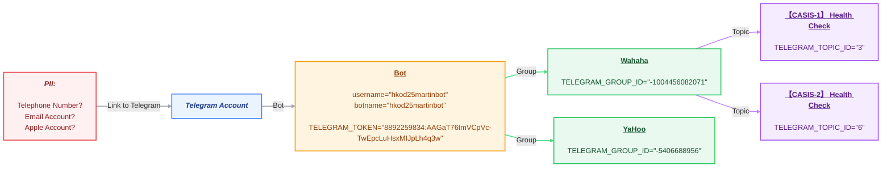

# Assistance - Monitoring Alert (Telegram.Sender)
## Installation
> [!IMPORTANT]
> Run under `telegram/`:
> ```shell
> docker-compose build --no-cache \
>   && docker-compose up -d
> ```

> [!CAUTION]
> Running this code will permanently destroy both the container and image. Proceed with care.
> 
> ```shell
> docker rm -f monitoring-alert-telegram \
>   && docker rmi monitoring-alert-telegram
> ```
### Telegram Account


### FAQ
---
#### How to query all accumulated records from `MongoDB`?
Run:
```shell
docker exec -it monitoring-alert-telegram mongosh --quiet --eval "db.getSiblingDB('telegram_bot').raw_updates.find().pretty()"
```
---
#### How to set up Telegram channel(s)?
##### Workflow:
1. Setup a bot via `@BotFather` via `username` and `botname`, and then retrieve `TELEGRAM_TOKEN`
2. Create group(s) with topics disabled or enabled (with `username` added to the group(s))
- for `Group(s) with topics disabled`: Send `/start-hko-d2` as the first message
- for `Group(s) with topics enabled`: Create topics in the group(s), and then send `/start-hko-d2` as the first message
##### Details:
###### How to get "API Token"?
1. Get a device, e.g. Mobile.
2. Install Telegram.
3. Click `Start` or type `/start` in `@BotFather`, and then fill in "botname" and "username" respectively.
4. Type `/mybots` -> Select "{username}" -> Select "API Token" -> Jot down "API Token".
5. Run `curl https://api.telegram.org/bot{API_TOKEN}/getUpdates` to verify the bot working properly.
```json
// failure
{
    "ok": false,
    "error_code": 401,
    "description": "Unauthorized"
}
```
```json
// success
{
    "ok": true,
    "result": [
        // ...
    ]
}
```

---

###### How to create a `group`?
1. Click the collapse bar on topright corner
2. Click "New Group"
3. Create group with "username" with a "group name"

---

###### How to enable `topic` on a `group`?
1. Click "group name" on top center
2. Click "edit" on top right corner
3. Click "Topic"
4. Enable "Topic"
5. Select "List"

---

###### How to add `topic` to a `group` enabled `topic`?

---

###### How to allow "API Token" to send message to a `group`?
1. Click the collapse bar on topright corner, and then click "New Group", and then create group with "" with a "group name".
2. Add "botname" as a member into this group.

---

###### How to query for the `group id` or `topic id`?
- Testcase(s):
```shell
root@hkss13:/home/snd2/monitoring-alert/telegram# docker exec -it monitoring-alert-telegram python3 GetIDTelegram.py 8892259834:AAGaT76tmVCpVc-TwEpcLuHsxMIJpLh4q3w
[
  {
    "title": "WaHaHa",
    "id": -1004456082071,
    "type": "supergroup",
    "topics": [
      {
        "title": "【CASIS-1】 Health Check",
        "id": 3
      },
      {
        "title": "【CASIS-2】 Health Check",
        "id": 6
      },
      {
        "title": "Trash",
        "id": 10
      },
      {
        "title": "Trash",
        "id": 12
      }
    ]
  },
  {
    "title": "YaHoo",
    "id": -5406688956,
    "type": "group",
    "topics": []
  }
]
```
- Scripts(s): [GetIDTelegram.py](app/GetIDTelegram.py)
```shell
root@hkss13:/home/snd2/monitoring-alert/telegram# realpath GetIDTelegram.py 
/home/snd2/monitoring-alert/telegram/GetIDTelegram.py
```
> **Note:** Capabilities → Reflective in `Python` output
>:white_circle: Add member followed by sending `/start-hko-d2` from any group
>:white_circle: Drop member from any group
>:white_circle: Add back the member to the group

> **Note:** Limitations → Non-reflective in `Python` output
>:red_circle: Disable topic
>:red_circle: Delete topic
---

###### How to truly send meesage to "group name" on behalf of "botname"?
- Testcase(s) - Group (with topics `disabled`) --> Disseminate `per group`
```shell
root@hkss13:/home/snd2/monitoring-alert/telegram# docker exec -it monitoring-alert-telegram python3 SendTelegram.py "TELEGRAM_TOKEN=8892259834:AAGaT76tmVCpVc-TwEpcLuHsxMIJpLh4q3w" "TELEGRAM_GROUP_ID=-5406688956" "TELEGRAM_TOPIC_ID=" "SEND_MESSAGE=Group (disabled topics) as 'YaHoo'"
📨 嘗試發送至主聊天（即 #General 主題）
✅ 傳送成功 (訊息ID: 49)
```
- Testcase(s) - Group (with topics `enabled`) --> Disseminate `per topic`
```shell
root@hkss13:/home/snd2/monitoring-alert/telegram# docker exec -it monitoring-alert-telegram python3 SendTelegram.py "TELEGRAM_TOKEN=8892259834:AAGaT76tmVCpVc-TwEpcLuHsxMIJpLh4q3w" "TELEGRAM_GROUP_ID=-1004456082071" "TELEGRAM_TOPIC_ID=" "SEND_MESSAGE=Group (enabled topics) as 'WaHaHa' - General"
📨 嘗試發送至主聊天（即 #General 主題）
✅ 傳送成功 (訊息ID: 14)
```
```shell
root@hkss13:/home/snd2/monitoring-alert/telegram# docker exec -it monitoring-alert-telegram python3 SendTelegram.py "TELEGRAM_TOKEN=8892259834:AAGaT76tmVCpVc-TwEpcLuHsxMIJpLh4q3w" "TELEGRAM_GROUP_ID=-1004456082071" "TELEGRAM_TOPIC_ID=3" "SEND_MESSAGE=Group (enabled topics) as 'WaHaHa' -【CASIS-1】 Health Check"
📨 嘗試發送至主題 ID: 3
✅ 傳送成功 (訊息ID: 15)
   ⚠️ 請確認訊息是否出現在對應主題中；若未出現，請檢查主題ID是否正確。
   ```
```shell
root@hkss13:/home/snd2/monitoring-alert/telegram# docker exec -it monitoring-alert-telegram python3 SendTelegram.py "TELEGRAM_TOKEN=8892259834:AAGaT76tmVCpVc-TwEpcLuHsxMIJpLh4q3w" "TELEGRAM_GROUP_ID=-1004456082071" "TELEGRAM_TOPIC_ID=6" "SEND_MESSAGE=Group (enabled topics) as 'WaHaHa' -【CASIS-2】 Health Check"
📨 嘗試發送至主題 ID: 6
✅ 傳送成功 (訊息ID: 16)
   ⚠️ 請確認訊息是否出現在對應主題中；若未出現，請檢查主題ID是否正確。
```
```shell
root@hkss13:/home/snd2/monitoring-alert/telegram# docker exec -it monitoring-alert-telegram python3 SendTelegram.py "TELEGRAM_TOKEN=8892259834:AAGaT76tmVCpVc-TwEpcLuHsxMIJpLh4q3w" "TELEGRAM_GROUP_ID=-1004456082071" "TELEGRAM_TOPIC_ID=17" "SEND_MESSAGE=Group (enabled topics) as 'WaHaHa' -【Testcase-2026.08.28】 Health Check"
📨 嘗試發送至主題 ID: 17
✅ 傳送成功 (訊息ID: 20)
   ⚠️ 請確認訊息是否出現在對應主題中；若未出現，請檢查主題ID是否正確。
```
- Scripts(s): [SendTelegram.py](app/SendTelegram.py)
```shell
root@hkss13:/home/snd2/monitoring-alert/telegram# realpath SendTelegram.py 
/home/snd2/monitoring-alert/telegram/SendTelegram.py
```
---
###### How to reset webhook manually? (:warning: Cautious: Non-recoverable)
```shell
ccmak@dolphin2-d2vm:~$ curl "https://api.telegram.org/bot8892259834:AAGaT76tmVCpVc-TwEpcLuHsxMIJpLh4q3w/getUpdates?offset=-1" | python3 -m json.tool
{
    "ok": true,
    "result": [
        {
            "update_id": 563141482,
            "message": {
                "message_id": 41,
                "from": {
                    "id": 8641051574,
                    "is_bot": false,
                    "first_name": "Mcc",
                    "last_name": "Mak"
                },
                "chat": {
                    "id": -5457807547,
                    "title": "Google D2",
                    "type": "group",
                    "all_members_are_administrators": false
                },
                "date": 1787825472,
                "text": "/start-hko-d2",
                "entities": [
                    {
                        "offset": 0,
                        "length": 6,
                        "type": "bot_command"
                    }
                ]
            }
        }
    ]
}
```