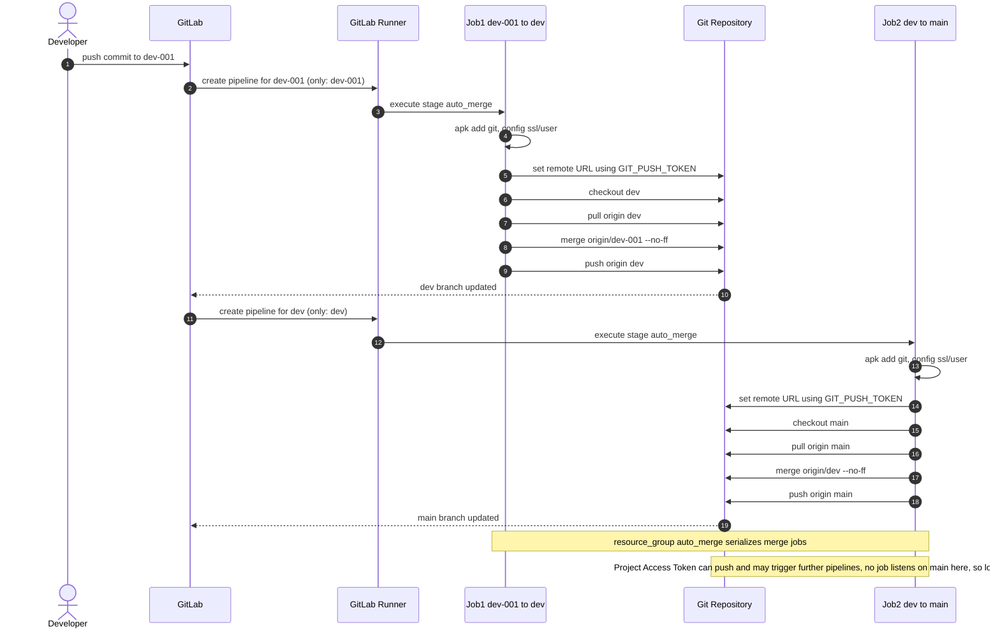
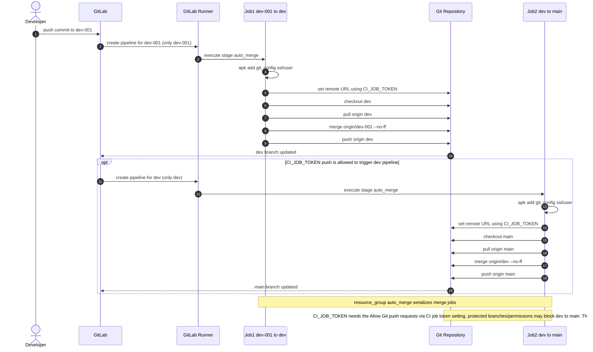
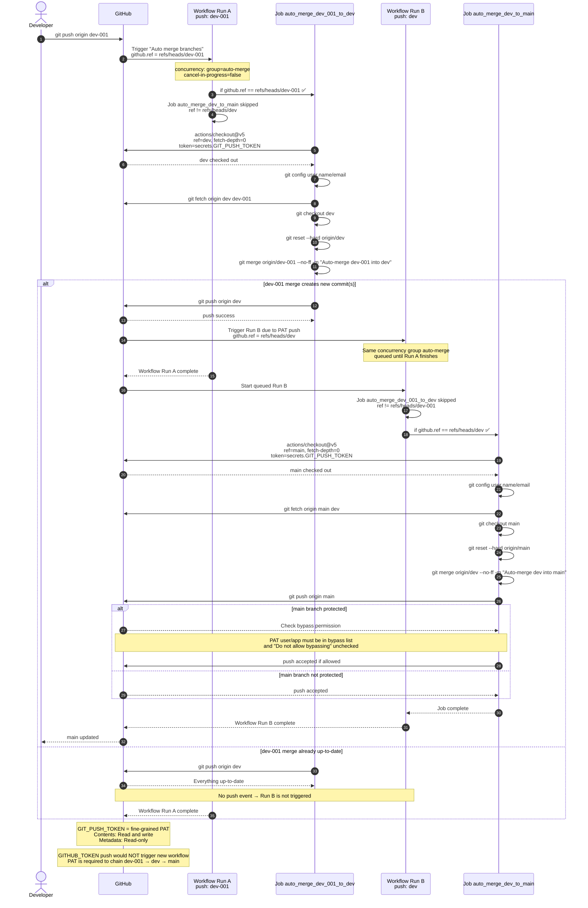
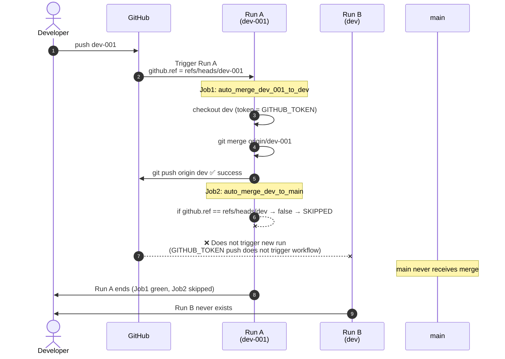

# CI/CD Pipeline (Configuration)
## Configuration Files
### GitLab
- **GitLab:** [Auto-merge: `dev-001` to `dev` to `main`](gitlab/auto-merge-dev-001-to-dev-to-main/.gitlab-ci.yml)

- **GitLab:** [Auto-merge: `dev-001` to `dev`](gitlab/auto-merge-dev-001-to-dev/.gitlab-ci.yml)

### GitHub
- **GitHub:** [Auto-merge: `dev-001` to `dev` to `main`](github/auto-merge-dev-001-to-dev-to-main/.github-ci.yml)

- **GitHub:** [Auto-merge: `dev-001` to `dev`](github/auto-merge-dev-001-to-dev/.github-ci.yml)

