## Session 6 – Risk Assessment and Threat Modeling

### Quantitative Risk Analysis Formulas (SLE, ALE, ARO, EF)

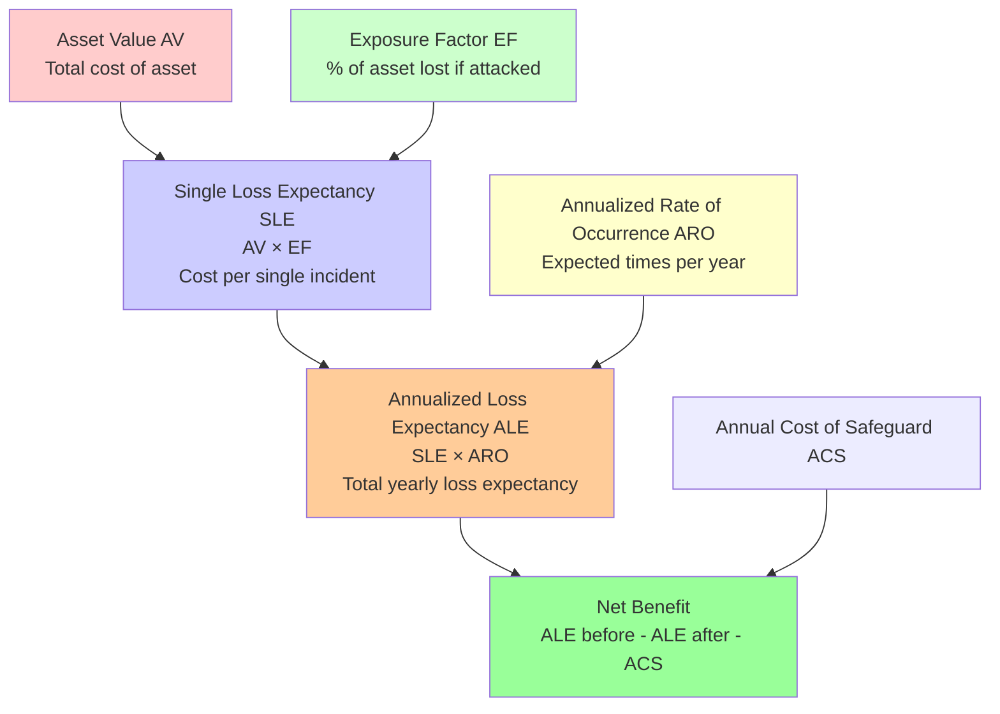

### Qualitative Risk Analysis – Delphi Technique

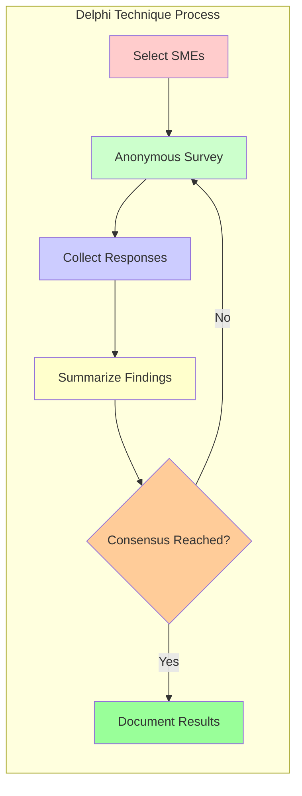

### Hybrid Risk Assessment

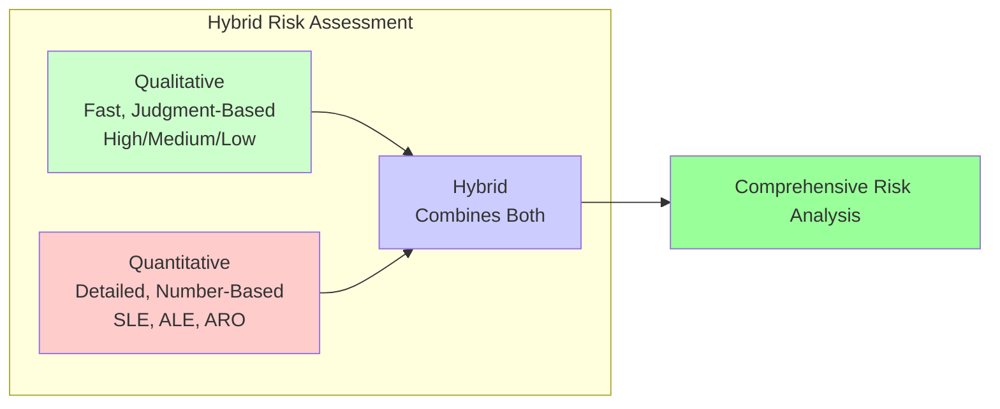

### Privacy Control Assessment – PTA, PIA, PCA (PDCA)

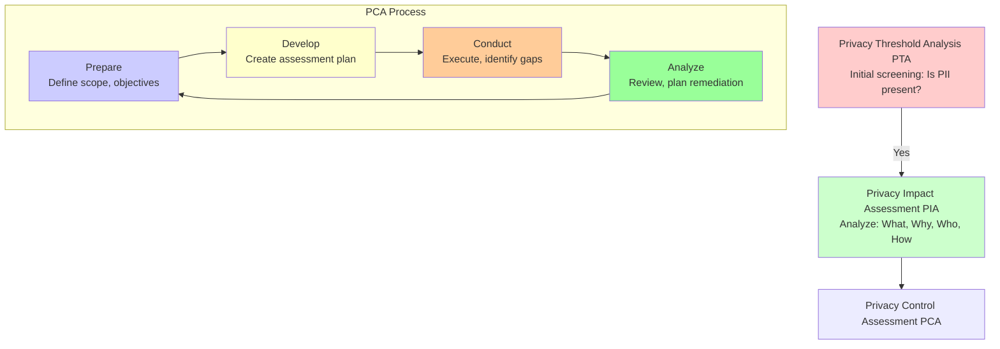

### PCI DSS Assessment – ROC, SAQ, Merchant Levels

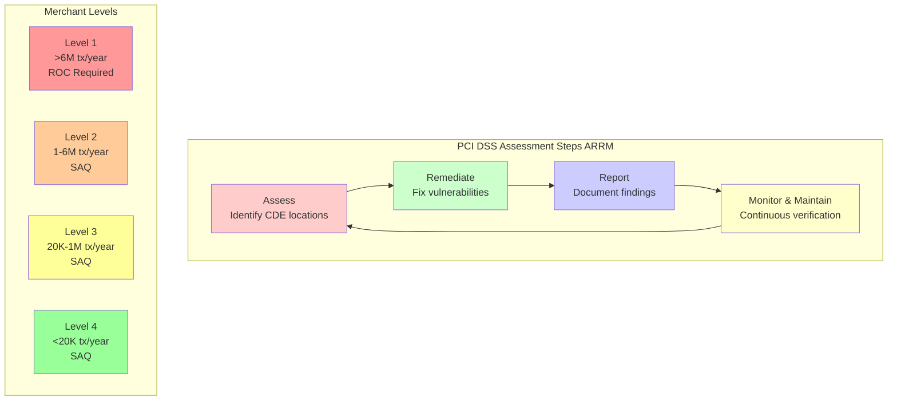

### Threat Modeling Methodologies – STRIDE, PASTA, OCTAVE, TRIKE, VAST

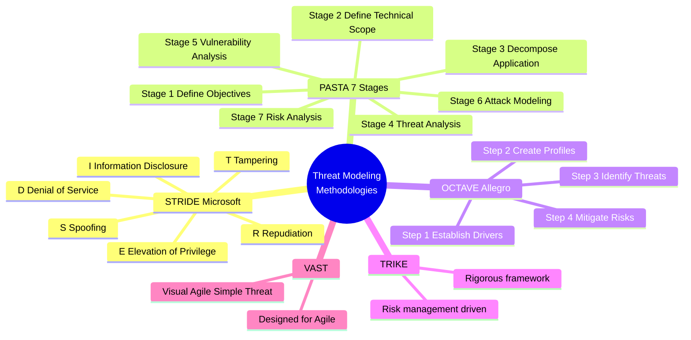

---

## Session 7 – Asset Security

### Data Classification Levels – National Security vs. Civilian

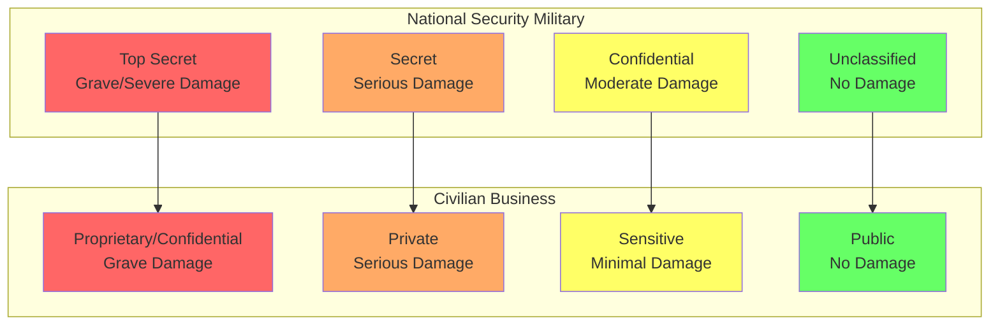

### Asset Classification Tiers

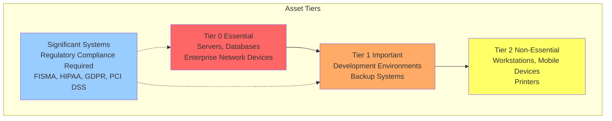

### Marking vs. Labeling

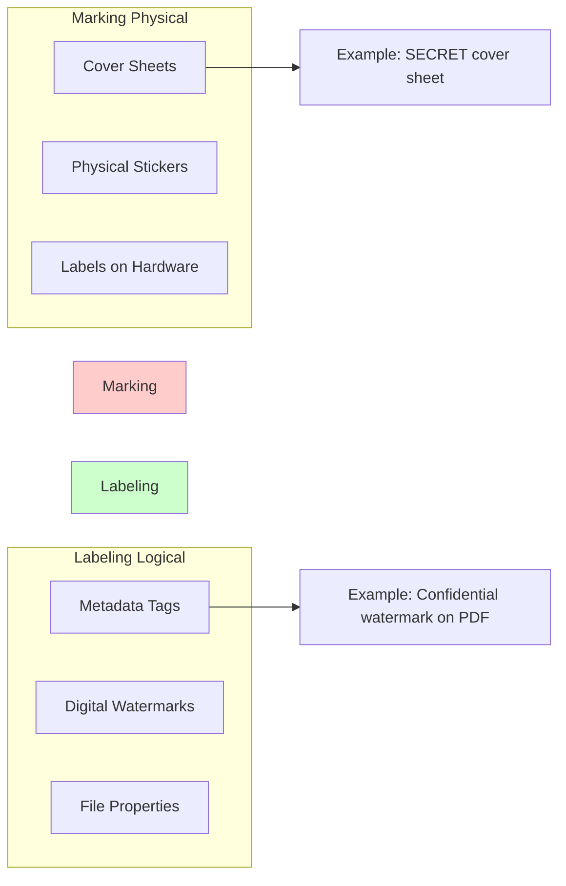

### Data States – In Use, In Transit, At Rest

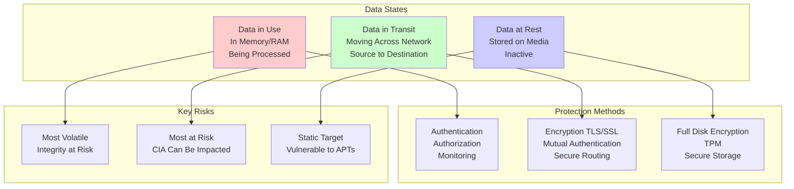

### Information System Lifecycle – NIST SP 800-64

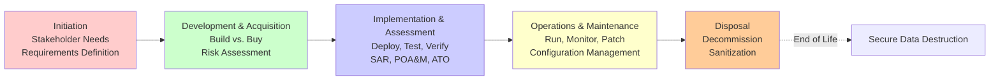

---

## Session 8 – Data Security Controls

### DRM Methods – HDCP, AACS, ADEPT

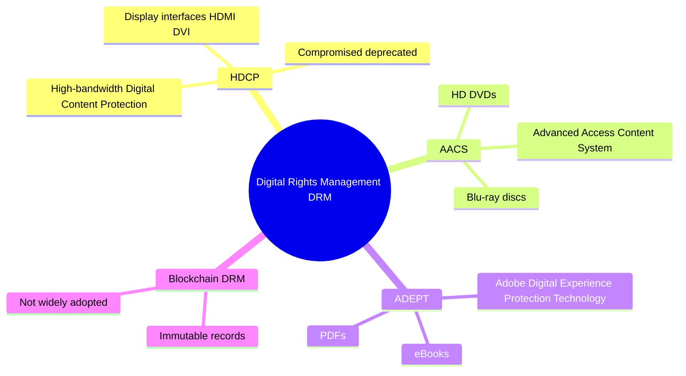

### DLP Types – Network DLP vs. Endpoint DLP

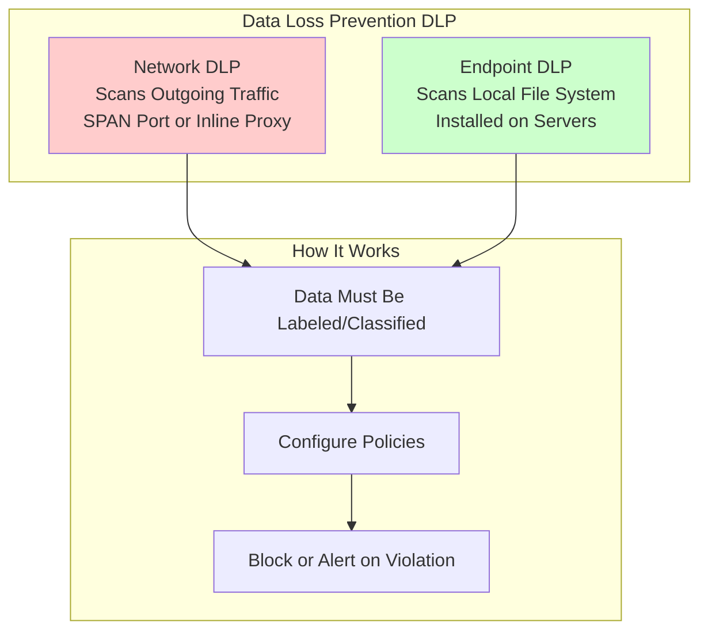

### CASB Functions

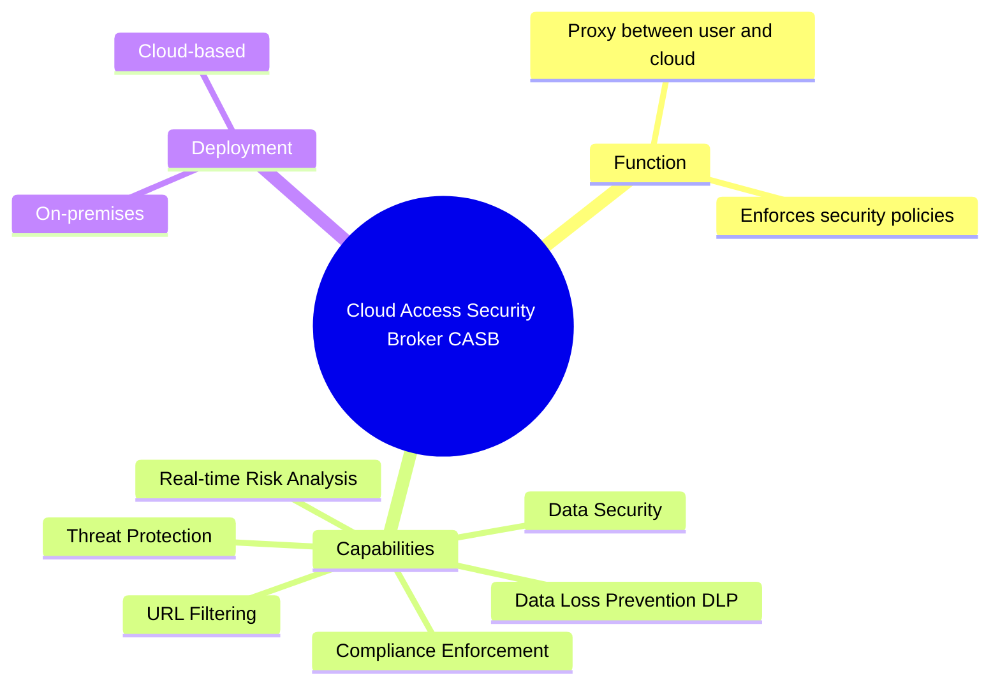

### Data Remanence – Clearing, Purging, Sanitization

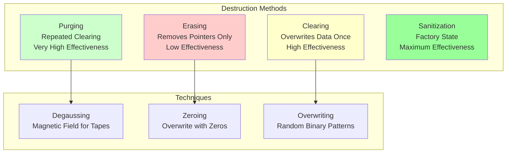

### Declassification Techniques

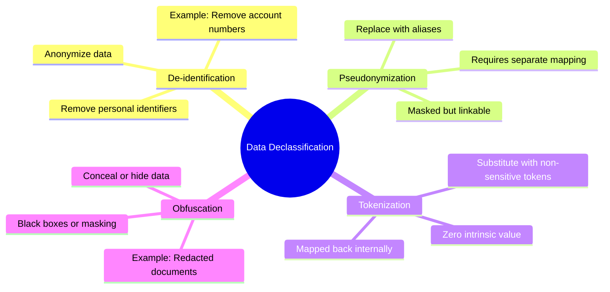

---

## Session 9 – Secure Design Principles

### Confusion and Diffusion

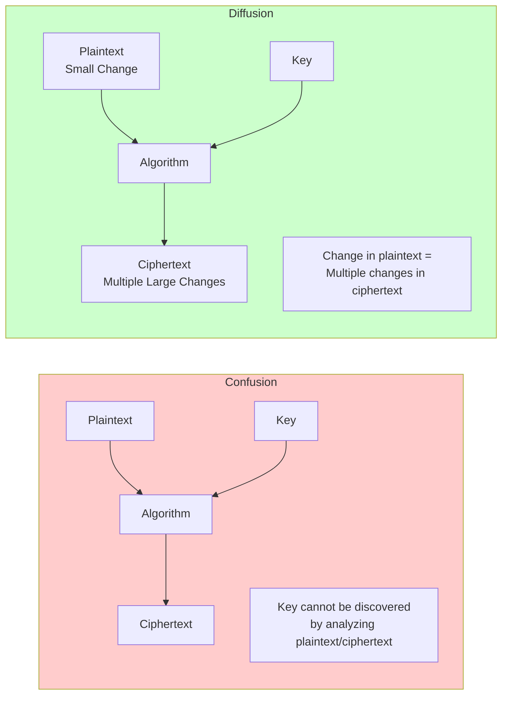

### Kerckhoffs's Principle

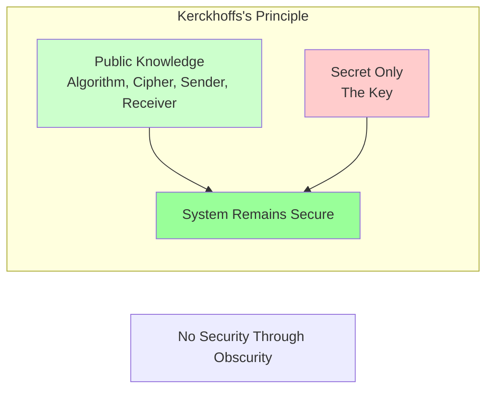

### Cryptographic Lifecycle Steps

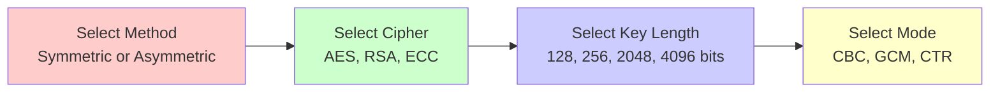

---

## Session 10 – Secure Architecture Design

### Common Criteria – EAL Levels

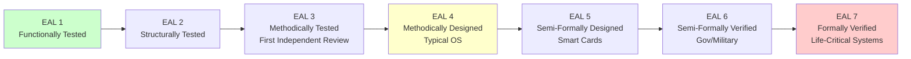

### ICS Components – PLC, DCS, SCADA

```mermaid
graph TD
    subgraph ICS Components
        PLC[PLC<br/>Programmable Logic Controller<br/>Digital Computer<br/>Automation Control]
        DCS[DCS<br/>Distributed Control System<br/>Same Facility<br/>Gathers Operational Data]
        SCADA[SCADA<br/>Supervisory Control<br/>Data Acquisition<br/>Networked Control]
    end
    
    subgraph SCADA Subcomponents
        RTU[RTU<br/>Remote Terminal Unit<br/>Connects to Sensors via RF]
        HMI[HMI<br/>Human Machine Interface<br/>Operator Control]
        DNP[DNP3<br/>Distributed Network Protocol<br/>Open Standard]
        IED[IED<br/>Intelligent Electronic Device<br/>Data Collection]
    end
    
    SCADA --> RTU
    SCADA --> HMI
    RTU --> DNP
    IED --> RTU
    
    style PLC fill:#ffcccc
    style DCS fill:#ccffcc
    style SCADA fill:#ccccff
```

### Microservices Architecture – API Gateway, Service Mesh

```mermaid
graph TD
    Client[Client<br/>Mobile/Web] --> API[API Gateway]
    
    subgraph Service Mesh
        Control[Control Plane<br/>Policies & Monitoring]
        Data[Data Plane<br/>Sidecar Proxies]
    end
    
    API --> Control
    Control --> Data
    
    Data --> Service1[Microservice 1<br/>Database Access]
    Data --> Service2[Microservice 2<br/>Authentication]
    Data --> Service3[Microservice 3<br/>Messaging]
    
    subgraph Security Measures
        Keys[API Keys<br/>Non-sensitive]
        Tokens[Authentication Tokens<br/>JWT, SAML, OAuth]
        Monitoring[Traffic Monitoring]
    end
    
    API --> Keys
    API --> Tokens
    API --> Monitoring
    
    style API fill:#ffcccc
    style Control fill:#ccffcc
    style Data fill:#ccccff
```

### Embedded Systems Attacks and Defenses

```mermaid
mindmap
  root((Embedded Systems))
    Attack Types
      User Interface
        Brute force inputs
        Privilege escalation
      Physical
        Manipulate inputs
        Steal device
        Deny service
      Sensor
        Trick sensors
        Example: Vending machine
      Output
        Manipulate actuators
        Example: Electronic door locks
      Processor
        Target memory or CPU
      Firmware
        Exploit vulnerabilities
        Install rogue firmware
    Defense Strategies
      Threat Modeling
      Traffic Isolation
      Application Firewall
      Defense in Depth
      Wrapping/Encapsulation
        TCP wrappers
      Manual Updates
      Digital Signatures
      Redundancy
      Continuous Monitoring
```

### HPC Security

```mermaid
mindmap
  root((High-Performance Computing HPC))
    Challenges
      Large Footprint
        Up to 10 million CPU cores
      Energy Consumption
        Requires generators UPS
      Data Separation
        Complex access control
      Geographical Dispersion
        Global users
        Import/export laws
      Unreviewed Code
        R&D code risks
    Security Measures
      Threat Modeling
      Data Isolation
      Hardware Security
        Trusted execution
      Multi-Factor Authentication
      Identity Management
      Compliance with NIST OWASP
```

### Edge Computing

```mermaid
mindmap
  root((Edge Computing))
    Benefits
      Increased Data Availability
      Better Network Performance
        Reduced bandwidth
        Cached locally
      Improved Data Protection
        Minimizes internet sharing
    Risks
      Physical Tampering
      Poor Security on IoT
      Complex Security Baselines
      Limited Remote Management
      Potential Attack Vectors
    Best Practices
      Follow NIST OWASP
      Create Security Policies
      Change Default Credentials
      Regular Firmware Updates
      Remove Unnecessary Services
      Network Segmentation VLANs
```

---

## Session 11 – Virtualization and Cloud Computing

### Type 1 vs. Type 2 Hypervisors

```mermaid
graph TD
    subgraph Type 1 Bare Metal
        HW1[Hardware]
        HV1[Type 1 Hypervisor<br/>ESXi, Xen, vSphere]
        VM1[Virtual Machines]
        OS1[Guest OS]
    end
    
    subgraph Type 2 Hosted
        HW2[Hardware]
        OS2[Host OS<br/>Windows/Linux/macOS]
        HV2[Type 2 Hypervisor<br/>VirtualBox, Workstation Player]
        VM2[Virtual Machines]
        OS3[Guest OS]
    end
    
    HW1 --> HV1 --> VM1 --> OS1
    HW2 --> OS2 --> HV2 --> VM2 --> OS3
    
    style HV1 fill:#ccffcc
    style HV2 fill:#ffffcc
```

### VM Escaping

```mermaid
graph LR
    subgraph VM Escape Attack
        VM[Virtual Machine<br/>Guest OS]
        HV[Hypervisor]
        Host[Host OS]
        Attacker[Attacker] -->|Bypass| VM
        VM -.->|Escape| HV
        HV -.->|Control| Host
    end
    
    style VM fill:#ffcccc
    style HV fill:#ffffcc
    style Host fill:#ff9999
```

### Containerization vs. VMs

```mermaid
graph TD
    subgraph Virtual Machines
        HW_VM[Hardware]
        HV_VM[Hypervisor]
        OS_VM1[Guest OS 1]
        OS_VM2[Guest OS 2]
        App1[App A]
        App2[App B]
    end
    
    subgraph Containers
        HW_Cont[Hardware]
        OS_Cont[Host OS]
        Engine[Container Engine<br/>Docker]
        C1[Container 1]
        C2[Container 2]
        AppC1[App A]
        AppC2[App B]
    end
    
    HW_VM --> HV_VM
    HV_VM --> OS_VM1 --> App1
    HV_VM --> OS_VM2 --> App2
    
    HW_Cont --> OS_Cont --> Engine
    Engine --> C1 --> AppC1
    Engine --> C2 --> AppC2
    
    style HV_VM fill:#ffcccc
    style Engine fill:#ccffcc
```

### Cloud Deployment Models

```mermaid
graph TD
    subgraph Cloud Deployment Models
        Public[Public Cloud<br/>Available to General Public<br/>Internet-Facing<br/>Large Attack Surface]
        Private[Private Cloud<br/>Single Organization<br/>Contained Risk<br/>Internal Threats]
        Community[Community Cloud<br/>Shared by Organizations<br/>SLA Governed<br/>Mix of Threats]
        Hybrid[Hybrid Cloud<br/>Combination of Models<br/>Public + Private Common<br/>Multiple Attack Vectors]
    end
    
    style Public fill:#ffcccc
    style Private fill:#ccffcc
    style Community fill:#ccccff
    style Hybrid fill:#ffffcc
```

### Cloud Service Models – Shared Responsibility

```mermaid
graph TD
    subgraph IaaS Infrastructure as a Service
        IaaS_Cust[Customer: OS, Apps, IAM, Data]
        IaaS_Provider[Provider: Hardware, Hypervisor, Network]
    end
    
    subgraph PaaS Platform as a Service
        PaaS_Cust[Customer: Apps, IAM, Data]
        PaaS_Provider[Provider: Hardware, OS]
    end
    
    subgraph SaaS Software as a Service
        SaaS_Cust[Customer: Access Controls, Data]
        SaaS_Provider[Provider: Application down to Hardware]
    end
    
    IaaS_Cust --> PaaS_Cust --> SaaS_Cust
    IaaS_Provider --> PaaS_Provider --> SaaS_Provider
    
    Note[Responsibility shifts from Customer to Provider]
    
    style IaaS_Cust fill:#ffcccc
    style PaaS_Cust fill:#ffffcc
    style SaaS_Cust fill:#ccffcc
```

### VPC Components

```mermaid
graph TD
    subgraph VPC Virtual Private Cloud
        Subnets[Subnets<br/>Logical Isolation]
        RouteTables[Route Tables<br/>Traffic Paths]
        SecurityGroups[Security Groups<br/>Virtual Firewalls<br/>Instance Level]
        NACLs[Network ACLs<br/>Subnet-Level Firewall<br/>Stateless]
    end
    
    subgraph Connections
        Direct[Direct Connect<br/>Dedicated Circuit]
        Peering[Peering<br/>Connect VPCs]
        VPN[VPN Connection<br/>Secure Tunnel]
    end
    
    style Subnets fill:#ffcccc
    style SecurityGroups fill:#ccffcc
    style NACLs fill:#ccccff
```

### Serverless Computing – FaaS, Risks, Mitigations

```mermaid
mindmap
  root((Serverless Computing<br/>Function as a Service))
    Benefits
      No infrastructure management
      Faster development
      Cost-effective pay per use
      Automatic scaling
    Risks
      Expanded Attack Surface
      Traditional security tools ineffective
      Performance cold starts
      Reduced control
      Data security challenges
    Mitigations
      Define responsibilities in SLA
      Minimize code size
      Limit sensitive data
      Architecture design for CIA
```

---

## Session 12 – Cryptographic Solutions

### Digital Signature Standards

```mermaid
mindmap
  root((Digital Signature Standards))
    FIPS 186-4
      US government approved
    DSA
      Digital Signature Algorithm
      Based on ElGamal
      Signatures only
      Slower
    RSA DSA
      ANSI X9.31
      Versatile
      Encryption key distribution signatures
    ECDSA
      ANSI X9.60
      Elliptic Curve
      More efficient
      Shorter keys
```

### HMAC – Hashed Message Authentication Code

```mermaid
graph LR
    subgraph HMAC Process
        Message[Message] --> Hash[Hash Function<br/>SHA-2 or SHA-3]
        Key[Shared Secret Key] --> Hash
        Hash --> HMAC[HMAC<br/>Partial Digital Signature]
    end
    
    subgraph Provides
        HMAC --> Integrity[Integrity Only]
        HMAC -.->|No| NonRep[Non-Repudiation]
    end
    
    style HMAC fill:#ccccff
    style Integrity fill:#ccffcc
    style NonRep fill:#ffcccc
```

### PKI Components – CA, RA, CRL, OCSP

```mermaid
graph TD
    subgraph PKI Components
        CA[Certificate Authority CA<br/>Trusted Third Party<br/>Issues, Revokes, Manages]
        RA[Registration Authority RA<br/>Identity Verification<br/>Processes Requests]
        CRL[Certificate Revocation List CRL<br/>Offline Check<br/>Downloaded from CA]
        OCSP[Online Certificate Status Protocol OCSP<br/>Real-Time Verification]
    end
    
    subgraph Certificate Lifecycle
        Subject[Subject] -->|CSR| CA
        CA -->|Issues| Cert[Digital Certificate X.509]
        Cert -->|Validate| CRL
        Cert -->|Validate| OCSP
        CA -->|Revoke| CRL
    end
    
    style CA fill:#ffcccc
    style RA fill:#ccffcc
    style CRL fill:#ffffcc
    style OCSP fill:#99ff99
```

### Split Knowledge and Key Escrow

```mermaid
graph TD
    subgraph Split Knowledge
        SK1[Seed Key 1<br/>Party A] --> Combine[Combine]
        SK2[Seed Key 2<br/>Party B] --> Combine
        Combine --> OpKey[Operational Key]
    end
    
    subgraph Key Escrow
        Org[Organization] -->|Backup Keys| Escrow[Third Party Escrow]
        Escrow -->|Recovery| DR[Disaster Recovery]
    end
    
    style Split Knowledge fill:#ccffcc
    style Key Escrow fill:#ffcccc
```

---

## Session 13 – Cryptanalytic Attacks

### Work Factor

```mermaid
graph LR
    subgraph Work Factor
        Time[Time] --> WF[Work Factor<br/>Resources Needed]
        Effort[Effort] --> WF
        Resources[Resources] --> WF
        
        WF --> Decision{Attack Feasible?}
        Decision -->|Yes| Attack[Proceed with Attack]
        Decision -->|No| Choose[Choose Different Target]
    end
    
    style WF fill:#ffcccc
    style Attack fill:#99ff99
    style Choose fill:#ffffcc
```

### Rainbow Table Attack

```mermaid
graph LR
    subgraph Rainbow Table Attack
        Hash[Stolen Password Hash] --> Compare[Compare]
        Rainbow[Precomputed Rainbow Table<br/>Common Passwords] --> Compare
        Compare -->|Match| Password[Plaintext Password Found]
        Compare -->|No Match| Fail[Not in Table]
    end
    
    style Rainbow fill:#ccffcc
    style Password fill:#99ff99
```

### Birthday Attack

```mermaid
graph LR
    subgraph Birthday Attack
        Input1[Input A] --> Hash[Hash Function]
        Input2[Input B] --> Hash
        Hash --> Collision{Hash Collision?}
        Collision -->|Same Hash| Exploit[Exploit Collision]
        Collision -->|Different| No[No Exploit]
    end
    
    style Collision fill:#ffcccc
    style Exploit fill:#99ff99
```

### Kerberoasting

```mermaid
graph TD
    subgraph Kerberoasting Attack
        Harvest[Harvest Kerberos Password Hashes] --> Crack[Crack Hashes]
        Crack --> TGT[Ticket Granting Ticket<br/>Golden Ticket]
        Crack --> TGS[Ticket Granting Service<br/>Silver Ticket]
        TGT --> Access[Unauthorized Access]
        TGS --> Access
    end
    
    style Harvest fill:#ffcccc
    style TGT fill:#ffffcc
    style TGS fill:#ffffcc
    style Access fill:#99ff99
```

### Pass-the-Hash

```mermaid
graph LR
    subgraph Pass-the-Hash Attack
        Hash[Stolen Hash] --> Auth[Use Hash for Authentication]
        Auth --> Access[Unauthorized Access]
        Note[No plaintext password needed]
    end
    
    subgraph Targets
        Auth --> Windows[Windows LANMAN/NTLM]
    end
    
    style Hash fill:#ffcccc
    style Access fill:#99ff99
```

---

## Session 14 – Physical Security

### CPTED – Crime Prevention Through Environmental Design

```mermaid
mindmap
  root((CPTED))
    Natural Access Control
      Limit access points
      Landscape features
      Single entry points
    Natural Surveillance
      Elevated positions
      Cleared sightlines
      Camera placement
    Natural Territorial Reinforcement
      Physical barriers
      Landscaping
      Ownership indication
    Fort Knox Example
      Clear elevated terrain
      Single access point
      Cleared trees
      Open patrol routes
```

### Turnstiles, Mantraps, Piggybacking vs. Tailgating

```mermaid
graph LR
    subgraph Access Control Devices
        Turnstile[Turnstile<br/>One person at a time<br/>Authentication required]
        Mantrap[Mantrap<br/>Two interlocking doors<br/>Isolates subject]
    end
    
    subgraph Unauthorized Access Types
        Piggyback[Piggybacking<br/>With Knowledge<br/>User enables attacker]
        Tailgate[Tailgating<br/>Without Knowledge<br/>Attacker follows unnoticed]
    end
    
    Mantrap --> Prevents[Prevents Both]
    
    style Piggyback fill:#ffcccc
    style Tailgate fill:#ffcccc
    style Mantrap fill:#ccffcc
```

### Detection Sensors

```mermaid
mindmap
  root((Detection Sensors))
    Active Infrared
      Infrared light patterns
    Passive Infrared PIR
      Ambient temperature
      Most common
    Wave Pattern
      Ultrasonic low waves
      Microwave high waves
    Heat and Temperature
      Clipping levels
    Photoelectric
      Visible light changes
    Audio
      Sound changes
      Glass break detection
    Capacitance Proximity
      Electric fields
      Magnetic fields
```

### Alarm Systems – Local, Central Station, Auxiliary

```mermaid
graph TD
    subgraph Alarm Types by Behavior
        Silent[Notification Silent Alarm<br/>No audible alert<br/>Remote notification]
        Repellent[Repellent Alarm<br/>Loud sirens/lights<br/>Deters intruder]
        Deterrent[Deterrent Alarm<br/>Activates barriers<br/>Traps intruder]
    end
    
    subgraph Alarm Types by Station
        Local[Local Alarm System<br/>Audible only locally<br/>~400 ft range]
        Central[Central Station System<br/>Remotely monitored<br/>Silent]
        Auxiliary[Auxiliary Station<br/>Direct to police/EMS<br/>Immediate notification]
    end
    
    style Silent fill:#ccffcc
    style Repellent fill:#ffffcc
    style Deterrent fill:#ffcccc
```

### CCTV – Fixed vs. PTZ, Secondary Verification

```mermaid
graph LR
    subgraph CCTV Types
        Fixed[Fixed CCTV<br/>Constant view<br/>Specific area]
        PTZ[PTZ Camera<br/>Pan, Tilt, Zoom<br/>360-degree view]
    end
    
    subgraph Verification
        Single[Single Verification<br/>Monitor point alert]
        Secondary[Secondary Verification<br/>CCTV confirms real threat]
    end
    
    PTZ --> Secondary
    
    style Fixed fill:#ccffcc
    style PTZ fill:#ccccff
    style Single fill:#ffffcc
    style Secondary fill:#99ff99
```

### PACS – Physical Access Control System

```mermaid
graph LR
    subgraph PACS Components
        Cards[ID Badges<br/>PIV or CAC]
        Readers[Card Readers]
        Controllers[Access Controllers]
        Software[Management Software]
    end
    
    subgraph Standards
        FIPS201[FIPS Publication 201<br/>Governs PACS requirements]
    end
    
    Cards --> Readers --> Controllers --> Software
    FIPS201 --> Software
    
    style Cards fill:#ccffcc
    style FIPS201 fill:#ffffcc
```

---

## Session 15 – Network Components

### Ethernet Components – DTE, DCE

```mermaid
graph LR
    subgraph Ethernet Components
        DTE[Data Terminal Equipment DTE<br/>Endpoints<br/>Computers, Servers]
        DCE[Data Communication Equipment DCE<br/>Transfers Ethernet Frames<br/>Layer 2 Switches]
    end
    
    DTE -->|Communication| DCE
    
    style DTE fill:#ccffcc
    style DCE fill:#ccccff
```

### Fiber Optic Modes – Single-mode vs. Multi-mode

```mermaid
graph TD
    subgraph Single-mode Fiber
        SM_Core[Core: 8.3 microns]
        SM_Distance[Distance: Very Long<br/>Service Provider]
        SM_Color[Jacket: Yellow/Gray]
    end
    
    subgraph Multi-mode Fiber
        MM_Core[Core: 50 or 62.5 microns]
        MM_Distance[Distance: ~2 km]
        MM_Color[Jacket: Orange]
    end
    
    style SM_Core fill:#ffcccc
    style MM_Core fill:#ccffcc
```

### Plenum Rated Cable

```mermaid
graph LR
    subgraph Cable Types
        PVC[PVC Cable<br/>Toxic fumes when burned]
        Plenum[Plenum Rated Cable<br/>Non-toxic jacket<br/>For air ducts/ceilings]
    end
    
    style PVC fill:#ffcccc
    style Plenum fill:#ccffcc
```

### TIA 568 Standard – 568A vs. 568B

```mermaid
graph LR
    subgraph TIA 568 Wiring Standards
        A[568A]
        B[568B<br/>Most Prevalent]
    end
    
    style B fill:#ccffcc
```

---

## Session 16 – Networking Concepts

### TCP/IP Model Layers Mapping

```mermaid
graph TD
    subgraph TCP/IP Model
        App[Application Layer<br/>OSI Layers 5,6,7]
        Trans[Transport Layer<br/>OSI Layer 4]
        Net[Internet Layer<br/>OSI Layer 3]
        Link[Link Layer<br/>OSI Layers 1,2]
    end
    
    App --> Trans --> Net --> Link
    
    style App fill:#ffcccc
    style Trans fill:#ccffcc
    style Net fill:#ccccff
    style Link fill:#ffffcc
```

### CSMA/CD vs. CSMA/CA

```mermaid
graph LR
    subgraph CSMA/CD
        Type1[Wired Ethernet]
        Detect[Detects collision]
        Wait[Waits random time]
        Retransmit[Retransmits]
    end
    
    subgraph CSMA/CA
        Type2[Wireless Wi-Fi]
        Request[Requests permission]
        Grant[Grants single device]
        Transmit[Transmits]
    end
    
    style CSMA/CD fill:#ccffcc
    style CSMA/CA fill:#ffffcc
```

### Routing Protocols Comparison

```mermaid
graph TD
    subgraph Distance Vector
        RIP[RIP<br/>Hop count max 15<br/>RIPv2 supports CIDR]
        IGRP[IGRP<br/>Cisco proprietary]
        EIGRP[EIGRP<br/>Open standard<br/>Supports VLSM]
    end
    
    subgraph Link State
        OSPF[OSPF<br/>Dijkstra algorithm<br/>Uses areas]
        ISIS[IS-IS<br/>Service provider networks]
    end
    
    subgraph Exterior Gateway
        BGP[BGP<br/>Least number of AS<br/>Internet routing]
    end
    
    style RIP fill:#ffcccc
    style OSPF fill:#ccffcc
    style BGP fill:#ccccff
```

### Converged Protocols – FCoE, iSCSI, MPLS, VoIP, SDN

```mermaid
mindmap
  root((Converged Protocols))
    FCoE
      Fibre Channel over Ethernet
      SAN over standard Ethernet
    iSCSI
      SCSI over IP networks
      Storage access anywhere
    MPLS
      Multi-Protocol Label Switching
      Predetermined paths
      Uses labels
    VoIP
      Voice over IP
      Replaces PBX
      Uses existing network
    SDN
      Software Defined Networking
      Virtualized resources
      Removes vendor dependence
```

---

## Session 17 – Network Architectures

### CDN Architecture

```mermaid
graph TD
    subgraph CDN Architecture
        User[User] -->|Request| Edge[Edge Server]
        Edge -->|Cache Hit| User
        Edge -->|Cache Miss| Origin[Origin Server]
        Origin -->|Content| Edge
    end
    
    subgraph CDN Benefits
        B1[Low Latency]
        B2[High Availability]
        B3[Load Distribution]
    end
    
    style Edge fill:#ccffcc
    style Origin fill:#ffcccc
```

### SDN Architecture – Three Planes

```mermaid
graph TD
    subgraph Application Plane
        Apps[Applications<br/>Load Balancing, IDS/IPS<br/>Orchestration, Monitoring]
    end
    
    subgraph Control Plane
        Controller[SDN Controller<br/>Central Intelligence<br/>ONOS]
        NBI[Northbound API<br/>A-CPI]
        SBI[Southbound API<br/>D-CPI]
    end
    
    subgraph Data Plane
        Elements[Network Elements<br/>Routers, Switches<br/>Access Points]
    end
    
    Apps -->|NBI| Controller
    Controller -->|SBI| Elements
    
    style Apps fill:#ffcccc
    style Controller fill:#ccffcc
    style Elements fill:#ccccff
```

### API Types Comparison

```mermaid
mindmap
  root((API Types))
    SOAP
      Simple Object Access Protocol
      Uses XML
      Older technology
    REST
      Representational State Transfer
      Uses HTTP methods
      Stateless
      Most prevalent
    RPC
      Remote Procedure Call
      Execute remote code as local
    WebSocket
      Web API
      Uses HTTP/HTTPS
      JSON or XML
    GraphQL
      Query Language
      Client requests specific data
      Flexible and efficient
```

### NFV Architecture – VNFs, NFVI, MANO

```mermaid
graph TD
    subgraph NFV Architecture
        OSS_BSS[OSS/BSS<br/>Operations & Business Support]
        
        subgraph MANO
            Orchestrator[NFV Orchestrator]
            VNFM[VNF Manager]
            VIM[Virtualized Infrastructure Manager]
        end
        
        subgraph VNFs
            VNF1[Firewall]
            VNF2[Router]
            VNF3[Load Balancer]
            VNF4[Gateway]
        end
        
        subgraph NFVI
            Virtual[Virtual Compute, Storage, Network]
            Hypervisor[Hypervisor]
            Hardware[Physical Hardware]
        end
    end
    
    OSS_BSS --> MANO
    MANO --> VNFs
    VNFs --> NFVI
    
    style OSS_BSS fill:#ffcccc
    style MANO fill:#ccffcc
    style VNFs fill:#ccccff
    style NFVI fill:#ffffcc
```
