## Session 18 – Secure Network Design

### Performance Metrics – SNR, Throughput, Bandwidth, Latency, Jitter

```mermaid
flowchart LR
    subgraph Metrics["Network Performance Metrics"]
        direction TB
        
        SNR["Signal-to-Noise Ratio (SNR)"]
        SNR_Desc["Signal strength vs. background noise<br/>Measured in decibels (dB)<br/>Higher = clearer signal"]
        
        Throughput["Throughput"]
        TP_Desc["Actual data transmitted/received<br/>Measured in bps<br/>Affected by bandwidth, latency, packet loss"]
        
        Bandwidth["Bandwidth"]
        BW_Desc["Maximum data transmission capacity<br/>Measured in Mbps/Gbps<br/>The 'pipe' size"]
        
        Latency["Latency"]
        Lat_Desc["Time delay from send to receive<br/>Measured in milliseconds (ms)<br/>Critical for real-time apps"]
        
        Jitter["Jitter"]
        Jit_Desc["Variation in packet delay<br/>Affects VoIP and video streaming<br/>Caused by congestion"]
    end
    
    style SNR fill:#f99,stroke:#333,stroke-width:2px
    style Throughput fill:#9f9,stroke:#333,stroke-width:2px
    style Bandwidth fill:#9f9,stroke:#333,stroke-width:2px
    style Latency fill:#ff9,stroke:#333,stroke-width:2px
    style Jitter fill:#ff9,stroke:#333,stroke-width:2px
```

---

## Session 19 – Network Security and Attacks

### IPsec – Transport Mode vs. Tunnel Mode

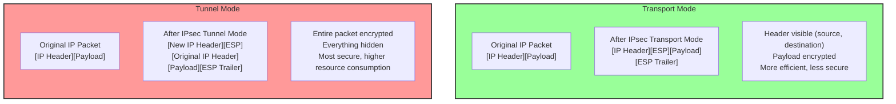

### DoS Attacks – Smurf vs. Fraggle (Reflection/Amplification)

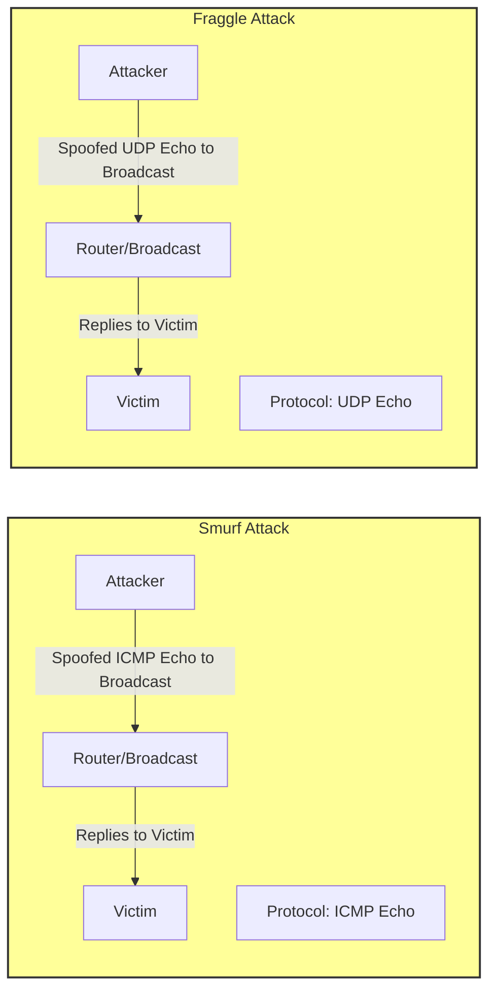

### Spoofing & Poisoning – Mitigation Strategies

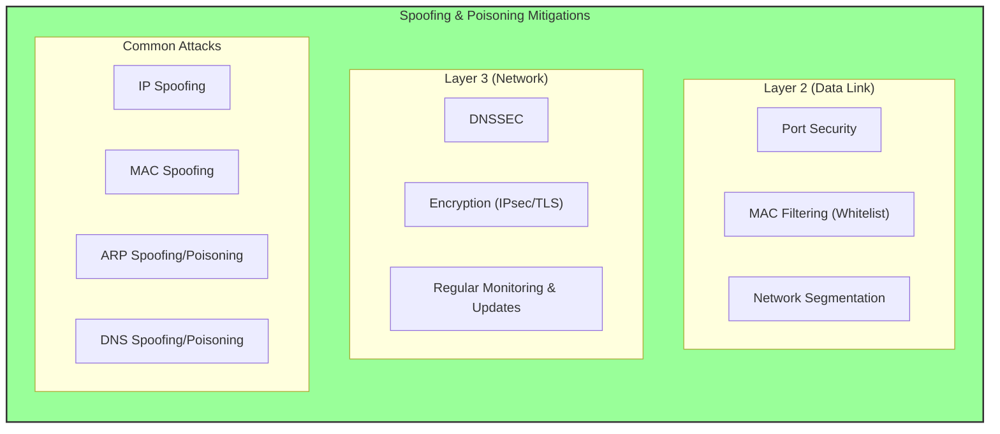

---

## Session 20 – Secure Communications

### Remote Access – RADIUS vs. TACACS+ vs. Diameter

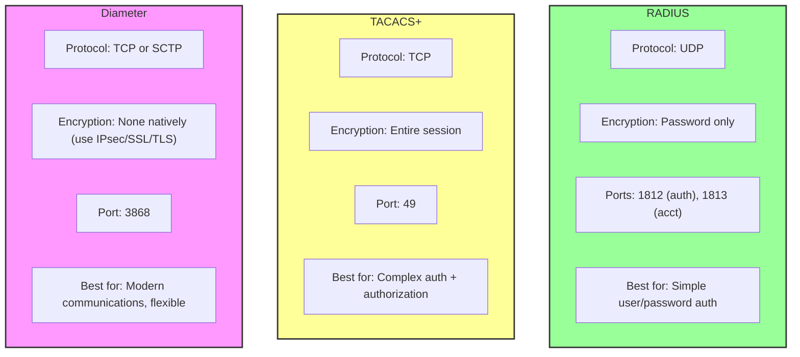

### Email Security – MOSS, PEM, PGP, S/MIME

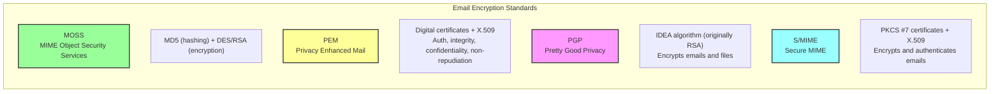

---

## Session 21 – Wireless Networking

### IEEE 802.11 Standards Evolution

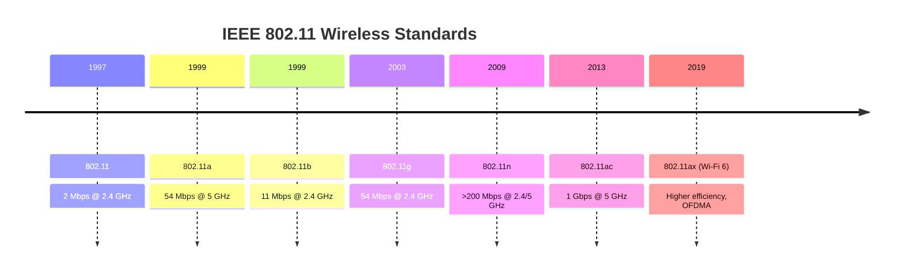

### Bluetooth Attacks – Bluejacking, Bluesnarfing, Bluebugging

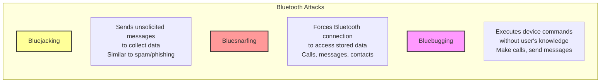

### WPA3 – SAE (Simultaneous Authentication of Equals)

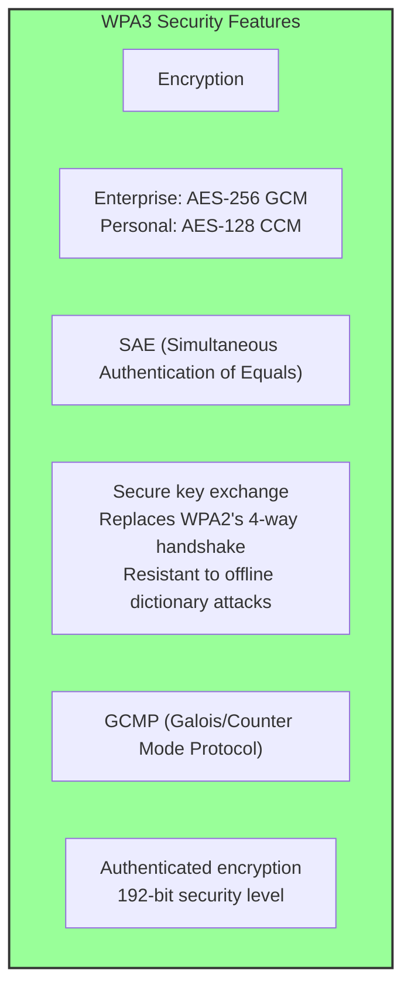

---

## Session 22 – Identity Management

### Identity Assurance Levels (IAL 1,2,3)

```mermaid
flowchart LR
    subgraph IAL1["IAL Level 1"]
        Desc1["Self-asserted attributes"]
        Method1["No validation required"]
        Example1["Website account creation"]
        Security1["Low security"]
    end

    subgraph IAL2["IAL Level 2"]
        Desc2["Evidence required for real-world existence"]
        Method2["Remote (preferred in person)"]
        Example2["Guest user account"]
        Security2["Moderate security"]
    end

    subgraph IAL3["IAL Level 3"]
        Desc3["Physical presence required"]
        Method3["In person"]
        Example3["System administrator account"]
        Security3["High security (background check)"]
    end
    
    IAL1 --> IAL2 --> IAL3
    
    style IAL1 fill:#9f9,stroke:#333,stroke-width:2px
    style IAL2 fill:#ff9,stroke:#333,stroke-width:2px
    style IAL3 fill:#f99,stroke:#333,stroke-width:2px
```

### SAML Components – Identity Provider, Service Provider, Assertions

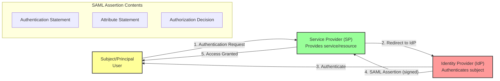

---

## Session 23 – Authentication Mechanisms

### LDAP LDIF Fields – DN, CN, OU, DC

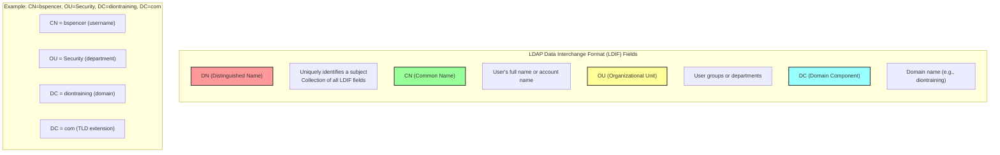

### Biometric Errors – Type I (FRR) vs. Type II (FAR) vs. CER

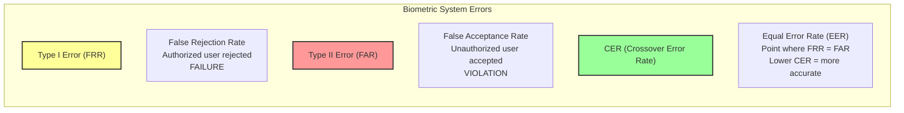

### Kerberos – Golden Ticket (TGT) vs. Silver Ticket (Service Ticket)

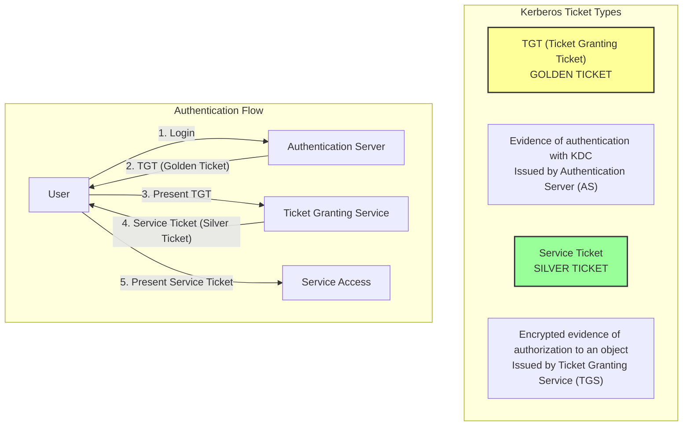

### Access Control Models Comparison (DAC, MAC, RBAC, ABAC, Rule-Based, Risk-Based)

```mermaid
flowchart TB
    subgraph DAC["DAC - Discretionary"]
        DAC_Owner["Object Owner"]
        DAC_Owner -->|Decides| DAC_ACL["ACL"]
        DAC_ACL -->|Read/Write/Execute| DAC_Subject["Subject"]
    end

    subgraph MAC["MAC - Mandatory"]
        MAC_Policy["Security Policy"] -->|Labels| MAC_Object["Object: Secret"]
        MAC_Policy -->|Clearance| MAC_Subject["Subject: Secret"]
        MAC_Object <-->|Access Granted| MAC_Subject
    end

    subgraph RBAC["RBAC - Role-Based"]
        RBAC_Roles["Roles: Admin, Engineer, Analyst"] -->|Assigned to| RBAC_Subject["Subject"]
        RBAC_Roles -->|Permissions| RBAC_Resources["Resources"]
    end

    subgraph ABAC["ABAC - Attribute-Based"]
        ABAC_Attrs["Attributes: Role, Clearance, Location, Time"] -->|Policy| ABAC_Decision{Access Decision}
        ABAC_Subject["Subject"] --> ABAC_Attrs
        ABAC_Object["Object"] --> ABAC_Attrs
        ABAC_Decision -->|Permit/Deny| ABAC_Access
    end

    subgraph RuleBased["Rule-Based"]
        Rule_Firewall["Firewall/IPS"] -->|Predefined Rules| Rule_Decision{Allow/Deny}
        Rule_Traffic["Traffic: Source, Dest, Port, Protocol"] --> Rule_Decision
    end

    subgraph RiskBased["Risk-Based"]
        Risk_Context["Device, Location, Behavior"] -->|Dynamic Risk Score| Risk_Decision{High/Medium/Low}
        Risk_Decision -->|MFA Required or Deny| Risk_Access
    end
    
    style DAC fill:#9f9,stroke:#333,stroke-width:1px
    style MAC fill:#f99,stroke:#333,stroke-width:1px
    style RBAC fill:#ff9,stroke:#333,stroke-width:1px
    style ABAC fill:#9ff,stroke:#333,stroke-width:1px
    style RuleBased fill:#f9f,stroke:#333,stroke-width:1px
    style RiskBased fill:#ff9,stroke:#333,stroke-width:1px
```

---

## Session 25 – Security Tests and Assessments

### SCAP Components – XCCDF, OVAL, OCIL

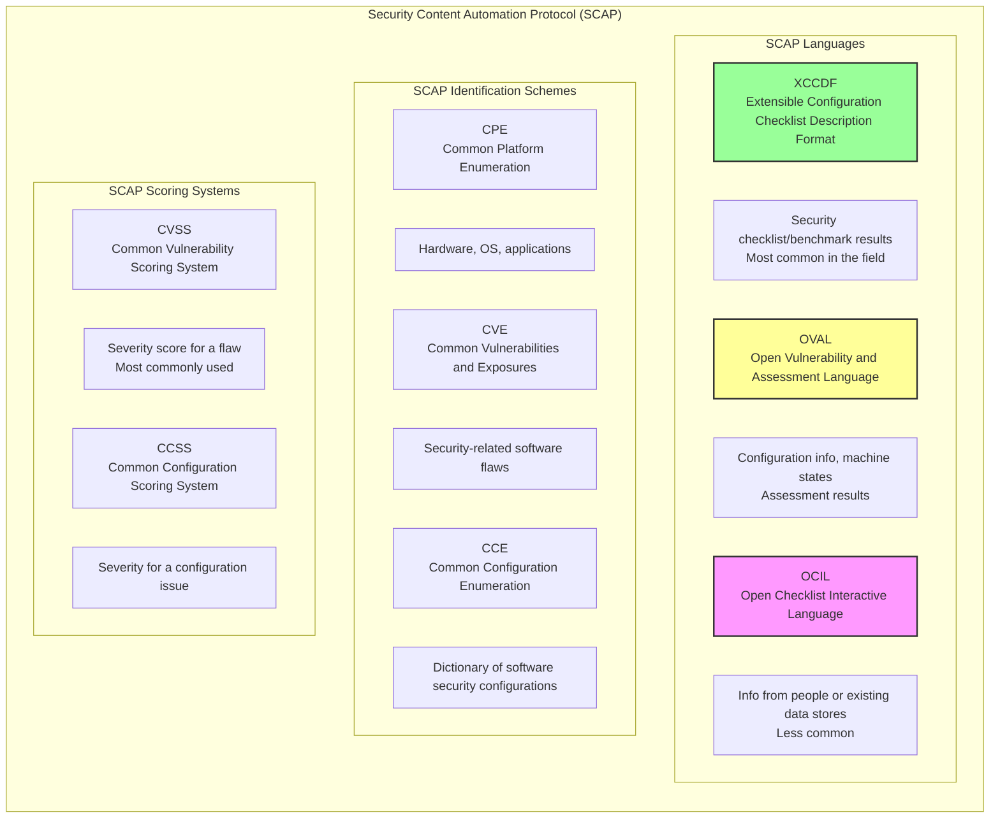

### SOC Report Types (1, 2, 3)

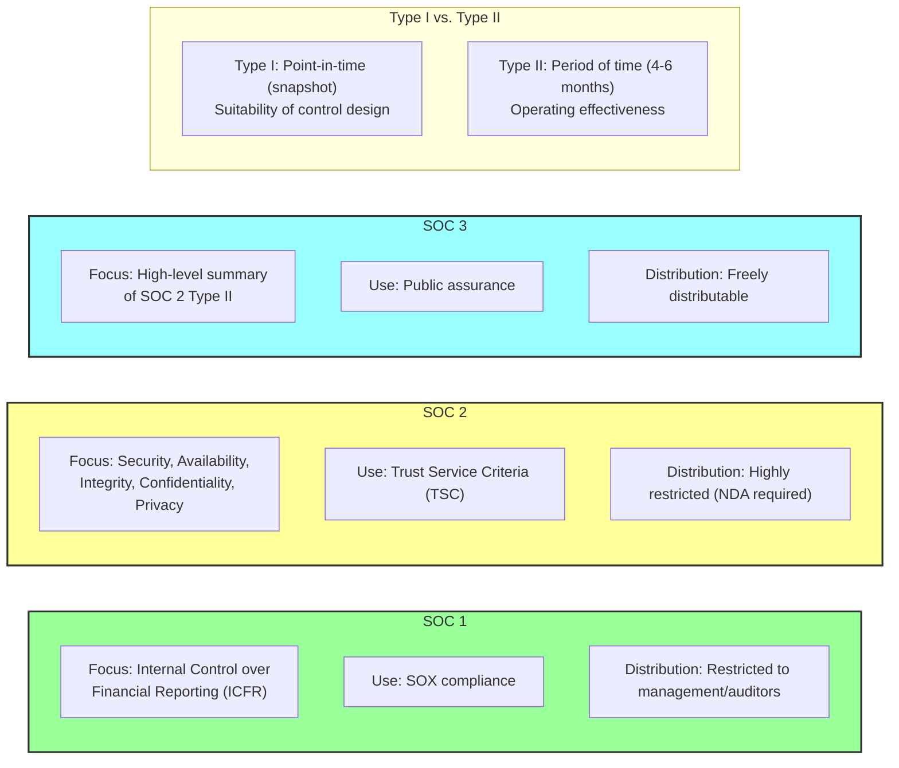

### PCI DSS Merchant Levels

```mermaid
flowchart TB
    subgraph Levels["PCI DSS Merchant Levels"]
        direction TB
        
        L1["Level 1"]
        L1_Trans["> 6 million transactions/year"]
        L1_Req["Requirement: ROC (Report on Compliance)<br/>by QSA (Qualified Security Assessor)"]
        
        L2["Level 2"]
        L2_Trans["1 - 6 million transactions/year"]
        L2_Req["Requirement: SAQ (Self-Assessment Questionnaire)"]
        
        L3["Level 3"]
        L3_Trans["20,000 - 1 million transactions/year"]
        L3_Req["Requirement: SAQ"]
        
        L4["Level 4"]
        L4_Trans["< 20,000 transactions/year"]
        L4_Req["Requirement: SAQ"]
    end
    
    style L1 fill:#f99,stroke:#333,stroke-width:2px
    style L2 fill:#ff9,stroke:#333,stroke-width:2px
    style L3 fill:#9f9,stroke:#333,stroke-width:2px
    style L4 fill:#9ff,stroke:#333,stroke-width:2px
```

---

## Session 26 – Conducting Security Testing

### SAST vs. DAST Comparison

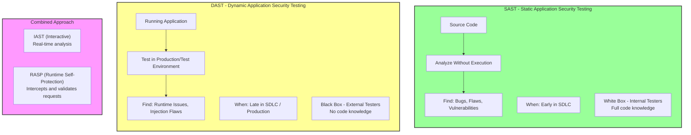

---

## Session 27 – Detective and Preventative Measures

### IDS/IPS Detection Types

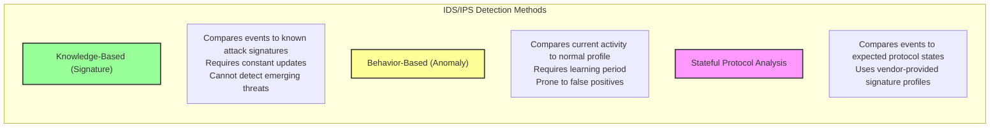

### IDS/IPS Deployment Types

```mermaid
flowchart TB
    subgraph Deployment["IDS/IPS Deployment Types"]
        direction LR
        
        Network["NIDS/NIPS<br/>Network-Based"]
        Network_Desc["Monitors all network traffic<br/>IPS must be in-line"]
        
        Host["HIDS/HIPS<br/>Host-Based"]
        Host_Desc["Host-specific only<br/>Cannot see network traffic"]
        
        Wireless["WIDS/WIPS<br/>Wireless"]
        Wireless_Desc["Monitors wireless protocol anomalies"]
        
        NBA["NBA<br/>Network Behavior Analysis"]
        NBA_Desc["Detects unusual communication patterns"]
    end
    
    style Network fill:#9f9,stroke:#333,stroke-width:2px
    style Host fill:#ff9,stroke:#333,stroke-width:2px
    style Wireless fill:#f9f,stroke:#333,stroke-width:2px
    style NBA fill:#9ff,stroke:#333,stroke-width:2px
```

### Malware Types

```mermaid
flowchart TB
    subgraph Malware["Types of Malware"]
        direction TB
        
        subgraph SelfPropagating["Self-Propagating"]
            Worms["Worms<br/>Self-replicate without human intervention"]
        end
        
        subgraph Deceptive["Deceptive"]
            Trojan["Trojan Horses<br/>Disguised as legitimate applications"]
            RAT["RAT (Remote Access Trojan)<br/>Creates backdoor access"]
        end
        
        subgraph Extortion["Extortion"]
            Ransomware["Ransomware<br/>Encrypts data and demands ransom"]
        end
        
        subgraph Surveillance["Surveillance"]
            Keyloggers["Keyloggers<br/>Records keystrokes"]
            Spyware["Spyware<br/>Monitors and collects data remotely"]
            Adware["Adware<br/>Collects user interest data"]
        end
        
        subgraph NetworkAttacks["Network Attacks"]
            Bots["Bots / Botnet<br/>Compromised machines controlled by botmaster<br/>Used for DDoS attacks"]
        end
        
        subgraph Viruses["Viruses (by infection method)"]
            MBR["Master Boot Record Virus<br/>Infects first boot sector"]
            File["File Infector Virus<br/>Activates upon file execution"]
            Macro["Macro Virus<br/>Infects MS Office via VBA"]
            Service["Service Injection Virus<br/>Infects trusted system processes"]
        end
    end
    
    style Malware fill:#f99,stroke:#333,stroke-width:2px
```

### AI Levels – Narrow, General, Super

```mermaid
flowchart LR
    subgraph AI_Levels["Three Levels of AI"]
        direction LR
        
        Narrow["Narrow AI (Weak AI)"]
        Narrow_Desc["Single task<br/>No transfer learning<br/>Examples: Siri, Alexa, chatbots"]
        
        General["General AI (AGI)"]
        General_Desc["Mimics human behavior<br/>Complex tasking<br/>Equal to human intelligence (future goal)"]
        
        Super["Super AI (ASI)"]
        Super_Desc["Surpasses human intelligence<br/>Future goal<br/>Not yet achieved"]
    end
    
    Narrow --> General --> Super
    
    style Narrow fill:#9f9,stroke:#333,stroke-width:2px
    style General fill:#ff9,stroke:#333,stroke-width:2px
    style Super fill:#f99,stroke:#333,stroke-width:2px
```

### Machine Learning Types – Supervised, Unsupervised, Semi-supervised, Reinforcement

```mermaid
flowchart TB
    subgraph ML["Machine Learning Types"]
        direction TB
        
        Supervised["Supervised Learning"]
        Supervised_Desc["Uses labeled data to train algorithms<br/>Risk: Bias from labeled data<br/>Example: Recommendation engines"]
        
        Unsupervised["Unsupervised Learning"]
        Unsupervised_Desc["Analyzes unlabeled data<br/>Uses clustering to find hidden patterns<br/>Example: APT detection, anomaly detection"]
        
        Semi["Semi-Supervised Learning"]
        Semi_Desc["Combines labeled and unlabeled data<br/>Balances specificity and exploration"]
        
        Reinforcement["Reinforcement Learning"]
        Reinforcement_Desc["Uses positive/negative feedback loops<br/>Rewards positive outcomes, punishes negative<br/>Example: Tesla autonomous driving"]
    end
    
    style Supervised fill:#9f9,stroke:#333,stroke-width:2px
    style Unsupervised fill:#ff9,stroke:#333,stroke-width:2px
    style Semi fill:#f9f,stroke:#333,stroke-width:2px
    style Reinforcement fill:#9ff,stroke:#333,stroke-width:2px
```

---

## Session 28 – Logging and Monitoring

### Syslog Facility Codes and Severity Levels

```mermaid
flowchart LR
    subgraph Facilities["Syslog Facility Codes"]
        Auth["auth (4)<br/>Security/authorization"]
        AuthPriv["authpriv (10)<br/>Privileged auth messages"]
    end

    subgraph Severities["Syslog Severity Levels (0=Most Detailed, 7=Least)"]
        Sev0["0 - Emergency"]
        Sev1["1 - Alert"]
        Sev2["2 - Critical"]
        Sev3["3 - Error"]
        Sev4["4 - Warning"]
        Sev5["5 - Notice"]
        Sev6["6 - Info"]
        Sev7["7 - Debug"]
    end
    
    style Facilities fill:#9f9,stroke:#333,stroke-width:2px
    style Severities fill:#ff9,stroke:#333,stroke-width:2px
```

### NTP Stratum Levels (0,1,2)

```mermaid
flowchart TB
    subgraph Stratum["NTP Stratum Levels"]
        direction TB
        
        Stratum0["Stratum 0"]
        Stratum0_Desc["Most accurate time source<br/>GPS satellites, atomic clocks, radio signals<br/>Reference clock"]
        
        Stratum1["Stratum 1"]
        Stratum1_Desc["Network appliance connected to Stratum 0<br/>Primary time server"]
        
        Stratum2["Stratum 2"]
        Stratum2_Desc["Individual computers<br/>Less accurate for logging"]
    end
    
    Stratum0 --> Stratum1 --> Stratum2
    
    style Stratum0 fill:#f99,stroke:#333,stroke-width:2px
    style Stratum1 fill:#ff9,stroke:#333,stroke-width:2px
    style Stratum2 fill:#9f9,stroke:#333,stroke-width:2px
```

### SIEM – SIM vs. SEM

```mermaid
flowchart LR
    subgraph SIM["SIM (Security Information Manager)"]
        SIM_Func["Collects and aggregates logs<br/>from hosts to central repository"]
    end

    subgraph SEM["SEM (Security Event Manager)"]
        SEM_Func["Correlates, analyzes, and monitors<br/>logs for security events"]
    end

    subgraph SIEM["SIEM (Combined)"]
        SIEM_Func["Collection + Aggregation + Correlation<br/>Real-time analysis, alerting, reporting<br/>Retention and archive<br/>Dashboard customization"]
    end
    
    SIM --> SIEM
    SEM --> SIEM
    
    style SIM fill:#9f9,stroke:#333,stroke-width:2px
    style SEM fill:#ff9,stroke:#333,stroke-width:2px
    style SIEM fill:#f9f,stroke:#333,stroke-width:2px
```

### MITRE ATT&CK – 14 Tactics

```mermaid
flowchart LR
    subgraph ATTACK["MITRE ATT&CK Framework"]
        direction LR
        R[Reconnaissance] --> RD[Resource Development] --> IA[Initial Access] --> EX[Execution] --> P[Persistence] --> PE[Privilege Escalation] --> DE[Defense Evasion] --> CA[Credential Access] --> D[Discovery] --> C[Collection] --> C2[Command & Control] --> E[Exfiltration] --> I[Impact]
    end
    
    style R fill:#9f9,stroke:#333,stroke-width:1px
    style IA fill:#ff9,stroke:#333,stroke-width:1px
    style PE fill:#f99,stroke:#333,stroke-width:1px
    style C2 fill:#f9f,stroke:#333,stroke-width:1px
    style I fill:#f99,stroke:#333,stroke-width:1px
```

### Cyber Kill Chain – 7 Stages

```mermaid
flowchart LR
    subgraph KillChain["Cyber Kill Chain (Lockheed Martin)"]
        direction LR
        R[1. Reconnaissance<br/>Gather information] --> W[2. Weaponization<br/>Create exploit] --> D[3. Delivery<br/>Phishing, USB, website] --> E[4. Exploitation<br/>Activate exploit] --> I[5. Installation<br/>Install malware] --> C2[6. Command & Control<br/>Maintain access] --> A[7. Actions on Objectives<br/>Exfiltrate, destroy, disrupt]
    end
    
    style R fill:#9f9,stroke:#333,stroke-width:2px
    style W fill:#9f9,stroke:#333,stroke-width:2px
    style D fill:#ff9,stroke:#333,stroke-width:2px
    style E fill:#ff9,stroke:#333,stroke-width:2px
    style I fill:#f99,stroke:#333,stroke-width:2px
    style C2 fill:#f99,stroke:#333,stroke-width:2px
    style A fill:#f99,stroke:#333,stroke-width:2px
```

### SOAR – Playbook vs. Runbook

```mermaid
flowchart TB
    subgraph SOAR["SOAR Components"]
        direction TB
        
        Trigger[Security Event Detected<br/>e.g., Phishing email]
        
        Runbook["Runbook"]
        Runbook_Desc["Script that calls one or more playbooks<br/>Manages execution order<br/>Like a 'cookbook' in Chef automation"]
        
        Playbook1["Playbook 1: Email Analysis"]
        Playbook2["Playbook 2: IP Reputation Check"]
        Playbook3["Playbook 3: User Notification"]
        
        Response["Automated Response<br/>Incident handled without manual intervention"]
    end
    
    Trigger --> Runbook
    Runbook --> Playbook1
    Runbook --> Playbook2
    Runbook --> Playbook3
    Playbook1 --> Response
    Playbook2 --> Response
    Playbook3 --> Response
    
    style Runbook fill:#f99,stroke:#333,stroke-width:2px
    style Playbook1 fill:#9f9,stroke:#333,stroke-width:2px
    style Playbook2 fill:#9f9,stroke:#333,stroke-width:2px
    style Playbook3 fill:#9f9,stroke:#333,stroke-width:2px
```

---

## Session 29 – Configuration Management

### NIST SP 800-128 Four Phases

```mermaid
flowchart LR
    subgraph CM["NIST SP 800-128 Configuration Management"]
        direction LR
        
        P1["1. Planning<br/>- Identify CIs<br/>- Create CM policy<br/>- Establish CCB"]
        P2["2. Identifying & Implementing<br/>- Define secure baseline<br/>- Provisioning<br/>- Version control"]
        P3["3. Controlling<br/>- Security impact assessments<br/>- Update documentation"]
        P4["4. Monitoring<br/>- Analyze compliance<br/>- Integrity tools (AIDE/Tripwire)<br/>- Vulnerability scans"]
    end
    
    P1 --> P2 --> P3 --> P4
    P4 -.->|Continuous Improvement| P1
    
    style P1 fill:#9f9,stroke:#333,stroke-width:2px
    style P2 fill:#9f9,stroke:#333,stroke-width:2px
    style P3 fill:#ff9,stroke:#333,stroke-width:2px
    style P4 fill:#f9f,stroke:#333,stroke-width:2px
```

### RAID Levels (0,1,5,10)

```mermaid
flowchart TB
    subgraph RAID0["RAID 0 - Striping"]
        direction LR
        Data0[Data] -->|Split| DiskA0[Disk A]
        Data0 -->|Split| DiskB0[Disk B]
        Fault0["Fault Tolerance: ❌ No"]
    end

    subgraph RAID1["RAID 1 - Mirroring"]
        direction LR
        Data1[Data] -->|Copy| DiskA1[Disk A]
        Data1 -->|Copy| DiskB1[Disk B]
        Fault1["Fault Tolerance: ✅ Yes<br/>Resource-intensive"]
    end

    subgraph RAID5["RAID 5 - Striping with Parity"]
        direction LR
        Data5[Data + Parity] --> DiskA5[Disk A]
        Data5 --> DiskB5[Disk B]
        Data5 --> DiskC5["Disk C (Parity)"]
        Fault5["Fault Tolerance: ✅ Yes<br/>3+ disks required<br/>Slower if a disk fails"]
    end

    subgraph RAID10["RAID 10 - Stripe of Mirrors"]
        direction LR
        Data10[Data] -->|Mirror| Mirror1[Set 1]
        Data10 -->|Mirror| Mirror2[Set 2]
        Mirror1 -->|Stripe| Disks1[Disks]
        Mirror2 -->|Stripe| Disks2[Disks]
        Fault10["Fault Tolerance: ✅ Yes<br/>4+ disks required"]
    end
    
    style RAID0 fill:#f9f,stroke:#333,stroke-width:1px
    style RAID1 fill:#9f9,stroke:#333,stroke-width:1px
    style RAID5 fill:#ff9,stroke:#333,stroke-width:1px
    style RAID10 fill:#9ff,stroke:#333,stroke-width:1px
```

### Power Protection – UPS vs. Generator

```mermaid
flowchart LR
    subgraph UPS["UPS (Uninterruptible Power Supply)"]
        UPS_Type["Type: Battery or Flywheel"]
        UPS_Duration["Duration: Short-term (minutes)"]
        UPS_Use["Use: Bridge to generator or safe shutdown"]
        UPS_Location["Location: Inside data center"]
    end

    subgraph Generator["Generator"]
        Gen_Type["Type: Motor-operated machine"]
        Gen_Duration["Duration: Long-term (days/weeks)"]
        Gen_Use["Use: Extended power outages"]
        Gen_Req["Requires: Fuel supply, regular maintenance"]
    end

    subgraph Other["Other Power Protection"]
        Voltage["Voltage Regulators"]
        Line["Line Conditioners"]
        Surge["Surge Protectors"]
    end
    
    style UPS fill:#9f9,stroke:#333,stroke-width:2px
    style Generator fill:#ff9,stroke:#333,stroke-width:2px
    style Other fill:#f9f,stroke:#333,stroke-width:2px
```

### Failover Cluster vs. Load Balancing

```mermaid
flowchart LR
    subgraph Failover["Failover Cluster"]
        direction TB
        Users1[Users] --> VIP1[Virtual IP]
        VIP1 --> Server1[Server A - Active]
        VIP1 --> Server2[Server B - Standby]
        Server1 -.->|Failure| Server2
        Failover_Desc["If Server A fails, Server B takes over<br/>Provides high availability"]
    end

    subgraph LoadBalancer["Load Balancing"]
        direction TB
        Users2[Users] --> LB[Load Balancer]
        LB --> Web1[Web Server 1]
        LB --> Web2[Web Server 2]
        LB --> Web3[Web Server 3]
        LB_Desc["Distributes traffic across multiple servers<br/>Improves performance and resilience"]
    end
    
    style Failover fill:#9f9,stroke:#333,stroke-width:2px
    style LoadBalancer fill:#ff9,stroke:#333,stroke-width:2px
```

---

## Session 30 – Incident Management

### NIST SP 800-61 Incident Response Steps

```mermaid
flowchart LR
    subgraph IR["Incident Response Lifecycle (NIST SP 800-61)"]
        direction LR
        Prep["Preparation<br/>Policy, Team, Tools"]
        Detect["Detection & Analysis<br/>Triage"]
        Response["Response<br/>Activate IRT"]
        Mitigate["Mitigation<br/>Containment"]
        Report["Reporting<br/>Internal/External"]
        Recover["Recovery<br/>Restore Operations"]
        Remediate["Remediation<br/>Full Restoration"]
        Lessons["Lessons Learned<br/>Post-Mortem"]
    end
    
    Prep --> Detect --> Response --> Mitigate --> Report --> Recover --> Remediate --> Lessons
    Lessons -.->|Update| Prep
    
    style Prep fill:#9f9,stroke:#333,stroke-width:2px
    style Detect fill:#ff9,stroke:#333,stroke-width:2px
    style Mitigate fill:#f99,stroke:#333,stroke-width:2px
    style Lessons fill:#f9f,stroke:#333,stroke-width:2px
```

### Evidence Types

```mermaid
flowchart TB
    subgraph Evidence["Types of Evidence"]
        direction TB
        
        Real["Real Evidence"]
        Real_Desc["Tangible objects<br/>Fingerprints, video recording, screen scrape"]
        
        Documentary["Documentary Evidence"]
        Documentary_Desc["Written records<br/>Audit logs, entry/exit logs (must be authenticated)"]
        
        Testimonial["Testimonial Evidence"]
        Testimonial_Desc["Witness statements<br/>Verbal or written"]
        
        Direct["Direct Evidence"]
        Direct_Desc["Witness directly observed the offense"]
        
        Hearsay["Hearsay Evidence"]
        Hearsay_Desc["Secondhand knowledge ('someone told me')"]
        
        Opinion["Opinion Evidence"]
        Opinion_Desc["Expert statement from subject matter expert"]
        
        Circumstantial["Circumstantial Evidence"]
        Circumstantial_Desc["Facts combined to infer offense"]
        
        Corroborative["Corroborative Evidence"]
        Corroborative_Desc["Supports or validates other evidence<br/>Video + logs matching hearsay"]
    end
    
    style Real fill:#9f9,stroke:#333,stroke-width:1px
    style Documentary fill:#ff9,stroke:#333,stroke-width:1px
    style Direct fill:#9f9,stroke:#333,stroke-width:1px
    style Hearsay fill:#f99,stroke:#333,stroke-width:1px
    style Corroborative fill:#9ff,stroke:#333,stroke-width:1px
```

### Chain of Custody Documentation

```mermaid
flowchart LR
    subgraph Chain["Chain of Custody Requirements"]
        direction TB
        
        What["What was transferred?"]
        What_Desc["Hard drive, logs, thumb drive, device"]
        
        Who["To whom was it transferred?"]
        Who_Desc["Name and role of receiving party"]
        
        When["When was it transferred?"]
        When_Desc["Date and time (to seconds)"]
        
        How["How was it transferred?"]
        How_Desc["Physical, digital, envelope, secure courier"]
        
        Signatures["Signatures"]
        Signatures_Desc["Both parties sign for each handoff"]
    end
    
    style Chain fill:#ff9,stroke:#333,stroke-width:2px
```

### eDiscovery Reference Model

```mermaid
flowchart LR
    subgraph eDiscovery["eDiscovery Reference Model"]
        direction LR
        IG["Information Governance"] --> ID["Identify"] --> PR["Preserve"] --> C["Collect"] --> P["Process"] --> R["Review"] --> A["Analyze"] --> PD["Produce"] --> PRS["Presentation"]
    end
    
    style IG fill:#9f9,stroke:#333,stroke-width:2px
    style ID fill:#9f9,stroke:#333,stroke-width:2px
    style PR fill:#ff9,stroke:#333,stroke-width:2px
    style C fill:#ff9,stroke:#333,stroke-width:2px
    style P fill:#f9f,stroke:#333,stroke-width:2px
    style R fill:#f9f,stroke:#333,stroke-width:2px
    style A fill:#f99,stroke:#333,stroke-width:2px
    style PD fill:#9ff,stroke:#333,stroke-width:2px
    style PRS fill:#9ff,stroke:#333,stroke-width:2px
```

---

## Session 31 – Business Continuity and Disaster Recovery

### NIST SP 800-34 Seven BCP Steps

```mermaid
flowchart LR
    subgraph BCP["NIST SP 800-34 Business Continuity Planning"]
        direction LR
        S1["1. Develop Policy"] --> S2["2. Conduct BIA"] --> S3["3. Identify Preventive Controls"] --> S4["4. Develop Contingency Strategies"] --> S5["5. Develop IS Contingency Plan"] --> S6["6. Testing, Training & Exercises"] --> S7["7. Plan Maintenance"]
    end
    
    style S1 fill:#9f9,stroke:#333,stroke-width:2px
    style S2 fill:#ff9,stroke:#333,stroke-width:2px
    style S3 fill:#9f9,stroke:#333,stroke-width:2px
    style S4 fill:#ff9,stroke:#333,stroke-width:2px
    style S5 fill:#f9f,stroke:#333,stroke-width:2px
    style S6 fill:#f99,stroke:#333,stroke-width:2px
    style S7 fill:#9ff,stroke:#333,stroke-width:2px
```

### BIA Metrics – MTD, RTO, RPO, WRT

```mermaid
flowchart LR
    subgraph Timeline["Disaster Recovery Timeline"]
        direction LR
        T0[Incident Occurs<br/>Time = 0]
        T1[RTO Target<br/>Systems Restored]
        T2[WRT Completed<br/>Business Resumes]
        T3[MTD Deadline<br/>Irreversible Damage]
    end
    
    T0 -->|"IT Recovery Goal"| T1
    T1 -->|"Work Recovery Time"| T2
    T0 -->|"Maximum Tolerable Downtime"| T3
    
    subgraph Formula["Formula"]
        F1["RTO + WRT ≤ MTD"]
    end
    
    style T0 fill:#f99,stroke:#333,stroke-width:2px
    style T1 fill:#ff9,stroke:#333,stroke-width:2px
    style T2 fill:#9f9,stroke:#333,stroke-width:2px
    style T3 fill:#f9f,stroke:#333,stroke-width:2px
```

### Disaster Recovery Sites Comparison

```mermaid
flowchart LR
    subgraph Sites["🏢 Disaster Recovery Sites"]
        direction LR
        
        Cold["❄️ Cold Site<br/>────────────────<br/>📦 Empty room/warehouse<br/>💾 No equipment or data<br/>💰 Cost: Lowest<br/>⏱️ Activation: Days to weeks"]
        
        Warm["🌡️ Warm Site<br/>────────────────<br/>⚙️ Pre-configured equipment<br/>🏗️ Basic infrastructure<br/>📊 No operational data<br/>💰💰 Cost: Moderate<br/>⏱️ Activation: ~12 hours"]
        
        Hot["🔥 Hot Site<br/>────────────────<br/>🖥️ Full suite equipment<br/>🏭 Full infrastructure<br/>📈 Near real-time data<br/>💰💰💰 Cost: Highest<br/>⏱️ Activation: Minutes to hours"]
    end
    
    Mobile["🚚 Mobile Site<br/>────────────────<br/>📦 Self-contained in trailer/container<br/>🌡️ Typically warm configuration<br/>🚛 Transportable"]
    
    Cloud["☁️ Cloud Managed<br/>────────────────<br/>🌐 Hosted on AWS/Azure/Google Cloud<br/>🌡️🔥 Warm or hot configuration<br/>📋 Requires SLA"]
    
    Shared["🤝 Shared Site<br/>────────────────<br/>🏢 Shared with external organizations<br/>📄 Mutual Assistance Agreement (MAA)<br/>⚠️ Rare due to data sensitivity"]
    
    Cold ==>|⬆️ More Cost<br/>⚡ Faster Recovery| Warm
    Warm ==>|⬆️ More Cost<br/>⚡ Faster Recovery| Hot
    
    Mobile -.->|Alternative Options| Cold
    Cloud -.->|Alternative Options| Warm
    Cloud -.->|Alternative Options| Hot
    Shared -.->|Alternative Options| Warm
    
    style Cold fill:#c8e6c9,stroke:#2e7d32,stroke-width:2px,color:#1b5e20
    style Warm fill:#fff9c4,stroke:#f57f17,stroke-width:2px,color:#e65100
    style Hot fill:#ffcdd2,stroke:#c62828,stroke-width:2px,color:#b71c1c
    style Mobile fill:#b3e5fc,stroke:#01579b,stroke-width:2px,color:#014361
    style Cloud fill:#e1bee7,stroke:#4a148c,stroke-width:2px,color:#311b92
    style Shared fill:#fff9c4,stroke:#f57f17,stroke-width:2px,color:#e65100
    
    linkStyle 0,1 stroke:#333,stroke-width:2px
    linkStyle 2,3,4,5 stroke:#666,stroke-width:1.5px,stroke-dasharray: 5 5
```

### Backup Types – Full vs. Differential vs. Incremental

```mermaid
flowchart TB
    subgraph Full["Full Backup"]
        Full_Desc["Complete copy of all data"]
        Full_Bit["Archive bit: Sets all to 0"]
        Full_Size["Size: Large"]
        Full_Freq["Frequency: Weekly (e.g., Sunday)"]
    end

    subgraph Differential["Differential Backup"]
        Diff_Desc["Changes since last FULL backup"]
        Diff_Bit["Archive bit: Does NOT reset (leaves 1)"]
        Diff_Size["Size: Medium"]
        Diff_Freq["Frequency: Daily (except full days)"]
    end

    subgraph Incremental["Incremental Backup"]
        Inc_Desc["Changes since ANY last backup (full/diff/inc)"]
        Inc_Bit["Archive bit: Resets to 0"]
        Inc_Size["Size: Small"]
        Inc_Freq["Frequency: Daily (except full/diff days)"]
    end
    
    subgraph Example["Weekly Backup Strategy"]
        Sun[Sunday: Full]
        Mon[Monday: Incremental]
        Tue[Tuesday: Incremental]
        Wed[Wednesday: Differential]
        Thu[Thursday: Incremental]
        Fri[Friday: Differential]
        Sat[Saturday: Incremental]
    end
    
    style Full fill:#9f9,stroke:#333,stroke-width:2px
    style Differential fill:#ff9,stroke:#333,stroke-width:2px
    style Incremental fill:#f9f,stroke:#333,stroke-width:2px
```

### 3-2-1 Backup Rule

```mermaid
flowchart LR
    subgraph Rule["3-2-1 Backup Rule"]
        direction TB
        Three["3 copies of data"]
        Two["2 different storage media<br/>on-premise"]
        One["1 copy off-premise"]
    end
    
    Three --> Two --> One
    
    style Three fill:#9f9,stroke:#333,stroke-width:2px
    style Two fill:#ff9,stroke:#333,stroke-width:2px
    style One fill:#f99,stroke:#333,stroke-width:2px
```

### DR Test Types

```mermaid
flowchart TB
    subgraph Tests["Disaster Recovery Test Types"]
        direction TB
        
        Read["Read-through (Checklist)"]
        Read_Desc["Individual review of DRP<br/>Production impact: ❌ No"]
        
        Walk["Walkthrough (Tabletop)"]
        Walk_Desc["Team rehearses procedures together<br/>Production impact: ❌ No"]
        
        Sim["Simulation (Preparedness)"]
        Sim_Desc["On-prem role-play, drills<br/>No relocation<br/>Production impact: ❌ No"]
        
        Parallel["Parallel Test"]
        Parallel_Desc["Activate recovery site<br/>Primary site runs normal ops<br/>Production impact: ❌ No"]
        
        Full["Full Interruption Test"]
        Full_Desc["Migrate operations to recovery site<br/>Requires senior management approval<br/>Production impact: ✅ YES"]
    end
    
    Read --> Walk --> Sim --> Parallel --> Full
    
    style Read fill:#9f9,stroke:#333,stroke-width:2px
    style Walk fill:#9f9,stroke:#333,stroke-width:2px
    style Sim fill:#ff9,stroke:#333,stroke-width:2px
    style Parallel fill:#ff9,stroke:#333,stroke-width:2px
    style Full fill:#f99,stroke:#333,stroke-width:2px
```

---

## Session 32 – Software Development Security

### SDLC Phases (NIST SP 800-64)

```mermaid
flowchart LR
    subgraph SDLC["NIST SP 800-64 SDLC Five Phases"]
        direction LR
        I[Initiation] --> DA[Development & Acquisition] --> IMP[Implementation & Assessment] --> OM[Operations & Maintenance] --> D[Disposal]
    end
    
    style I fill:#9f9,stroke:#333,stroke-width:2px
    style DA fill:#9f9,stroke:#333,stroke-width:2px
    style IMP fill:#ff9,stroke:#333,stroke-width:2px
    style OM fill:#f9f,stroke:#333,stroke-width:2px
    style D fill:#f99,stroke:#333,stroke-width:2px
```

### Development Methodologies Comparison

```mermaid
flowchart TB
    subgraph Waterfall["Waterfall"]
        WF_Desc["Sequential, repetitive<br/>Requirements upfront<br/>Best for: Critical/sensitive apps"]
    end

    subgraph Spiral["Spiral"]
        SP_Desc["Revisits phases multiple times<br/>Risk analysis (project, not security)<br/>Best for: Large, complex projects"]
    end

    subgraph Incremental["Incremental Build"]
        INC_Desc["Smaller, achievable chunks<br/>Faster than waterfall<br/>Best for: Flexibility with user feedback"]
    end

    subgraph Cleanroom["Cleanroom"]
        CR_Desc["Strict engineering processes<br/>Defect prevention<br/>Best for: Rigorous quality control"]
    end

    subgraph JAD["JAD"]
        JAD_Desc["Continuous user-developer interaction<br/>Short timeframes<br/>Best for: User satisfaction"]
    end

    subgraph RAD["RAD"]
        RAD_Desc["Fast development/deployment<br/>Minimum viable product<br/>Best for: R&D, proof-of-concept"]
    end
    
    style Waterfall fill:#9f9,stroke:#333,stroke-width:1px
    style Spiral fill:#ff9,stroke:#333,stroke-width:1px
    style Incremental fill:#f9f,stroke:#333,stroke-width:1px
    style Cleanroom fill:#9ff,stroke:#333,stroke-width:1px
    style JAD fill:#9f9,stroke:#333,stroke-width:1px
    style RAD fill:#ff9,stroke:#333,stroke-width:1px
```

### Agile – 12 Principles

```mermaid
flowchart TB
    subgraph Agile["Agile Manifesto - 12 Principles"]
        direction TB
        P1["1. Customer satisfaction as highest priority"]
        P2["2. Welcome requirement changes, even late"]
        P3["3. Deliver frequently (working software)"]
        P4["4. Business and developers team together"]
        P5["5. Build projects around motivated people"]
        P6["6. Face-to-face communication preferred"]
        P7["7. Working software defines progress"]
        P8["8. Sustainable development (constant pace)"]
        P9["9. Technical excellence and good design"]
        P10["10. Simplicity (maximize work not done)"]
        P11["11. Self-organized teams"]
        P12["12. Regular reflection and adjustment"]
    end
    
    style Agile fill:#9f9,stroke:#333,stroke-width:2px
```

### Scrum – Roles and Sprint Process

```mermaid
flowchart TB
    subgraph Scrum["Scrum Framework"]
        direction TB
        
        subgraph Roles["Scrum Roles"]
            PO["Product Owner<br/>Defines goals, objectives, scope"]
            SM["Scrum Master<br/>Manages process, removes impediments"]
            DT["Development Team<br/>Self-organized, creates work (DoD)"]
        end
        
        subgraph Sprint["Sprint Lifecycle"]
            Planning["Sprint Planning"] --> Dev["Development/Acquisition"] --> Review["Sprint Review"] --> Retro["Retrospective<br/>Lessons learned"]
        end
        
        subgraph Artifacts["Scrum Artifacts"]
            Backlog["Product Backlog"]
            Kanban["Kanban Board"]
            DoD["Definition of Done (DoD)"]
        end
    end
    
    style PO fill:#f99,stroke:#333,stroke-width:2px
    style SM fill:#ff9,stroke:#333,stroke-width:2px
    style DT fill:#9f9,stroke:#333,stroke-width:2px
```

### DevSecOps Manifesto Principles

```mermaid
flowchart TB
    subgraph DevSecOps["DevSecOps Manifesto Principles"]
        direction TB
        D1["Lean In - Listen and collaborate, not just reject"]
        D2["Data & Science over Fear, Uncertainty & Doubt"]
        D3["Open Contribution & Collaboration over strict requirements"]
        D4["Consumable Security APIs over mandated controls"]
        D5["Business-Driven Security Scores over token approvals"]
        D6["Red & Blue Team Testing over sole reliance on scans"]
        D7["24/7 Proactive Monitoring over reactive response"]
        D8["Shared Threat Intelligence over isolated knowledge"]
        D9["Compliance Operations over mere checklists"]
    end
    
    style DevSecOps fill:#f9f,stroke:#333,stroke-width:2px
```

### CI/CD Pipeline Security Gates

```mermaid
flowchart LR
    subgraph Pipeline["CI/CD Pipeline with Security Gates"]
        direction LR
        Code[Code Commit] --> Build[Build]
        Build --> Unit[Unit Test]
        Unit --> SAST[SAST Scan]
        SAST --> DeployTest[Deploy to Test]
        DeployTest --> DAST[DAST Scan]
        DAST --> SecurityGate{Security Gate<br/>Risk within tolerance?}
        SecurityGate -->|Yes| DeployProd[Deploy to Production]
        DeployProd --> Monitor[Continuous Monitoring]
        SecurityGate -->|No| Remediate[Remediate & Retest]
    end
    
    style SAST fill:#9f9,stroke:#333,stroke-width:2px
    style DAST fill:#ff9,stroke:#333,stroke-width:2px
    style SecurityGate fill:#f99,stroke:#333,stroke-width:2px
    style Monitor fill:#f9f,stroke:#333,stroke-width:2px
```

### CMMI Maturity Levels (1-5)

```mermaid
flowchart TB
    subgraph CMMI["CMMI Maturity Levels"]
        direction TB
        L1["Level 1 - Initial<br/>Unpredictable, reactive processes"]
        L2["Level 2 - Managed<br/>Project-level management (planned, performed, measured)"]
        L3["Level 3 - Defined<br/>Organization-wide standards guiding projects"]
        L4["Level 4 - Measured & Controlled<br/>Data-driven, quantitatively controlled"]
        L5["Level 5 - Optimizing<br/>Stable, flexible processes with continuous improvement"]
    end
    
    L1 --> L2 --> L3 --> L4 --> L5
    
    style L1 fill:#f9f,stroke:#333,stroke-width:2px
    style L2 fill:#ff9,stroke:#333,stroke-width:2px
    style L3 fill:#9f9,stroke:#333,stroke-width:2px
    style L4 fill:#9ff,stroke:#333,stroke-width:2px
    style L5 fill:#9f9,stroke:#333,stroke-width:2px
```

### OWASP SAMM Levels

```mermaid
flowchart LR
    subgraph SAMM["OWASP SAMM Levels"]
        direction LR
        L0["Level 0 - None<br/>No security practices"]
        L1["Level 1 - Initial<br/>Ad hoc security practices"]
        L2["Level 2 - Managed<br/>Effective practices with process management"]
        L3["Level 3 - Mastered<br/>Comprehensive and mature practices"]
    end
    
    L0 --> L1 --> L2 --> L3
    
    style L0 fill:#f99,stroke:#333,stroke-width:2px
    style L1 fill:#ff9,stroke:#333,stroke-width:2px
    style L2 fill:#9f9,stroke:#333,stroke-width:2px
    style L3 fill:#9f9,stroke:#333,stroke-width:2px
```

---

## Session 33 – Application Security

### Programming Languages – Generations (1GL–5GL)

```mermaid
flowchart LR
    subgraph Generations["Programming Language Generations"]
        direction LR
        G1["1GL<br/>Machine Code<br/>Binary (0s and 1s)"]
        G2["2GL<br/>Assembly Language<br/>English words → machine code"]
        G3["3GL<br/>High-Level Compiled<br/>Java, C++, C#"]
        G4["4GL<br/>Domain-Specific<br/>SQL"]
        G5["5GL<br/>Problem-Solving/AI<br/>Creates logic from constraints"]
    end
    
    G1 --> G2 --> G3 --> G4 --> G5
    
    style G1 fill:#f99,stroke:#333,stroke-width:2px
    style G2 fill:#ff9,stroke:#333,stroke-width:2px
    style G3 fill:#9f9,stroke:#333,stroke-width:2px
    style G4 fill:#9ff,stroke:#333,stroke-width:2px
    style G5 fill:#f9f,stroke:#333,stroke-width:2px
```

### Compiled vs. Interpreted Languages

```mermaid
flowchart LR
    subgraph Compiled["Compiled Languages"]
        Comp_Code[Source Code] --> Compiler[Compiler] --> Machine[Machine Code]
        Comp_Examples["Examples: C, C++, C#, Java, Swift, Rust"]
        Comp_Use["Use: High-performance applications"]
    end

    subgraph Interpreted["Interpreted Languages"]
        Int_Code[Source Code] --> Interpreter[Interpreter] --> Execution[Direct Execution]
        Int_Examples["Examples: Python, JavaScript, Ruby, PHP, Perl"]
        Int_Use["Use: Rapid development, scripting"]
    end
    
    style Compiled fill:#9f9,stroke:#333,stroke-width:2px
    style Interpreted fill:#ff9,stroke:#333,stroke-width:2px
```

### OWASP ASVS Levels (1,2,3)

```mermaid
flowchart LR
    subgraph ASVS["OWASP ASVS Levels"]
        direction LR
        L1["Level 1 - Low Assurance"]
        L1_Desc["Bare minimum requirements<br/>Protects against script kiddies<br/>First step in multi-phase effort"]
        
        L2["Level 2 - Moderate Assurance"]
        L2_Desc["Protects against skilled hackers<br/>Standard penetration testing defenses"]
        
        L3["Level 3 - High Assurance"]
        L3_Desc["Protects against APTs<br/>Critical organizational operations"]
    end
    
    L1 --> L2 --> L3
    
    style L1 fill:#9f9,stroke:#333,stroke-width:2px
    style L2 fill:#ff9,stroke:#333,stroke-width:2px
    style L3 fill:#f99,stroke:#333,stroke-width:2px
```

### OWASP Top 10 (2021) – New Risks (A4, A5, A8, A10)

```mermaid
flowchart TB
    subgraph OWASP2021["OWASP Top 10 (2021) - New/Updated Risks"]
        direction TB
        
        A4["A4 - Insecure Design"]
        A4_Desc["Ineffective security/privacy controls in design<br/>Mitigation: Risk analysis, threat modeling"]
        
        A5["A5 - Security Misconfiguration (Updated)"]
        A5_Desc["Unpatched software, default accounts, lack of hardening<br/>Mitigation: Best practices, disable unnecessary services"]
        
        A8["A8 - Software & Data Integrity Failures"]
        A8_Desc["Lack of integrity protection in software (updates, libraries)<br/>Mitigation: Limit automated updates, verify digital signatures"]
        
        A10["A10 - Server-Side Request Forgery (SSRF)"]
        A10_Desc["Application accesses remote resources without validating URL<br/>Mitigation: Validate client inputs, whitelist URLs and ports"]
    end
    
    style A4 fill:#f99,stroke:#333,stroke-width:2px
    style A5 fill:#ff9,stroke:#333,stroke-width:2px
    style A8 fill:#f9f,stroke:#333,stroke-width:2px
    style A10 fill:#9ff,stroke:#333,stroke-width:2px
```

### API Types – Public, Private, Partner, Composite

```mermaid
flowchart LR
    subgraph Public["Public (Open) API"]
        Public_Access["Anyone can connect via HTTP"]
        Public_Risk["Risk: High exposure, open access"]
    end

    subgraph Private["Private (Internal) API"]
        Private_Access["Internal use only (behind firewall)"]
        Private_Risk["Risk: Lower risk, controlled"]
    end

    subgraph Partner["Partner API"]
        Partner_Access["Selected entities only"]
        Partner_Risk["Risk: Requires authorization"]
    end

    subgraph Composite["Composite API"]
        Composite_Access["Combines multiple requests into one call"]
        Composite_Risk["Risk: Efficiency but complexity"]
    end
    
    style Public fill:#f99,stroke:#333,stroke-width:2px
    style Private fill:#9f9,stroke:#333,stroke-width:2px
    style Partner fill:#ff9,stroke:#333,stroke-width:2px
    style Composite fill:#9ff,stroke:#333,stroke-width:2px
```

### API Security Measures

```mermaid
flowchart TB
    subgraph APISecurity["API Security Measures"]
        direction TB
        
        Keys["API Keys"]
        Keys_Desc["Long, complex passwords for authentication/authorization<br/>Protect from unauthorized disclosure"]
        
        Mutual["Mutual Authentication"]
        Mutual_Desc["Use SSH/TLS for secure communication"]
        
        Least["Least Privilege"]
        Least_Desc["Limit size/number of accessible resources<br/>Prevent DoS/DDoS"]
        
        Validation["Input Validation"]
        Validation_Desc["Reject invalid or unauthorized commands<br/>Prevent injection attacks"]
        
        Logging["Logging & Monitoring"]
        Logging_Desc["Track API activities for threats and misuse"]
        
        Testing["Testing"]
        Testing_Desc["Include APIs in unit tests and security assessments"]
    end
    
    style APISecurity fill:#9f9,stroke:#333,stroke-width:2px
```

### Secure Coding Practices – Hard-coded Credentials Warning

```mermaid
flowchart TB
    subgraph SecureCoding["Secure Coding Practices"]
        direction TB
        
        Hardcoded["❌ Avoid Hard-coded Credentials"]
        Hardcoded_Desc["Do not include passwords, tokens, or sensitive data in code<br/>Risk: Exposure if uploaded to public repos (GitHub)"]
        
        Privilege["❌ Restrict Privileged Escalation"]
        Privilege_Desc["Limit applications from requiring root/admin unless necessary<br/>High-privilege apps are more vulnerable if compromised"]
        
        Approved["✅ Use Approved Code Only"]
        Approved_Desc["Prevent unmanaged/unapproved code<br/>Implement change control"]
        
        Integrity["✅ Verify Code Integrity"]
        Integrity_Desc["Use hash functions (checksums) to confirm integrity<br/>Only use trusted sources"]
        
        Crypto["✅ Use Modern Cryptographic Ciphers"]
        Crypto_Desc["Use unbroken ciphers for API and application communications"]
        
        Error["✅ Proper Error Handling"]
        Error_Desc["Prevent injection attacks, buffer overflows, and DoS"]
        
        Memory["✅ Manage Computer Memory"]
        Memory_Desc["Prevent memory leaks and DoS conditions"]
    end
    
    style Hardcoded fill:#f99,stroke:#333,stroke-width:2px
    style Privilege fill:#f99,stroke:#333,stroke-width:2px
    style Approved fill:#9f9,stroke:#333,stroke-width:2px
    style Integrity fill:#9f9,stroke:#333,stroke-width:2px
```

### Software-Defined Security – Config as Code, Policy as Code

```mermaid
flowchart TB
    subgraph SDS["Software-Defined Security"]
        direction TB
        
        SecAsCode["Security as Code"]
        SecAsCode_Desc["Integrates security processes into DevOps workflows<br/>Ensures compliance throughout CI/CD"]
        
        ConfigAsCode["Configuration as Code"]
        ConfigAsCode_Desc["Standardizes approved configurations<br/>Creates 'gold images' (hardened, compliant, immutable)"]
        
        PolicyAsCode["Policy as Code"]
        PolicyAsCode_Desc["Merges Infrastructure as Code + Configuration as Code<br/>Creates immutable resources with strict policy compliance"]
        
        Gates["Security Gates"]
        Gates_Desc["Add security checks throughout pipeline<br/>Verify risk remains within acceptable tolerance"]
        
        Testing["Regular Testing"]
        Testing_Desc["Test security as code functions as part of SDLC/DevOps lifecycle"]
    end
    
    style SecAsCode fill:#f9f,stroke:#333,stroke-width:2px
    style ConfigAsCode fill:#9f9,stroke:#333,stroke-width:2px
    style PolicyAsCode fill:#9ff,stroke:#333,stroke-width:2px
    style Gates fill:#ff9,stroke:#333,stroke-width:2px
```
