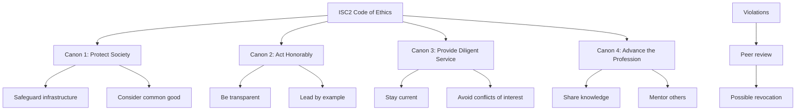
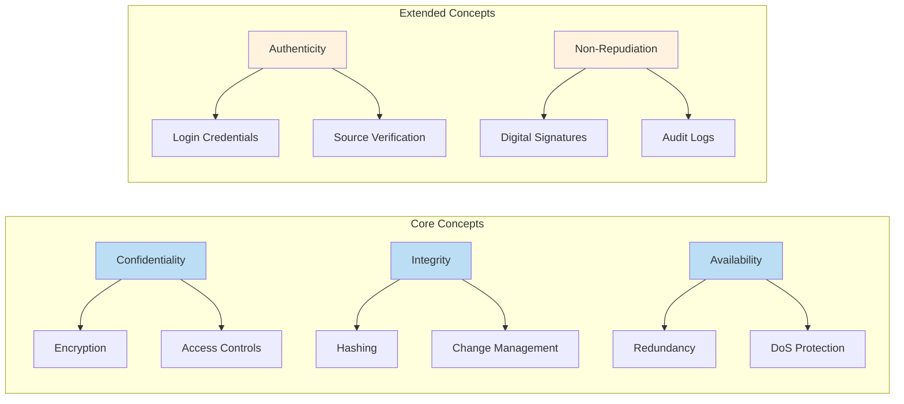
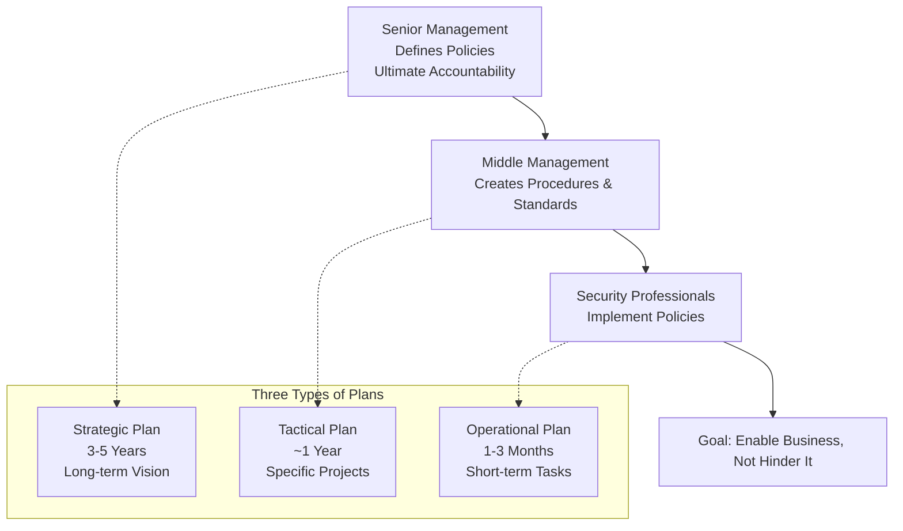
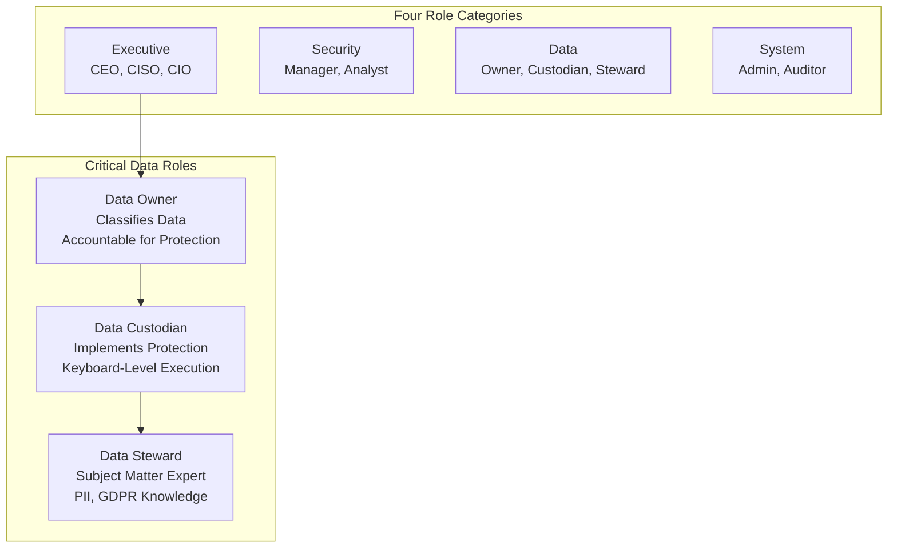
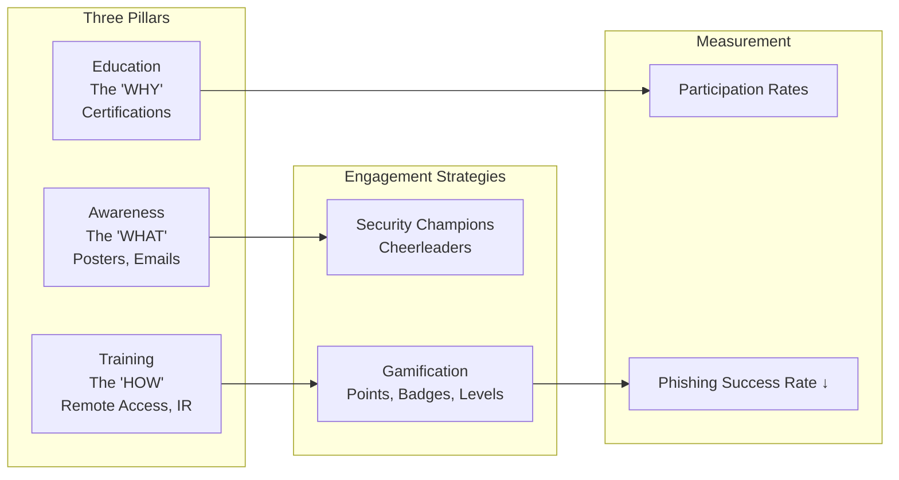
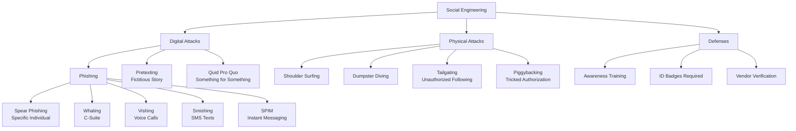
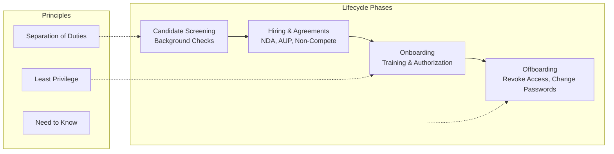
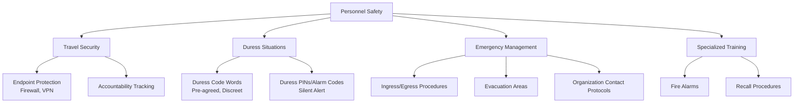

### Video V6: ISC2 Code of Ethics (The Four Canons)

---

### Video V7: The CIA Triad + Authenticity & Non-Repudiation

---

### Video V8: Aligning Security and the Organization (Top-Down Governance)

---

### Video V9: Organizational Roles and Responsibilities (Focus on Data Roles)

---

### Video V10: Security Awareness, Training & Education

---

### Video V11: Social Engineering Attack Tree

---

### Video V12: Personnel Security Lifecycle

---

### Video V13: Personnel Safety and Security

