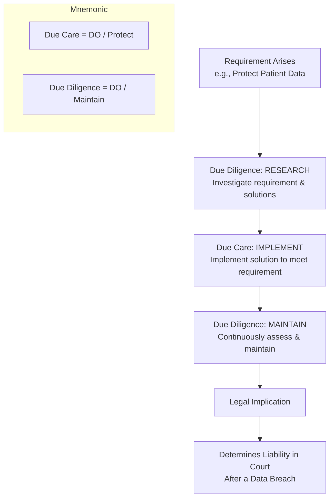
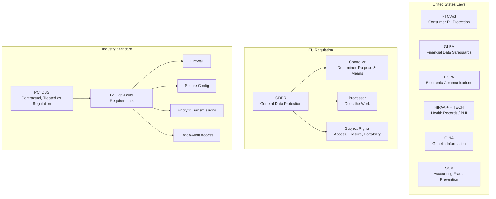
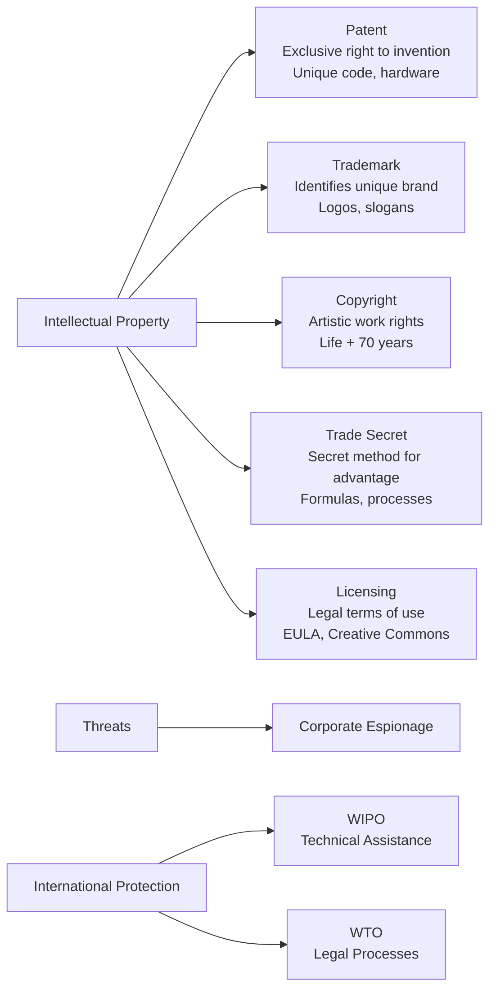
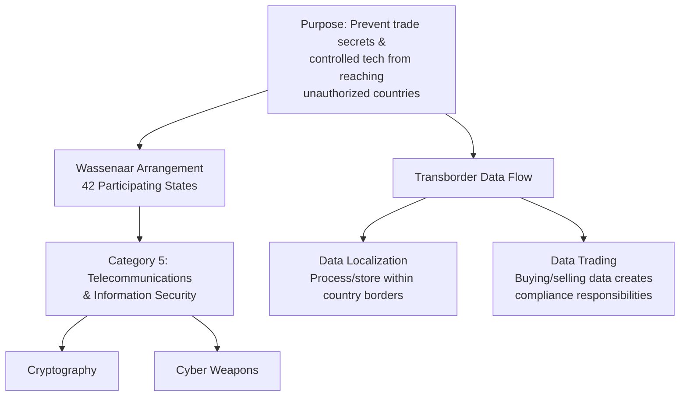
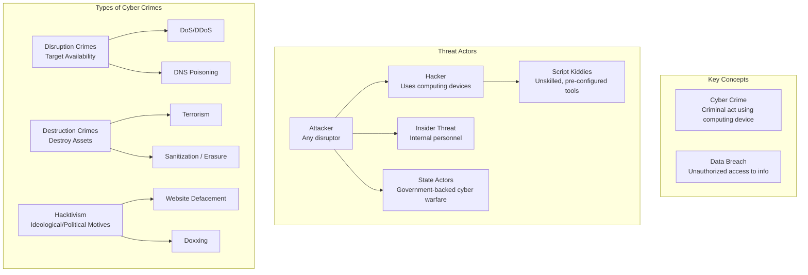
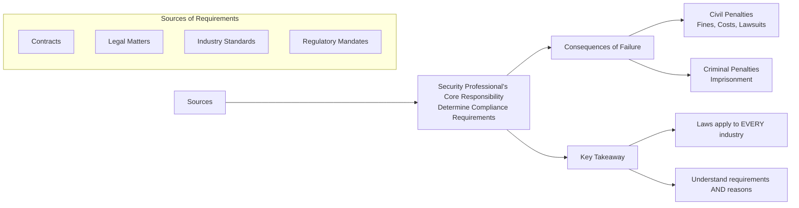
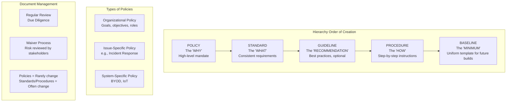
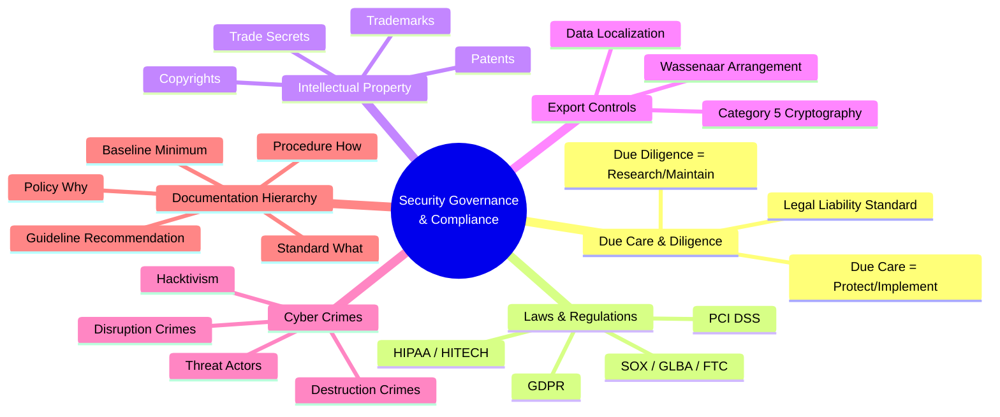

### Video V15: Due Care vs. Due Diligence (Workflow)

---

### Video V16: Key Laws and Regulations (Jurisdiction Map)

---

### Video V17: Intellectual Property Protection Types

---

### Video V18: Export Controls & Wassenaar Arrangement

---

### Video V19: Cyber Crimes and Threat Actors

---

### Video V20: Determining Compliance Requirements

---

### Video V21: Security Documentation Hierarchy

---

### Bonus: Session 3 Complete Concept Map

