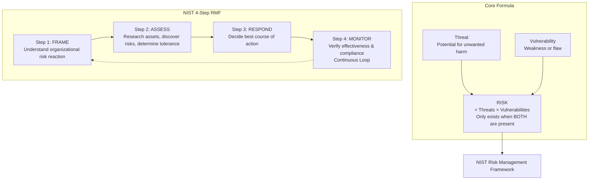
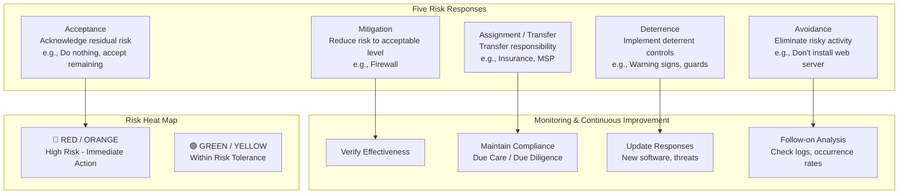
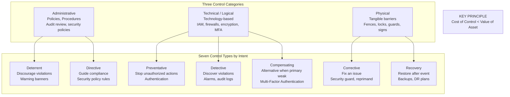
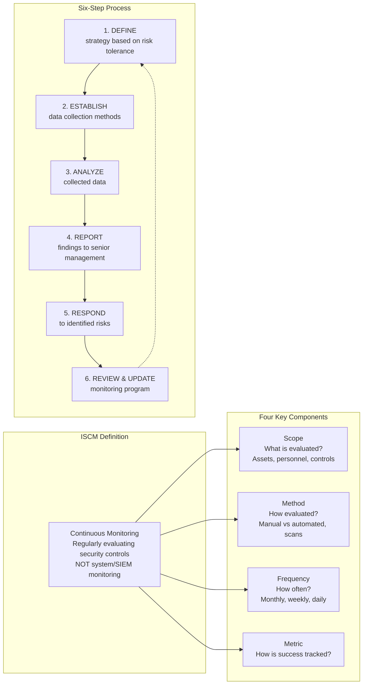
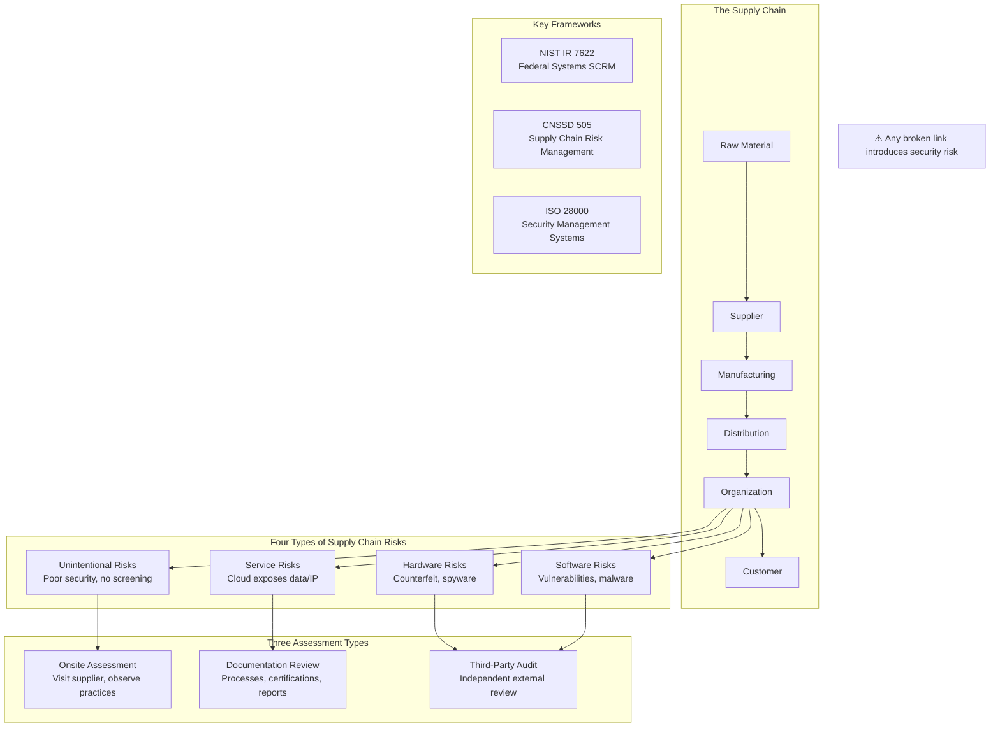
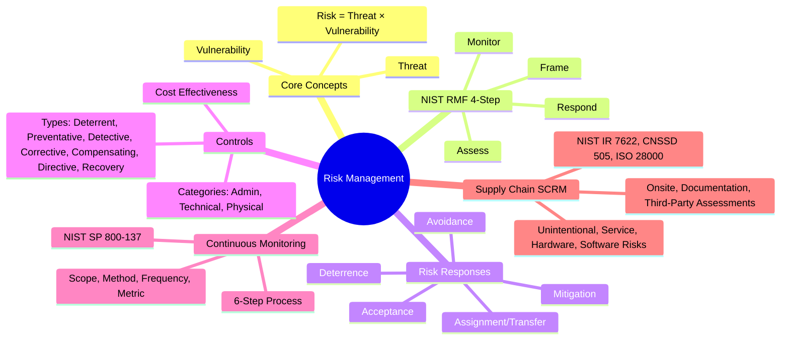

### Video V23: Risk Management Concepts (Threats, Vulnerabilities & NIST RMF)

---

### Video V24: Five Risk Response Strategies + Monitoring

---

### Video V25: Controls and Countermeasures (Defense in Depth)

---

### Video V26: Continuous Monitoring (NIST SP 800-137)

---

### Video V27: Supply Chain Risk Management (SCRM)

---

### Bonus: Session 4 Complete Concept Map

