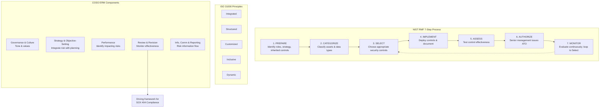
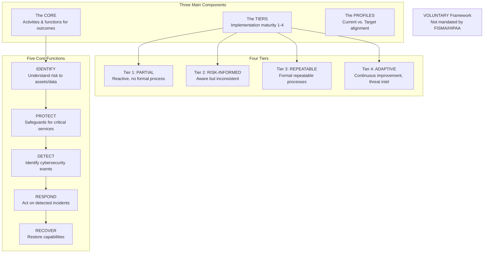
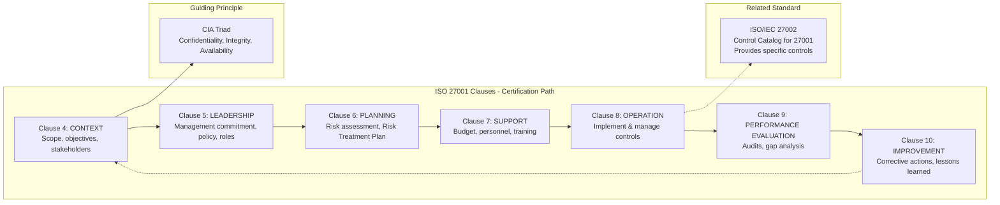
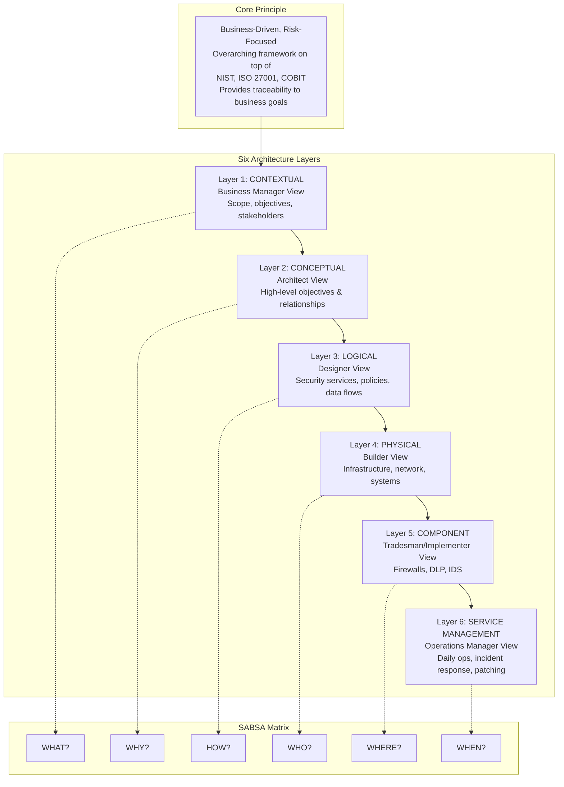
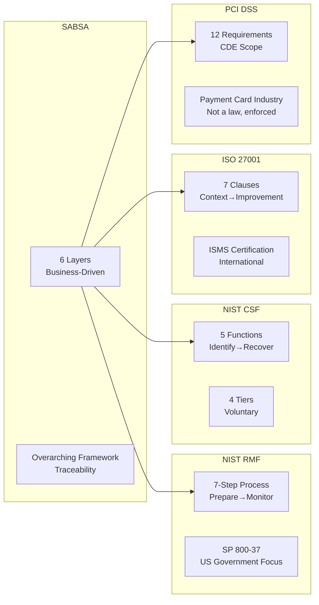

Here are the **Mermaid diagrams** explaining the key concepts for each video in Session 5.

---

### Video V29: NIST RMF (SP 800-37) + ISO 31000 + COSO

---

### Video V30: NIST Cybersecurity Framework (CSF)

---

### Video V31: ISO/IEC 27001 (ISMS Clauses)

---

### Video V32: PCI DSS - Cardholder Data Environment

```mermaid
graph TD
    subgraph Scope
        CDE[Cardholder Data Environment<br/>Any person, process, technology<br/>that touches card data]
    end

    subgraph Data Types to Protect
        CHD[Cardholder Data]
        CHD --> PAN[Account Number - PAN]
        CHD --> Name[Cardholder Name]
        CHD --> Exp[Expiration Date]
        CHD --> SC[Service Code]

        SAD[Sensitive Authentication Data]
        SAD --> Track[Full Track Data]
        SAD --> CVV[CVV/CVC/CVV2]
        SAD --> PIN[PIN / PIN Block]
    end

    subgraph 12 High-Level Requirements
        R1[1. Network Security Controls]
        R2[2. Secure Configurations]
        R3[3. Protect Stored Account Data]
        R4[4. Strong Cryptography in Transit]
        R5[5. Protect from Malware]
        R6[6. Develop Secure Systems]
        R7[7. Need-to-Know Access]
        R8[8. Identify & Authenticate Users]
        R9[9. Restrict Physical Access]
        R10[10. Log & Monitor Access]
        R11[11. Test Security Regularly]
        R12[12. Organizational Policies]
    end

    CDE --> CHD
    CDE --> SAD
    CDE --> R1
```

---

### Video V33: SABSA Framework (6 Architecture Layers)

---

### Bonus: Session 5 Framework Comparison Matrix

