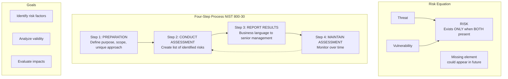
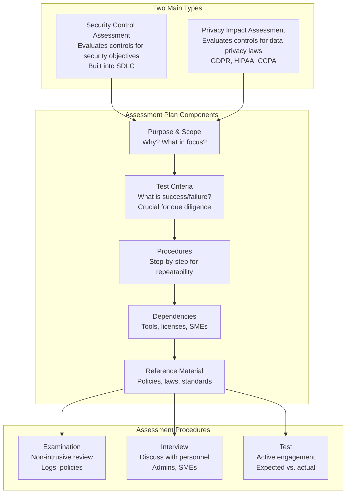
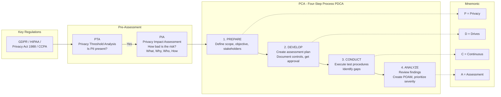
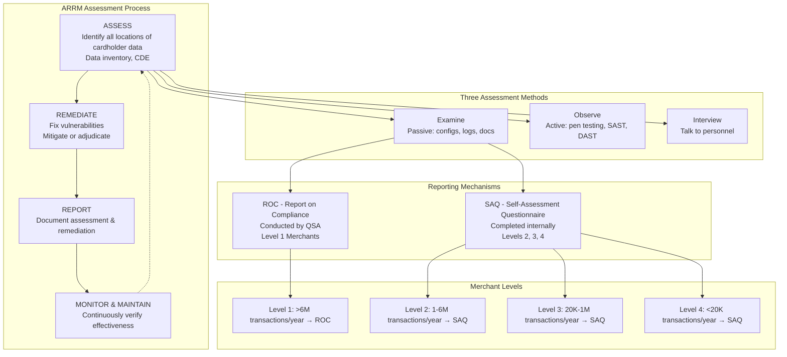
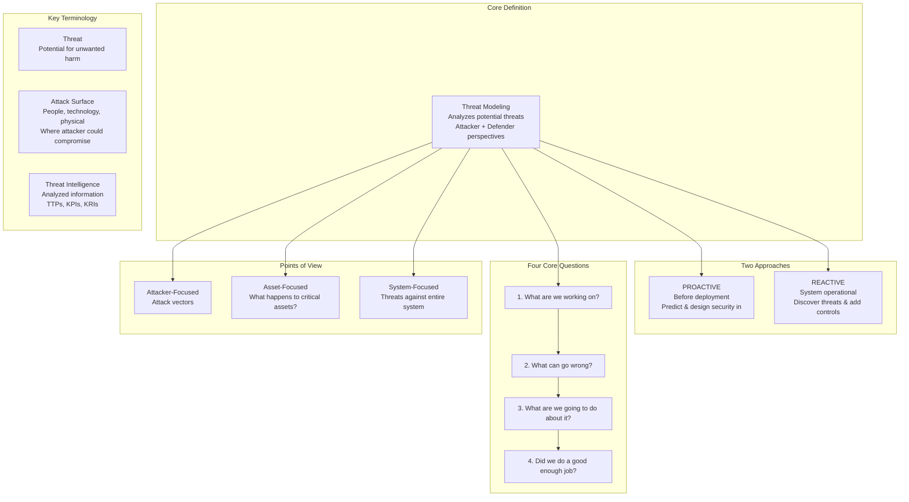
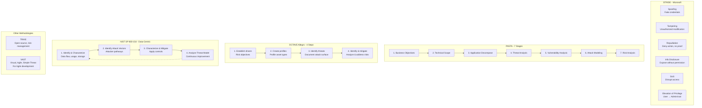
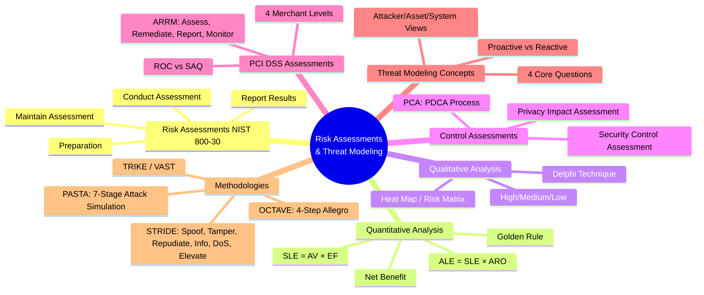

### Video V35: Understanding Risk Assessments (NIST 800-30)



---

### Video V36: Quantitative vs. Qualitative Risk Analysis

```mermaid
graph TD
    subgraph Quantitative - Numbers & Money
        AV[Asset Value<br/>Total worth]
        EF[Exposure Factor<br/>% lost if attacked]
        SLE[SLE = AV × EF<br/>Single Loss Expectancy]

        ARO[Annualized Rate of Occurrence<br/>Times per year]
        ALE[ALE = SLE × ARO<br/>Annualized Loss Expectancy]

        ACS[Annual Cost of Safeguard]
        NB[Net Benefit =<br/>(ALE before - ALE after) - ACS]

        AV --> SLE
        EF --> SLE
        SLE --> ALE
        ARO --> ALE
        ALE --> NB
        ACS --> NB

        Golden[GOLDEN RULE<br/>Never spend more on safeguard<br/>than value of asset]
    end

    subgraph Qualitative - Judgment & Rankings
        Delphi[Delphi Technique<br/>Anonymous survey of SMEs]
        HeatMap[Heat Map / Risk Matrix<br/>Probability vs. Impact]
        Rankings[High / Medium / Low Rankings]
    end

    subgraph Hybrid Approach
        H1[Quantitative → Hardware]
        H2[Qualitative → Data]
        H3[Start Qualitative → Quick results<br/>Then Quantitative → Hotspots]
    end

    Quantitative --> Hybrid
    Qualitative --> Hybrid
```

---

### Video V37: Control Assessments (Security & Privacy)



---

### Video V38: Privacy Control Assessments (PTA → PIA → PCA)



---

### Video V39: PCI DSS Assessments (ROC, SAQ, Merchant Levels)



---

### Video V40: Threat Modeling Concepts



---

### Video V41: Threat Modeling Methodologies



---

### Bonus: Session 6 Complete Concept Map


