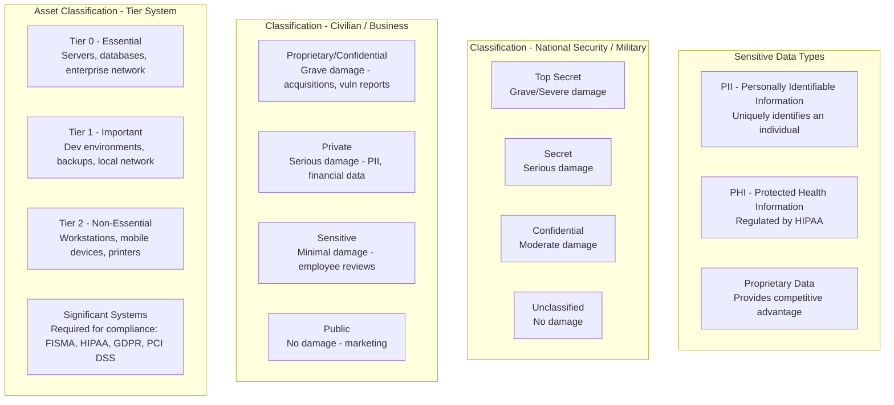
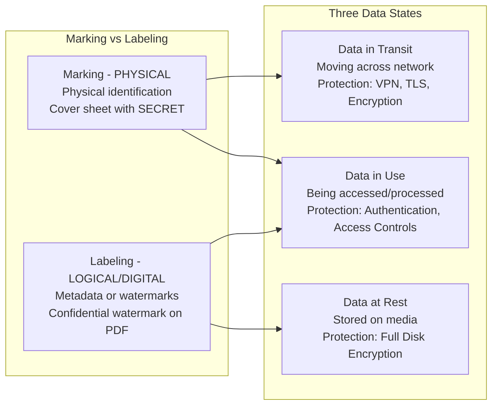
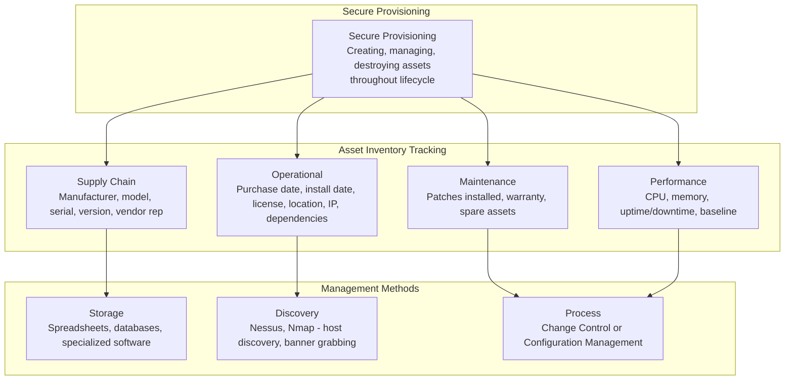
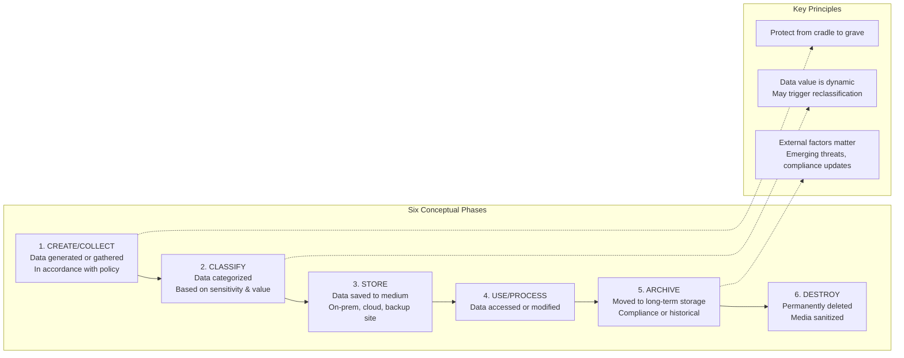
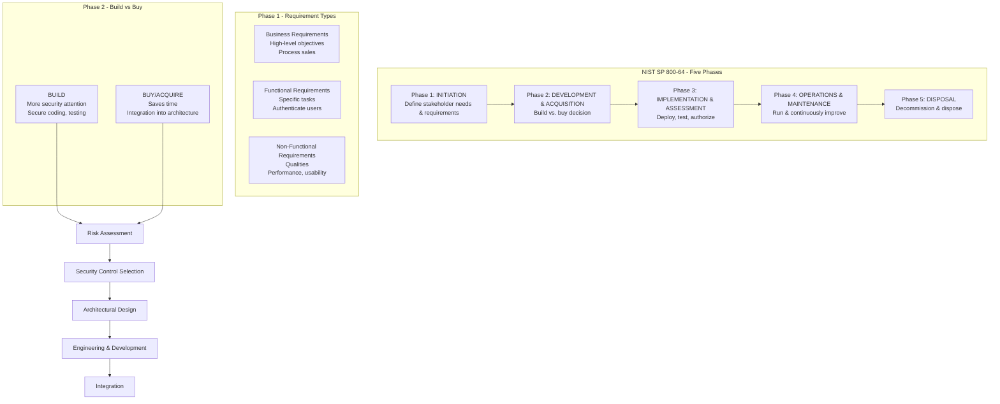
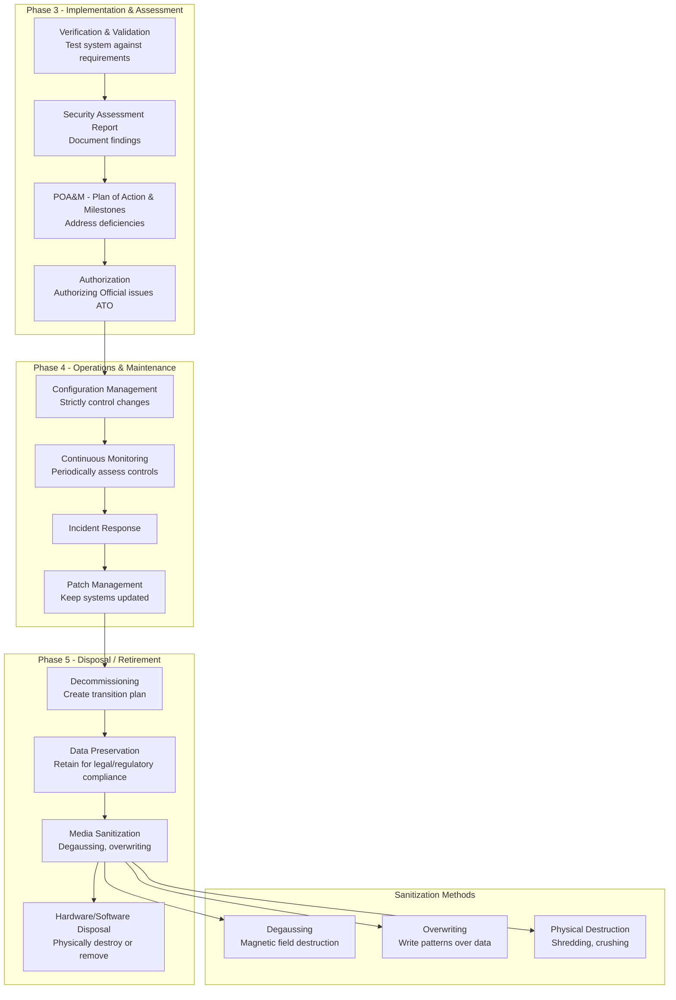
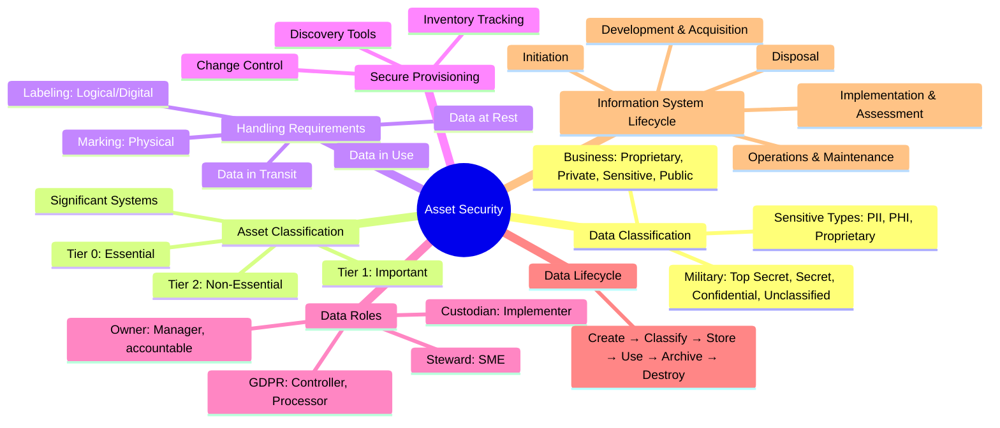

### Video V43: Classifying Data and Assets (Sensitivity Levels)



---

### Video V44: Information and Asset Handling (Marking, Labeling & Data States)



---

### Video V45: Managing System Assets (Secure Provisioning)



---

### Video V46: Data Roles and Responsibilities

```mermaid
graph TD
    subgraph Primary Data Roles
        Owner[Data Owner - The Manager<br/>Ultimate accountability<br/>Defines value & protection levels]
        Custodian[Data Custodian - The Implementer<br/>Implements physical, admin, logical controls<br/>On behalf of owner]
        Steward[Data Steward - The Specialist<br/>Subject matter expert (SME)<br/>Helps categorize & classify]
    end

    Owner --> Custodian
    Custodian --> Steward

    subgraph GDPR Regulatory Roles
        Controller[Data Controller<br/>Determines purpose & means<br/>The Data Owner in GDPR]
        Processor[Data Processor<br/>Collects & processes data<br/>On behalf of controller]
    end

    subgraph Access Roles
        Subject[Subject<br/>Any entity accessing an object<br/>Human, software, API]
        User[User<br/>Specific type of subject<br/>Identified & authenticated human]
        Object[Object<br/>Resource being accessed<br/>File, service, function]
    end

    Subject --> User
    User --> Object
```

---

### Video V47: Managing the Data Lifecycle (Create to Destroy)



---

### Video V48: Information System Lifecycle (Part 1) - Initiation to Acquisition



---

### Video V49: Information System Lifecycle (Part 2) - Implementation to Disposal



---

### Bonus: Session 7 Complete Concept Map


