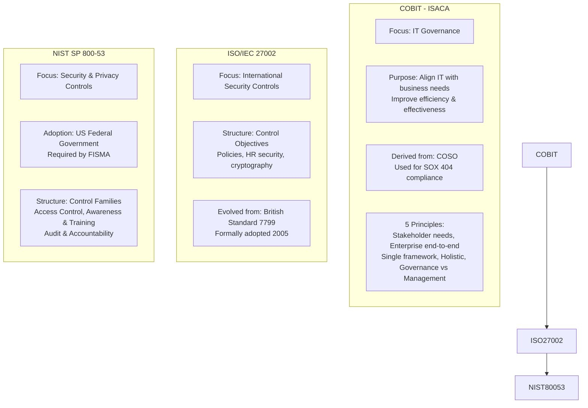
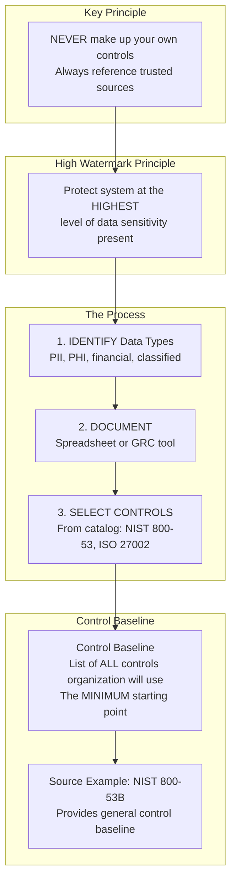
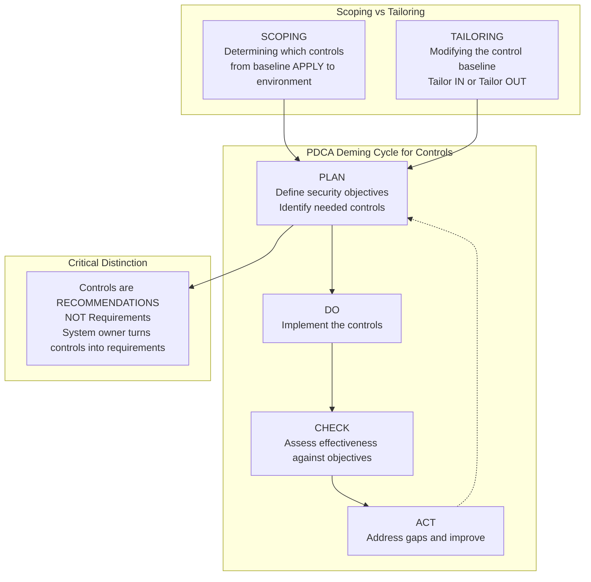
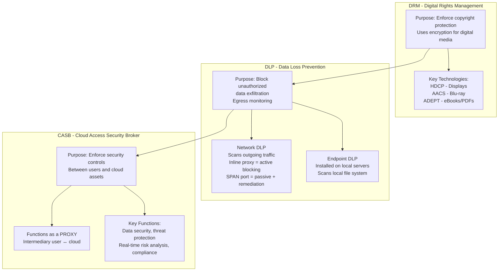
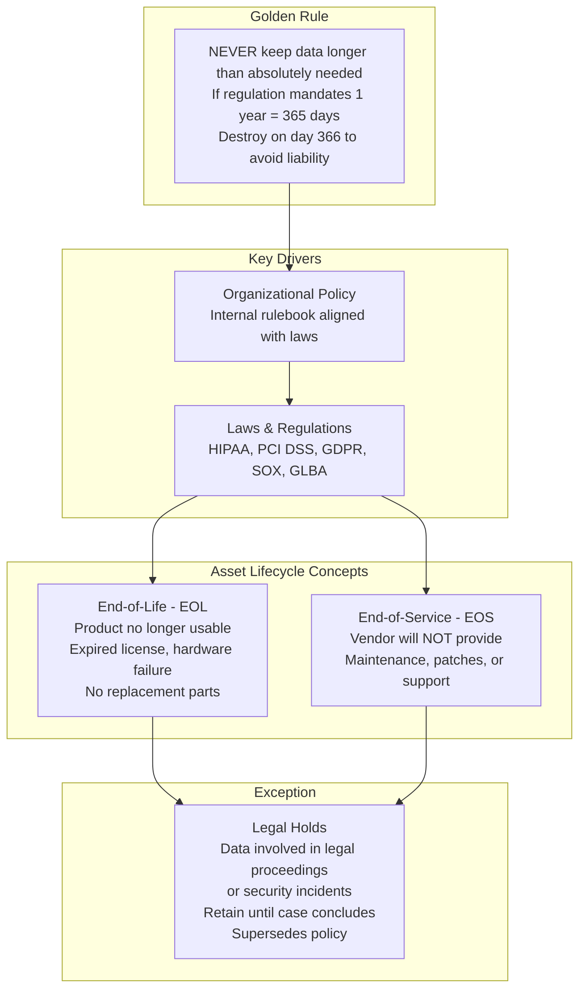
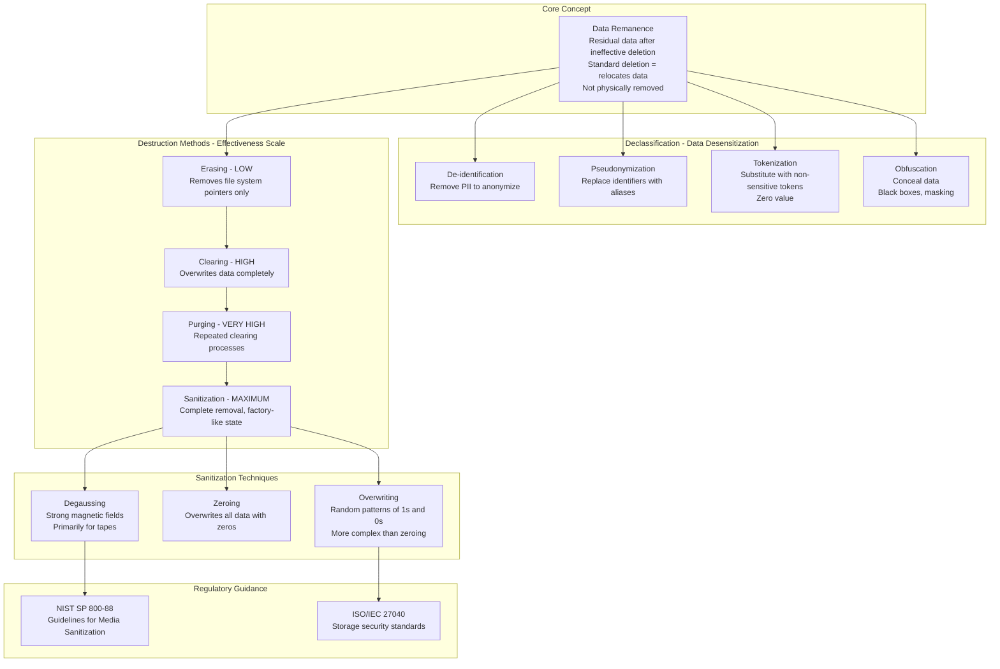
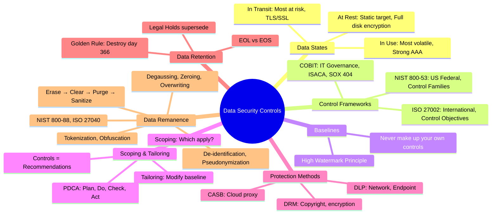

### Video V51: The Three Data States (At Rest, In Transit, In Use)

```mermaid
graph TD
    subgraph Three Data States
        InUse[Data in Use<br/>Active in Memory/RAM<br/>Being processed]
        InTransit[Data in Transit<br/>Moving across network<br/>Source to destination]
        AtRest[Data at Rest<br/>Stored on media<br/>Inactive]
    end

    subgraph Key Characteristics
        V[Most VOLATILE<br/>Integrity at risk]
        R[Most at RISK<br/>CIA can be impacted]
        S[STATIC TARGET<br/>Vulnerable to APTs]
    end

    subgraph Security Focus
        F1[Strong AAA<br/>Authentication, Authorization, Accounting]
        F2[Encryption TLS/SSL<br/>Mutual authentication]
        F3[Full disk encryption<br/>TPM]
    end

    InUse --> V --> F1
    InTransit --> R --> F2
    AtRest --> S --> F3
```

---

### Video V52: Security Control Frameworks (COBIT, ISO 27002, NIST 800-53)

---

### Video V53: Determining Security Controls (Baselines)

---

### Video V54: Selecting Security Controls (Scoping & Tailoring + PDCA)

---

### Video V55: Data Protection Methods (DRM, DLP, CASB)

---

### Video V56: Data Retention Requirements (EOL/EOS)

---

### Video V57: Managing Data Remnants (Sanitization)

---

### Bonus: Session 8 Complete Concept Map

