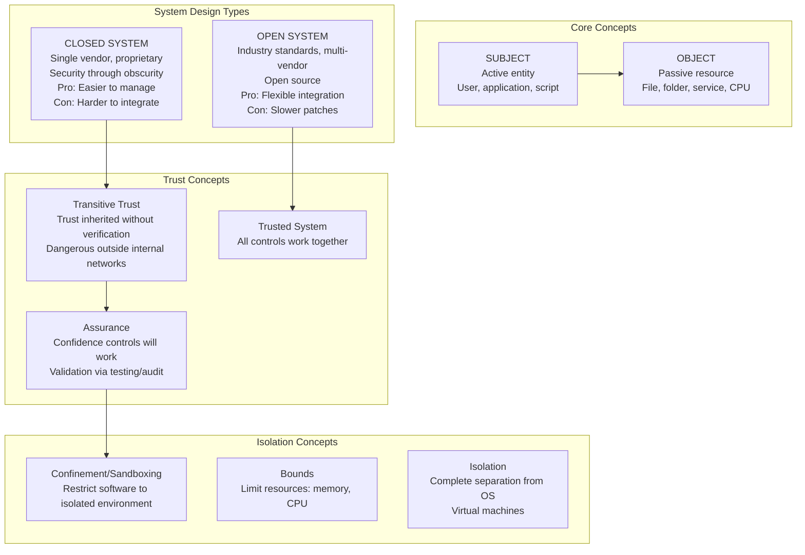
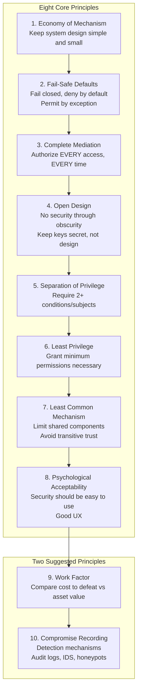
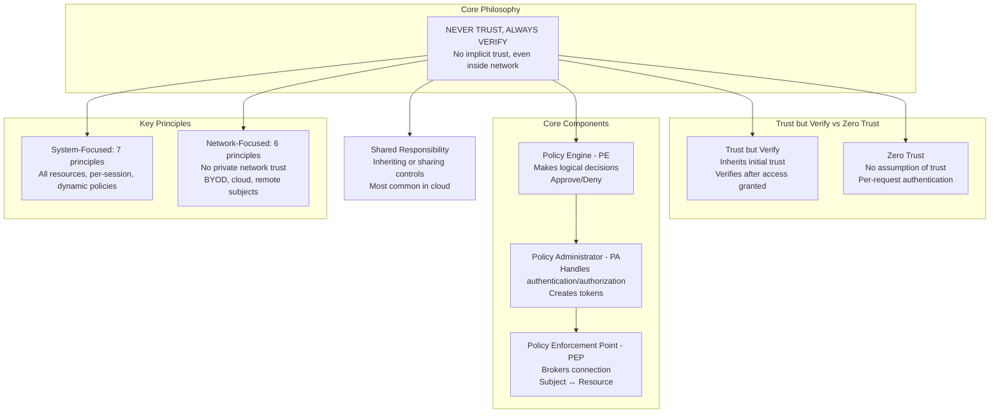
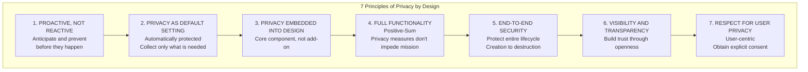
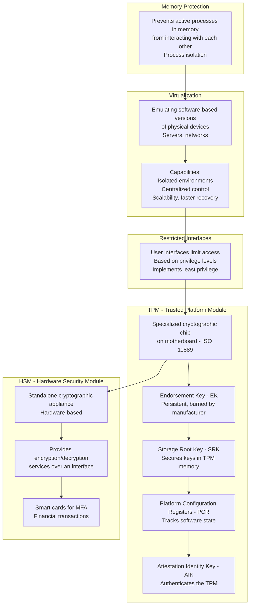
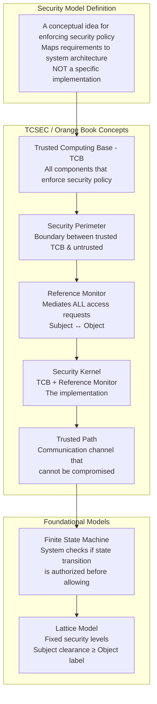
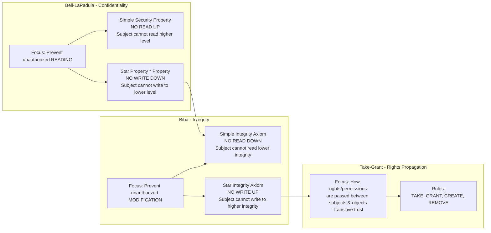
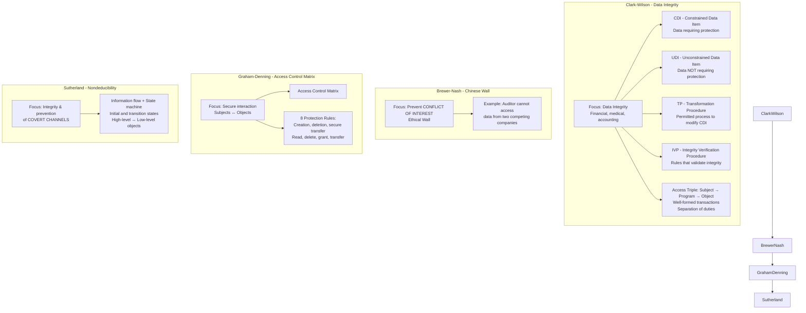
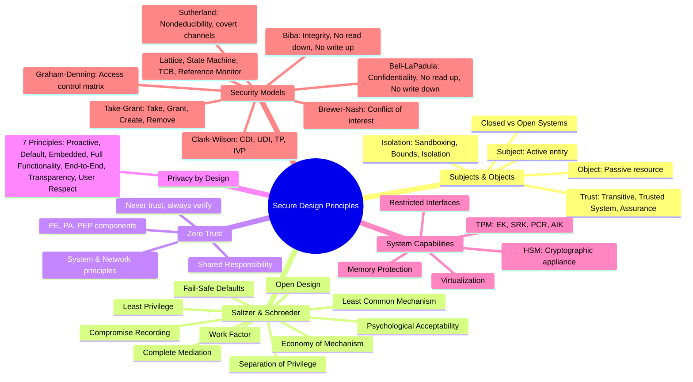

### Video V59: Understanding Secure Design (Subjects, Objects, Trust)

---

### Video V60: Saltzer & Schroeder Design Principles

---

### Video V61: Zero Trust Architecture (NIST SP 800-207)

---

### Video V62: Privacy by Design (7 Foundational Principles)

---

### Video V63: System Security Capabilities (TPM, HSM)

---

### Video V64: Security Models (Lattice, State Machine)

---

### Video V65: Security Models (Bell-LaPadula, Biba, Take-Grant)

---

### Video V66: Security Models (Clark-Wilson, Brewer-Nash, Graham-Denning, Sutherland)

---

### Bonus: Session 9 Complete Concept Map

