### Video V68: System Architectures (Distributed, Client-Based)

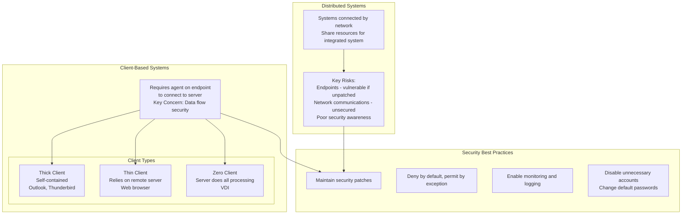

---

### Video V69: Database Systems (Aggregation, Inference, ACID)

```mermaid
graph TD
    subgraph Database Architecture
        Tables[Tables: rows/tuples, columns/attributes]
        PK[Primary Key: unique identifier]
        FK[Foreign Key: references another table]
        Schema[Schema: defines database structure]
    end

    subgraph Security Concepts
        Agg[Aggregation<br/>Combining data from multiple tables]
        AggAttack[Aggregation Attack<br/>Query multiple tables to gather scattered data]
        Inf[Inference Attack<br/>Use aggregated data to deduce hidden info]
        Poly[Polyinstantiation<br/>Multiple entries with same primary key<br/>Different sensitivity levels]
    end

    subgraph ACID Framework
        A[Atomicity<br/>All or nothing<br/>Prevents dirty reads]
        C[Consistency<br/>Data must comply with rules<br/>Prevents lost updates]
        I[Isolation<br/>Transactions kept separate<br/>Enforces concurrency]
        D[Durability<br/>Completed transactions persist<br/>After system failure]
    end

    Tables --> PK
    Tables --> FK
    PK --> Schema
    Agg --> AggAttack
    AggAttack --> Inf
    Inf --> Poly
    
    A --> C --> I --> D
```

---

### Video V70: Common Criteria (EAL Levels)

```mermaid
graph TD
    subgraph Common Criteria - ISO/IEC 15408
        CC[Internationally recognized standard<br/>for IT security evaluation]
        Parts[Three Parts:<br/>Part 1: Introduction<br/>Part 2: Security Functional Requirements<br/>Part 3: Security Assurance Requirements]
    end

    subgraph Key Components
        TOE[TOE - Target of Evaluation<br/>Software, firmware, hardware]
        PP[PP - Protection Profile<br/>Template defining desired security needs<br/>Reusable]
        ST[ST - Security Target<br/>High-level definition for specific TOE]
    end

    subgraph EAL Levels 1-7
        EAL1[EAL 1: Functionally tested<br/>Basic operations]
        EAL2[EAL 2: Structurally tested<br/>Design info available]
        EAL3[EAL 3: Methodically tested/checked<br/>First independent review]
        EAL4[EAL 4: Methodically designed/tested<br/>Operating systems: Windows, Linux]
        EAL5[EAL 5: Semi-formally designed<br/>Smart cards, authentication]
        EAL6[EAL 6: Semi-formally verified<br/>Government/military assets]
        EAL7[EAL 7: Formally verified<br/>Life-critical systems]
    end

    subgraph Drawbacks
        D1[Manufacturers choose what gets evaluated<br/>Can hide shortcomings]
        D2[Focuses strictly on product<br/>Not personnel, physical security, or BCP/DR]
    end

    CC --> Parts
    Parts --> TOE
    TOE --> PP
    PP --> ST
    ST --> EAL1 --> EAL2 --> EAL3 --> EAL4 --> EAL5 --> EAL6 --> EAL7
    EAL7 --> D1
    D1 --> D2
```

---

### Video V71: Industrial Control Systems (ICS/SCADA)

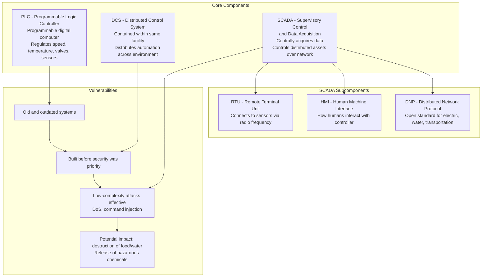

---

### Video V72: SASE (Secure Access Service Edge)

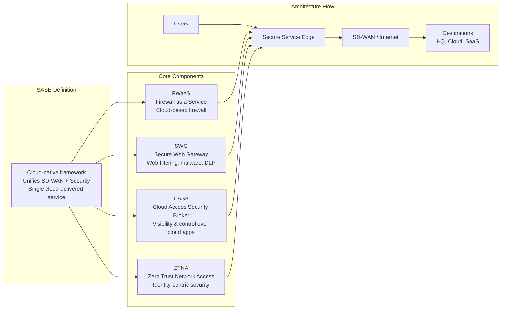

---

### Video V73: Internet of Things (IoT)

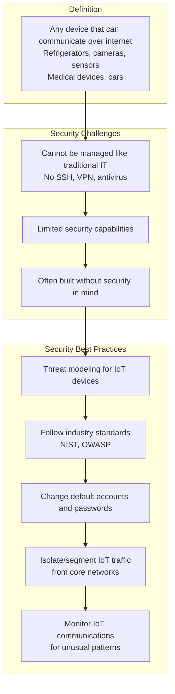

---

### Video V74: Microservices & API Gateways

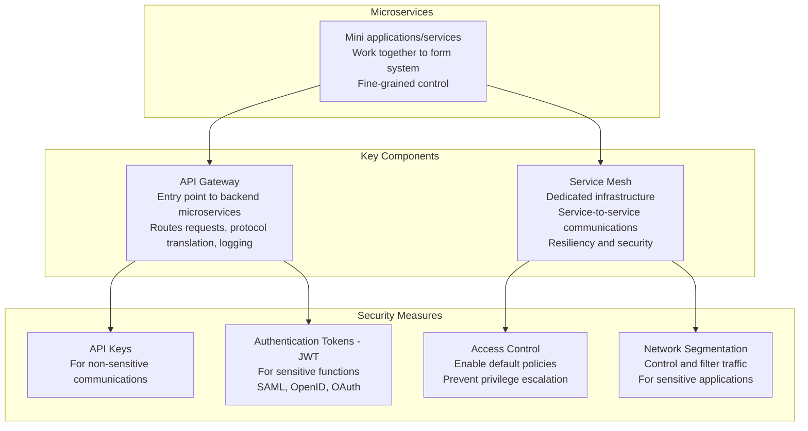

---

### Video V75: Embedded Systems

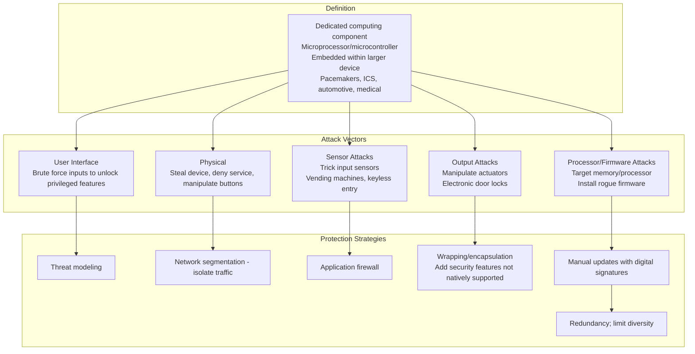

---

### Video V76: High-Performance Computing (HPC)

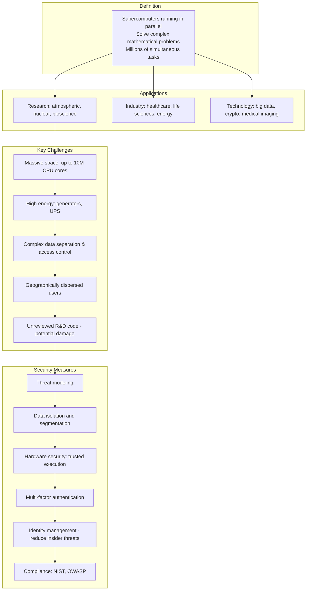

---

### Video V77: Edge Computing Systems (Fog Computing)

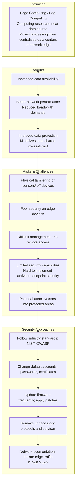

---

### Bonus: Session 10 Complete Concept Map

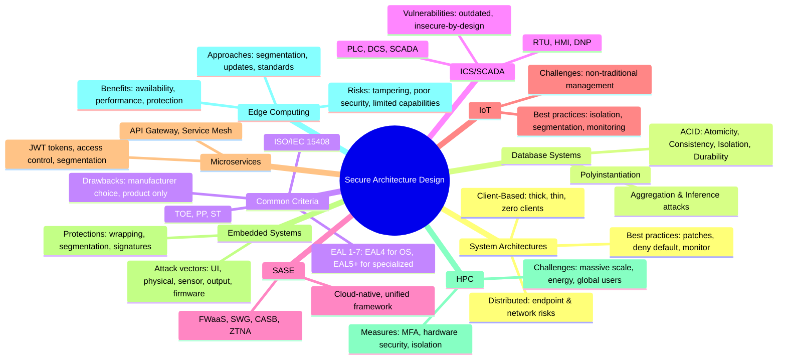
