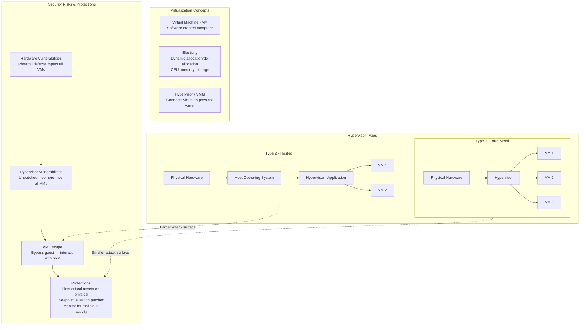
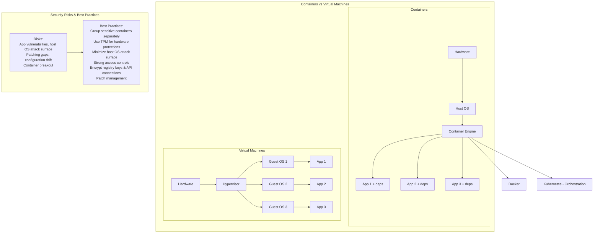
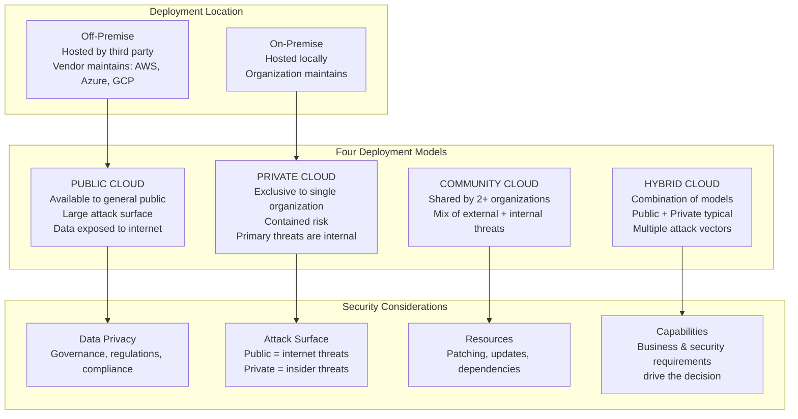
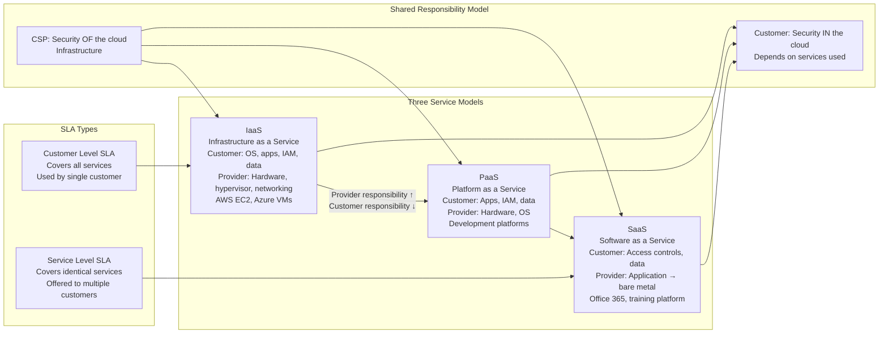
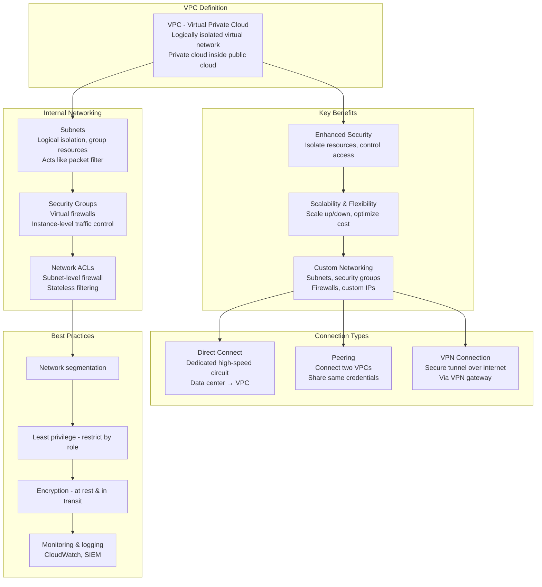
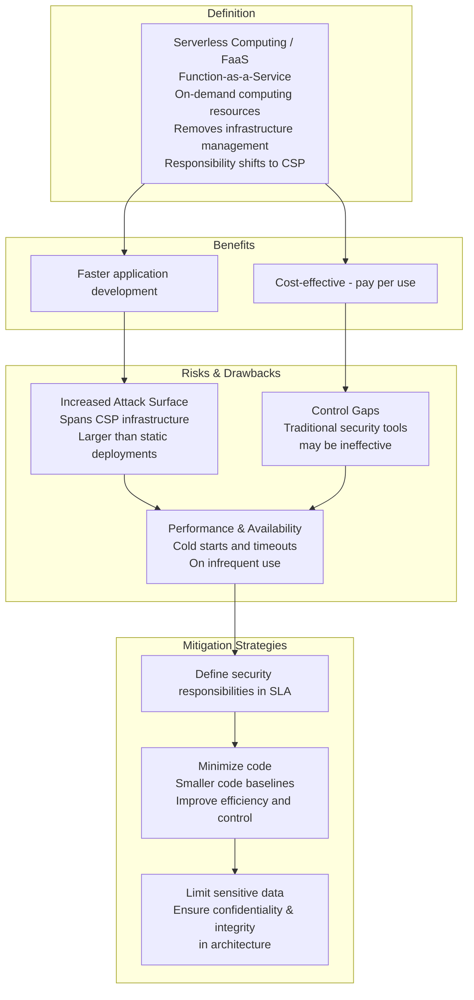
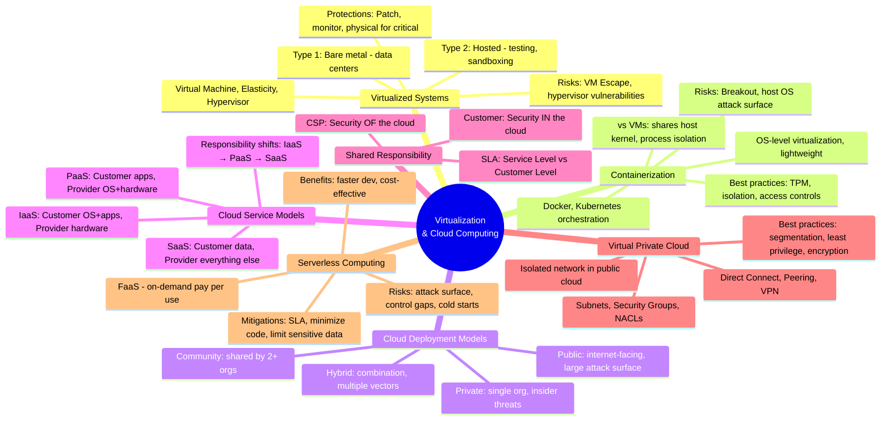

### Video V79: Virtualized Systems (Type 1 vs. Type 2 Hypervisors)

---

### Video V80: Containerization (Docker, Kubernetes vs. VMs)

---

### Video V81: Cloud Deployment Models (Public, Private, Hybrid, Community)

---

### Video V82 & V83: Cloud Service Models (IaaS, PaaS, SaaS) + Shared Responsibility

---

### Video V84: Virtual Private Cloud (VPC)

---

### Video V85: Serverless Computing (Function-as-a-Service)

---

### Bonus: Session 11 Complete Concept Map

