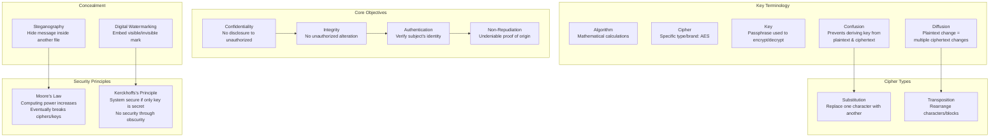
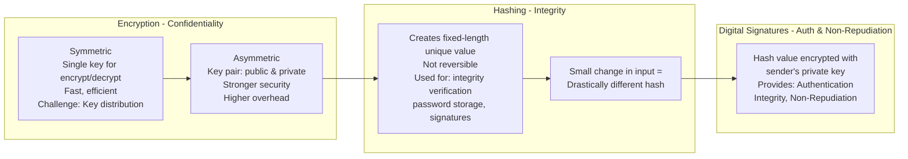
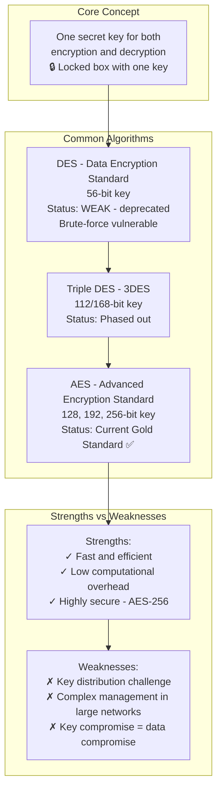
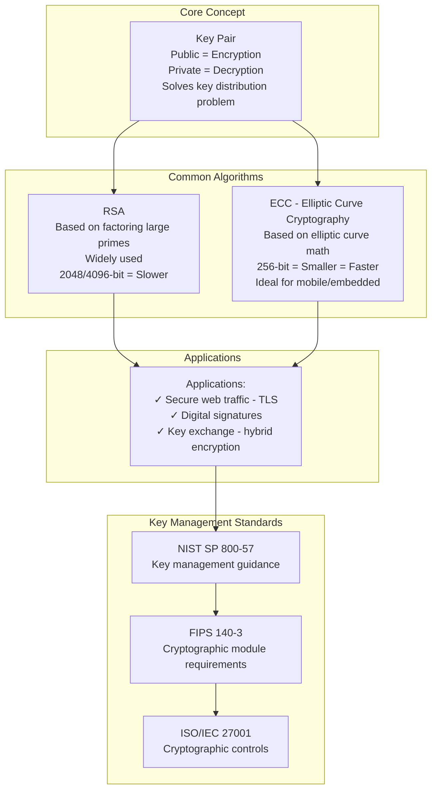
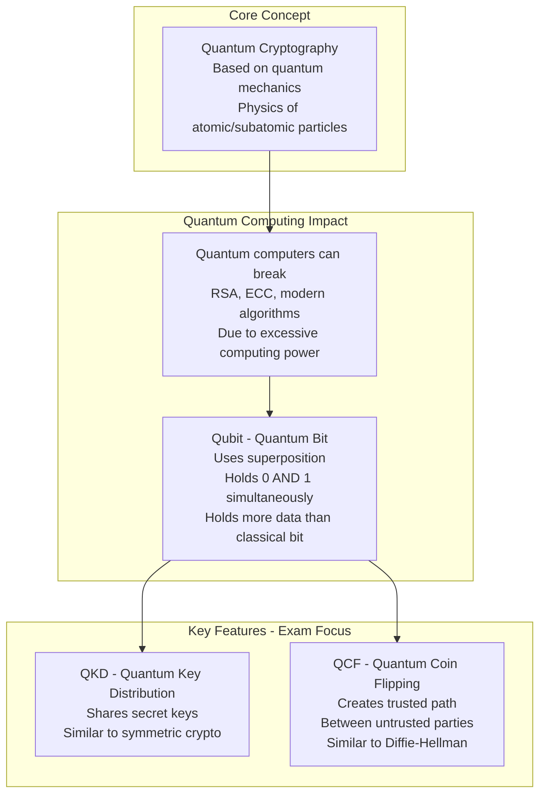
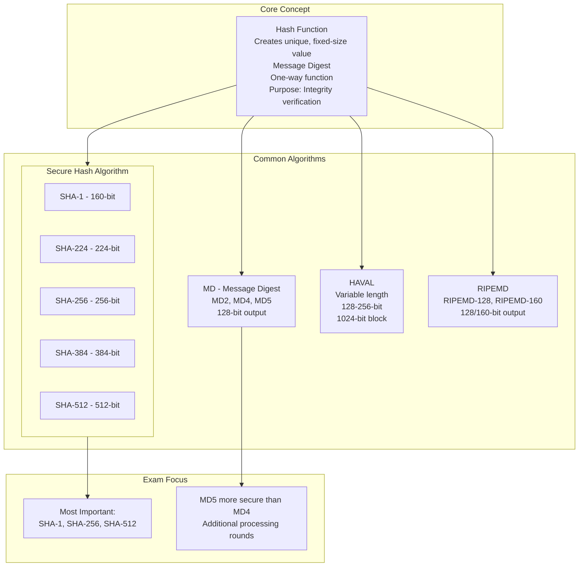
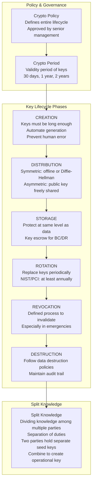
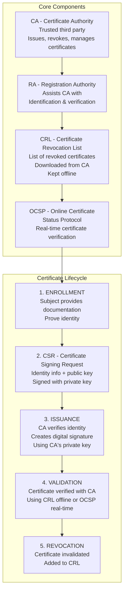
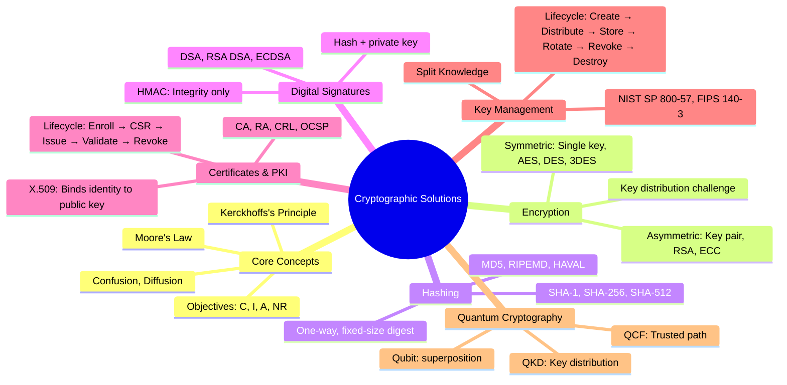

### Video V87: Understanding Cryptography (Confusion, Diffusion)



---

### Video V88: Cryptographic Methods (Encryption, Hashing, Signatures)



---

### Video V89: Symmetric Encryption (AES, DES, 3DES)



---

### Video V90: Asymmetric Encryption (RSA, ECC)



---

### Video V91: Quantum Cryptography (QKD, Qubits)



---

### Video V92: Hash Functions (SHA, MD5, RIPEMD)



---

### Video V93: Cryptographic Key Management (Lifecycle)



---

### Video V94: Digital Signatures and X.509 Certificates

```mermaid
graph TD
    subgraph Digital Signatures
        DS[Hash value encrypted with<br/>sender's PRIVATE key<br/>Provides: Authentication<br/>Integrity, Non-Repudiation]
    end

    subgraph Digital Signature Algorithms
        DSA[DSA - FIPS 186-4<br/>Signatures only - Slower]
        RSADSA[RSA DSA - ANSI X9.31<br/>Versatile: signatures, encryption<br/>key distribution]
        ECDSA[ECDSA - ANSI X9.62<br/>More efficient<br/>160-bit vs 1024-bit DSA]
    end

    subgraph HMAC
        HMAC[HMAC - Partial Signature<br/>Hash + shared secret key<br/>Provides: Integrity ONLY<br/>Does NOT provide non-repudiation]
    end

    subgraph X.509 Digital Certificates
        Cert[Purpose: Assurance of claimed identity<br/>Binds identity to public key<br/>Standard: X.509 - ITU]
        Attrs[Key Attributes:<br/>Issuer, serial number, validity period<br/>Subject name, subject public key<br/>CA digital signature]
    end

    subgraph Vulnerabilities & Mitigations
        V1[Hash Collision → Use SHA-2/SHA-3]
        V2[Key Disclosure → Protect private key<br/>Use exclusively for signing]
        V3[CA Compromise → Use trusted CA]
    end

    DS --> DSA
    DS --> RSADSA
    DS --> ECDSA
    DS --> HMAC
    HMAC --> Cert
    Cert --> Attrs
    Attrs --> V1
    V1 --> V2 --> V3
```

---

### Video V95: Public Key Infrastructure (PKI)



---

### Bonus: Session 12 Complete Concept Map

